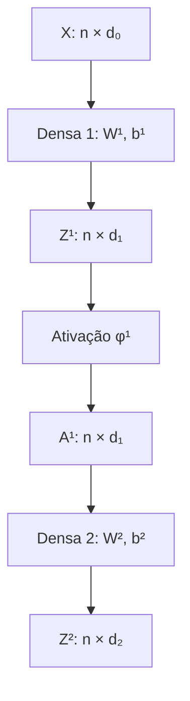
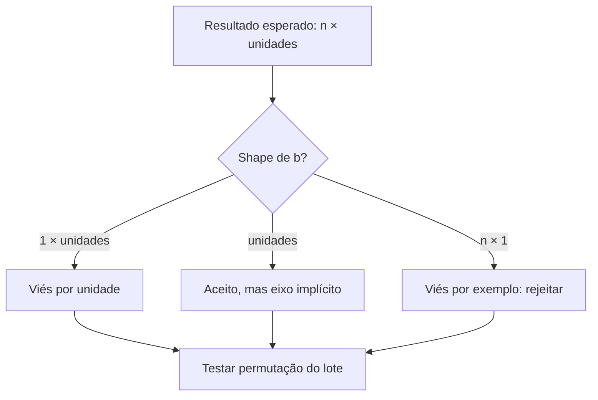

<!-- mirandastech-aula-v2 -->

# Aula 03 — MLP, camadas densas e convenções de shape

- **Trilha:** Especialista em IA
- **Módulo:** M5 · Redes Neurais do Zero
- **Pré-requisito:** [Aula 02 — Perceptron e regra de aprendizagem](./02-perceptron-regra-aprendizagem.md)
- **Objetivo central:** converter o grafo de uma MLP em álgebra matricial sem ambiguidades de eixo, parâmetros ou broadcasting

[](https://colab.research.google.com/github/joaopaulomirandamatias/ai-lab/blob/main/04-deep-learning/m5-redes-neurais-do-zero/notebooks/03-mlp-camadas-densas-shapes-laboratorio.ipynb)

## O problema motivador

Na aula anterior, um perceptron aprendeu uma fronteira linear e falhou no XOR. Acrescentar unidades resolve o problema? Não basta colocar vários neurônios lado a lado: sem uma camada intermediária e uma transformação não linear, todas as operações afins ainda colapsam em uma única operação afim.

Há também um problema menos vistoso e muito frequente. A ideia da rede pode estar correta, o NumPy pode executar sem exceção e, ainda assim, o programa pode somar um viés por exemplo quando pretendia somar um viés por unidade. A saída até preserva o shape esperado em certos lotes. Esse erro silencioso nasce quando se programa antes de declarar o significado de cada eixo.

Nesta aula construiremos uma MLP (*multilayer perceptron*) de duas camadas: uma camada oculta densa e uma camada de saída densa. O foco não é treinar. É estabelecer o contrato estrutural que todo forward, backward e otimizador das próximas aulas deverá respeitar.

## Objetivos de aprendizagem

Ao final, você deverá conseguir:

1. distinguir entrada, camada oculta, camada de saída e profundidade;
2. traduzir uma arquitetura $d_0\to d_1\to d_2$ em matrizes;
3. rastrear o shape de cada transformação sem executar código;
4. demonstrar a equivalência entre uma multiplicação matricial e vários neurônios;
5. contar pesos, vieses e ativações separadamente;
6. explicar por que o tamanho do lote não altera o número de parâmetros;
7. reconhecer broadcasting válido, inválido e semanticamente perigoso;
8. testar propriedades do eixo do lote;
9. construir uma solução explícita de XOR com uma camada oculta;
10. provar por que empilhar camadas afins sem não linearidade não aumenta a capacidade.

## Pré-requisitos

- produto interno e multiplicação de matrizes;
- transformação afim $x^\top w+b$;
- perceptron, função limiar e XOR;
- arrays NumPy bidimensionais;
- noção de lote de exemplos.

## Vocabulário

| Termo | Definição operacional |
|---|---|
| **MLP** | rede feedforward formada por camadas densas intercaladas com não linearidades |
| **camada densa** | cada unidade recebe todas as saídas da camada anterior |
| **unidade oculta** | unidade entre entrada e saída cuja ativação é representação intermediária |
| **largura** | quantidade de unidades em uma camada |
| **profundidade** | número de camadas parametrizadas segundo a convenção adotada |
| **pré-ativação** | transformação afim $Z=XW+b$, antes da função de ativação |
| **ativação** | $A=\phi(Z)$, saída da função aplicada à pré-ativação |
| **lote** | conjunto de exemplos processados em paralelo |
| **broadcasting** | expansão implícita de dimensões compatíveis em uma operação de arrays |
| **invariante** | propriedade que deve permanecer verdadeira em toda execução correta |

## 1. Da unidade isolada à camada densa

Uma unidade recebe $d_{\text{in}}$ valores e produz um escalar:

$$
z_j=\sum_{k=1}^{d_{\text{in}}}x_kW_{kj}+b_j.
$$

Aqui:

- $j$ identifica a unidade de saída;
- $k$ percorre as entradas;
- $W_{kj}$ é o peso da entrada $k$ para a unidade $j$;
- $b_j$ é o viés da unidade $j$;
- $z_j$ é sua pré-ativação.

Coloque $d_{\text{out}}$ unidades lado a lado. Para um lote de $n$ exemplos, a mesma soma vira:

$$
Z=XW+b,
$$

com o contrato:

| Objeto | Shape | Significado dos eixos |
|---|---:|---|
| $X$ | $(n,d_{\text{in}})$ | exemplos × atributos de entrada |
| $W$ | $(d_{\text{in}},d_{\text{out}})$ | entradas × unidades de saída |
| $b$ | $(1,d_{\text{out}})$ | uma linha × unidades de saída |
| $Z$ | $(n,d_{\text{out}})$ | exemplos × pré-ativações |

O eixo interno da multiplicação deve coincidir:

$$
(n,\cancel{d_{\text{in}}})
(\cancel{d_{\text{in}}},d_{\text{out}})
\longrightarrow(n,d_{\text{out}}).
$$

Cada **coluna** $W_{:j}$ reúne os pesos da unidade $j$. Por isso,

$$
Z_{:j}=XW_{:j}+b_j.
$$

Calcular cada coluna separadamente e empilhá-las deve produzir exatamente o mesmo resultado que `X @ W + b`. No laboratório, com sete exemplos, cinco entradas e quatro unidades, a diferença máxima foi $8{,}882\times10^{-16}$ — apenas arredondamento de ponto flutuante.

> Outra convenção, com exemplos em colunas e unidades nas linhas de $W$, também é matematicamente válida. O erro é misturar convenções. Neste M5, exemplos permanecem nas linhas.

## 2. O grafo de uma MLP de duas camadas

Adote as larguras $d_0$, $d_1$ e $d_2$ para entrada, camada oculta e saída. Chamaremos a rede de **duas camadas** porque contamos as duas transformações parametrizadas e não contamos a entrada. Alguns textos usam outra nomenclatura; sempre prefira declarar a arquitetura completa.

O forward estrutural é:

$$
\begin{aligned}
Z^{[1]} &= XW^{[1]}+b^{[1]},\\
A^{[1]} &= \phi^{[1]}\left(Z^{[1]}\right),\\
Z^{[2]} &= A^{[1]}W^{[2]}+b^{[2]},\\
A^{[2]} &= \phi^{[2]}\left(Z^{[2]}\right).
\end{aligned}
$$

Os sobrescritos entre colchetes identificam camadas, não potências. Os shapes são:

| Objeto | Shape | Papel |
|---|---:|---|
| $X=A^{[0]}$ | $(n,d_0)$ | lote de entrada |
| $W^{[1]}$ | $(d_0,d_1)$ | conexões entrada → oculta |
| $b^{[1]}$ | $(1,d_1)$ | vieses ocultos |
| $Z^{[1]}$ | $(n,d_1)$ | pré-ativações ocultas |
| $A^{[1]}$ | $(n,d_1)$ | representação oculta |
| $W^{[2]}$ | $(d_1,d_2)$ | conexões oculta → saída |
| $b^{[2]}$ | $(1,d_2)$ | vieses de saída |
| $Z^{[2]}$ | $(n,d_2)$ | pré-ativações finais |
| $A^{[2]}$ | $(n,d_2)$ | saída da rede |



A função $\phi$ é aplicada elemento a elemento nesta arquitetura. Portanto, não muda o shape. Sua escolha, derivada e estabilidade serão o tema da Aula 04. A saída pode usar identidade, limiar, sigmoid ou softmax conforme a tarefa; ainda não precisamos escolher uma loss.

## 3. Exemplo resolvido passo a passo

Considere dois exemplos, três atributos, duas unidades ocultas e uma saída:

$$
X=
\begin{bmatrix}
1&0&-1\\
2&1&0
\end{bmatrix},\quad
W^{[1]}=
\begin{bmatrix}
1&-1\\
2&0{,}5\\
-1&1
\end{bmatrix},\quad
b^{[1]}=\begin{bmatrix}0{,}5&-0{,}5\end{bmatrix}.
$$

Os shapes são $(2,3)(3,2)+(1,2)\to(2,2)$. Para a primeira linha e a primeira unidade:

$$
z^{[1]}_{11}=1(1)+0(2)+(-1)(-1)+0{,}5=2{,}5.
$$

Para a mesma linha e a segunda unidade:

$$
z^{[1]}_{12}=1(-1)+0(0{,}5)+(-1)(1)-0{,}5=-2{,}5.
$$

Repetindo para a segunda linha:

$$
Z^{[1]}=
\begin{bmatrix}
2{,}5&-2{,}5\\
4{,}5&-2
\end{bmatrix}.
$$

Use, por enquanto, $\phi(z)=\max(0,z)$:

$$
A^{[1]}=
\begin{bmatrix}
2{,}5&0\\
4{,}5&0
\end{bmatrix}.
$$

Com

$$
W^{[2]}=\begin{bmatrix}2\\-3\end{bmatrix},
\qquad b^{[2]}=\begin{bmatrix}0{,}25\end{bmatrix},
$$

temos $(2,2)(2,1)+(1,1)\to(2,1)$ e:

$$
Z^{[2]}=
\begin{bmatrix}
5{,}25\\
9{,}25
\end{bmatrix}.
$$

O laboratório usa esses valores exatos como oráculo. Assim, não testa a multiplicação matricial apenas contra outra chamada equivalente da mesma implementação.

## 4. Parâmetros não são ativações

Para uma camada $d_{\text{in}}\to d_{\text{out}}$:

$$
P=d_{\text{in}}d_{\text{out}}+d_{\text{out}}
=(d_{\text{in}}+1)d_{\text{out}}.
$$

O primeiro termo conta pesos; o segundo, um viés por unidade. Em $d_0\to d_1\to d_2$:

$$
P=(d_0+1)d_1+(d_1+1)d_2.
$$

Para $3\to4\to2$:

$$
P=(3+1)4+(4+1)2=16+10=26.
$$

Trocar um lote de uma observação por 32 observações mantém os 26 parâmetros. O que cresce são as ativações. Se contarmos apenas $X$, $Z^{[1]}$ e $Z^{[2]}$, há

$$
n(d_0+d_1+d_2)
$$

elementos: 9 para $n=1$, 63 para $n=7$ e 288 para $n=32$. Mais adiante, o backward exigirá guardar valores intermediários, e essa distinção será central para estimar memória.

| Quantidade | Depende do lote $n$? | Persiste após o forward? |
|---|---|---|
| pesos e vieses | não | sim, formam o modelo |
| pré-ativações e ativações | sim | somente se necessárias ao uso/cache |
| saída por exemplo | sim | conforme a aplicação |
| largura da arquitetura | não | é hiperparâmetro estrutural |

## 5. Broadcasting: compatibilidade não garante significado

Em `X @ W + b`, a matriz principal tem shape $(n,d_{\text{out}})$. O viés correto tem $(1,d_{\text{out}})$; o NumPy replica essa única linha sobre os $n$ exemplos. Assim, toda linha recebe o mesmo vetor de vieses.

Um vetor com shape $(d_{\text{out}},)$ também funciona pelas regras do NumPy. Nesta trilha exigiremos $(1,d_{\text{out}})$ para manter o eixo explícito. Já um array $(n,1)$ representa outra coisa: um deslocamento diferente para cada exemplo, compartilhado pelas unidades.

O caso perigoso ocorre quando $n=d_{\text{out}}$. Com ambos iguais a 3:

$$
(3,3)+(3,1)\longrightarrow(3,3).
$$

Não há erro de shape. O resultado, porém, depende da posição do exemplo no lote. No experimento, o falso viés produziu erro de equivariância igual a $0{,}5$. A função `dense` estrita rejeitou essa entrada antes do cálculo.



### Um vetor isolado também merece cuidado

Se um único exemplo chega como `(d_0,)`, `X @ W` produz `(d_1,)`, apagando o eixo de lote. Prefira `x.reshape(1, -1)`, resultando em `(1,d_0)`. Manter todos os exemplos bidimensionais reduz ramificações especiais no forward e no backward.

## 6. Invariantes do eixo do lote

Uma MLP densa como a desta aula aplica a mesma função a cada linha, sem misturar exemplos. Isso implica propriedades testáveis.

### Equivariança à permutação

Se $P$ é uma matriz de permutação que apenas reordena linhas:

$$
f(PX)=Pf(X).
$$

Não se trata de invariância, pois as saídas mudam de posição; trata-se de **equivariança**: a transformação acompanha a mesma permutação. O laboratório obteve erro máximo zero.

### Independência entre exemplos

Processar $x_i$ sozinho ou dentro de um lote deve produzir a mesma saída:

$$
f(x_i)=f(X)_{i:}.
$$

A diferença observada foi $2{,}220\times10^{-16}$, compatível com a ordem de operações em ponto flutuante. Camadas que calculam estatísticas do lote, como uma forma de BatchNorm em modo de treino, quebrarão deliberadamente essa propriedade; isso será declarado quando aparecer.

### Duplicatas consistentes

Duas linhas idênticas devem gerar saídas idênticas. O erro medido foi zero. Se isso falhar numa camada densa determinística, suspeite de estado oculto, índice usado como atributo, broadcasting incorreto ou aleatoriedade não controlada.

Esses são **testes de propriedade**, não casos isolados. Eles testam relações que devem valer para muitos dados e complementam asserts de shape.

## 7. Como a camada oculta resolve XOR

XOR vale 1 quando exatamente uma das entradas binárias vale 1:

| $x_1$ | $x_2$ | XOR |
|---:|---:|---:|
| 0 | 0 | 0 |
| 0 | 1 | 1 |
| 1 | 0 | 1 |
| 1 | 1 | 0 |

Nenhuma única reta separa os positivos dos negativos no espaço $(x_1,x_2)$. Em vez de procurar uma fronteira impossível ali, a camada oculta cria duas novas coordenadas:

$$
h_1=\mathbb{1}[x_1+x_2-0{,}5\ge0] \quad\text{(OR)},
$$

$$
h_2=\mathbb{1}[x_1+x_2-1{,}5\ge0] \quad\text{(AND)}.
$$

Isso corresponde a:

$$
W^{[1]}=
\begin{bmatrix}
1&1\\
1&1
\end{bmatrix},qquad
b^{[1]}=
\begin{bmatrix}
-0{,}5&-1{,}5
\end{bmatrix}.
$$

A representação resultante é:

| Entrada | $(h_1,h_2)$ | XOR |
|---|---:|---:|
| $(0,0)$ | $(0,0)$ | 0 |
| $(0,1)$ | $(1,0)$ | 1 |
| $(1,0)$ | $(1,0)$ | 1 |
| $(1,1)$ | $(1,1)$ | 0 |

Agora os casos positivos coincidem em $(1,0)$ e podem ser separados por:

$$
\hat y=\mathbb{1}[h_1-2h_2-0{,}5\ge0].
$$

Logo,

$$
W^{[2]}=\begin{bmatrix}1\\-2\end{bmatrix},qquad
b^{[2]}=\begin{bmatrix}-0{,}5\end{bmatrix}.
$$

A arquitetura $2\to2\to1$ tem $(2+1)2+(2+1)1=9$ parâmetros e acertou os quatro casos. Isso demonstra **existência** de uma representação, não aprendizagem: os pesos foram projetados manualmente. A partir da Aula 08 construiremos as derivadas que permitirão ajustá-los.

## 8. Por que a não linearidade é indispensável

Suponha que removamos $\phi$ entre as camadas:

$$
Z^{[2]}=(XW^{[1]}+b^{[1]})W^{[2]}+b^{[2]}.
$$

Distribuindo:

$$
Z^{[2]}
=X\underbrace{(W^{[1]}W^{[2]})}_{W^*}
{}+\underbrace{(b^{[1]}W^{[2]}+b^{[2]})}_{b^*}
=XW^*+b^*.
$$

A composição inteira é apenas outra transformação afim. No laboratório, as duas formulações coincidiram com erro máximo $1{,}776\times10^{-15}$. A profundidade só passa a criar novas geometrias quando há não linearidade entre as transformações.

Isso não significa que “qualquer ativação resolve qualquer problema”. Faixa, derivada, saturação e estabilidade importam. A próxima aula fará essa análise antes de adotarmos uma implementação geral.

## 9. Implementação mínima e auditável

```python
import numpy as np

def dense(X, W, b):
    X = np.asarray(X, dtype=np.float64)
    W = np.asarray(W, dtype=np.float64)
    b = np.asarray(b, dtype=np.float64)

    assert X.ndim == 2
    assert W.ndim == 2
    assert b.ndim == 2 and b.shape[0] == 1
    assert X.shape[1] == W.shape[0]
    assert W.shape[1] == b.shape[1]

    Z = X @ W + b
    assert Z.shape == (X.shape[0], W.shape[1])
    assert np.isfinite(Z).all()
    return Z
```

Essa função é deliberadamente pequena. Ela ainda não:

- inicializa parâmetros;
- guarda cache para backward;
- escolhe ativação;
- calcula loss;
- aceita tensores com mais de dois eixos;
- treina a rede.

Separar responsabilidades reduz a superfície de erro. Um módulo `Dense` completo surgirá depois que tivermos derivado forward e backward de cada operação.

## 10. Erros comuns e depuração

| Erro | Sintoma | Diagnóstico correto |
|---|---|---|
| misturar exemplos em linhas e colunas | `matmul` incompatível ou transpostas em cascata | escrever shapes antes da equação |
| armazenar unidades nas linhas de $W$ sem adaptar a fórmula | saída errada apesar de dimensões plausíveis | conferir $Z_{:j}=XW_{:j}+b_j$ |
| usar $b$ com shape $(n,1)$ | resultado depende da posição no lote | testar $f(PX)=Pf(X)$ |
| apagar eixo de lote para um exemplo | código especial e bugs no backward | usar `(1, d)` |
| incluir $n$ na contagem de parâmetros | modelo parece mudar com o batch size | contar somente $W$ e $b$ |
| chamar entrada de primeira camada | profundidade ambígua | declarar $d_0\to d_1\to d_2$ |
| omitir ativação oculta | várias camadas colapsam em uma afim | expandir a composição algebricamente |
| confundir pré-ativação e ativação | derivadas futuras usam variável errada | manter nomes `Z` e `A` distintos |
| usar comparação exata em cálculo aleatório | teste frágil por ponto flutuante | usar tolerância justificada |
| acreditar que shape correto prova correção | broadcasting semântico passa | testar propriedades, não só dimensões |

## 11. Checklist prático

- [ ] Declarei a convenção de eixos antes de escrever o forward.
- [ ] Toda entrada de lote permanece bidimensional.
- [ ] Cada $W^{[\ell]}$ tem shape $(d_{\ell-1},d_\ell)$.
- [ ] Cada $b^{[\ell]}$ tem shape $(1,d_\ell)$.
- [ ] Distingo $Z^{[\ell]}$ de $A^{[\ell]}$.
- [ ] A ativação elemento a elemento preserva o shape.
- [ ] Contei pesos e vieses por camada independentemente do lote.
- [ ] Comparei a forma matricial com neurônios individuais.
- [ ] Testei permutação, independência e duplicatas no lote.
- [ ] Rejeito broadcasting que atribui parâmetros a exemplos.
- [ ] Verifiquei que camadas afins consecutivas colapsam.
- [ ] Sei que a solução de XOR foi construída, ainda não aprendida.

## 12. Laboratório reproduzível

O [notebook da Aula 03](../notebooks/03-mlp-camadas-densas-shapes-laboratorio.ipynb) contém 28 células, sendo 12 de código, e nove contratos consolidados. Usa NumPy e Matplotlib, seed fixa e dados explícitos ou sintéticos. A cópia de validação executou todas as células em ordem, sem erro nem aviso inesperado; o arquivo publicado permanece com outputs limpos.

Resultados confirmados:

| Verificação | Resultado |
|---|---:|
| matriz × neurônios individuais | erro máximo $8{,}882\times10^{-16}$ |
| arquitetura $3\to4\to2$ | 26 parâmetros |
| equivariância à permutação | erro máximo $0$ |
| independência do lote | erro máximo $2{,}220\times10^{-16}$ |
| broadcasting semanticamente errado | violação $0{,}5$ e rejeição pela função estrita |
| XOR com $2\to2\to1$ | acurácia $1{,}0$ nos quatro casos |
| colapso de duas camadas afins | erro máximo $1{,}776\times10^{-15}$ |

### O que o laboratório não prova

- que a arquitetura generaliza para uma população;
- que gradiente descendente encontrará os pesos do XOR;
- que ReLU é sempre a melhor ativação;
- que lotes diferentes terão execução numericamente idêntica em todo hardware;
- que asserts de shape substituem testes de loss e gradiente.

## 13. Exercícios

### 1. Shape de uma camada

Um lote tem 32 exemplos com 784 atributos. A camada possui 128 unidades. Quais são os shapes de $W$, $b$ e $Z$?

**Resposta comentada:** $W:(784,128)$, $b:(1,128)$ e $Z:(32,128)$. O 32 atravessa a camada como eixo de exemplos; não entra em $W$.

### 2. Contagem de parâmetros

Quantos parâmetros tem uma MLP $10\to8\to3$?

**Resposta comentada:** $(10+1)8+(8+1)3=88+27=115$. São 104 pesos e 11 vieses.

### 3. Descubra o shape ausente

Se $A^{[1]}$ tem $(64,20)$ e $Z^{[2]}$ tem $(64,5)$, qual deve ser o shape de $W^{[2]}$?

**Resposta comentada:** $(20,5)$, pois $(64,20)(20,5)\to(64,5)$.

### 4. Broadcasting

Por que um viés `(128,)` funciona em `Z + b`, mas `(1, 128)` é preferido nesta trilha?

**Resposta comentada:** as regras do NumPy alinham `(128,)` ao último eixo. A forma `(1,128)` torna explícito que existe uma linha compartilhada pelo lote e facilita asserts e rastreamento algébrico.

### 5. Contraprova de semântica

Um teste verifica apenas `output.shape == (n, d_out)`. Dê um bug que passa nesse teste.

**Resposta comentada:** quando $n=d_{\text{out}}$, somar um falso viés `(n,1)` produz `(n,d_out)`, mas associa um deslocamento a cada exemplo. Um teste de permutação do lote expõe o erro.

### 6. Permutação

Qual relação deve ser testada ao reordenar as linhas por uma permutação $P$?

**Resposta comentada:** $f(PX)=Pf(X)$. Comparar `f(PX)` diretamente com `f(X)` seria errado porque a saída deve acompanhar a ordem dos exemplos.

### 7. XOR

Na solução apresentada, o que representam as duas unidades ocultas?

**Resposta comentada:** a primeira implementa OR e a segunda AND. A camada oculta troca as coordenadas originais por propriedades lógicas em que XOR se torna linearmente separável.

### 8. Colapso afim

Três camadas densas sem ativação expressam mais que uma camada densa?

**Resposta comentada:** não. A composição de transformações afins continua afim. Podemos multiplicar os pesos e combinar os vieses para obter uma única transformação equivalente.

### 9. Parâmetros versus memória

Dobrar o batch size dobra o número de parâmetros? E os elementos de ativação?

**Resposta comentada:** não altera os parâmetros. Em uma arquitetura fixa, dobra aproximadamente os elementos das ativações e o trabalho do forward.

## 14. Conexões com IA e sistemas reais

- **Classificação de imagens:** uma imagem achatada pode entrar como linha; cada coluna de $W$ representa uma unidade que combina todos os pixels. CNNs posteriores trocarão conectividade total por compartilhamento local.
- **Embeddings e Transformers:** projeções densas continuam sendo multiplicações matriciais. Convenções de batch, sequência e dimensão do modelo tornam o rastreamento de eixos ainda mais importante.
- **LLMs:** matrizes de projeção possuem bilhões de parâmetros, mas o princípio $\text{entrada}\times\text{pesos}\to\text{saída}$ permanece. Confundir eixos de tokens, cabeças e features gera bugs análogos.
- **Sistemas de produção:** tamanho de lote afeta throughput, latência e memória de ativações, mas não muda o checkpoint do modelo.
- **Pesquisa reproduzível:** declarar shapes e testar invariantes transforma uma figura conceitual em especificação executável.

## Resumo

Uma camada densa reúne unidades em $Z=XW+b$. Com exemplos nas linhas, $W$ possui entradas nas linhas e unidades nas colunas, enquanto $b$ é uma linha compartilhada. Uma MLP de duas camadas $d_0\to d_1\to d_2$ produz uma representação oculta $(n,d_1)$ e uma saída $(n,d_2)$.

Parâmetros dependem das larguras, não do tamanho do lote. Shapes corretos são necessários, mas insuficientes: broadcasting errado pode manter a dimensão final. Por isso verificamos equivalência com neurônios individuais, equivariância à permutação, independência entre linhas e consistência de duplicatas.

A camada oculta resolveu XOR ao representar OR e AND, mostrando como uma não linearidade muda a geometria. Sem ela, qualquer pilha de transformações afins colapsa em uma única transformação afim.

## Referências

### Técnicas e institucionais

1. Goodfellow, Bengio e Courville — [Deep Learning, capítulo 6: Deep Feedforward Networks](https://www.deeplearningbook.org/contents/mlp.html).
2. Stanford CS231n — [Neural Networks Part 1: Setting up the Architecture](https://cs231n.github.io/neural-networks-1/).
3. Dive into Deep Learning 1.0.3 — [Multilayer Perceptrons](https://d2l.ai/chapter_multilayer-perceptrons/mlp.html).

URLs e versões acessíveis verificadas em **9 de setembro de 2026**. A convenção matricial desta aula usa exemplos nas linhas; algumas referências exibem exemplos como vetores-coluna, sem diferença matemática quando toda a notação é transposta de modo consistente.

## Próxima aula

Na **Aula 04 — Funções de ativação**, derivaremos sigmoid, tanh, ReLU e variantes. Vamos comparar faixas, derivadas, saturação e comportamento numérico antes de generalizar o forward da rede.
