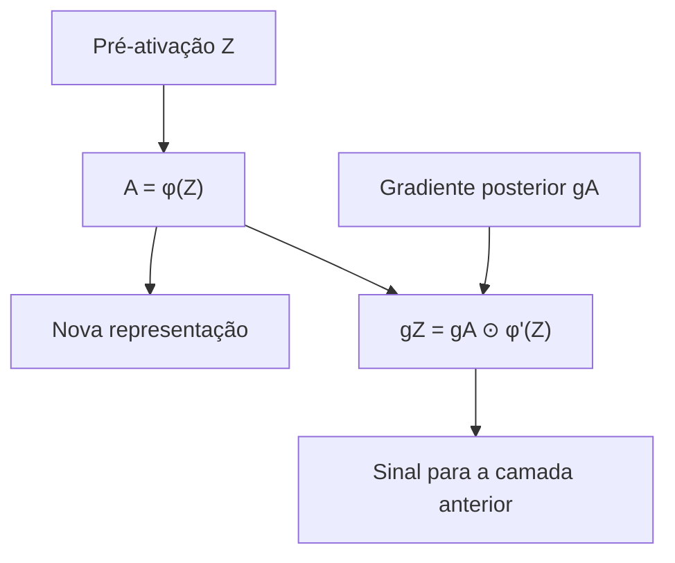
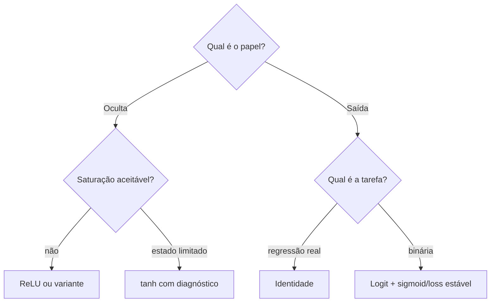

<!-- mirandastech-aula-v2 -->

# Aula 04 — Funções de ativação: sigmoid, tanh, ReLU e variantes

- **Trilha:** Especialista em IA
- **Módulo:** M5 · Redes Neurais do Zero
- **Pré-requisito:** [Aula 03 — MLP, camadas densas e convenções de shape](./03-mlp-camadas-densas-shapes.md)
- **Objetivo central:** derivar, implementar e comparar ativações pela geometria, inclinação local e estabilidade numérica

[](https://colab.research.google.com/github/joaopaulomirandamatias/ai-lab/blob/main/04-deep-learning/m5-redes-neurais-do-zero/notebooks/04-funcoes-ativacao-laboratorio.ipynb)

## O problema motivador

Na aula anterior, mostramos que duas camadas afins consecutivas colapsam em uma única transformação afim. A camada oculta só criou uma representação capaz de separar XOR porque introduzimos uma função não linear entre as matrizes.

Mas “coloque uma ativação” é uma orientação incompleta. Sigmoid, tanh e ReLU transformam o mesmo número de maneiras radicalmente diferentes. Algumas limitam a saída; outras deixam o lado positivo crescer. Algumas possuem derivada pequena em grandes regiões; outra nem sequer tem derivada clássica exatamente em zero. Uma fórmula matematicamente correta ainda pode provocar overflow se implementada de forma ingênua.

Imagine uma MLP profunda usada para detectar anomalias industriais. Se as pré-ativações de várias camadas caírem na região saturada da sigmoid, cada inclinação local será minúscula. Pela regra da cadeia, o sinal de ajuste que chega às primeiras camadas pode se tornar quase zero. Se todas as entradas de uma ReLU forem negativas, a unidade produz zero e também recebe derivada local zero. A escolha da ativação altera a representação e a dinâmica de treinamento.

Nesta aula estudaremos a operação local

$$
a=\phi(z),
$$

antes de construir o forward completo. O cache será assunto da Aula 05; losses e backward da rede virão depois.

## Objetivos de aprendizagem

Ao final, você deverá conseguir:

1. explicar por que uma MLP precisa de não linearidade;
2. derivar sigmoid, tanh, ReLU, Leaky ReLU e softplus;
3. distinguir saturação, região inativa e ponto não diferenciável;
4. interpretar $\phi'(z)$ como ganho local do sinal;
5. implementar sigmoid e softplus com estabilidade numérica;
6. verificar derivadas por diferenças centrais sem testar em quinas;
7. comparar faixa, centralização, custo e limitações das ativações;
8. documentar uma convenção para a derivada da ReLU em zero;
9. separar ativação oculta de transformação de saída;
10. reconhecer onde ELU, PReLU, SiLU e GELU se encaixam.

## Pré-requisitos

- derivada, regra do produto e regra da cadeia;
- exponencial e logaritmo;
- shapes e camada densa da Aula 03;
- arrays e operações vetorizadas do NumPy;
- noções de ponto flutuante e overflow.

## Vocabulário

| Termo | Definição |
|---|---|
| **ativação** | função $\phi$ aplicada à pré-ativação $z$ |
| **inclinação local** | derivada $\phi'(z)$ no ponto avaliado |
| **saturação** | região em que a saída muda muito pouco e $|\phi'(z)|$ se aproxima de zero |
| **região inativa** | região da ReLU em que saída e derivada implementada valem zero |
| **centrada em zero** | distribuição de saída cuja média pode ficar próxima de zero sob entrada simétrica |
| **quina** | ponto contínuo com derivadas laterais diferentes |
| **subgradiente** | generalização de derivada para funções convexas não diferenciáveis |
| **overflow** | resultado intermediário acima do maior número representável |
| **função por partes** | função definida por expressões diferentes em regiões distintas |

## 1. O que uma ativação muda

Considere uma camada:

$$
Z=XW+b,\qquad A=\phi(Z).
$$

Como $\phi$ é aplicada elemento a elemento nesta MLP, $A$ preserva o shape de $Z$. O que muda é a geometria da função composta. Sem ativação:

$$
(XW^{[1]}+b^{[1]})W^{[2]}+b^{[2]}=XW^*+b^*.
$$

Com ativação não linear:

$$
\phi(XW^{[1]}+b^{[1]})W^{[2]}+b^{[2]}
$$

não pode, em geral, ser reduzida a uma única matriz e um único viés.

No caminho inverso, se $g_A=\partial L/\partial A$ representa o gradiente que chega de operações posteriores, a contribuição local é:

$$
g_Z=\frac{\partial L}{\partial Z}
=g_A\odot\phi'(Z),
$$

onde $\odot$ é o produto elemento a elemento. Ainda não implementaremos o backward da rede; a equação serve para explicar por que a inclinação da ativação importa.



Quatro perguntas ajudam a analisar uma ativação:

1. Qual é sua faixa de saída?
2. Onde sua derivada é grande, pequena ou zero?
3. Ela é diferenciável em todos os pontos?
4. A implementação continua finita para valores extremos?

## 2. Sigmoid

A sigmoid logística é:

$$
\sigma(z)=\frac{1}{1+e^{-z}}.
$$

Matematicamente, $0<\sigma(z)<1$. Em ponto flutuante, valores extremos podem arredondar exatamente para 0 ou 1. Ela é monotônica, suave e satisfaz:

$$
\sigma(-z)=1-\sigma(z).
$$

### Derivação

Escreva $\sigma(z)=(1+e^{-z})^{-1}$. Pela regra da cadeia:

$$
\begin{aligned}
\sigma'(z)
&=-(1+e^{-z})^{-2}(-e^{-z})\\
&=\frac{e^{-z}}{(1+e^{-z})^2}.
\end{aligned}
$$

Como


$$
1-\sigma(z)=\frac{e^{-z}}{1+e^{-z}},
$$

obtemos a forma computacional útil:

$$
\boxed{\sigma'(z)=\sigma(z)(1-\sigma(z))}.
$$

A derivada máxima ocorre em $z=0$, onde $\sigma(0)=0{,}5$:

$$
\sigma'(0)=0{,}25.
$$

Quando $|z|$ cresce, a saída se aproxima de uma constante e a derivada se aproxima de zero. Isso é **saturação**.

### Implementação estável

A fórmula direta calcula $e^{-z}$. Para $z=-1000$, isso exige $e^{1000}$, que ultrapassa `float64`. Reescreva o ramo negativo:

$$
\sigma(z)=
\begin{cases}
\dfrac{1}{1+e^{-z}}, & z\ge0,\\[6pt]
\dfrac{e^z}{1+e^z}, & z<0.
\end{cases}
$$

```python
def sigmoid(z):
    z = np.asarray(z, dtype=np.float64)
    out = np.empty_like(z)
    positive = z >= 0
    out[positive] = 1 / (1 + np.exp(-z[positive]))
    exp_z = np.exp(z[~positive])
    out[~positive] = exp_z / (1 + exp_z)
    return out
```

No laboratório, a forma estável permaneceu finita de $-1000$ a $1000$. A fórmula ingênua produziu um intermediário infinito no extremo negativo, embora o quociente final tenha arredondado para zero.

### Onde usar

Sigmoid continua apropriada para uma **saída binária probabilística**, acompanhada de loss e interpretação coerentes. Dizer que ela é problemática em muitas camadas ocultas não significa bani-la de toda rede.

## 3. Tangente hiperbólica

A tangente hiperbólica é:

$$
\tanh(z)=\frac{e^z-e^{-z}}{e^z+e^{-z}}.
$$

Sua faixa é $(-1,1)$ e a função é ímpar:

$$
\tanh(-z)=-\tanh(z).
$$

Há uma ligação direta com a sigmoid:

$$
\tanh(z)=2\sigma(2z)-1.
$$

### Derivação

Aplicando a regra do quociente e simplificando:

$$
\boxed{\frac{d}{dz}\tanh(z)=1-\tanh^2(z)}.
$$

Em zero, a derivada vale 1. Nos extremos, aproxima-se de zero. Portanto, tanh também satura, mas sua saída é centrada em zero sob uma entrada simétrica.

No experimento com 200 mil valores normais gerados por seed fixa, as médias foram:

| Objeto | Média observada |
|---|---:|
| entrada | $0{,}002215$ |
| sigmoid | $0{,}500357$ |
| tanh | $0{,}000752$ |
| ReLU | $0{,}399310$ |
| Leaky ReLU | $0{,}395339$ |

Esses números ilustram o mecanismo, não uma lei universal: a média depende da distribuição das pré-ativações.

## 4. ReLU

A unidade linear retificada é:

$$
\operatorname{ReLU}(z)=\max(0,z)
=
\begin{cases}
0, & z<0,\\
z, & z\ge0.
\end{cases}
$$

Sua derivada clássica é:

$$
\operatorname{ReLU}'(z)=
\begin{cases}
0, & z<0,\\
1, & z>0.
\end{cases}
$$

Em $z=0$, a derivada clássica **não existe**: a inclinação à esquerda é 0 e à direita é 1. Como ReLU é convexa, qualquer valor em $[0,1]$ é um subgradiente válido. Nossa implementação escolhe 0 e documenta a convenção.

O laboratório confirmou:

| Quantidade em $z=0$ | Valor |
|---|---:|
| inclinação lateral esquerda | $0$ |
| inclinação lateral direita | $1$ |
| diferença central | $0{,}5$ |
| convenção implementada | $0$ |

Um gradient check exatamente na quina não decide qual convenção é “correta”. Ele mistura os dois lados e retorna 0,5. Testes numéricos de funções por partes devem usar pontos afastados das fronteiras ou tratar a quina separadamente.

### Região inativa

Quando $z<0$, saída e derivada implementada são zero. Se uma unidade permanece negativa para todos os exemplos relevantes, ela não transmite sinal por esse ramo. Isso é chamado informalmente de **ReLU morta**.

Em 100 mil pré-ativações sintéticas de uma normal com média $-2$ e desvio 1, a fração de zeros foi $0{,}97747$. O resultado alto foi induzido pela distribuição escolhida; não é uma taxa universal de unidades mortas.

## 5. Leaky ReLU e PReLU

Leaky ReLU conserva uma pequena inclinação $\alpha>0$ no lado negativo:

$$
\operatorname{LReLU}(z)=
\begin{cases}
\alpha z, & z<0,\\
z, & z\ge0.
\end{cases}
$$

Fora de zero:

$$
\operatorname{LReLU}'(z)=
\begin{cases}
\alpha, & z<0,\\
1, & z>0.
\end{cases}
$$

Usamos $\alpha=0{,}01$. No mesmo experimento deslocado, nenhuma derivada local foi zero e a menor inclinação foi 0,01. Isso demonstra o mecanismo, mas não prova melhor generalização ou convergência.

Na **PReLU**, $\alpha$ deixa de ser hiperparâmetro fixo e passa a ser aprendido. Isso acrescenta parâmetros e exige derivar também $\partial L/\partial\alpha$. A ideia será retomada quando o backward estiver disponível.

## 6. Softplus: uma retificação suave

Softplus é:

$$
\operatorname{softplus}(z)=\log(1+e^z).
$$

Ela é suave, positiva e se aproxima de ReLU:

- para $z\ll0$, aproxima-se de 0;
- para $z\gg0$, aproxima-se de $z$.

Sua derivada revela uma conexão elegante:

$$
\begin{aligned}
\frac{d}{dz}\log(1+e^z)
&=\frac{e^z}{1+e^z}\\
&=\frac{1}{1+e^{-z}}\\
&=\sigma(z).
\end{aligned}
$$

A implementação direta `log(1 + exp(z))` explode em $z=1000$. O NumPy oferece:

```python
def softplus(z):
    return np.logaddexp(0.0, z)
```

No laboratório, a forma ingênua retornou infinito em 1000; `logaddexp` retornou exatamente 1000 dentro da precisão disponível.

Softplus remove a quina da ReLU, mas sua inclinação no extremo negativo também se aproxima de zero. “Suave” não significa “imune a gradientes pequenos”.

## 7. Outras variantes no mapa

| Função | Expressão | Característica | Cuidado |
|---|---|---|---|
| ELU | $z$ se $z\ge0$; $\alpha(e^z-1)$ caso contrário | lado negativo satura em $-\alpha$ | derivada na junção coincide apenas se $\alpha=1$ |
| PReLU | $z$ se $z\ge0$; $\alpha z$ caso contrário | inclinação negativa aprendida | adiciona parâmetros |
| SiLU/Swish | $z\sigma(z)$ | suave e não monotônica em parte da região negativa | usa sigmoid e tem maior custo que ReLU |
| GELU | $z\Phi(z)$ | pondera a entrada pela CDF normal | requer cálculo ou aproximação de $\Phi$ |
| softplus | $\log(1+e^z)$ | aproximação suave da ReLU | implementar com `logaddexp` |

Para SiLU:

$$
\frac{d}{dz}[z\sigma(z)]
=\sigma(z)+z\sigma(z)(1-\sigma(z)).
$$

Para GELU exata, com $\Phi$ como CDF e $\varphi$ como densidade da normal padrão:

$$
\frac{d}{dz}[z\Phi(z)]=\Phi(z)+z\varphi(z).
$$

SiLU e GELU aparecem em arquiteturas modernas, inclusive modelos de linguagem. Elas estão aqui para completar o mapa, não para antecipar o módulo de Transformers.

## 8. Saturação e regra da cadeia

Considere uma cadeia escalar idealizada. Pela regra da cadeia:

$$
\frac{\partial a^{[L]}}{\partial a^{[0]}}
=\prod_{\ell=1}^{L}\phi'(z^{[\ell]})\,w^{[\ell]}.
$$

Mesmo ignorando os pesos, uma cadeia de 20 sigmoids possui produto máximo de inclinações:

$$
\left(\frac14\right)^{20}
=9{,}095\times10^{-13}.
$$

Isso é uma ilustração de pior contração local, não o gradiente completo de uma MLP. Pesos, arquitetura, normalização, conexões residuais e distribuição das pré-ativações também importam. Vanishing e exploding gradients serão medidos diretamente na Aula 16.

A tabela do laboratório mostra a saturação:

| $z$ | $\sigma(z)$ | $\sigma'(z)$ | $\tanh(z)$ | $\tanh'(z)$ |
|---:|---:|---:|---:|---:|
| $-20$ | $2{,}061\times10^{-9}$ | $2{,}061\times10^{-9}$ | aproximadamente $-1$ | aproximadamente $0$ |
| $-5$ | $0{,}006693$ | $0{,}006648$ | $-0{,}999909$ | $0{,}000182$ |
| $0$ | $0{,}5$ | $0{,}25$ | $0$ | $1$ |
| $5$ | $0{,}993307$ | $0{,}006648$ | $0{,}999909$ | $0{,}000182$ |
| $20$ | $1-2{,}061\times10^{-9}$ | $2{,}061\times10^{-9}$ | aproximadamente $1$ | aproximadamente $0$ |

## 9. Verificação numérica correta

Para uma função escalar diferenciável, a diferença central é:

$$
\phi'(z)\approx\frac{\phi(z+h)-\phi(z-h)}{2h}.
$$

Usamos $h=10^{-6}$ em pontos longe de zero. Os maiores erros absolutos foram:

| Função | Erro máximo |
|---|---:|
| sigmoid | $5{,}700\times10^{-11}$ |
| tanh | $5{,}437\times10^{-11}$ |
| ReLU | $1{,}398\times10^{-10}$ |
| Leaky ReLU | $1{,}398\times10^{-10}$ |
| softplus | $2{,}470\times10^{-10}$ |

Esses valores são pequenos e compatíveis com truncamento da diferença finita e arredondamento. Usar $h$ pequeno demais aumenta cancelamento; usar grande demais piora a aproximação local.

## 10. Ativação oculta não é decisão de saída

A última transformação deve combinar com o significado da tarefa e com a loss.

| Papel | Transformação comum | Interpretação |
|---|---|---|
| camada oculta densa | ReLU, Leaky ReLU, tanh, GELU ou SiLU | representação intermediária |
| regressão sem limite | identidade | valor real |
| probabilidade binária | sigmoid sobre logit | número entre 0 e 1 |
| classes mutuamente exclusivas | softmax | distribuição que soma 1 |
| múltiplos rótulos independentes | uma sigmoid por rótulo | probabilidades marginais |

Softmax e cross-entropy multiclasse terão uma aula própria. Também calcularemos losses a partir de logits com formas estáveis. Não aplique sigmoid apenas porque “a rede precisa de ativação”; pergunte qual objeto matemático a saída deve representar.



## 11. Armadilhas e erros comuns

| Erro | Consequência | Prevenção |
|---|---|---|
| usar sigmoid ingênua em extremos | overflow intermediário | implementar por ramos |
| calcular softplus como `log(1 + exp(z))` | infinito para $z$ grande | usar `logaddexp` |
| gradient check da ReLU em zero | diferença central dá 0,5 | testar os lados e declarar convenção |
| dizer que ReLU é diferenciável em todo ponto | afirmação matemática falsa | separar continuidade de diferenciabilidade |
| chamar toda saída zero de “neurônio morto” | diagnóstico exagerado | verificar a unidade em dados relevantes e ao longo do treino |
| concluir que Leaky ReLU sempre é melhor | extrapolação sem experimento | comparar sob protocolo controlado |
| confundir saturação com overflow | mistura fenômenos distintos | medir derivada e estabilidade separadamente |
| usar sigmoid oculta por hábito | maior risco de contração local | justificar pelo problema e medir pré-ativações |
| aplicar ativação e depois usar loss incompatível | interpretação e gradiente incorretos | projetar saída e loss em conjunto |
| comparar ativações sem controlar inicialização | atribuição causal inválida | manter demais fatores constantes |
| achar que saída centrada garante gradiente saudável | conclusão insuficiente | medir também derivadas e normas por camada |

## 12. Checklist prático

- [ ] Sei a faixa e a derivada da ativação escolhida.
- [ ] Distingo saturação de não diferenciabilidade.
- [ ] Declaro a derivada usada nas quinas.
- [ ] Preservo shape e dtype na implementação vetorizada.
- [ ] Testo valores pequenos, moderados e extremos.
- [ ] Evito exponenciais intermediárias desnecessárias.
- [ ] Faço gradient check longe das fronteiras por partes.
- [ ] Verifico simetrias e monotonicidade quando aplicáveis.
- [ ] Meço a fração de ReLUs inativas em vez de assumir.
- [ ] Não confundo ativação oculta com transformação de saída.
- [ ] Não atribuo causalidade a uma comparação sem controle.

## 13. Laboratório reproduzível

O [notebook da Aula 04](../notebooks/04-funcoes-ativacao-laboratorio.ipynb) possui 28 células, 12 de código e 11 contratos consolidados. Usa NumPy e Matplotlib, seed fixa, `float64` e arrays sintéticos documentados.

A cópia de validação executou todas as células em ordem, sem erro nem aviso inesperado. O arquivo publicado conserva outputs e contadores de execução limpos.

Resultados principais:

| Verificação | Resultado |
|---|---:|
| sigmoid estável em $[-1000,1000]$ | todos os valores finitos |
| softplus estável em $z=1000$ | $1000$ |
| maior erro de derivada | $2{,}470\times10^{-10}$ |
| produto máximo de 20 derivadas sigmoid | $9{,}095\times10^{-13}$ |
| erro da simetria da sigmoid | $1{,}570\times10^{-16}$ |
| ReLU zero no cenário deslocado | $97{,}747\%$ |
| derivadas zero da Leaky ReLU | $0\%$ |
| contratos satisfeitos | 11 de 11 |

### O que o laboratório não prova

- que uma ativação vence outra em dados reais;
- que a taxa de ReLUs inativas se repetirá em outra distribuição;
- que a loss diminuirá durante treinamento;
- que gradientes de uma rede profunda seguirão o exemplo escalar;
- que a convenção em zero produz diferença prática mensurável;
- que estabilidade do forward garante estabilidade da loss ou do backward.

## 14. Exercícios com respostas comentadas

### 1. Derivada da sigmoid em zero

Calcule $\sigma'(0)$.

**Resposta comentada:** $\sigma(0)=0{,}5$ e $\sigma'(0)=0{,}5(1-0{,}5)=0{,}25$. Essa é a maior inclinação da sigmoid.

### 2. Saturação

Por que uma sigmoid com saída próxima de 1 transmite pouco sinal local?

**Resposta comentada:** se $\sigma(z)\approx1$, então $\sigma'(z)=\sigma(z)(1-\sigma(z))\approx0$. O gradiente upstream é multiplicado por um número pequeno.

### 3. tanh e centralização

Qual é a média esperada de $\tanh(Z)$ quando a distribuição de $Z$ é perfeitamente simétrica em torno de zero?

**Resposta comentada:** zero, pois tanh é ímpar. Valores em $z$ e $-z$ cancelam. Isso não impede saturação nos extremos.

### 4. ReLU em zero

Por que a diferença central retorna 0,5 em zero?

**Resposta comentada:** ela combina o ramo esquerdo, com inclinação 0, e o direito, com inclinação 1. Como as derivadas laterais diferem, a derivada clássica não existe.

### 5. Leaky ReLU

Com $\alpha=0{,}01$, qual é a saída e a derivada em $z=-3$?

**Resposta comentada:** saída $-0{,}03$ e derivada $0{,}01$. O lado negativo não fica plano.

### 6. Softplus

Mostre que a derivada de softplus é sigmoid.

**Resposta comentada:** $d\log(1+e^z)/dz=e^z/(1+e^z)=1/(1+e^{-z})=\sigma(z)$.

### 7. Estabilidade

Por que `logaddexp(0, z)` é preferível a `log(1 + exp(z))`?

**Resposta comentada:** calcula a mesma expressão reorganizando os termos para evitar formar $e^z$ quando ele excederia a faixa numérica.

### 8. Saída binária

O problema da saturação significa que sigmoid nunca deve ser usada?

**Resposta comentada:** não. Ela é uma transformação coerente de logit em probabilidade binária. O cálculo da loss deve ser numericamente estável, preferencialmente a partir do logit.

### 9. Comparação experimental

Você troca ReLU por Leaky ReLU e a métrica melhora. Isso prova que a ativação causou a melhora?

**Resposta comentada:** apenas se inicialização, dados, split, seed, orçamento e demais hiperparâmetros forem controlados, idealmente com repetição sobre seeds. Uma execução isolada não sustenta causalidade.

## 15. Conexões com IA e sistemas reais

- **Visão computacional:** ReLU e variantes permitiram redes profundas com regiões lineares por partes; inicialização coerente será tratada adiante.
- **Modelos recorrentes:** tanh e sigmoid aparecem em estados e portas de LSTM/GRU, onde suas faixas limitadas têm papel estrutural.
- **Transformers e LLMs:** GELU e SiLU são comuns em blocos feedforward. A análise local desta aula continua válida para cada elemento do tensor.
- **Classificação probabilística:** sigmoid transforma logits binários, mas calibração depende de treino, dados e avaliação, não da faixa sozinha.
- **Observabilidade:** histogramas de pré-ativações, ativações e derivadas ajudam a localizar saturação e unidades inativas.
- **Segurança numérica:** evitar `inf` e `nan` é parte do contrato de produção; valores não finitos podem contaminar uma rede inteira.
- **Pesquisa:** comparar ativações exige protocolo, seeds e incerteza, não apenas a melhor curva observada.

## Resumo

Ativações impedem que uma pilha de camadas densas colapse em uma única transformação afim. A sigmoid é suave e limitada, com derivada $\sigma(1-\sigma)$, mas satura e exige implementação cuidadosa. Tanh é centrada em zero e deriva para $1-\tanh^2$, porém também satura.

ReLU é simples e não satura no lado positivo, mas possui região negativa plana e uma quina em zero. Leaky ReLU conserva inclinação negativa; PReLU aprende essa inclinação. Softplus aproxima ReLU suavemente e deve ser calculada com `logaddexp`.

Uma ativação não é escolhida por slogan. Faixa, derivada, estabilidade, papel da camada e protocolo experimental precisam ser explícitos. A saída da rede deve ser projetada em conjunto com a tarefa e a loss.

## Referências

### Técnicas e institucionais

1. Goodfellow, Bengio e Courville — [Deep Learning, capítulo 6](https://www.deeplearningbook.org/contents/mlp.html).
2. Stanford CS231n — [Neural Networks Part 1: activation functions](https://cs231n.github.io/neural-networks-1/).
3. Dive into Deep Learning 1.0.3 — [Multilayer Perceptrons](https://d2l.ai/chapter_multilayer-perceptrons/mlp.html).

### Artigos primários

4. Glorot, Bordes e Bengio (2011) — [Deep Sparse Rectifier Neural Networks](https://proceedings.mlr.press/v15/glorot11a.html).
5. He et al. (2015) — [Delving Deep into Rectifiers: Surpassing Human-Level Performance on ImageNet Classification](https://openaccess.thecvf.com/content_iccv_2015/html/He_Delving_Deep_into_ICCV_2015_paper.html).

URLs e versões acessíveis verificadas em **9 de setembro de 2026**. Recomendações históricas de uma fonte não substituem medição no problema atual; esta aula usa as fontes para definições, mecanismos e contexto técnico.

## Próxima aula

Na **Aula 05 — Forward pass vetorizado**, integraremos camadas densas e ativações em uma sequência reproduzível, com validação de shapes e cache explícito dos intermediários necessários às derivações posteriores.
