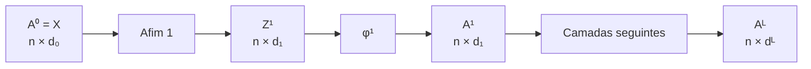
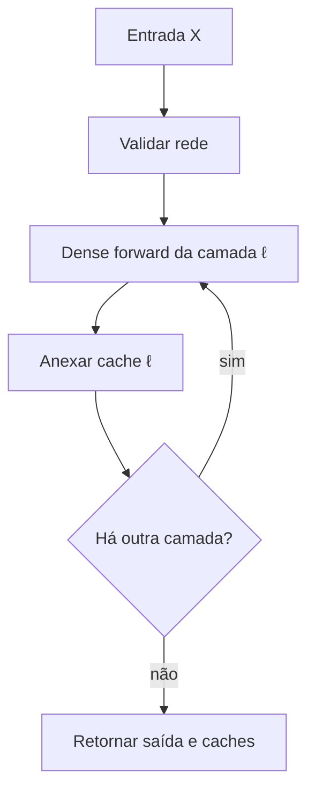

<!-- mirandastech-aula-v2 -->

# Aula 05 — Forward pass vetorizado e cache de intermediários

- **Trilha:** Especialista em IA
- **Módulo:** M5 · Redes Neurais do Zero
- **Pré-requisito:** [Aula 04 — Funções de ativação](./04-funcoes-ativacao.md)
- **Objetivo central:** implementar em NumPy o caminho completo da entrada até os logits, preservando shapes e os intermediários necessários ao backward futuro

[](https://colab.research.google.com/github/joaopaulomirandamatias/ai-lab/blob/main/04-deep-learning/m5-redes-neurais-do-zero/notebooks/05-forward-pass-vetorizado-cache-laboratorio.ipynb)

## O problema motivador

Já sabemos construir uma camada densa e aplicar sigmoid, tanh, ReLU ou uma variante. Falta transformar essas peças em um sistema coerente. Em uma rede real, não calculamos cada neurônio ou cada exemplo isoladamente: propagamos um lote por operações matriciais, camada após camada, até obter a saída.

Esse caminho parece simples, mas concentra erros difíceis de perceber:

- um viés com shape incorreto pode ser aceito por *broadcasting* e produzir uma saída semanticamente errada;
- misturar exemplos nas linhas e atributos nas colunas quebra todas as multiplicações seguintes;
- sobrescrever um intermediário elimina a informação de que o backward precisará;
- guardar tudo duplica memória sem necessidade;
- alterar um array depois do forward pode corromper um cache que apenas referencia esse array;
- aplicar sigmoid no último passo por hábito confunde **logit** com probabilidade antes mesmo de definir a loss.

Imagine uma MLP usada para classificar falhas em sensores. A inferência pode terminar ao produzir logits. O treinamento, porém, precisará percorrer o mesmo grafo no sentido inverso. Se o forward não documentar sua ordem, seus shapes e seu cache, o backward vira adivinhação.

Nesta aula construiremos esse contrato. A Aula 06 definirá MSE e binary cross-entropy; as Aulas 08–13 usarão os caches para derivar o backward, sem autograd.

## Objetivos de aprendizagem

Ao final, você deverá conseguir:

1. formalizar o forward de uma MLP com $L$ camadas;
2. rastrear o shape de cada entrada, parâmetro, pré-ativação e ativação;
3. distinguir produto matricial, produto elemento a elemento e broadcasting;
4. implementar `affine_forward`, `dense_forward` e `mlp_forward` em NumPy;
5. vetorizar o processamento de um lote sem laço sobre exemplos;
6. definir um cache suficiente para o backward futuro;
7. explicar o custo de memória de manter intermediários;
8. validar parâmetros antes que o NumPy aceite um broadcasting acidental;
9. testar independência entre exemplos e equivariância à permutação das linhas;
10. separar logits, probabilidades, predição e loss.

## Pré-requisitos

- multiplicação de matrizes e convenções de shape;
- camada densa e contagem de parâmetros da Aula 03;
- funções de ativação e estabilidade numérica da Aula 04;
- arrays, `@`, broadcasting e `dtype` no NumPy;
- noção de grafo computacional e regra da cadeia.

## Vocabulário

| Termo | Definição |
|---|---|
| **forward pass** | avaliação do grafo da entrada para a saída |
| **pré-ativação** | resultado afim $Z=A_{\text{prev}}W+b$ |
| **ativação** | saída $A=\phi(Z)$ de uma camada |
| **logit** | escore real antes da transformação probabilística |
| **lote** | conjunto de $n$ exemplos processados em paralelo |
| **vetorização** | expressão de operações sobre arrays, sem laço Python por exemplo |
| **cache** | intermediários preservados pelo forward para uso posterior |
| **contrato de shape** | dimensões aceitas e produzidas por uma função |
| **broadcasting** | expansão conceitual de eixos compatíveis em operações elemento a elemento |
| **função pura** | função cujo resultado depende das entradas e não altera estado externo |
| **equivariância à permutação** | permutar as linhas da entrada permuta as mesmas linhas da saída |

## 1. O forward como avaliação de um grafo

Adotaremos **exemplos nas linhas**. Para um lote com $n$ exemplos e $d_0$ atributos:

$$
A^{[0]}=X\in\mathbb{R}^{n\times d_0}.
$$

Para cada camada $\ell\in\{1,\ldots,L\}$:

$$
\boxed{
Z^{[\ell]}=A^{[\ell-1]}W^{[\ell]}+b^{[\ell]},
\qquad
A^{[\ell]}=\phi^{[\ell]}\!\left(Z^{[\ell]}\right)
}
$$

com:

$$
W^{[\ell]}\in\mathbb{R}^{d_{\ell-1}\times d_\ell},
\qquad
b^{[\ell]}\in\mathbb{R}^{d_\ell}.
$$

Logo:

$$
Z^{[\ell]},A^{[\ell]}\in\mathbb{R}^{n\times d_\ell}.
$$

O eixo do lote $n$ é preservado. O eixo de representação muda de $d_{\ell-1}$ para $d_\ell$.



O forward percorre o grafo na ordem das dependências. Não existe $A^{[2]}$ antes de $A^{[1]}$, nem $A^{[1]}$ antes de $Z^{[1]}$.

## 2. Três operações que não devem ser confundidas

| Código | Operação | Exemplo de shape |
|---|---|---|
| `A @ W` | produto matricial | $(n,d_{in})@(d_{in},d_{out})\to(n,d_{out})$ |
| `A * B` | produto elemento a elemento | shapes iguais ou compatíveis por broadcasting |
| `Z + b` | soma com broadcasting | $(n,d_{out})+(d_{out},)\to(n,d_{out})$ |

No NumPy, `@` segue a assinatura matricial $(n,k),(k,m)\to(n,m)$ para arrays bidimensionais. Já `*` é elemento a elemento. Trocar um pelo outro não é uma diferença de estilo; é uma operação matemática diferente.

O viés $b\in\mathbb{R}^{d_{out}}$ é somado a cada linha de $Z$. Conceitualmente:

$$
Z_{ij}=\sum_{k=1}^{d_{in}}A_{ik}W_{kj}+b_j.
$$

O NumPy não precisa materializar $n$ cópias de $b$. Ele aplica as regras de broadcasting sobre o eixo final. Essa conveniência exige disciplina: o código deve validar `b.shape == (d_out,)`, em vez de aceitar qualquer forma que “rode”.

## 3. Contrato de uma camada densa

Separaremos a camada em duas operações:

1. etapa afim: $Z=A_{prev}W+b$;
2. ativação: $A=\phi(Z)$.

```python
def affine_forward(a_prev, w, b):
    assert a_prev.ndim == 2
    assert w.ndim == 2
    assert b.ndim == 1
    assert a_prev.shape[1] == w.shape[0]
    assert b.shape == (w.shape[1],)
    z = a_prev @ w + b
    assert z.shape == (a_prev.shape[0], w.shape[1])
    return z
```

Esses testes falham cedo e perto da causa. Uma mensagem como “esperava viés `(4,)`, recebi `(1, 4)`” é mais útil do que um erro surgido três camadas depois.

### A função não deve alterar as entradas

O forward deve produzir novos resultados, não modificar `X`, `W` ou `b` *in place*. A disciplina tem três benefícios:

- repetir o forward com as mesmas entradas produz a mesma saída;
- o cache continua representando a execução que o criou;
- comparar implementações e depurar valores fica mais simples.

Determinismo não significa que toda rede é determinística em qualquer configuração. Dropout e outras operações estocásticas terão seus próprios estados. Nesta aula, camadas afins e ativações são funções determinísticas.

## 4. Exemplo resolvido de duas camadas

Considere dois exemplos, duas entradas, três unidades ocultas e duas saídas:

$$
X=
\begin{bmatrix}
1&-2\\
0{,}5&3
\end{bmatrix},
\quad
W^{[1]}=
\begin{bmatrix}
1&-1&0{,}5\\
2&0&-1
\end{bmatrix},
\quad
b^{[1]}=\begin{bmatrix}0{,}5&-0{,}5&1\end{bmatrix}.
$$

Primeiro:

$$
Z^{[1]}=XW^{[1]}+b^{[1]}
=
\begin{bmatrix}
-2{,}5&-1{,}5&3{,}5\\
7&-1&-1{,}75
\end{bmatrix}.
$$

Aplicando ReLU:

$$
A^{[1]}=
\begin{bmatrix}
0&0&3{,}5\\
7&0&0
\end{bmatrix}.
$$

Agora use:

$$
W^{[2]}=
\begin{bmatrix}
1&-1\\
0{,}5&2\\
-2&0{,}25
\end{bmatrix},
\qquad
b^{[2]}=\begin{bmatrix}0{,}1&-0{,}2\end{bmatrix}.
$$

Com ativação identidade na saída:

$$
A^{[2]}=Z^{[2]}=A^{[1]}W^{[2]}+b^{[2]}
=
\begin{bmatrix}
-6{,}9&0{,}675\\
7{,}1&-7{,}2
\end{bmatrix}.
$$

São **logits**, não probabilidades. Ainda não definimos alvo, loss ou regra de decisão.

### Rastreamento de shapes

| Objeto | Shape |
|---|---:|
| $X=A^{[0]}$ | $(2,2)$ |
| $W^{[1]}$, $b^{[1]}$ | $(2,3)$, $(3,)$ |
| $Z^{[1]}$, $A^{[1]}$ | $(2,3)$ |
| $W^{[2]}$, $b^{[2]}$ | $(3,2)$, $(2,)$ |
| $Z^{[2]}$, $A^{[2]}$ | $(2,2)$ |

## 5. O que precisa entrar no cache

O backward futuro não precisa adivinhar os valores usados no forward. Para uma camada densa, adotaremos:

```text
DenseCache = (a_prev, w, b, z, activation)
```

| Item | Por que preservar |
|---|---|
| `a_prev` | a etapa afim usará a entrada da camada para obter o gradiente dos pesos |
| `w` | será necessária para propagar o gradiente à entrada anterior |
| `b` | documenta o contrato e o shape do parâmetro; seu valor não é estritamente necessário para a derivada afim |
| `z` | permite calcular a derivada local da ativação de modo uniforme |
| `activation` | registra qual transformação criou a saída |

Não guardaremos `a` no mesmo cache. Para camadas internas, ela já aparece como `a_prev` no cache seguinte; para certas ativações, poderia substituir `z`, mas isso criaria contratos diferentes. Preferimos um contrato uniforme e auditável nesta etapa didática.

### Cache mínimo, cache conveniente e recomputação

Há três estratégias:

| Estratégia | Memória | Computação futura | Risco didático |
|---|---:|---:|---|
| guardar tudo | alta | baixa | duplicação e estado confuso |
| cache explícito suficiente | moderada | baixa | exige contrato claro |
| recomputar intermediários | baixa | alta | pode divergir se houver aleatoriedade ou mutação |

Bibliotecas modernas podem usar *gradient checkpointing*: guardam alguns pontos e recomputam trechos durante o backward. Isso troca computação por memória. Aqui usaremos o cache explícito porque o objetivo é enxergar o grafo.

## 6. Cache não é cópia automática

Uma tupla ou `dataclass(frozen=True)` impede trocar seus campos, mas não torna os arrays internos imutáveis. Se o cache contém uma referência a `W` e alguém executa `W += 1` antes do backward, o valor visto pelo cache também muda.

Temos duas opções:

1. copiar arrays ao armazenar, aumentando memória e tráfego;
2. manter referências e proibir mutação entre forward e backward.

Adotaremos a segunda, como contrato. Atualizações de parâmetros só ocorrerão depois de todo o backward. O laboratório inclui uma contraprova controlada que mostra a aliasing de referências sem corromper os parâmetros reais da rede.

## 7. Da camada à MLP

Uma implementação modular pode receber uma sequência de parâmetros e ativações:

```python
parameters = [
    (w1, b1),
    (w2, b2),
]
activations = ["relu", "identity"]
```

O forward é então:

```python
a = x
caches = []
for (w, b), activation in zip(parameters, activations):
    a, cache = dense_forward(a, w, b, activation)
    caches.append(cache)
return a, tuple(caches)
```

O laço percorre **camadas**, não exemplos. Cada chamada processa o lote inteiro.



### Por que validar a rede antes de calcular

Uma rede com larguras $[d_0,d_1,\ldots,d_L]$ deve satisfazer, em cada camada:

$$
W^{[\ell]}.shape=(d_{\ell-1},d_\ell),
\qquad
b^{[\ell]}.shape=(d_\ell,).
$$

Validar toda a cadeia antes do primeiro `@` evita produzir resultado parcial e torna o erro independente dos dados daquele lote.

## 8. Vetorização: equivalência, não slogan

Considere uma rede com $L$ camadas e lote de $n$ exemplos. Uma implementação ingênua que chama o forward para cada linha realiza $nL$ produtos matriciais em Python. A implementação vetorizada realiza $L$ produtos matriciais sobre arrays maiores.

O número de multiplicações escalares continua da mesma ordem:

$$
\sum_{\ell=1}^{L}n\,d_{\ell-1}d_\ell.
$$

O ganho vem de expressar o trabalho em operações de array que podem usar laços compilados, melhor localidade e bibliotecas lineares otimizadas. Não se deve afirmar uma aceleração universal sem medir hardware, tamanhos e biblioteca.

No laboratório, a equivalência é verificada numericamente:

$$
\max\left|f_{\text{lote}}(X)-
\operatorname{concat}_{i=1}^{n}f(X_{i,:})\right|<10^{-12}.
$$

O benchmark é apresentado apenas como observação local; os contratos matemáticos não dependem do tempo medido.

## 9. Propriedades estruturais para testar

### 9.1 Independência entre exemplos

Para uma MLP composta apenas de camadas densas e ativações elemento a elemento, a saída de um exemplo não depende das outras linhas do lote:

$$
f(X)_{i,:}=f(X_{i:i+1,:})_{0,:}.
$$

Isso deixará de ser automaticamente verdadeiro quando estudarmos operações que usam estatísticas do lote, como BatchNorm em modo de treinamento.

### 9.2 Equivariância à permutação

Se $P$ apenas permuta linhas:

$$
f(PX)=Pf(X).
$$

Esse teste detecta implementações que acidentalmente misturam o eixo do lote com o eixo das features.

### 9.3 Invariância ao tamanho do lote

Os parâmetros não mudam quando $n$ muda. Para arquitetura $d_0\to d_1\to\cdots\to d_L$:

$$
N_{\text{parâmetros}}
=\sum_{\ell=1}^{L}(d_{\ell-1}d_\ell+d_\ell).
$$

Já a memória dos intermediários cresce com $n$. Esse contraste explica por que aumentar o batch pode causar falta de memória sem alterar o modelo.

## 10. Quanto custa o cache

Em `float64`, cada escalar ocupa 8 bytes. Para uma camada que guarda `a_prev` e `z`, a parte dependente do lote ocupa aproximadamente:

$$
M_\ell=8n(d_{\ell-1}+d_\ell)\text{ bytes}.
$$

Essa soma superestima quando o mesmo array é referenciado por dois caches e contado duas vezes. Por isso o laboratório calcula duas medidas:

- **bytes lógicos:** soma dos campos como se cada referência fosse independente;
- **bytes físicos únicos:** soma uma vez por objeto de memória distinto.

Para estimar memória de verdade, é preciso incluir parâmetros, gradientes, estado do otimizador, temporários e comportamento do alocador. `nbytes` é uma auditoria dos arrays, não um perfil completo do processo.

## 11. Logits, probabilidade, predição e loss

Esses quatro objetos não são sinônimos:

| Objeto | Exemplo binário | Papel |
|---|---|---|
| logit | $z\in\mathbb{R}$ | escore sem limite |
| probabilidade | $\sigma(z)\in[0,1]$ | interpretação probabilística |
| predição | $\mathbb{1}[\sigma(z)\ge t]$ | decisão sob limiar $t$ |
| loss | função de $z$ e do alvo $y$ | objetivo de treinamento |

Nesta aula, a saída identidade preserva os logits. A Aula 06 mostrará por que calcular binary cross-entropy diretamente de logits é mais estável do que encadear operações ingênuas.

## 12. Armadilhas e erros comuns

| Erro | Consequência | Prevenção |
|---|---|---|
| usar `*` no lugar de `@` | operação matemática errada | testar shapes e exemplo manual |
| representar uma amostra como `(d,)` | eixo do lote desaparece | manter `(1,d)` |
| aceitar viés `(1,d_out)` ou `(d_out,1)` | convenção ambígua ou broadcasting inesperado | exigir exatamente `(d_out,)` |
| transpor `W` para “fazer caber” | esconde contrato inconsistente | definir uma única convenção |
| laço sobre exemplos | overhead e código duplicado | vetorizar sobre o lote |
| modificar parâmetros durante o forward | cache incoerente | tratar entradas e parâmetros como somente leitura |
| guardar intermediários sem nome | backward frágil | usar cache estruturado por camada |
| guardar tudo indiscriminadamente | consumo de memória desnecessário | justificar cada campo |
| recomputar após atualizar pesos | backward usa outro grafo numérico | atualizar somente após o backward |
| aplicar sigmoid e chamar a saída de logit | semântica incorreta | nomear cada estágio |
| medir apenas tempo de uma execução | benchmark instável | aquecer, repetir e reportar ambiente |
| afirmar que exemplos são sempre independentes | falha com operações entre exemplos | declarar o escopo da propriedade |

## 13. Checklist prático

- [ ] `X` e todas as ativações são matrizes 2D com exemplos nas linhas.
- [ ] Cada `W` tem shape `(d_in, d_out)`.
- [ ] Cada `b` tem shape exato `(d_out,)`.
- [ ] Uso `@` para produto matricial e `*` para produto elemento a elemento.
- [ ] O laço percorre camadas, não exemplos.
- [ ] Toda camada valida entrada, parâmetros, saída e finitude.
- [ ] O cache registra `a_prev`, `w`, `b`, `z` e a ativação.
- [ ] Parâmetros não são modificados entre forward e backward.
- [ ] Repetir o forward preserva saída e entradas.
- [ ] Testei exemplo isolado, lote e lote permutado.
- [ ] Distingo bytes lógicos de arrays físicos únicos.
- [ ] A saída está nomeada como logit, ativação ou probabilidade corretamente.

## 14. Laboratório reproduzível

O [notebook da Aula 05](../notebooks/05-forward-pass-vetorizado-cache-laboratorio.ipynb) implementa o forward em NumPy puro e usa dados sintéticos com seed fixa. Ele verifica:

1. o exemplo resolvido de duas camadas;
2. equivalência entre forward por exemplo e por lote;
3. independência entre linhas e equivariância à permutação;
4. rejeição de parâmetros com shapes ambíguos;
5. integridade e ordem dos caches;
6. repetibilidade e ausência de mutação das entradas;
7. crescimento da memória de ativações com o tamanho do lote;
8. o risco de aliasing quando arrays cacheados são alterados.

A cópia de validação é executada integralmente. O notebook publicado mantém outputs e contadores limpos.

## 15. Exercícios com respostas comentadas

### 1. Rastreie os shapes

Uma rede recebe $X\in\mathbb{R}^{32\times10}$ e possui larguras $10\to8\to3$. Quais são os shapes de parâmetros e ativações?

**Resposta comentada:** $W^{[1]}:(10,8)$, $b^{[1]}:(8,)$, $Z^{[1]}$ e $A^{[1]}:(32,8)$; $W^{[2]}:(8,3)$, $b^{[2]}:(3,)$, $Z^{[2]}$ e $A^{[2]}:(32,3)$.

### 2. Conte os parâmetros

Quantos parâmetros treináveis possui a rede anterior?

**Resposta comentada:** $(10\cdot8+8)+(8\cdot3+3)=88+27=115$. O lote 32 não entra na conta.

### 3. Encontre o erro

Por que `z = a_prev * w + b` não implementa uma camada densa?

**Resposta comentada:** `*` multiplica elemento a elemento e não soma contribuições sobre $d_{in}$. A operação requerida é `a_prev @ w`.

### 4. Viés

Por que exigir `b.shape == (d_out,)` se `(1,d_out)` também funciona no NumPy?

**Resposta comentada:** ambas podem produzir o mesmo resultado, mas aceitar múltiplas convenções aumenta ambiguidades e permite que formas erradas atravessem a API. Um contrato estreito falha cedo.

### 5. Exemplo isolado

Por que preservar uma única amostra como `(1,d)` em vez de `(d,)`?

**Resposta comentada:** o eixo do lote permanece explícito, as saídas continuam 2D e o mesmo código atende lote unitário ou múltiplo sem regras especiais de promoção de dimensão.

### 6. Cache

O backward afim precisa do valor de `b` para calcular sua derivada?

**Resposta comentada:** não. O gradiente do viés vem da soma do gradiente de $Z$ sobre o lote. Mantemos `b` no cache para contrato, auditoria e shape; uma implementação otimizada poderia guardar apenas sua forma.

### 7. Mutação

Uma `dataclass(frozen=True)` torna `cache.w` imutável?

**Resposta comentada:** impede reatribuir o campo, mas o `ndarray` referenciado continua mutável. `w += ...` altera o conteúdo visto pelo cache.

### 8. Permutação

Se uma MLP densa sem operações entre exemplos recebe as linhas na ordem `[2,0,1]`, o que deve acontecer?

**Resposta comentada:** a saída deve conter as mesmas linhas na ordem `[2,0,1]`. Valores de um exemplo não devem migrar para outro.

### 9. Memória

Dobrar o batch dobra o número de parâmetros?

**Resposta comentada:** não. Os parâmetros dependem das larguras. O que cresce aproximadamente de forma linear com o batch é a memória dos intermediários.

### 10. Saída

Uma camada final identidade para classificação binária está incompleta?

**Resposta comentada:** não. Ela fornece o logit. A transformação probabilística e a loss devem ser definidas juntas e de modo numericamente estável na próxima aula.

## 16. Conexões com IA, pesquisa e sistemas reais

- **Autograd:** frameworks constroem ou registram dependências durante o forward; nosso cache explicita parte do que será automatizado no M6.
- **LLMs:** projeções densas em blocos feedforward continuam obedecendo a contratos de shape, ainda que os tensores tenham mais eixos.
- **Inferência:** quando gradientes não são necessários, intermediários podem ser liberados mais cedo, reduzindo memória.
- **Treinamento distribuído:** o eixo do lote pode ser particionado, mas parâmetros e ordem das operações precisam permanecer consistentes.
- **Observabilidade:** registrar shapes, dtype e finitude por camada localiza rapidamente `nan`, transposição errada e incompatibilidade de modelo.
- **Segurança:** validar dimensões e limites evita que entradas inesperadas provoquem alocações ou operações não previstas.
- **Pesquisa reproduzível:** equivalência entre implementação escalar e vetorizada é uma contraprova mais forte do que observar apenas uma loss diminuindo.
- **Otimização de memória:** cache, recomputação e checkpointing são decisões de arquitetura mensuráveis, não detalhes invisíveis.

## Resumo

O forward de uma MLP avalia um grafo dirigido da entrada para a saída. Com exemplos nas linhas, cada camada calcula $Z^{[\ell]}=A^{[\ell-1]}W^{[\ell]}+b^{[\ell]}$ e $A^{[\ell]}=\phi^{[\ell]}(Z^{[\ell]})$. O eixo do lote é preservado; a largura muda conforme os pesos.

Vetorização significa processar o lote com operações matriciais, não alterar a matemática. Sua correção pode ser testada contra um laço por exemplos, além de independência entre linhas e equivariância à permutação.

O cache preserva o estado numérico que o backward futuro consumirá. Guardamos entrada da camada, parâmetros, pré-ativação e nome da ativação, mas documentamos o custo de memória e o risco de mutação por referência. Por fim, mantemos logits separados de probabilidade, decisão e loss.

## Referências

### Técnicas e institucionais

1. Goodfellow, Bengio e Courville — [Deep Learning, capítulo 6](https://www.deeplearningbook.org/contents/mlp.html).
2. Stanford CS231n — [Backpropagation, staged computation e cache](https://cs231n.github.io/optimization-2/).
3. Dive into Deep Learning 1.0.3 — [Forward Propagation, Backward Propagation, and Computational Graphs](https://d2l.ai/chapter_multilayer-perceptrons/backprop.html).
4. NumPy — [`matmul`](https://numpy.org/doc/stable/reference/generated/numpy.matmul.html) e [regras de broadcasting](https://numpy.org/doc/stable/user/basics.broadcasting.html).

URLs e versões acessíveis verificadas em **9 de setembro de 2026**. A documentação do NumPy consultada apresentava a série 2.5; o laboratório declara versões mínimas e não depende de comportamento experimental.

## Próxima aula

Na **Aula 06 — Losses de regressão e classificação binária**, transformaremos a saída do forward em um objetivo escalar, derivando MSE e binary cross-entropy e implementando formas estáveis a partir de logits.
