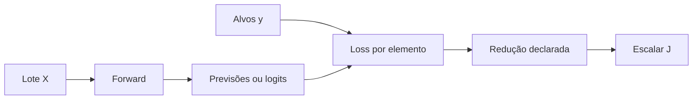
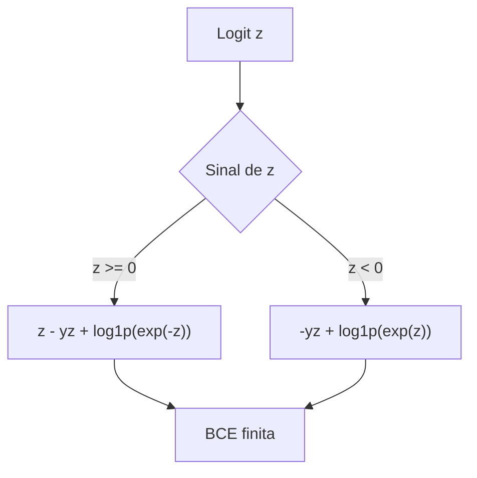

<!-- mirandastech-aula-v2 -->

# Aula 06 — Losses de regressão e classificação binária

Na aula anterior, construímos um *forward pass* vetorizado que transforma um lote de entradas em saídas. Mas uma rede ainda não aprende apenas por produzir números: precisamos medir, com uma função escalar e diferenciável, o quanto essas saídas discordam dos alvos.

Imagine dois sistemas. O primeiro estima o consumo diário de energia, em kWh. O segundo decide se uma transação é fraude. Ambos podem usar camadas densas idênticas, mas exigem modelos probabilísticos e funções de perda diferentes. Aplicar MSE indiscriminadamente à classificação ou calcular logaritmos de probabilidades saturadas pode gerar aprendizado ruim ou `nan` justamente nos exemplos mais importantes.

Nesta aula construiremos, em NumPy puro, duas peças fundamentais:

- **erro quadrático médio (MSE)** para regressão;
- **entropia cruzada binária (BCE)** calculada de forma estável diretamente dos logits.

O foco é o valor da loss e seu contrato. As derivadas usadas no treinamento serão implementadas na Aula 11; softmax e classificação multiclasse ficam para a Aula 07.

[](https://colab.research.google.com/github/joaopaulomirandamatias/ai-lab/blob/main/04-deep-learning/m5-redes-neurais-do-zero/notebooks/06-losses-regressao-classificacao-binaria-laboratorio.ipynb)

## Objetivos de aprendizagem

Ao final, você será capaz de:

1. distinguir loss por elemento, loss por exemplo, métrica e objetivo de treinamento;
2. calcular MSE manualmente e declarar a redução e o denominador;
3. relacionar MSE à hipótese de ruído gaussiano com variância fixa;
4. derivar a BCE em função do logit;
5. implementar BCE estável sem clipping arbitrário;
6. detectar broadcasting acidental entre previsão e alvo;
7. comparar reduções `none`, `sum`, `mean` e média ponderada;
8. validar uma implementação com casos extremos e invariantes.

## Pré-requisitos

- produto matricial, vetores e médias;
- probabilidade condicional e logaritmo natural;
- sigmoid e logits, vistos na Aula 04;
- convenção de shapes e forward vetorizado, vistos nas Aulas 03 e 05;
- NumPy básico.

## Vocabulário

| Termo | Significado nesta aula |
|---|---|
| **alvo** | valor observado \(y\) que a rede deve aproximar |
| **previsão** | saída numérica \(\hat y\) do modelo de regressão |
| **logit** | escore real \(z\in\mathbb{R}\), antes da sigmoid |
| **probabilidade** | \(p=\sigma(z)\), restrita ao intervalo \([0,1]\) |
| **loss** | penalidade calculada por elemento ou exemplo |
| **redução** | regra que transforma várias perdas em um escalar |
| **objetivo** | quantidade efetivamente minimizada; pode incluir loss e regularização |
| **estabilidade numérica** | obtenção de resultado finito e preciso dentro da aritmética de ponto flutuante |

## 1. Da saída da rede a um sinal de erro

O forward termina em uma matriz de saídas. A loss compara essa matriz com os alvos e produz um número que resume a discordância.



Uma **métrica** responde a uma pergunta de avaliação — RMSE em kWh, acurácia, recall. Uma **loss** é escolhida para orientar a otimização e precisa fornecer um sinal matemático útil. Elas podem coincidir, mas não são sinônimos. O objetivo também pode conter termos adicionais:

\[
J(\theta)=\operatorname{mean}_i\ell_i(\theta)+\lambda\Omega(\theta),
\]

em que \(\theta\) representa os parâmetros, \(\ell_i\) é a loss do exemplo \(i\), \(\Omega\) é uma penalidade e \(\lambda\) controla sua intensidade. Nesta aula, calcularemos apenas o primeiro termo.

### O contrato mínimo

Antes de escrever uma fórmula, registre:

- o que a saída representa: valor real, logit ou probabilidade;
- o shape esperado de saída e alvo;
- a loss por elemento;
- os eixos reduzidos e o denominador;
- como pesos de amostra entram na média;
- o dtype e o tratamento de valores não finitos.

Sem esse contrato, duas implementações chamadas “MSE” podem diferir por um fator igual ao número de saídas; duas chamadas “BCE” podem receber domínios incompatíveis.

## 2. MSE para regressão

Para um elemento com alvo \(y\) e previsão \(\hat y\), o erro quadrático é

\[
\ell_{\text{quad}}(y,\hat y)=(\hat y-y)^2.
\]

Para \(N\) elementos, o erro quadrático médio é

\[
\operatorname{MSE}(\mathbf y,\hat{\mathbf y})=
\frac{1}{N}\sum_{j=1}^{N}(\hat y_j-y_j)^2.
\]

Aqui, \(N\) é o número total de elementos reduzidos. Em uma saída de shape \((m,d_{out})\), reduzir todos os eixos significa \(N=m\,d_{out}\). Algumas derivações usam \(\frac{1}{2N}\sum e_j^2\); o fator \(1/2\) simplifica a derivada, mas muda o valor reportado. O importante é declarar a convenção.

### Exemplo resolvido

Considere:

\[
\mathbf y=[1,2,-1],\qquad \hat{\mathbf y}=[2,0,-1].
\]

1. Resíduos: \([2-1,0-2,-1-(-1)]=[1,-2,0]\).
2. Quadrados: \([1,4,0]\).
3. Soma: \(5\).
4. Média: \(5/3\approx1{,}6667\).

O MSE está em unidades quadradas. Se o alvo está em kWh, o MSE está em kWh². O RMSE, \(\sqrt{\operatorname{MSE}}\), volta à unidade original, mas a raiz altera a escala do resumo; não é preciso treinar com RMSE para avaliá-lo.

### Por que erros grandes pesam tanto?

Um erro de magnitude \(2\) contribui \(4\); um erro de magnitude \(10\) contribui \(100\). Isso é útil quando grandes desvios são realmente muito piores, mas torna o MSE sensível a outliers, falhas de sensor e rótulos incorretos.

| Loss | Penalidade para erro \(e\) | Sensibilidade a outlier | Observação |
|---|---:|---|---|
| MSE | \(e^2\) | alta | suave e alinhada ao ruído gaussiano |
| MAE | \(|e|\) | menor | não diferenciável exatamente em zero |
| Huber | quadrática perto de zero, linear longe | intermediária | exige escolher um limiar |

MAE e Huber aparecem aqui apenas como referência de decisão. Nosso artefato implementa MSE.

### Interpretação probabilística

Suponha que

\[
y_i=\hat y_i+\varepsilon_i,
\qquad \varepsilon_i\sim\mathcal N(0,\sigma^2),
\]

com erros independentes e variância fixa \(\sigma^2\). A log-verossimilhança negativa, ignorando constantes, é

\[
-\log p(\mathbf y\mid\hat{\mathbf y})
=\frac{1}{2\sigma^2}\sum_i(y_i-\hat y_i)^2+C.
\]

Minimizar a soma quadrática equivale, sob essas hipóteses, a maximizar a verossimilhança. Isso não prova que todo fenômeno tenha ruído gaussiano; revela a suposição embutida na escolha.

## 3. BCE para classificação binária

Em classificação binária, \(y\in\{0,1\}\). Se \(p=P(y=1\mid x)\), a probabilidade do rótulo observado é

\[
p(y\mid x)=p^y(1-p)^{1-y}.
\]

Aplicar menos log produz a BCE por elemento:

\[
\ell_{\text{BCE}}(y,p)
=-[y\log p+(1-y)\log(1-p)].
\]

Para \(y=1\), resta \(-\log p\); para \(y=0\), resta \(-\log(1-p)\). Uma previsão correta e confiante aproxima a loss de zero. Uma previsão errada e confiante recebe grande penalidade.

### Exemplo em probabilidade

Para \(y=1\) e \(p=0{,}8\):

\[
\ell=-\log(0{,}8)\approx0{,}2231.
\]

Para o mesmo alvo e \(p=0{,}01\):

\[
\ell=-\log(0{,}01)\approx4{,}6052.
\]

A loss não é “percentual de erro”. Ela é uma log-penalidade derivada do modelo de Bernoulli.

## 4. Por que calcular a BCE diretamente dos logits

A rede normalmente produz um logit \(z\), e \(p=\sigma(z)=1/(1+e^{-z})\). O caminho ingênuo calcula primeiro \(p\) e depois seus logaritmos. Para \(z=1000\), a sigmoid arredonda para \(1\) em `float64`; então `log(1 - p)` vira `log(0)`.

Podemos substituir \(p=\sigma(z)\) e simplificar:

\[
\ell(y,z)=\log(1+e^z)-yz
=\operatorname{softplus}(z)-yz.
\]

Uma forma estável é

\[
\boxed{\ell(y,z)=\max(z,0)-yz+\log(1+e^{-|z|})}.
\]

Ela evita formar \(e^{1000}\). Em NumPy, `np.logaddexp(0, z) - y*z` implementa a mesma identidade com uma operação dedicada.



### Exemplo resolvido com logits

Considere logits \([0,2,-2]\) e alvos \([0,1,0]\).

- \(z=0,y=0\): \(\ell=\log 2\approx0{,}693147\);
- \(z=2,y=1\): \(\ell=\log(1+e^{-2})\approx0{,}126928\);
- \(z=-2,y=0\): a mesma loss, \(\approx0{,}126928\).

A média é aproximadamente \(0{,}315668\). A simetria dos dois últimos casos é uma excelente verificação automática.

### Clipping não é a mesma coisa

Uma correção comum é limitar probabilidades a \([\epsilon,1-\epsilon]\). Isso evita infinitos, mas modifica o objetivo. Com \(\epsilon=10^{-12}\), uma previsão extremamente errada tem loss máxima próxima de \(27{,}63\), enquanto a BCE exata para \(z=1000,y=0\) vale aproximadamente \(1000\). O clipping esconde a gravidade do erro e muda o sinal que seria usado no aprendizado.

Clipping pode ser uma política explícita de uma aplicação, mas não substitui uma formulação estável quando logits estão disponíveis.

## 5. Reduções: `none`, `sum`, `mean` e pesos

Uma função de loss deve poder devolver os valores elementares. Só depois escolhemos a redução.

| Redução | Definição | Uso típico | Risco |
|---|---|---|---|
| `none` | preserva o shape | auditoria, pesos, máscaras | esquecer de reduzir |
| `sum` | soma todos os elementos | acumular numeradores | escala cresce com o lote |
| `mean` | soma dividida pelo número de elementos | lotes comparáveis | denominador ambíguo em saídas múltiplas |
| ponderada | \(\sum w_i\ell_i/\sum w_i\) | importâncias ou amostragem | usar \(\operatorname{mean}(w_i\ell_i)\) por engano |

### O problema da média das médias

Suponha dois minilotes: o primeiro tem perdas \([1,1]\); o segundo, \([9]\). A média global correta é

\[
\frac{1+1+9}{3}=\frac{11}{3}\approx3{,}667.
\]

A média ingênua das médias dos lotes é \((1+9)/2=5\). Para agregar lotes de tamanhos diferentes, acumule a soma e a contagem, ou faça uma média ponderada pelo número de elementos.

### Pesos de amostra

Com pesos não negativos \(w_i\), use

\[
L_w=\frac{\sum_iw_i\ell_i}{\sum_iw_i}.
\]

Exija \(\sum_iw_i>0\). Se os dados têm várias saídas por exemplo, declare se o peso se aplica a cada elemento ou à média interna do exemplo.

## 6. Shapes: rejeite broadcasting silencioso

Considere previsões de shape \((m,1)\) e alvos de shape \((m,)\). O NumPy pode transmiti-los para uma matriz \((m,m)\). Cada previsão seria comparada com todos os alvos — um cálculo válido para a biblioteca, mas semanticamente absurdo.

O contrato seguro para esta aula é simples:

```python
if prediction.shape != target.shape:
    raise ValueError("previsão e alvo devem ter o mesmo shape")
```

Também verifique:

- arrays numéricos e finitos;
- alvos binários em \([0,1]\) para BCE;
- pesos compatíveis e não negativos;
- pelo menos um elemento antes da média.

## 7. Sanity checks que capturam bugs cedo

Uma implementação confiável deve satisfazer estes invariantes:

1. MSE é não negativo e vale zero para previsões perfeitas.
2. MSE não muda ao permutar previsão e alvo juntos.
3. BCE com logit zero vale \(\log 2\), qualquer que seja o rótulo binário.
4. BCE estável permanece finita para logits \(\pm1000\).
5. BCE de uma previsão correta fica menor ao aumentar a confiança.
6. A forma estável coincide com a forma em probabilidades para logits moderados.
7. `sum == mean * número_de_elementos`, salvo arredondamento.
8. Particionar um vetor não altera a média global quando soma e contagem são agregadas.

## 8. Implementação NumPy de referência

```python
import numpy as np

def _same_shape(a, b):
    a = np.asarray(a, dtype=np.float64)
    b = np.asarray(b, dtype=np.float64)
    if a.shape != b.shape or a.size == 0:
        raise ValueError("arrays não vazios e com shapes idênticos são obrigatórios")
    if not (np.isfinite(a).all() and np.isfinite(b).all()):
        raise ValueError("valores devem ser finitos")
    return a, b

def reduce_loss(values, reduction="mean"):
    if reduction == "none":
        return values.copy()
    if reduction == "sum":
        return float(np.sum(values))
    if reduction == "mean":
        return float(np.mean(values))
    raise ValueError("reduction deve ser 'none', 'sum' ou 'mean'")

def mse(prediction, target, reduction="mean"):
    prediction, target = _same_shape(prediction, target)
    return reduce_loss(np.square(prediction - target), reduction)

def bce_with_logits(logits, target, reduction="mean"):
    logits, target = _same_shape(logits, target)
    if np.any((target < 0.0) | (target > 1.0)):
        raise ValueError("alvos BCE devem estar em [0, 1]")
    elementwise = np.logaddexp(0.0, logits) - target * logits
    return reduce_loss(elementwise, reduction)
```

Essa implementação aceita *soft labels* entre 0 e 1, úteis em algumas técnicas probabilísticas. Isso deve ser intencional; rótulos fora do intervalo são rejeitados.

## 9. Armadilhas e limites

| Armadilha | Consequência | Prevenção |
|---|---|---|
| aplicar sigmoid e depois logs | `inf` ou `nan` em logits extremos | BCE diretamente dos logits |
| clipping silencioso | objetivo e penalidade alterados | documentar ou evitar clipping |
| alvo \((m,)\), saída \((m,1)\) | broadcasting para \((m,m)\) | igualdade estrita de shapes |
| média das médias | resultado depende do particionamento | acumular soma e contagem |
| confundir MSE com RMSE | unidade e valor reportado incorretos | nomear e registrar a fórmula |
| MSE com outliers sem auditoria | poucos pontos dominam o objetivo | inspecionar resíduos e qualidade dos alvos |
| BCE sobre probabilidades fora de \([0,1]\) | logaritmo inválido | manter a interface baseada em logits |
| misturar regularização na loss reportada | comparação opaca | reportar loss de dados e penalidade separadamente |

MSE e BCE também não resolvem mudança de distribuição, rótulos enviesados, custo desigual entre erros ou má especificação do modelo. Elas formalizam uma parte do problema, não toda a decisão de produto ou pesquisa.

## 10. Conexões com IA, pesquisa e sistemas reais

- **Regressão neural:** previsão de demanda, energia e tempo usa frequentemente MSE quando desvios simétricos e grandes erros merecem penalidade quadrática.
- **Detecção binária:** fraude, falha e moderação usam BCE, mas o limiar operacional é escolhido depois, conforme custo e capacidade.
- **Modelos generativos:** losses de reconstrução revelam uma hipótese de distribuição; MSE não é uma escolha neutra.
- **Treinamento distribuído:** a semântica de redução determina como losses de dispositivos e lotes desiguais devem ser agregadas.
- **Reprodutibilidade:** registrar logits, denominadores, pesos e versão da implementação permite reproduzir a métrica exata.
- **Mixed precision:** estabilidade algébrica continua necessária; apenas aumentar o dtype não corrige uma fórmula que forma `log(0)`.

## 11. Checklist prático

- [ ] A saída foi identificada como previsão, logit ou probabilidade?
- [ ] Previsão e alvo têm exatamente o mesmo shape?
- [ ] A redução e seus eixos foram documentados?
- [ ] O denominador da média é inequívoco?
- [ ] MSE foi avaliado quanto a outliers e unidades?
- [ ] BCE é calculada diretamente dos logits?
- [ ] Logits extremos produzem loss finita?
- [ ] Pesos são não negativos e normalizados por sua soma?
- [ ] Médias entre lotes usam soma e contagem globais?
- [ ] Loss de dados e regularização são reportadas separadamente?
- [ ] Os casos perfeitos, neutros e errados foram testados?

## 12. Resumo

- MSE é a média dos resíduos quadrados e corresponde, sob hipóteses específicas, à verossimilhança gaussiana.
- BCE é a log-verossimilhança negativa de uma Bernoulli.
- A BCE baseada em logits usa \(\operatorname{softplus}(z)-yz\) e permanece estável em valores extremos.
- Clipping evita infinitos ao custo de modificar o objetivo; não é necessário quando a fórmula estável é usada.
- `none`, `sum`, `mean` e médias ponderadas possuem semânticas diferentes.
- Shapes idênticos, casos-limite e invariantes fazem parte do contrato, não são detalhes de implementação.

## 13. Exercícios

### 1. MSE manual

Calcule o MSE para \(y=[0,2,4]\) e \(\hat y=[1,2,1]\).

**Resposta comentada:** os resíduos são \([1,0,-3]\), os quadrados \([1,0,9]\) e o MSE é \(10/3\approx3{,}3333\).

### 2. Fator \(1/2\)

Por que alguns textos usam \(\frac{1}{2N}\sum e_i^2\)?

**Resposta comentada:** a derivada do quadrado contém fator 2, cancelado pelo \(1/2\). A posição do mínimo não muda, mas o valor e a escala do gradiente mudam; a convenção deve ser explícita.

### 3. BCE neutra

Mostre que \(z=0\) produz a mesma BCE para \(y=0\) e \(y=1\).

**Resposta comentada:** \(\sigma(0)=0{,}5\). Em ambos os casos, a probabilidade do rótulo observado é \(0{,}5\), então a loss vale \(-\log0{,}5=\log2\).

### 4. Extremo corretamente classificado

Qual é o limite de \(\ell(1,z)\) quando \(z\to+\infty\)?

**Resposta comentada:** zero. Pela forma estável, \(\ell(1,z)=\log(1+e^{-z})\), que tende a zero.

### 5. Extremo incorreto

Qual é o comportamento de \(\ell(0,z)\) quando \(z\to+\infty\)?

**Resposta comentada:** \(\ell(0,z)=\log(1+e^z)\approx z\). A penalidade cresce linearmente com a magnitude do logit errado.

### 6. Broadcasting

Por que shapes \((32,1)\) e \((32,)\) são perigosos?

**Resposta comentada:** o broadcasting os combina como \((32,32)\), cruzando cada previsão com todos os alvos. Igualdade estrita de shapes captura o erro antes da loss.

### 7. Agregação por lote

Um lote de 8 elementos tem loss média 0,2; outro de 2 elementos tem média 1,0. Qual é a média global?

**Resposta comentada:** \((8\cdot0{,}2+2\cdot1{,}0)/10=0{,}36\). A média simples \(0{,}6\) atribuiria o mesmo peso a lotes de tamanhos diferentes.

### 8. Peso correto

Para perdas \([1,2]\) e pesos \([1,3]\), calcule a média ponderada.

**Resposta comentada:** \((1\cdot1+3\cdot2)/(1+3)=7/4=1{,}75\). `mean(weights * losses)` daria 3,5 e estaria normalizando pelo número de exemplos, não pela soma dos pesos.

### 9. Escolha da loss

Um sensor ocasionalmente produz erros de digitação cem vezes maiores que os demais. Por que MSE merece auditoria especial?

**Resposta comentada:** ao elevar o erro ao quadrado, uma observação pode dominar o objetivo. Primeiro investigue a qualidade do dado; depois compare uma loss robusta e documente a hipótese, sem simplesmente apagar casos difíceis.

### 10. Teste de equivalência

Como validar a BCE baseada em logits sem usar outra biblioteca?

**Resposta comentada:** em logits moderados, compare-a com a fórmula em probabilidades; depois teste separadamente logits extremos, simetria, \(\log2\) em zero e monotonicidade. A primeira comparação verifica equivalência, e os invariantes cobrem onde a referência ingênua falha.

## 14. Referências

### Técnicas e primárias

- GOODFELLOW, Ian; BENGIO, Yoshua; COURVILLE, Aaron. [Deep Learning — Numerical Computation](https://www.deeplearningbook.org/contents/numerical.html). MIT Press, 2016.
- ZHANG, Aston et al. [Dive into Deep Learning — Linear Regression](https://d2l.ai/chapter_linear-regression/linear-regression.html). versão 1.0.3.
- BLANCHARD, Pierre; HIGHAM, Desmond J.; HIGHAM, Nicholas J. [Accurate Computation of the Log-Sum-Exp and Softmax Functions](https://arxiv.org/abs/1909.03469). IMA Journal of Numerical Analysis, 2021.
- NUMPY DEVELOPERS. [`numpy.logaddexp`](https://numpy.org/doc/stable/reference/generated/numpy.logaddexp.html). documentação da versão estável, consultada em 9 set. 2026.

### Complementar

- PYTORCH. [`BCEWithLogitsLoss`](https://docs.pytorch.org/docs/stable/generated/torch.nn.BCEWithLogitsLoss.html). Documentação oficial; útil para comparar o contrato industrial, sem usar o framework nesta trilha.

## Próxima aula

Com regressão e classificação binária formalizadas, a **Aula 07 — Softmax e cross-entropy multiclasse** ampliará o contrato para várias classes. Derivaremos log-sum-exp, distinguiremos índices de classe de distribuições-alvo e chegaremos ao gradiente compacto \(\mathbf p-\mathbf y\), ainda em NumPy puro.
