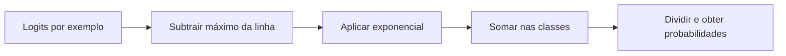
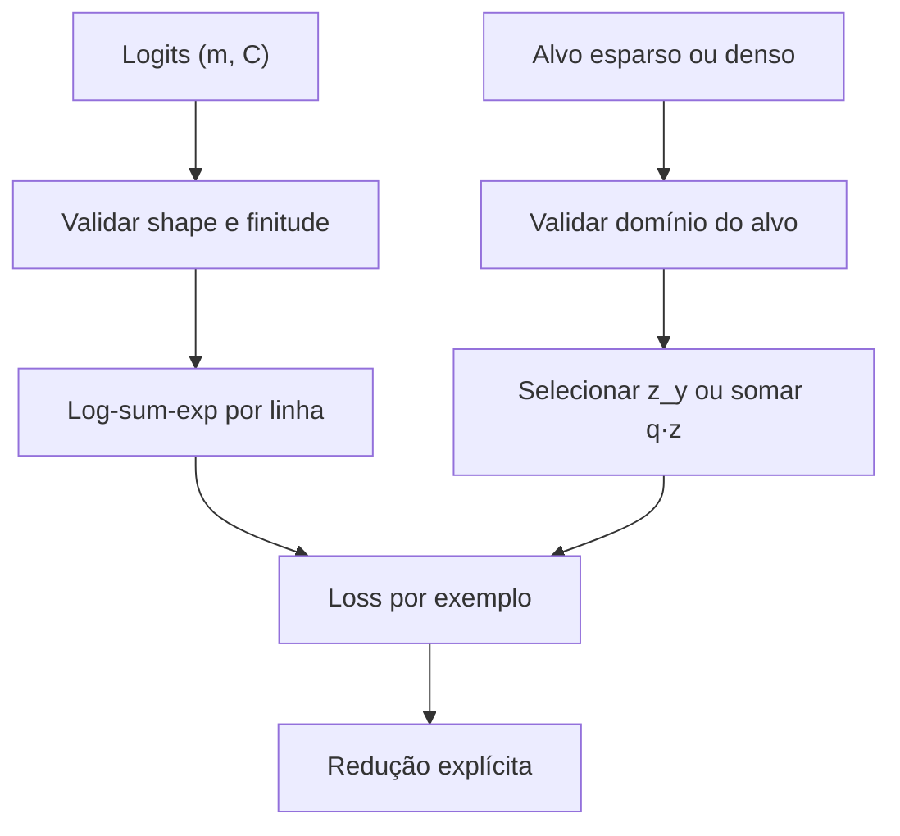

<!-- mirandastech-aula-v2 -->

# Aula 07 — Softmax e cross-entropy multiclasse

Na Aula 06, um único logit bastava para representar uma decisão binária. Agora imagine um sistema que precisa classificar uma imagem como **navio**, **caminhão** ou **guindaste**. Três sigmoides independentes poderiam atribuir probabilidade alta às três classes ao mesmo tempo. Quando as classes são mutuamente exclusivas, queremos uma única distribuição: valores positivos cuja soma seja exatamente 1.

A função **softmax** transforma um vetor de logits nessa distribuição. A **cross-entropy** mede quanto da probabilidade foi atribuída ao alvo. O par parece simples, mas uma implementação ingênua com `exp` e `log` quebra em logits grandes; um eixo incorreto pode normalizar classes entre exemplos; e um alvo com contrato ambíguo pode produzir uma loss numericamente válida, porém semanticamente errada.

Nesta aula vamos derivar e implementar, em NumPy puro:

- softmax estável por linha;
- log-sum-exp e log-softmax;
- cross-entropy para rótulos esparsos e distribuições-alvo;
- o gradiente local compacto \(\mathbf p-\mathbf q\);
- testes de invariância, shapes, estabilidade e diferenças finitas.

O backward completo da rede ainda não começa aqui. A Aula 08 formalizará derivadas locais, *vector-Jacobian products* e gradiente upstream; a Aula 11 transformará as losses em componentes `forward`/`backward` reutilizáveis.

[](https://colab.research.google.com/github/joaopaulomirandamatias/ai-lab/blob/main/04-deep-learning/m5-redes-neurais-do-zero/notebooks/07-softmax-cross-entropy-multiclasse-laboratorio.ipynb)

## Objetivos de aprendizagem

Ao final, você será capaz de:

1. distinguir classificação multiclasse de classificação multirrótulo;
2. transformar logits em probabilidades com softmax no eixo correto;
3. explicar por que somar uma constante aos logits não altera a distribuição;
4. calcular log-sum-exp sem overflow;
5. obter cross-entropy diretamente dos logits;
6. trabalhar com rótulos esparsos e distribuições-alvo sem confundir seus shapes;
7. derivar \(\partial \ell/\partial \mathbf z=\mathbf p-\mathbf q\);
8. aplicar corretamente as reduções `none`, `sum` e `mean`;
9. validar a implementação com invariantes e diferenças centrais.

## Pré-requisitos

- logits, probabilidades e BCE da Aula 06;
- exponencial, logaritmo e derivadas elementares;
- vetores, matrizes e soma por eixo;
- convenção de lotes com exemplos nas linhas;
- NumPy básico.

## Vocabulário

| Termo | Significado nesta aula |
|---|---|
| **classe** | uma das \(C\) categorias possíveis |
| **logit** | escore real \(z_k\) da classe \(k\), antes da normalização |
| **simplex** | conjunto de vetores não negativos cuja soma é 1 |
| **softmax** | função que mapeia logits para o interior do simplex |
| **log-sum-exp** | \(\log\sum_j e^{z_j}\), calculado de forma estável |
| **cross-entropy** | surpresa média ao usar a distribuição prevista para codificar o alvo |
| **rótulo esparso** | índice inteiro da classe correta |
| **alvo denso** | vetor \(\mathbf q\) que representa uma distribuição sobre classes |
| **one-hot** | distribuição-alvo com 1 na classe correta e 0 nas demais |
| **redução** | regra que agrega losses por exemplo em um escalar |

## 1. Multiclasse não é multirrótulo

Antes da fórmula, identifique o problema.

| Situação | Saída adequada | Loss típica | Interpretação |
|---|---|---|---|
| uma entre \(C\) classes | softmax | cross-entropy multiclasse | probabilidades competem e somam 1 |
| várias classes podem coexistir | \(C\) sigmoides | soma/média de BCEs | cada classe é uma Bernoulli independente |
| valor contínuo | identidade | MSE ou outra loss de regressão | saída não é distribuição de classes |

Em uma foto, “navio” e “guindaste” podem coexistir se a tarefa é detectar objetos: isso é multirrótulo. Se a tarefa pergunta pelo **tipo principal do equipamento central**, as classes podem ser exclusivas: isso é multiclasse. A arquitetura matemática depende do significado do alvo, não do número de colunas.

## 2. Intuição: competição relativa entre logits

Para \(C\) classes e logits \(\mathbf z=[z_1,\ldots,z_C]\), a softmax é

\[
p_k=\operatorname{softmax}(\mathbf z)_k
=\frac{e^{z_k}}{\sum_{j=1}^{C}e^{z_j}},
\qquad k=1,\ldots,C.
\]

Cada \(p_k>0\) e

\[
\sum_{k=1}^{C}p_k=1.
\]

Softmax não interpreta o logit isoladamente. Apenas **diferenças** entre logits importam. Se somarmos uma constante \(c\) a todos eles,

\[
\frac{e^{z_k+c}}{\sum_j e^{z_j+c}}
=\frac{e^c e^{z_k}}{e^c\sum_j e^{z_j}}
=p_k.
\]

Essa invariância permite escolher \(c=-\max_j z_j\), fazendo o maior argumento da exponencial valer zero.



### Exemplo resolvido

Para \(\mathbf z=[2,1,0]\), subtraímos o máximo:

\[
\mathbf z-2=[0,-1,-2].
\]

Então

\[
e^{\mathbf z-2}\approx[1,0{,}367879,0{,}135335]
\]

e a soma é aproximadamente \(1{,}503215\). Logo,

\[
\mathbf p\approx[0{,}665241,0{,}244728,0{,}090031].
\]

A primeira classe tem maior probabilidade, mas não porque o logit 2 seja “66,5%”. A probabilidade depende dos três logits.

## 3. Eixo correto e contrato de shape

Adotaremos logits de shape \((m,C)\):

- \(m\): número de exemplos;
- \(C\): número de classes;
- `axis=1`: eixo das classes.

O máximo e a soma devem manter a dimensão:

```python
shifted = logits - np.max(logits, axis=1, keepdims=True)
exp_shifted = np.exp(shifted)
probabilities = exp_shifted / np.sum(exp_shifted, axis=1, keepdims=True)
```

`keepdims=True` produz objetos de shape \((m,1)\), adequados ao broadcasting por linha. Se usarmos `axis=0`, cada coluna será normalizada entre exemplos; as linhas deixarão de representar distribuições.

O contrato seguro exige:

- `logits.ndim == 2`;
- \(m\ge1\) e \(C\ge2\);
- valores finitos;
- saída com o mesmo shape;
- soma de cada linha próxima de 1.

## 4. Log-sum-exp: a peça numérica central

Defina

\[
\operatorname{LSE}(\mathbf z)=\log\sum_{j=1}^{C}e^{z_j}.
\]

Calcular isso literalmente pode formar `exp(1000) = inf`. Com \(a=\max_j z_j\), reescrevemos:

\[
\operatorname{LSE}(\mathbf z)
=a+\log\sum_{j=1}^{C}e^{z_j-a}.
\]

Agora todos os expoentes são menores ou iguais a zero. Pelo menos um termo vale 1, portanto a soma não zera por underflow.

O log-softmax segue imediatamente:

\[
\log p_k=z_k-\operatorname{LSE}(\mathbf z).
\]

Essa forma calcula log-probabilidades sem primeiro arredondar probabilidades minúsculas para zero.

## 5. Cross-entropy multiclasse

Se o alvo é uma distribuição \(\mathbf q\) e a previsão é \(\mathbf p\),

\[
H(\mathbf q,\mathbf p)
=-\sum_{k=1}^{C}q_k\log p_k.
\]

Para um rótulo one-hot cuja classe correta é \(y\), apenas um termo permanece:

\[
\ell=-\log p_y.
\]

Substituindo o log-softmax:

\[
\boxed{\ell(\mathbf z,y)=\operatorname{LSE}(\mathbf z)-z_y}.
\]

Essa é a cross-entropy esparsa estável: não precisamos materializar `softmax` nem chamar `log` sobre uma probabilidade arredondada.

### Exemplo resolvido

Com \(\mathbf z=[2,1,0]\) e classe correta \(y=0\):

\[
\ell=\log(e^2+e^1+e^0)-2\approx0{,}407606.
\]

Isso coincide com \(-\log(0{,}665241)\).

Se a classe correta fosse a terceira, a loss seria

\[
-\log(0{,}090031)\approx2{,}407606.
\]

O modelo é penalizado por atribuir pouca probabilidade ao evento observado.

## 6. Alvos esparsos e densos

Há dois contratos úteis, mas eles não devem ser misturados.

| Contrato | Shape do alvo | Validação | Loss por exemplo |
|---|---:|---|---|
| esparso | \((m,)\) | inteiros em \([0,C-1]\) | \(\operatorname{LSE}(\mathbf z_i)-z_{i,y_i}\) |
| denso | \((m,C)\) | valores \(\ge0\), linhas somam 1 | \(-\sum_k q_{ik}\log p_{ik}\) |

Um alvo one-hot é uma distribuição densa especial. Uma distribuição como \([0{,}8,0{,}1,0{,}1]\) pode representar *label smoothing* ou incerteza deliberada. Não “conserte” automaticamente linhas que não somam 1: rejeite-as, pois normalizar silenciosamente altera o significado dos dados.

Para alvos densos válidos, usando \(\sum_k q_k=1\):

\[
\ell(\mathbf z,\mathbf q)
=\operatorname{LSE}(\mathbf z)-\sum_{k=1}^{C}q_kz_k.
\]

Cross-entropy também se relaciona à divergência KL:

\[
H(\mathbf q,\mathbf p)=H(\mathbf q)+D_{KL}(\mathbf q\|\mathbf p).
\]

Como \(H(\mathbf q)\) não depende do modelo, minimizar cross-entropy com o alvo fixo equivale a minimizar \(D_{KL}(\mathbf q\|\mathbf p)\). Isso não torna a loss uma distância: KL não é simétrica.

## 7. Derivação do gradiente \(\mathbf p-\mathbf q\)

Esta derivação é a evidência central da aula. Partimos da loss densa:

\[
\ell=\operatorname{LSE}(\mathbf z)-\sum_j q_jz_j.
\]

Para um logit \(z_k\),

\[
\frac{\partial}{\partial z_k}\operatorname{LSE}(\mathbf z)
=\frac{e^{z_k}}{\sum_j e^{z_j}}
=p_k.
\]

Além disso,

\[
\frac{\partial}{\partial z_k}\sum_j q_jz_j=q_k.
\]

Portanto,

\[
\boxed{\frac{\partial \ell}{\partial z_k}=p_k-q_k}
\qquad\Longrightarrow\qquad
\boxed{\nabla_{\mathbf z}\ell=\mathbf p-\mathbf q}.
\]

Para rótulo esparso, \(\mathbf q\) é o one-hot da classe correta. O gradiente aumenta logits de classes com probabilidade excessiva e diminui a loss ao elevar o logit correto.

Observe outra propriedade:

\[
\sum_k(p_k-q_k)=1-1=0.
\]

O gradiente por exemplo soma zero, coerente com a invariância a deslocamentos: mover todos os logits pela mesma constante não muda a loss.

Se a redução do lote é `mean`, o gradiente do escalar médio é

\[
\frac{1}{m}(\mathbf P-\mathbf Q).
\]

O laboratório verificará essa expressão com diferenças centrais, sem conectá-la ainda às camadas anteriores.

## 8. Redução por lote

Primeiro calculamos \(\ell_i\) para cada exemplo. Depois:

\[
L_{\text{sum}}=\sum_{i=1}^{m}\ell_i,
\qquad
L_{\text{mean}}=\frac{1}{m}\sum_{i=1}^{m}\ell_i.
\]

| Redução | Saída | Efeito no gradiente | Uso |
|---|---|---|---|
| `none` | \((m,)\) | um gradiente por exemplo | auditoria e pesos |
| `sum` | escalar | cresce com \(m\) | acumular numerador |
| `mean` | escalar | dividido por \(m\) | treino com escala comparável |

Ao agregar lotes desiguais, use soma total dividida pelo número total de exemplos. A média simples das médias repete o erro discutido na Aula 06.

## 9. Baselines e sanity checks

Se todos os logits são iguais, a distribuição é uniforme:

\[
p_k=\frac{1}{C},
\qquad
\ell=-\log\frac{1}{C}=\log C.
\]

Esse é um baseline útil. Para \(C=3\), esperamos \(\log3\approx1{,}098612\). Uma loss inicial muito menor pode indicar informação real, inicialização enviesada ou vazamento; uma loss muito maior pode ser possível, mas merece inspecionar logits, classes e shapes.

Verifique também:

1. cada linha da softmax soma 1;
2. probabilidades estão entre 0 e 1;
3. somar constantes por linha não muda softmax nem loss;
4. permutar classes e rótulos de modo consistente preserva a loss;
5. a cross-entropy esparsa coincide com a densa one-hot;
6. logits extremos produzem valores finitos;
7. o gradiente analítico coincide com diferenças centrais;
8. o gradiente de cada exemplo soma zero.

## 10. Fluxo de cálculo recomendado



Para monitorar probabilidades ou produzir o gradiente local, calcule softmax estável. Para obter apenas a loss esparsa, `LSE - z_y` é suficiente.

## 11. Implementação NumPy de referência

```python
import numpy as np

def logsumexp_rows(logits):
    logits = np.asarray(logits, dtype=np.float64)
    if logits.ndim != 2 or logits.shape[1] < 2:
        raise ValueError("logits devem ter shape (m, C), com C >= 2")
    maximum = np.max(logits, axis=1, keepdims=True)
    return maximum + np.log(np.sum(np.exp(logits - maximum), axis=1, keepdims=True))

def softmax(logits):
    logits = np.asarray(logits, dtype=np.float64)
    log_norm = logsumexp_rows(logits)
    return np.exp(logits - log_norm)

def cross_entropy_sparse(logits, labels, reduction="mean"):
    logits = np.asarray(logits, dtype=np.float64)
    labels = np.asarray(labels)
    if labels.shape != (logits.shape[0],):
        raise ValueError("labels devem ter shape (m,)")
    if not np.issubdtype(labels.dtype, np.integer):
        raise ValueError("labels esparsos devem ser inteiros")
    if np.any((labels < 0) | (labels >= logits.shape[1])):
        raise ValueError("índice de classe fora do intervalo")
    losses = logsumexp_rows(logits)[:, 0] - logits[np.arange(logits.shape[0]), labels]
    if reduction == "none":
        return losses
    if reduction == "sum":
        return float(losses.sum())
    if reduction == "mean":
        return float(losses.mean())
    raise ValueError("redução desconhecida")
```

Produção exigiria mensagens de erro e validações adicionais; o notebook fornece o contrato completo usado nesta aula.

## 12. Armadilhas e limites

| Armadilha | Consequência | Prevenção |
|---|---|---|
| `exp(logits)` sem deslocamento | overflow e `nan` | subtrair o máximo por linha |
| `log(softmax(logits))` | `log(0)` após underflow | calcular log-softmax por LSE |
| `axis=0` | classes normalizadas entre exemplos | usar e testar o eixo das classes |
| alvo \((m,1)\) na API esparsa | indexação/broadcasting ambíguo | exigir exatamente \((m,)\) |
| índice float “parecendo inteiro” | contrato opaco | exigir dtype inteiro |
| alvo denso sem soma 1 | deixa de ser distribuição | validar não negatividade e soma por linha |
| usar softmax em multirrótulo | classes indevidamente competem | usar sigmoides independentes e BCE |
| confundir probabilidade com confiança calibrada | decisões excessivamente confiantes | avaliar calibração separadamente |
| média de médias | lotes pequenos ganham peso excessivo | acumular soma e contagem |

Softmax sempre devolve uma distribuição, mesmo para uma entrada fora do domínio conhecido. Probabilidades que somam 1 não garantem acerto, calibração, robustez ou segurança operacional.

## 13. Conexões com IA, pesquisa e sistemas reais

- **Visão computacional:** classificadores de imagem terminam frequentemente em logits por classe e cross-entropy.
- **Modelos de linguagem:** cada posição prevê uma distribuição sobre o vocabulário; o mesmo log-sum-exp aparece em escala muito maior.
- **Distilação e label smoothing:** alvos densos carregam mais informação que um índice, mas mudam a interpretação do mínimo da loss.
- **Monitoramento:** cross-entropy detecta degradação de probabilidade antes que a acurácia mude, mas depende de rótulos confiáveis.
- **Governança:** registrar ordem das classes, redução e mapeamento índice–rótulo evita modelos tecnicamente válidos com semântica trocada.
- **Sistemas distribuídos:** redução e denominador precisam permanecer consistentes entre dispositivos e lotes desiguais.

## 14. Checklist prático

- [ ] O problema é realmente multiclasse exclusivo?
- [ ] A ordem das classes está versionada?
- [ ] Logits têm shape \((m,C)\), com \(C\ge2\)?
- [ ] Softmax usa o eixo das classes?
- [ ] O máximo é subtraído por linha?
- [ ] Cross-entropy é calculada diretamente dos logits?
- [ ] A API distingue alvo esparso de alvo denso?
- [ ] Índices e distribuições são validados?
- [ ] A redução e o denominador estão documentados?
- [ ] O baseline \(\log C\) foi conferido?
- [ ] Invariância a deslocamento e permutação foi testada?
- [ ] Logits extremos permanecem finitos?
- [ ] O gradiente \(\mathbf p-\mathbf q\) passou por diferenças centrais?

## 15. Resumo

- Softmax transforma logits em uma distribuição sobre classes mutuamente exclusivas.
- Apenas diferenças entre logits importam; subtrair o máximo preserva o resultado e evita overflow.
- Log-sum-exp permite obter log-softmax e cross-entropy sem calcular `log(0)`.
- Para rótulo esparso, \(\ell=\operatorname{LSE}(\mathbf z)-z_y\).
- Para alvo denso, \(\ell=\operatorname{LSE}(\mathbf z)-\sum_k q_kz_k\).
- O gradiente combinado é \(\mathbf p-\mathbf q\), ou \((\mathbf P-\mathbf Q)/m\) sob redução média.
- Eixo, shapes, mapeamento de classes e redução fazem parte da semântica do modelo.

## 16. Exercícios

### 1. Softmax manual

Calcule a softmax de \([0,0,0]\).

**Resposta comentada:** as três exponenciais valem 1 e a soma vale 3. Logo, a distribuição é \([1/3,1/3,1/3]\).

### 2. Invariância a deslocamento

Mostre que as softmax de \([2,1,0]\) e \([1002,1001,1000]\) são iguais.

**Resposta comentada:** o segundo vetor é o primeiro somado de 1000 em todas as coordenadas. O fator \(e^{1000}\) cancela no numerador e denominador; numericamente, a forma estável subtrai o máximo.

### 3. Baseline uniforme

Qual é a cross-entropy de um classificador uniforme com dez classes?

**Resposta comentada:** \(-\log(1/10)=\log10\approx2{,}302585\), qualquer que seja a classe correta.

### 4. Classe correta diferente

Para logits \([2,1,0]\), compare a loss quando \(y=0\) e quando \(y=2\).

**Resposta comentada:** são aproximadamente \(0{,}407606\) e \(2{,}407606\). O segundo caso penaliza a baixa probabilidade da terceira classe.

### 5. Eixo incorreto

O que acontece ao aplicar softmax com `axis=0` em um lote \((m,C)\)?

**Resposta comentada:** cada classe é normalizada entre os \(m\) exemplos; colunas somam 1, mas linhas geralmente não. A saída deixa de ser uma distribuição de classes por exemplo.

### 6. One-hot versus esparso

Converta os rótulos \([2,0]\) para one-hot com \(C=3\).

**Resposta comentada:** \([[0,0,1],[1,0,0]]\). As losses esparsa e densa devem coincidir para os mesmos logits.

### 7. Soma do gradiente

Por que os componentes de \(\mathbf p-\mathbf q\) somam zero?

**Resposta comentada:** tanto \(\mathbf p\) quanto \(\mathbf q\) somam 1. Logo, \(\sum_k(p_k-q_k)=0\), coerente com a invariância a somar uma constante aos logits.

### 8. Gradiente da classe correta

Para alvo one-hot, qual é o sinal do gradiente na classe correta?

**Resposta comentada:** \(p_y-1\le0\). Uma atualização na direção oposta ao gradiente tende a aumentar o logit correto. Nas classes erradas, o gradiente \(p_k\ge0\) tende a reduzir seus logits.

### 9. Multirrótulo

Uma imagem pode conter simultaneamente capacete, colete e luvas. Softmax é adequado?

**Resposta comentada:** não. As classes não são mutuamente exclusivas; use um logit e uma sigmoid por item, com BCE por classe.

### 10. Alvo denso inválido

Por que \([0{,}8,0{,}4,0]\) deve ser rejeitado como distribuição-alvo?

**Resposta comentada:** embora não contenha valores negativos, soma 1,2. Normalizar automaticamente esconderia um erro de dados e alteraria o alvo.

### 11. Estabilidade extrema

Como calcular a loss de logits \([1000,0,-1000]\) com classe correta 0?

**Resposta comentada:** use \(\operatorname{LSE}(\mathbf z)-z_0\) com máximo 1000 subtraído. A loss fica próxima de zero sem formar \(e^{1000}\).

## 17. Referências

### Técnicas e primárias

- ZHANG, Aston et al. [Dive into Deep Learning — Softmax Regression](https://www.d2l.ai/chapter_linear-classification/softmax-regression.html). versão 1.0.3.
- GOODFELLOW, Ian; BENGIO, Yoshua; COURVILLE, Aaron. [Deep Learning — Numerical Computation](https://www.deeplearningbook.org/contents/numerical.html). MIT Press, 2016.
- BLANCHARD, Pierre; HIGHAM, Desmond J.; HIGHAM, Nicholas J. [Accurate Computation of the Log-Sum-Exp and Softmax Functions](https://arxiv.org/abs/1909.03469). IMA Journal of Numerical Analysis, 2021.
- NUMPY DEVELOPERS. [Universal functions — `reduce`](https://numpy.org/doc/stable/reference/ufuncs.html). documentação da versão estável, consultada em 9 set. 2026.

### Complementar

- STANFORD CS231n. [Linear Classification: Softmax](https://cs231n.github.io/linear-classify/#softmax). Material institucional.

## Próxima aula

A **Aula 08 — Derivadas locais e grafo computacional** generalizará a ideia de gradiente local. Vamos representar cada operação por `forward` e `backward`, distinguir Jacobiana explícita de *vector-Jacobian product* e propagar um gradiente upstream sem construir matrizes gigantes.
