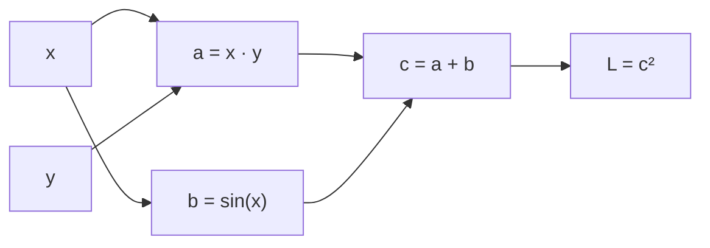
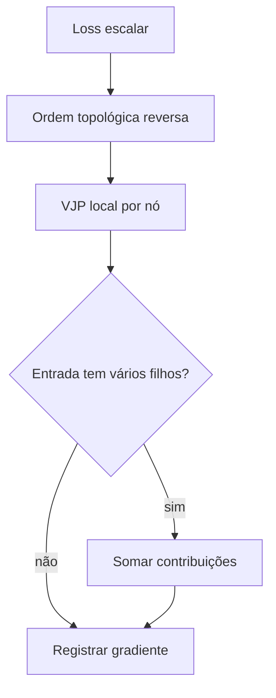

<!-- mirandastech-aula-v2 -->

# Aula 08 — Derivadas locais e grafo computacional

Na aula anterior, vimos que softmax combinada à cross-entropy produz o gradiente local compacto \(\mathbf p-\mathbf q\). Isso ainda não responde à pergunta central do treinamento: **como esse sinal chega a cada variável que participou do cálculo?**

Imagine um modelo que combina dezenas de transformações. Reescrever, a cada mudança, uma derivada simbólica gigantesca seria trabalhoso e frágil. O grafo computacional resolve o problema decompondo a função em operações elementares. Cada operação conhece apenas duas coisas: o que calculou no `forward` e como transformar um gradiente recebido no `backward`.

Nesta aula, construiremos essa mecânica em NumPy puro. O foco é a interface entre operações — derivada local, gradiente *upstream*, *vector–Jacobian product* (VJP), ordem topológica e acumulação em ramificações. A Aula 09 aplicará exatamente esse contrato à camada afim \(XW+b\).

[](https://colab.research.google.com/github/joaopaulomirandamatias/ai-lab/blob/main/04-deep-learning/m5-redes-neurais-do-zero/notebooks/08-derivadas-locais-grafo-computacional-laboratorio.ipynb)

## Objetivos de aprendizagem

Ao final, você será capaz de:

1. representar uma expressão como um grafo acíclico dirigido;
2. distinguir derivada local, gradiente *upstream* e gradiente acumulado;
3. aplicar a regra da cadeia sem expandir toda a expressão;
4. explicar e calcular um VJP;
5. justificar por que o modo reverso é adequado a uma loss escalar e muitos parâmetros;
6. percorrer o grafo em ordem topológica reversa;
7. somar contribuições quando uma variável alimenta vários caminhos;
8. desfazer broadcasting no backward de forma explícita;
9. validar VJPs por diferenças centrais e pelo teste de adjunção.

## Pré-requisitos

- derivada e regra da cadeia;
- produto interno e transposta;
- arrays, eixos e broadcasting em NumPy;
- convenções de shape e cache da Aula 05;
- losses e gradientes locais das Aulas 06 e 07.

## Vocabulário

| Termo | Significado nesta aula |
|---|---|
| **nó** | valor intermediário ou entrada do cálculo |
| **operação** | transformação que liga nós, como soma, produto ou seno |
| **grafo computacional** | DAG que registra dependências entre valores e operações |
| **derivada local** | sensibilidade da saída de uma operação às suas entradas |
| **upstream** | gradiente da loss em relação à saída do nó atual |
| **downstream** | gradiente enviado às entradas do nó atual |
| **VJP** | produto entre o gradiente upstream e a Jacobiana local, sem materializá-la |
| **adjunto** | notação \(\bar x=\partial L/\partial x\) usada no modo reverso |
| **folha** | nó sem pais, como uma entrada ou parâmetro |
| **ordem topológica** | ordem que respeita dependências; no backward, é percorrida ao contrário |

## 1. A intuição: mensagens locais em sentido reverso

Considere a expressão escalar

\[
L=(xy+\sin x)^2.
\]

Em vez de derivá-la de uma vez, criamos intermediários:

\[
a=xy,\qquad b=\sin x,\qquad c=a+b,\qquad L=c^2.
\]



O `forward` segue as setas e guarda \(a\), \(b\) e \(c\). O `backward` começa em \(\bar L=\partial L/\partial L=1\) e envia mensagens no sentido contrário:

\[
\bar c=2c\bar L,
\qquad
\bar a=\bar c,
\qquad
\bar b=\bar c.
\]

Como \(x\) participa de dois caminhos, recebe duas contribuições:

\[
\bar x=\underbrace{\bar a\,y}_{x\to a\to L}
+\underbrace{\bar b\cos x}_{x\to b\to L}.
\]

Para \(y\), há apenas um caminho:

\[
\bar y=\bar a\,x.
\]

O mecanismo completo é composto por regras pequenas. A complexidade está em respeitar dependências, shapes e somas — não em decorar uma fórmula global.

## 2. Três quantidades que não podem ser confundidas

Se \(u=f(x)\) e a loss \(L\) depende de \(u\), temos:

1. **derivada local**: \(\partial u/\partial x\);
2. **gradiente upstream**: \(\bar u=\partial L/\partial u\);
3. **gradiente downstream**:

\[
\bar x=\frac{\partial L}{\partial x}
=\frac{\partial L}{\partial u}\frac{\partial u}{\partial x}
=\bar u\frac{\partial u}{\partial x}.
\]

A derivada local descreve somente a operação. Ela não sabe qual é a loss nem o restante do grafo. O upstream carrega todo o efeito já acumulado entre a saída da operação e a loss.

### Exemplo escalar resolvido

Se \(u=x^2\), \(L=3u+1\) e \(x=4\):

- derivada local: \(du/dx=2x=8\);
- upstream: \(dL/du=3\);
- downstream: \(dL/dx=3\cdot8=24\).

Usar apenas \(2x\) daria 8 e ignoraria tudo o que aconteceu depois de \(u\).

## 3. De escalares a vetores: por que surge o VJP

Agora considere

\[
\mathbf y=f(\mathbf x),
\qquad
\mathbf x\in\mathbb R^n,
\quad
\mathbf y\in\mathbb R^m,
\quad
L\in\mathbb R.
\]

A Jacobiana local de \(f\) é

\[
J_f(\mathbf x)=
\frac{\partial\mathbf y}{\partial\mathbf x}
\in\mathbb R^{m\times n}.
\]

Adotando gradientes como vetores-coluna, o modo reverso calcula

\[
\boxed{\bar{\mathbf x}=J_f(\mathbf x)^\top\bar{\mathbf y}}.
\]

Esse é um **vector–Jacobian product** na convenção comum de autodiferenciação: o vetor upstream contrai a Jacobiana. Algumas fontes escrevem gradientes como vetores-linha e usam \(\bar{\mathbf y}^{\top}J_f\). As duas formas são equivalentes; misturá-las no mesmo desenvolvimento não é.

### Por que não construir a Jacobiana?

Se uma operação mapeia um milhão de entradas para um milhão de saídas, sua Jacobiana teria \(10^{12}\) elementos. Em muitas operações, ela é diagonal, esparsa ou possui estrutura simples. O backward implementa diretamente a ação \(J^\top\bar{\mathbf y}\), produzindo somente o gradiente necessário.

| Transformação | Jacobiana explícita | VJP direto |
|---|---:|---:|
| elemento a elemento \(y_i=f(x_i)\) | \(m^2\) posições | \(m\) produtos |
| soma escalar \(y=\sum_i x_i\) | vetor de uns | replica o upstream |
| reshape/transposição | matriz de permutação | operação inversa no upstream |
| camada afim | tensor de derivadas | produtos matriciais estruturados, na Aula 09 |

## 4. Regras locais fundamentais

Escreva `backward(upstream)` como uma função que devolve um gradiente para cada entrada.

### Soma

Para \(z=x+y\):

\[
\bar x=\bar z,
\qquad
\bar y=\bar z.
\]

O nó distribui a mesma mensagem a ambos os pais. Se houve broadcasting, o gradiente precisa ser reduzido ao shape original, como veremos adiante.

### Produto elemento a elemento

Para \(z=x\odot y\):

\[
\bar x=\bar z\odot y,
\qquad
\bar y=\bar z\odot x.
\]

O backward precisa dos valores do forward. Por isso `x` e `y` devem estar no cache ou acessíveis de forma imutável.

### Quadrado e seno

Para \(z=x^2\) e \(s=\sin x\):

\[
\bar x_{\text{quadrado}}=\bar z\odot2x,
\qquad
\bar x_{\text{seno}}=\bar s\odot\cos x.
\]

### Redução por soma

Para \(s=\sum_i x_i\), a saída é escalar. Logo:

\[
\bar x_i=\bar s\quad\text{para todo }i.
\]

Em NumPy, `np.ones_like(x) * upstream` torna o shape explícito.

## 5. Ramificações exigem acumulação

Considere

\[
L=x^2+x.
\]

O valor \(x\) alimenta dois caminhos. Pela regra da derivada de uma soma:

\[
\frac{dL}{dx}=2x+1.
\]

Em \(x=3\), o resultado correto é 7. Um motor que atribui `x.grad = contribuição` duas vezes pode terminar com 6 ou 1, dependendo da ordem. O contrato correto é acumular:

```python
x.grad += contribution
```



Essa soma é consequência do cálculo multivariado, não um detalhe de implementação.

## 6. Ordem topológica reversa

Um nó só pode executar seu backward depois de receber todas as contribuições vindas de seus filhos. A ordem segura é:

1. percorrer o grafo em profundidade e registrar cada nó depois de seus pais;
2. inicializar gradientes com zeros;
3. definir o gradiente da saída escalar como 1;
4. visitar a lista topológica ao contrário;
5. executar o VJP local e acumular nos pais.

Se \(L\) não é escalar, não existe um único “gradiente da saída”. É preciso fornecer explicitamente um vetor upstream \(\mathbf v\). Assim, calcula-se o gradiente da projeção escalar \(\mathbf v^\top\mathbf y\).

## 7. Broadcasting: fácil no forward, perigoso no backward

Suponha

\[
X\in\mathbb R^{m\times d},
\qquad
b\in\mathbb R^d,
\qquad
Y=X+b.
\]

O NumPy replica conceitualmente \(b\) nas \(m\) linhas. Se \(\bar Y\in\mathbb R^{m\times d}\), então

\[
\bar X=\bar Y,
\qquad
\bar b=\sum_{i=1}^{m}\bar Y_{i,:}.
\]

O gradiente de \(b\) deve voltar a \((d,)\), somando os eixos que foram expandidos. Uma função `unbroadcast(grad, original_shape)` precisa:

- somar eixos extras à esquerda;
- somar, com `keepdims=True`, dimensões cujo tamanho original era 1;
- remodelar e verificar o shape final.

Broadcasting é poderoso e documentado, mas compatibilidade sintática não prova correção semântica. Guarde o shape original de cada entrada.

## 8. Exemplo vetorial completo

Para vetores \(\mathbf x,\mathbf y\in\mathbb R^d\), defina

\[
L=\sum_i(x_i y_i+\sin x_i)^2.
\]

Com \(\mathbf c=\mathbf x\odot\mathbf y+\sin\mathbf x\):

\[
L=\sum_i c_i^2,
\qquad
\bar{\mathbf c}=2\mathbf c.
\]

O gradiente total em \(\mathbf x\) soma as duas rotas:

\[
\boxed{\bar{\mathbf x}=2\mathbf c\odot(\mathbf y+\cos\mathbf x)}
\]

e

\[
\boxed{\bar{\mathbf y}=2\mathbf c\odot\mathbf x}.
\]

Para \(\mathbf x=[0{,}5,-1,2]\) e \(\mathbf y=[3,-2,0{,}25]\), o laboratório calcula cada intermediário, separa as contribuições para \(\mathbf x\) e confirma a soma com diferenças centrais.

## 9. Modo reverso, modo direto e diferenças finitas

| Método | Propaga | Custo favorece | Uso nesta trilha |
|---|---|---|---|
| diferenças finitas | perturba entradas | validações pequenas | oráculo aproximado |
| modo direto | tangentes \(J\mathbf u\) | poucas entradas, muitas saídas | comparação conceitual |
| modo reverso | adjuntos \(J^\top\mathbf v\) | muitas entradas, poucas saídas | treinamento por loss escalar |

Uma rede costuma ter milhões de parâmetros e uma loss escalar. Um único sweep reverso produz a derivada dessa loss em relação a todos os parâmetros. Diferenças finitas exigiriam ao menos uma avaliação adicional por coordenada e acumulam erro de truncamento e arredondamento.

### Teste de adjunção

Para \(\mathbf y=f(\mathbf x)\), escolha vetores \(\mathbf u\) e \(\mathbf v\). Então

\[
\mathbf v^\top(J\mathbf u)
=(J^\top\mathbf v)^\top\mathbf u.
\]

O termo \(J\mathbf u\) pode ser aproximado por

\[
J\mathbf u\approx
\frac{f(\mathbf x+\varepsilon\mathbf u)-f(\mathbf x-\varepsilon\mathbf u)}{2\varepsilon}.
\]

Se o VJP analítico estiver correto, os dois escalares devem concordar até a tolerância numérica. Esse teste verifica uma direção inteira sem materializar \(J\).

## 10. Cache, mutação e memória

O backward de uma multiplicação precisa dos operandos; o de `sin` precisa de \(x\); o de uma ativação pode precisar da entrada ou da saída. Portanto:

- salve apenas o necessário no forward;
- não altere arrays cacheados antes do backward;
- copie quando houver risco de aliasing;
- libere caches quando o grafo não for mais necessário;
- documente dtype e shapes.

Treino consome mais memória que inferência porque preserva intermediários para a passagem reversa. Técnicas como recomputação e *checkpointing* trocam memória por computação, mas ficam para etapas posteriores.

## 11. Operações não suaves e gradientes interrompidos

Nem toda função é diferenciável em todos os pontos. ReLU, por exemplo, tem uma quina em zero; implementações escolhem uma convenção de subgradiente. Comparações booleanas e índices discretos geralmente não carregam derivada útil. Uma operação também pode deliberadamente bloquear o fluxo, comportamento chamado `stop_gradient` ou `detach` em frameworks.

Nesta trilha, toda escolha deve ser explícita. “O framework retornou zero” não é uma justificativa matemática.

## 12. Erros comuns

| Erro | Sintoma | Correção |
|---|---|---|
| usar só a derivada local | gradiente ignora a loss | multiplicar pelo upstream |
| sobrescrever em ramificação | um caminho desaparece | acumular com soma |
| visitar nó cedo demais | gradiente depende da ordem acidental | topologia reversa |
| criar Jacobiana completa | memória explode | implementar VJP direto |
| manter gradientes antigos | resultados dobram entre execuções | zerar antes de novo backward |
| ignorar broadcasting | shape errado ou bias incorreto | `unbroadcast` explícito |
| mutar cache | backward inconsistente | preservar valores do forward |
| sem upstream para saída vetorial | objetivo implícito e ambíguo | fornecer \(\mathbf v\) |
| confiar só em um caso | bug passa despercebido | invariantes, aleatoriedade e diferenças centrais |

## 13. Checklist prático

- [ ] A saída final usada no treino é escalar, ou o upstream foi informado.
- [ ] Cada operação declara shapes de entrada e saída.
- [ ] O backward recebe upstream com o shape da saída.
- [ ] Cada gradiente devolvido tem o shape da entrada correspondente.
- [ ] Contribuições de múltiplos caminhos são somadas.
- [ ] Broadcasting é desfeito pelos eixos corretos.
- [ ] Gradientes são zerados antes de uma nova passagem.
- [ ] Caches não são modificados entre forward e backward.
- [ ] VJPs foram testados por diferenças centrais ou adjunção.
- [ ] Não há Jacobianas densas desnecessárias.

## 14. Resumo

- Um grafo computacional decompõe uma função em operações locais e dependências.
- O backward combina gradiente upstream e derivada local.
- Para vetores, a operação central é \(J^\top\bar{\mathbf y}\), calculada sem formar \(J\).
- A passagem reversa segue ordem topológica inversa.
- Se uma variável participa de vários caminhos, suas contribuições são somadas.
- Broadcasting precisa ser revertido para o shape original.
- Diferenças centrais e o teste de adjunção são oráculos de depuração, não métodos de treino.

## 15. Exercícios

### 1. Upstream escalar

Se \(u=e^x\), \(L=u^3\) e \(x=0\), calcule a derivada local, o upstream e \(dL/dx\).

**Resposta comentada:** \(du/dx=e^0=1\); \(dL/du=3u^2=3\); logo, \(dL/dx=3\).

### 2. Ramificação

Calcule \(dL/dx\) para \(L=x^3+2x\) em \(x=2\).

**Resposta comentada:** os caminhos contribuem com \(3x^2=12\) e 2. A soma é 14; reter somente uma contribuição está errado.

### 3. Seed da loss

Por que iniciamos o backward escalar com \(\bar L=1\)?

**Resposta comentada:** porque \(\partial L/\partial L=1\). Essa é a identidade que inicia a regra da cadeia reversa.

### 4. Saída vetorial

Para \(\mathbf y=[y_1,y_2]\), o que significa iniciar o backward com \([1,0]\)?

**Resposta comentada:** calcula-se o gradiente de \(1\cdot y_1+0\cdot y_2=y_1\). Outro upstream selecionaria outra combinação escalar das saídas.

### 5. VJP elemento a elemento

Se \(\mathbf y=\tanh(\mathbf x)\) e o upstream é \(\mathbf v\), escreva o VJP.

**Resposta comentada:** \(\bar{\mathbf x}=\mathbf v\odot(1-\tanh^2\mathbf x)\). A Jacobiana diagonal nunca precisa ser criada.

### 6. Broadcasting

Se \(Y=X+b\), com \(X\) de shape \((32,64)\) e \(b\) de shape \((64,)\), qual é o shape de \(\bar b\)?

**Resposta comentada:** \((64,)\). Some \(\bar Y\) ao longo do eixo do lote: `grad_b = grad_y.sum(axis=0)`.

### 7. Média versus soma

Uma operação `mean` sobre \(n\) elementos recebe upstream \(g\). O que envia a cada entrada?

**Resposta comentada:** \(g/n\), pois a derivada local de \(\frac1n\sum_i x_i\) em relação a cada \(x_i\) é \(1/n\).

### 8. Ordem de execução

Por que um nó com dois filhos não deve rodar backward após receber apenas a primeira contribuição?

**Resposta comentada:** seu gradiente ainda está incompleto. A ordem topológica reversa garante que os dois filhos já tenham propagado suas mensagens antes de o nó continuar.

### 9. Diferenças centrais

Por que diferenças centrais costumam ser preferidas às progressivas para gradient checking?

**Resposta comentada:** a aproximação central cancela o termo de erro de primeira ordem e tem erro de truncamento \(O(\varepsilon^2)\), contra \(O(\varepsilon)\) da progressiva, embora exija duas avaliações.

### 10. Estado entre passagens

O mesmo grafo executa `backward()` duas vezes sem zerar gradientes. O que acontece?

**Resposta comentada:** as contribuições acumulam novamente. Isso pode ser desejado em acumulação de minilotes, mas é um bug se a intenção era medir uma única passagem.

### 11. VJP versus Jacobiana

Para \(f:\mathbb R^{10000}\to\mathbb R^{10000}\), por que uma Jacobiana densa é impraticável?

**Resposta comentada:** teria \(10^8\) elementos. Se a operação for elemento a elemento, o VJP requer apenas \(10^4\) multiplicações e memória linear.

## 16. Referências

### Técnicas e primárias

- BAYDIN, Atilim Gunes et al. [Automatic Differentiation in Machine Learning: a Survey](https://jmlr.org/papers/v18/17-468.html). JMLR, 2018.
- ZHANG, Aston et al. [Dive into Deep Learning — Forward Propagation, Backward Propagation, and Computational Graphs](https://d2l.ai/chapter_multilayer-perceptrons/backprop.html). versão 1.0.3.
- NUMPY DEVELOPERS. [Broadcasting](https://numpy.org/doc/stable/user/basics.broadcasting.html). documentação da versão 2.5, consultada em 9 set. 2026.

### Complementares

- STANFORD CS231n. [Backpropagation, Intuitions](https://cs231n.github.io/optimization-2/). Material institucional.
- KARPATHY, Andrej. [`micrograd`: scalar-valued autograd engine](https://github.com/karpathy/micrograd). Implementação educacional.

## Próxima aula

A **Aula 09 — Backward da camada afim** aplicará o contrato VJP a \(Z=XW+b\). Derivaremos \(\partial L/\partial X\), \(\partial L/\partial W\) e \(\partial L/\partial b\), rastrearemos todos os shapes e validaremos os produtos matriciais por diferenças centrais.
