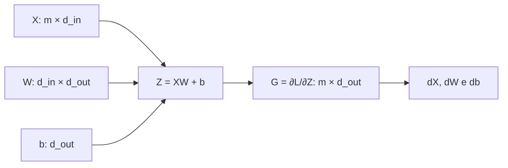
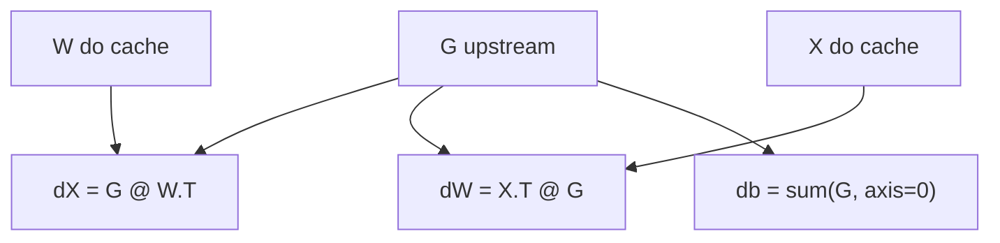

<!-- mirandastech-aula-v2 -->

# Aula 09 — Backward da camada afim

[](https://colab.research.google.com/github/joaopaulomirandamatias/ai-lab/blob/main/04-deep-learning/m5-redes-neurais-do-zero/notebooks/09-backward-camada-afim-laboratorio.ipynb)

Na [aula anterior](08-derivadas-locais-grafo-computacional.md), construímos a ideia de *vector–Jacobian product* (VJP): o gradiente que chega de jusante é multiplicado localmente pela derivada de cada operação. Agora aplicaremos essa regra à transformação que domina redes densas, projeções de atenção e muitas outras arquiteturas:

$$
Z=XW+b.
$$

O *forward* parece simples. O problema real surge no treinamento: dado o gradiente da loss em relação a $Z$, como devolver gradientes corretos para $X$, $W$ e $b$ sem criar um Jacobiano gigantesco? Uma transposição errada pode preservar dimensões em casos quadrados e ainda assim treinar o modelo errado; uma média extra no gradiente do viés pode reduzir a atualização por um fator igual ao tamanho do lote.

Esta aula deriva, implementa e testa o backward da camada afim em NumPy puro.

## Objetivos

Ao final, você deverá ser capaz de:

- rastrear os shapes do forward e do backward de uma camada afim;
- derivar $\partial L/\partial X$, $\partial L/\partial W$ e $\partial L/\partial b$ por índices e diferenciais;
- explicar por que o gradiente do viés soma a dimensão do lote;
- implementar uma camada afim vetorizada sem materializar Jacobianos;
- distinguir a redução da loss da acumulação local de gradientes;
- validar a implementação por diferenças centrais e teste direcional;
- reconhecer erros de broadcasting, cache, transposição e divisão duplicada pelo lote.

## Pré-requisitos

- álgebra matricial: produto, transposta e soma;
- derivadas parciais e regra da cadeia;
- VJP, gradiente upstream e acumulação em ramificações;
- arrays NumPy bidimensionais e broadcasting.

## Vocabulário essencial

| Termo | Significado nesta aula |
|---|---|
| camada afim | transformação $XW+b$; é linear apenas quando $b=0$ |
| upstream | gradiente $G=\partial L/\partial Z$ recebido da operação seguinte |
| cache | valores do forward necessários para calcular o backward |
| VJP | produto do gradiente upstream pelo Jacobiano local, sem formar o Jacobiano |
| redução | regra que converte losses por exemplo em escalar, como soma ou média |
| acumulação | soma de contribuições quando um tensor influencia a loss por vários caminhos |

## 1. Contrato de shapes

Adotaremos exemplos nas linhas e atributos nas colunas:

| Tensor | Shape | Papel |
|---|---:|---|
| $X$ | $(m,d_{in})$ | lote com $m$ exemplos e $d_{in}$ atributos |
| $W$ | $(d_{in},d_{out})$ | pesos da camada |
| $b$ | $(d_{out},)$ | viés compartilhado pelos exemplos |
| $Z$ | $(m,d_{out})$ | saída afim |
| $G=\partial L/\partial Z$ | $(m,d_{out})$ | gradiente upstream |

O NumPy transmite $b$ sobre as $m$ linhas. Conceitualmente, para cada exemplo $i$ e unidade de saída $k$,

$$
Z_{ik}=\sum_{j=1}^{d_{in}}X_{ij}W_{jk}+b_k.
$$

O backward deve devolver um gradiente com exatamente o shape de cada entrada:

$$
\boxed{\frac{\partial L}{\partial X}=GW^\top},\qquad
\boxed{\frac{\partial L}{\partial W}=X^\top G},\qquad
\boxed{\frac{\partial L}{\partial b}=\sum_{i=1}^{m}G_{i,:}}.
$$



O diagrama indica dependências, não a ordem temporal completa: $X$ e $W$ usados no backward são os valores correspondentes àquele forward.

## 2. Intuição antes da derivação

Cada elemento de $X$ afeta todas as saídas da mesma linha. Por isso, para obter $\partial L/\partial X_{ij}$, agregamos os sinais $G_{ik}$ das unidades de saída, ponderados por $W_{jk}$.

Cada peso $W_{jk}$ é reutilizado em todos os exemplos do lote. Seu gradiente soma, sobre $i$, o produto entre a entrada $X_{ij}$ e o sinal upstream $G_{ik}$.

Cada viés $b_k$ também é reutilizado em todas as linhas e entra com coeficiente 1. Portanto, seu gradiente é simplesmente a soma da coluna $k$ de $G$.

Essa reutilização explica o padrão:

- gradiente de $X$: combina unidades de saída;
- gradiente de $W$: combina exemplos do lote;
- gradiente de $b$: reduz a dimensão transmitida por broadcasting.

## 3. Derivação por índices

Considere $L$ uma loss escalar e defina $G_{ik}=\partial L/\partial Z_{ik}$.

### 3.1 Gradiente de $X$

Pela regra da cadeia,

$$
\frac{\partial L}{\partial X_{ij}}
=\sum_{k=1}^{d_{out}}
\frac{\partial L}{\partial Z_{ik}}
\frac{\partial Z_{ik}}{\partial X_{ij}}
=\sum_{k=1}^{d_{out}}G_{ik}W_{jk}.
$$

Essa é exatamente a entrada $(i,j)$ de $GW^\top$.

### 3.2 Gradiente de $W$

O mesmo peso participa de todas as linhas:

$$
\frac{\partial L}{\partial W_{jk}}
=\sum_{i=1}^{m}
\frac{\partial L}{\partial Z_{ik}}
\frac{\partial Z_{ik}}{\partial W_{jk}}
=\sum_{i=1}^{m}X_{ij}G_{ik}.
$$

Essa soma é a entrada $(j,k)$ de $X^\top G$.

### 3.3 Gradiente de $b$

Como $\partial Z_{ik}/\partial b_k=1$,

$$
\frac{\partial L}{\partial b_k}=\sum_{i=1}^{m}G_{ik}.
$$

O eixo reduzido é o mesmo que surgiu implicitamente no broadcasting do forward.

## 4. Derivação compacta por diferenciais

A derivação por diferenciais generaliza bem e evita manipular índices. Para perturbações infinitesimais,

$$
dZ=dX\,W+X\,dW+db,
$$

onde $db$ é transmitido para todas as linhas. Usando o produto interno de Frobenius,

$$
dL=\langle G,dZ\rangle_F=\operatorname{tr}(G^\top dZ).
$$

Substituindo $dZ$:

$$
dL=\operatorname{tr}(G^\top dXW)
+\operatorname{tr}(G^\top XdW)
+\sum_{i,k}G_{ik}\,db_k.
$$

Pela propriedade cíclica do traço, reorganizamos cada termo para que a perturbação apareça ao final:

$$
dL=\operatorname{tr}\!\left((GW^\top)^\top dX\right)
+\operatorname{tr}\!\left((X^\top G)^\top dW\right)
+\left(\sum_i G_{i,:}\right)^\top db.
$$

Comparando com a definição de gradiente, obtemos as três fórmulas anunciadas. O Jacobiano completo de $Z$ em relação a $X$ teria quatro eixos; o VJP produz diretamente os gradientes úteis.

## 5. Exemplo resolvido

Considere:

$$
X=\begin{bmatrix}1&-2&0{,}5\\0&3&-1\end{bmatrix},\quad
W=\begin{bmatrix}2&-1\\0{,}5&4\\-3&2\end{bmatrix},\quad
b=\begin{bmatrix}0{,}25&-0{,}75\end{bmatrix}.
$$

O forward resulta em

$$
Z=XW+b=
\begin{bmatrix}-0{,}25&-8{,}75\\4{,}75&9{,}25\end{bmatrix}.
$$

Suponha que a operação seguinte devolva

$$
G=\frac{\partial L}{\partial Z}
=\begin{bmatrix}1&-2\\0{,}5&3\end{bmatrix}.
$$

Então:

$$
\frac{\partial L}{\partial X}=GW^\top
=\begin{bmatrix}4&-7{,}5&-7\\-2&12{,}25&4{,}5\end{bmatrix},
$$

$$
\frac{\partial L}{\partial W}=X^\top G
=\begin{bmatrix}1&-2\\-0{,}5&13\\0&-4\end{bmatrix},
$$

e

$$
\frac{\partial L}{\partial b}
=\begin{bmatrix}1{,}5&1\end{bmatrix}.
$$

Um teste local ajuda a interpretar $dW_{2,2}=13$: o peso liga o segundo atributo à segunda saída. As contribuições são $(-2)(-2)=4$ no primeiro exemplo e $(3)(3)=9$ no segundo; a soma é 13.

## 6. Implementação vetorizada

```python
import numpy as np

def affine_forward(X, W, b):
    assert X.ndim == 2 and W.ndim == 2 and b.ndim == 1
    assert X.shape[1] == W.shape[0]
    assert b.shape[0] == W.shape[1]
    Z = X @ W + b
    cache = (X.copy(), W.copy())
    return Z, cache

def affine_backward(G, cache):
    X, W = cache
    assert G.shape == (X.shape[0], W.shape[1])
    dX = G @ W.T
    dW = X.T @ G
    db = G.sum(axis=0)
    return dX, dW, db
```

Guardar cópias no exemplo didático impede que uma mutação posterior de $X$ ou $W$ corrompa o backward. Em sistemas reais, copiar tudo pode consumir memória demais; a engenharia deve escolher entre imutabilidade, recomputação e armazenamento seletivo, mantendo o contrato correto.



## 7. Soma, média e tamanho do lote

O backward local não decide se a loss usa soma ou média. Essa decisão já está codificada em $G$.

Se $L=(1/m)\sum_i \ell_i$, então o fator $1/m$ aparece em $G$. Calcular `G.mean(axis=0)` para o viés dividiria novamente por $m$. O correto continua sendo `G.sum(axis=0)`.

| Situação | Upstream | Backward do viés |
|---|---|---|
| loss somada | contém gradientes por exemplo sem $1/m$ | `G.sum(axis=0)` |
| loss média | já contém o fator $1/m$ | `G.sum(axis=0)` |
| microbatches com loss somada | somar gradientes dos microbatches | mesma soma global |
| microbatches com médias locais | reponderar por quantidade de exemplos | não fazer média das médias cegamente |

O mesmo princípio vale para $dW$. Para uma loss somada, concatenar lotes ou somar seus gradientes produz o mesmo resultado. Para uma média global, cada microbatch deve ser ponderado por seu tamanho.

## 8. Gradient checking

Uma implementação analítica deve ser confrontada com diferenças centrais. Para uma coordenada $\theta_r$ de $X$, $W$ ou $b$,

$$
\frac{\partial L}{\partial \theta_r}
\approx
\frac{L(\theta_r+h)-L(\theta_r-h)}{2h}.
$$

Escolha $h$ pequeno, mas não tão pequeno que o arredondamento domine; em `float64`, valores próximos de $10^{-5}$ ou $10^{-6}$ são pontos de partida comuns. Compare pelo erro relativo simétrico:

$$
e=\frac{|g_a-g_n|}{\max(1,|g_a|,|g_n|)},
$$

em que $g_a$ é o gradiente analítico e $g_n$ o numérico. O denominador com piso 1 evita amplificar ruído quando ambos são quase zero.

Também podemos testar uma direção inteira $(\Delta X,\Delta W,\Delta b)$. O backward prevê a derivada direcional

$$
\langle dX,\Delta X\rangle_F+
\langle dW,\Delta W\rangle_F+
\langle db,\Delta b\rangle,
$$

que deve coincidir com a diferença central da loss ao perturbar todos os argumentos nessa direção. Esse teste valida a VJP sem enumerar cada coordenada.

## 9. Armadilhas e limites

### Transpostas que passam por acaso

Se todas as dimensões forem iguais, uma fórmula errada pode manter o shape. Use testes com $m$, $d_{in}$ e $d_{out}$ distintos, além de valores numéricos conhecidos.

### `*` não é produto matricial

Em NumPy, `X * W` é produto elemento a elemento. A camada afim usa `X @ W`.

### Vetores unidimensionais ocultam eixos

Um único exemplo com shape `(d_in,)` pode colapsar o eixo do lote. Nesta implementação, mantenha `(1, d_in)` para preservar o contrato.

### Média dupla

Não use `mean` em $dW$ ou $db$ porque a loss foi média. O upstream já transporta essa escolha.

### Broadcasting exige redução

Todo eixo criado por broadcasting no forward precisa ser reduzido no backward. Como $b$ foi replicado sobre o eixo 0, `db` soma esse eixo.

### Cache mutável

Se $X$ ou $W$ mudar entre forward e backward, o gradiente deixa de corresponder à computação original. Trate tensores em cache como imutáveis ou guarde cópias.

### Regularização é outro caminho

Se a função objetivo inclui $\lambda\|W\|_2^2$, a contribuição $2\lambda W$ deve ser acumulada ao gradiente da camada. Não a esconda dentro de `affine_backward` nem a adicione duas vezes.

### Parâmetros compartilhados

Quando o mesmo $W$ aparece em vários caminhos, cada chamada produz uma contribuição. O grafo deve somá-las, como estudado na aula anterior.

### O backward não prova que o modelo aprende

Gradient checking local verifica cálculo diferencial, não adequação dos dados, da arquitetura ou da otimização. Um gradiente perfeito ainda pode alimentar um experimento mal definido.

## 10. Conexões com sistemas reais

- **Camadas densas:** o backward derivado aqui é o núcleo de MLPs.
- **Transformers:** projeções de consultas, chaves, valores e logits são transformações afins bateladas; bibliotecas estendem a mesma álgebra a eixos adicionais.
- **Convoluções:** depois de reorganizar janelas em colunas, parte do backward assume forma de multiplicações matriciais e acumulações.
- **Treinamento distribuído:** gradientes de parâmetros calculados em réplicas precisam ser agregados com semântica compatível com a redução da loss.
- **Pesquisa reproduzível:** testes de gradiente, shapes não quadrados e seeds fixas transformam uma derivação em evidência executável.

## 11. Checklist prático

- [ ] $X$, $W$, $b$ e $G$ têm ranks e shapes explícitos.
- [ ] `dX.shape == X.shape`, `dW.shape == W.shape` e `db.shape == b.shape`.
- [ ] $dX=GW^\top$ e $dW=X^\top G$ usam produto matricial.
- [ ] `db` soma exatamente os eixos transmitidos por broadcasting.
- [ ] A redução da loss não é aplicada novamente no backward local.
- [ ] O cache corresponde ao mesmo forward e não foi mutado.
- [ ] Os testes usam dimensões distintas e `float64`.
- [ ] Diferenças centrais validam $X$, $W$ e $b$.
- [ ] Um teste direcional valida a VJP conjunta.
- [ ] Contribuições de parâmetros compartilhados são acumuladas fora da camada.

## 12. Resumo

Para $Z=XW+b$ e $G=\partial L/\partial Z$, o backward eficiente é:

$$
dX=GW^\top,\qquad dW=X^\top G,\qquad db=\sum_iG_{i,:}.
$$

As transpostas alinham os eixos que precisam ser contraídos. A soma de $db$ desfaz o broadcasting do viés. A redução da loss pertence ao upstream, e não deve ser repetida. Shapes explícitos, cache coerente, casos não quadrados, diferenças centrais e testes direcionais formam um conjunto compacto de garantias.

## 13. Exercícios com respostas comentadas

### 1. Shapes básicos

Se $X$ tem shape `(32, 128)` e $W$ tem `(128, 64)`, quais são os shapes de $Z$, $G$, $dX$, $dW$ e $db$?

**Resposta:** $Z$ e $G$ têm `(32, 64)`; $dX$, `(32, 128)`; $dW$, `(128, 64)`; e $db$, `(64,)`. Cada gradiente recupera o shape do argumento correspondente.

### 2. Viés compartilhado

Por que $db$ não tem shape `(m, d_out)`?

**Resposta:** existe um único vetor $b$ compartilhado pelas $m$ linhas. As $m$ contribuições precisam ser somadas para cada coordenada do mesmo parâmetro.

### 3. Média duplicada

Uma BCE média produz $G$. Um código calcula `db = G.mean(axis=0)`. Qual é o erro?

**Resposta:** $G$ já contém $1/m$. A média introduz outro $1/m$, deixando o gradiente $m$ vezes menor que o correto. Use soma.

### 4. Dependência local

Alterar apenas $X_{ij}$ pode modificar quais elementos de $Z$?

**Resposta:** apenas a linha $i$, mas potencialmente todas as $d_{out}$ colunas, pois $X_{ij}$ multiplica $W_{j,:}$.

### 5. Peso compartilhado no lote

Alterar apenas $W_{jk}$ pode modificar quais elementos de $Z$?

**Resposta:** a coluna $k$ de todas as linhas; a mudança na linha $i$ é proporcional a $X_{ij}$.

### 6. Lote unitário

Com $m=1$, por que ainda é útil manter $X$ bidimensional?

**Resposta:** preserva o eixo do lote e torna forward, backward e testes uniformes. O shape `(d_in,)` muda regras de multiplicação e pode ocultar erros.

### 7. Regularização L2

Se $L=L_{dados}+\lambda\|W\|_F^2$, qual é o gradiente total de $W$?

**Resposta:** $X^\top G+2\lambda W$. O primeiro termo vem do caminho da camada; o segundo, do caminho explícito da regularização.

### 8. Parâmetro compartilhado

O mesmo $W$ produz $Z_1=X_1W+b_1$ e $Z_2=X_2W+b_2$. Qual é $dW$?

**Resposta:** $dW=X_1^\top G_1+X_2^\top G_2$. O backward local calcula cada parcela; o grafo as acumula.

### 9. Teste insuficiente

Por que testar somente matrizes quadradas é perigoso?

**Resposta:** transpostas incorretas podem manter shapes compatíveis. Dimensões distintas tornam o contrato estrutural mais discriminativo.

### 10. Microbatches desiguais

Dois microbatches de tamanhos 8 e 24 devolvem gradientes de losses médias locais. A média simples dos dois gradientes equivale à média global?

**Resposta:** não. É preciso ponderar por 8 e 24 e dividir por 32. A média simples daria peso excessivo ao lote menor.

### 11. Jacobiano explícito

Qual a principal razão para preferir VJP ao Jacobiano de $Z$ em relação a $X$?

**Resposta:** o Jacobiano teria tamanho proporcional a $(m d_{out})(m d_{in})$, quase todo estruturado e desnecessário. $GW^\top$ entrega diretamente o gradiente requerido.

## 14. Laboratório reproduzível

O notebook [09-backward-camada-afim-laboratorio.ipynb](../notebooks/09-backward-camada-afim-laboratorio.ipynb) implementa:

1. forward e backward estritos em NumPy;
2. exemplo manual e versão por laços independentes;
3. gradient checking coordenada a coordenada para $X$, $W$ e $b$;
4. teste direcional conjunto da VJP;
5. contraprova da média duplicada no gradiente do viés;
6. equivalência entre lote completo e acumulação por microbatches;
7. proteção contra arrays 1D e mutação do cache;
8. visualização das magnitudes dos gradientes.

## 15. Próxima aula

Com a transformação afim capaz de propagar gradientes, a **Aula 10 — Backward das ativações** adicionará as derivadas elemento a elemento de sigmoid, tanh, ReLU e variantes. Veremos máscaras, saturação e a composição entre o backward da ativação e o backward afim, sem antecipar ainda o backward completo das losses.

## Referências

- GOODFELLOW, Ian; BENGIO, Yoshua; COURVILLE, Aaron. [Deep Learning — Deep Feedforward Networks](https://www.deeplearningbook.org/contents/mlp.html). MIT Press, 2016.
- ZHANG, Aston et al. [Dive into Deep Learning — Forward Propagation, Backward Propagation, and Computational Graphs](https://d2l.ai/chapter_multilayer-perceptrons/backprop.html). Versão 1.0.3.
- STANFORD UNIVERSITY. [CS231n — Backpropagation, Intuitions](https://cs231n.github.io/optimization-2/). Material do curso.
- NUMPY DEVELOPERS. [numpy.matmul](https://numpy.org/doc/stable/reference/generated/numpy.matmul.html). Documentação da versão estável, consultada em 9 de setembro de 2026.
