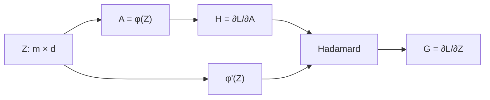
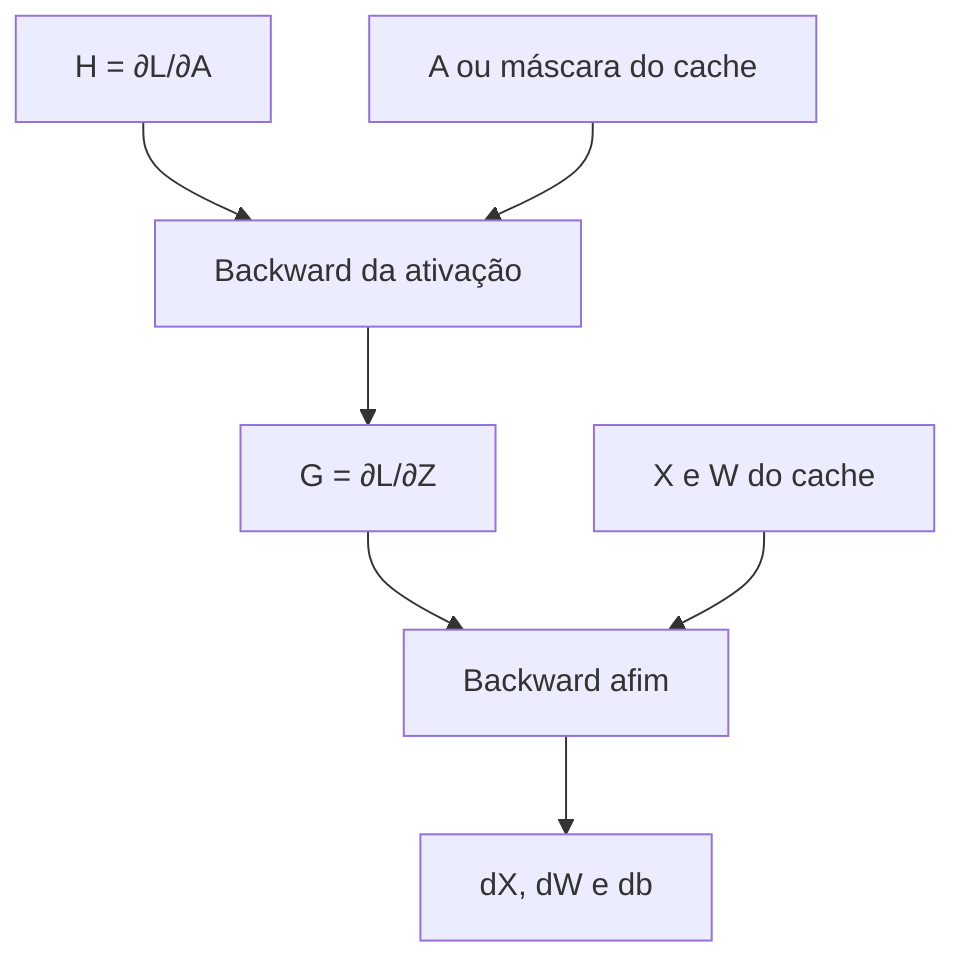

<!-- mirandastech-aula-v2 -->

# Aula 10 — Backward das ativações

[](https://colab.research.google.com/github/joaopaulomirandamatias/ai-lab/blob/main/04-deep-learning/m5-redes-neurais-do-zero/notebooks/10-backward-ativacoes-laboratorio.ipynb)

Na [Aula 09](09-backward-camada-afim.md), derivamos o backward de $Z=XW+b$. Uma MLP, porém, precisa de não linearidade: ela produz $A=\phi(Z)$ antes de enviar o resultado à próxima camada. Agora surge a pergunta operacional: dado $H=\partial L/\partial A$, como calcular $G=\partial L/\partial Z$?

A resposta é local e vetorizável:

$$
\boxed{G=H\odot\phi'(Z)},
$$

onde $\odot$ é o produto elemento a elemento. A fórmula é curta; implementá-la com estabilidade, shapes corretos, convenções explícitas e diagnóstico de saturação exige cuidado.

## Objetivos

Ao final, você deverá ser capaz de:

- derivar o backward de sigmoid, tanh, ReLU e Leaky ReLU;
- explicar por que o Jacobiano de uma ativação elemento a elemento é diagonal;
- combinar o gradiente upstream com a derivada local pelo produto de Hadamard;
- definir uma convenção auditável nos pontos não diferenciáveis;
- relacionar saturação a gradientes pequenos;
- decidir o que guardar no cache do forward;
- validar derivadas suaves e por partes com diferenças centrais;
- compor o backward de uma ativação com o backward da camada afim.

## Pré-requisitos e vocabulário

Pré-requisitos: regra da cadeia, VJP, arrays NumPy, funções de ativação e o backward afim.

| Termo | Significado |
|---|---|
| upstream $H$ | gradiente da loss em relação à saída $A$ |
| gradiente local | $\phi'(Z)$, avaliado no ponto do forward |
| máscara | array booleano ou numérico que seleciona regiões de uma função por partes |
| saturação | região em que grandes mudanças na entrada quase não mudam a saída |
| kink | ponto de quina em que a derivada clássica não existe |
| Hadamard | produto elemento a elemento entre arrays do mesmo shape |

## 1. Regra local e shapes

Se $Z,A,H,G\in\mathbb{R}^{m\times d}$ e $A_{ij}=\phi(Z_{ij})$, então

$$
\frac{\partial A_{ij}}{\partial Z_{rs}}=
\begin{cases}
\phi'(Z_{ij}), & (i,j)=(r,s),\\
0, & \text{caso contrário}.
\end{cases}
$$

O Jacobiano é diagonal após vetorizar os tensores: cada saída depende apenas da entrada na mesma posição. O VJP com $H$ reduz-se a

$$
G_{ij}=\frac{\partial L}{\partial Z_{ij}}
=\frac{\partial L}{\partial A_{ij}}
\frac{\partial A_{ij}}{\partial Z_{ij}}
=H_{ij}\phi'(Z_{ij}).
$$



Não há soma sobre o lote nem multiplicação matricial dentro da ativação. $G$, $H$, $Z$ e $A$ preservam o mesmo shape.

## 2. Sigmoid

A sigmoid é

$$
\sigma(z)=\frac{1}{1+e^{-z}}.
$$

Usando $a=\sigma(z)$,

$$
\sigma'(z)=\sigma(z)(1-\sigma(z))=a(1-a).
$$

Portanto,

$$
G=H\odot A\odot(1-A).
$$

Guardar $A$ evita recalcular a exponencial. A derivada está no intervalo $(0,0{,}25]$ e alcança o máximo em $z=0$. Para $|z|$ grande, $A$ se aproxima de 0 ou 1 e a derivada se aproxima de zero: a unidade está saturada.

Uma implementação estável calcula separadamente entradas positivas e negativas, evitando `exp(-z)` para $z$ muito negativo.

## 3. Tangente hiperbólica

Para $a=\tanh(z)$,

$$
\tanh'(z)=1-\tanh^2(z)=1-a^2.
$$

Logo,

$$
G=H\odot(1-A^2).
$$

A tanh é centrada em zero e sua derivada máxima é 1 em $z=0$. Ainda assim, também satura quando $|z|$ cresce. Calcular a derivada a partir de $A$ reutiliza o forward, mas arredondamentos podem fazê-la tornar-se exatamente zero nas caudas em precisão finita.

## 4. ReLU e a máscara

A ReLU é

$$
\operatorname{ReLU}(z)=\max(0,z).
$$

Fora da origem,

$$
\operatorname{ReLU}'(z)=
\begin{cases}
0, & z<0,\\
1, & z>0.
\end{cases}
$$

Em $z=0$, a derivada clássica não existe. Uma implementação precisa escolher uma convenção. Nesta trilha, adotaremos $\operatorname{ReLU}'(0)=0$:

```python
G = H * (Z > 0)
```

A máscara bloqueia o upstream nas posições não positivas e o preserva nas positivas. Essa decisão no ponto zero não “resolve” a não diferenciabilidade; apenas torna o algoritmo determinístico e testável.

## 5. Leaky ReLU

Com inclinação negativa $\alpha\in(0,1)$,

$$
\operatorname{LReLU}_\alpha(z)=
\begin{cases}
z, & z>0,\\
\alpha z, & z\le 0.
\end{cases}
$$

Adotando a convenção $\phi'(0)=\alpha$ coerente com o ramo `z <= 0`,

$$
G=H\odot
\begin{cases}
1, & Z>0,\\
\alpha, & Z\le 0.
\end{cases}
$$

A inclinação negativa permite algum fluxo de gradiente no semieixo negativo, mas uma cadeia longa ainda multiplica fatores $\alpha<1$.

## 6. Comparação operacional

| Ativação | Derivada local | Cache mínimo conveniente | Risco principal |
|---|---|---|---|
| sigmoid | $A(1-A)$ | saída $A$ | saturação nas duas caudas |
| tanh | $1-A^2$ | saída $A$ | saturação nas duas caudas |
| ReLU | $\mathbb{1}[Z>0]$ | máscara ou $Z$ | gradiente zero no ramo negativo |
| Leaky ReLU | $1$ ou $\alpha$ | máscara ou $Z$ | atenuação no ramo negativo |

O “cache mínimo” depende do sistema. Uma máscara booleana pode economizar memória em relação a $Z$; recomputá-la exige preservar informação suficiente. Em código didático, guardar cópias evita mutações acidentais.

## 7. Exemplo resolvido

Considere

$$
Z=[-2,0,1],\qquad H=[3,-4,2].
$$

Para ReLU, a máscara com nossa convenção é $[0,0,1]$ e

$$
G_{ReLU}=H\odot[0,0,1]=[0,0,2].
$$

Para Leaky ReLU com $\alpha=0{,}1$, a derivada local é $[0{,}1,0{,}1,1]$ e

$$
G_{LReLU}=[0{,}3,-0{,}4,2].
$$

Para sigmoid, $A\approx[0{,}1192,0{,}5,0{,}7311]$, logo

$$
G_{sigmoid}=H\odot A\odot(1-A)
\approx[0{,}3150,-1,0{,}3932].
$$

Observe que o sinal do upstream é preservado quando a derivada local é positiva; sua magnitude é modulada.

## 8. Saturação e propagação

Se uma sequência de operações escala o gradiente por derivadas locais $r_1,\ldots,r_K$, a contribuição ao início contém o produto

$$
\prod_{k=1}^{K}r_k.
$$

Mesmo sem estudar ainda uma rede completa, essa expressão explica o diagnóstico local. Na sigmoid, $r_k\le0{,}25$; vinte fatores máximos produzem $0{,}25^{20}\approx9{,}09\times10^{-13}$. Para tanh em zero, o fator é 1, mas em regiões saturadas ele fica próximo de zero. Uma ReLU ativa transmite fator 1; uma ReLU inativa bloqueia o caminho.

Saturação não depende apenas da escolha da ativação: escala dos pesos, distribuição das entradas e inicialização determinam onde os pré-logits caem. Esses temas serão aprofundados depois que o backward completo estiver construído.

## 9. Composição com a camada afim

Para

$$
Z=XW+b,\qquad A=\phi(Z),
$$

o backward percorre o grafo na ordem inversa:

$$
H=\frac{\partial L}{\partial A}
\quad\Longrightarrow\quad
G=H\odot\phi'(Z)
\quad\Longrightarrow\quad
\begin{cases}
dX=GW^\top,\\
dW=X^\top G,\\
db=\sum_iG_{i,:}.
\end{cases}
$$



A ativação não calcula $dW$ nem $db$; ela entrega $G$ à camada anterior. Essa separação torna os componentes reutilizáveis e testáveis.

## 10. Gradient checking e pontos de quina

Para uma coordenada $z_r$,

$$
g_n=\frac{L(z_r+h)-L(z_r-h)}{2h}
$$

aproxima a derivada quando a função é suave na vizinhança. Em ReLU no zero, a diferença central vale $1/2$, mas nossa convenção de backward vale 0. Isso não é bug: a aproximação atravessa dois ramos e não representa uma derivada inexistente.

Boas práticas:

- use `float64` e diferenças centrais;
- teste sigmoid e tanh em valores moderados e extremos;
- para funções por partes, mantenha os pontos de teste afastados do kink por mais que $h$;
- teste separadamente a convenção exatamente no kink;
- compare erros relativos com piso no denominador;
- use upstream não uniforme para revelar broadcasting indevido.

## 11. Armadilhas e limites

### Usar multiplicação matricial

O backward de uma ativação elemento a elemento usa `*`, não `@`. O Jacobiano diagonal não precisa ser materializado.

### Recalcular com fórmula instável

Recalcular sigmoid por `1 / (1 + exp(-Z))` pode causar overflow. Prefira um forward estável e reutilize $A$.

### Derivar pela saída errada

`1 - A**2` vale quando $A=\tanh(Z)$. Se o cache contém outra grandeza, a fórmula deixa de ser válida.

### Alterar o upstream

Funções de backward devem devolver novo gradiente ou documentar mutação. Alterar $H$ no lugar pode corromper outros caminhos do grafo.

### Confundir zero local com unidade “morta”

Um gradiente ReLU zero em uma observação é comportamento local. Uma unidade permanentemente inativa em todos os exemplos e passos é um problema mais amplo, dependente de parâmetros e dados.

### Supor que derivada pequena significa pouca importância

Gradiente mede sensibilidade local da loss no estado atual; não é explicação causal nem importância global de atributo.

### Ignorar precisão numérica

Nas caudas, sigmoid e tanh podem arredondar para exatamente 0 ou 1. O backward permanece finito, mas perde resolução. Gradient checking deve considerar escala e tolerância.

## 12. Conexões com IA e sistemas reais

- **MLPs:** cada bloco denso compõe backward da ativação e backward afim.
- **CNNs:** ativações continuam elemento a elemento, independentemente dos eixos espaciais.
- **Transformers:** GELU e variantes suaves obedecem ao mesmo padrão VJP local, embora suas derivadas sejam diferentes.
- **Tracing:** histogramas de pré-ativações e gradientes ajudam a detectar saturação ou caminhos bloqueados.
- **Treinamento misto:** caches, dtype e recomputação afetam memória e fidelidade numérica.
- **Pesquisa:** registrar convenção no kink, seed, dtype e tolerância evita resultados irreproduzíveis.

## 13. Checklist prático

- [ ] $H$ tem o mesmo shape da saída da ativação.
- [ ] O backward preserva shape e dtype esperado.
- [ ] O produto é elemento a elemento.
- [ ] Sigmoid e tanh reutilizam saída estável do forward.
- [ ] ReLU e Leaky ReLU têm convenção explícita em zero.
- [ ] A máscara corresponde ao mesmo forward e não foi mutada.
- [ ] O upstream original permanece inalterado.
- [ ] Gradient checks evitam quinas, e a quina é testada separadamente.
- [ ] Casos saturados permanecem finitos.
- [ ] A composição entrega $G$ ao backward afim sem média ou soma extra.

## 14. Resumo

O backward de uma ativação elemento a elemento é o VJP

$$
G=H\odot\phi'(Z).
$$

Sigmoid usa $A(1-A)$; tanh usa $1-A^2$; ReLU usa uma máscara binária; Leaky ReLU usa inclinações 1 e $\alpha$. Saturação reduz o gradiente local, e pontos de quina exigem convenções explícitas. O componente deve preservar shapes, não alterar o upstream e fornecer $G$ ao backward afim.

## 15. Exercícios com respostas comentadas

### 1. Shape

Se $H$ tem shape `(16, 32)`, qual deve ser o shape de $G$? **Resposta:** `(16, 32)`, pois a ativação é posição a posição.

### 2. Sigmoid em zero

Calcule $\sigma'(0)$. **Resposta:** $\sigma(0)=0{,}5$, então $0{,}5(1-0{,}5)=0{,}25$, seu máximo.

### 3. Tanh saturada

Se $A=0{,}99$, qual é a derivada local? **Resposta:** $1-0{,}99^2=0{,}0199$; o upstream é fortemente atenuado.

### 4. ReLU

Para $Z=[-1,0,2]$ e $H=[4,5,6]$, qual é $G$ com nossa convenção? **Resposta:** a máscara é `[0,0,1]`; portanto, $G=[0,0,6]$.

### 5. Leaky ReLU

Repita o exercício anterior com $\alpha=0{,}1$. **Resposta:** a derivada local é `[0.1,0.1,1]`; $G=[0{,}4,0{,}5,6]$.

### 6. Quina

Por que o gradient check central da ReLU em zero retorna aproximadamente $0{,}5$? **Resposta:** ele usa o ramo negativo em $-h$ e o positivo em $+h$. Como a derivada clássica não existe, não deve validar a convenção algorítmica nesse ponto.

### 7. Saturação em profundidade

Qual o maior fator possível após dez derivadas sigmoid? **Resposta:** $0{,}25^{10}\approx9{,}54\times10^{-7}$.

### 8. Cache

O que guardar para o backward da ReLU? **Resposta:** $Z$ ou apenas a máscara `Z > 0`. A máscara pode consumir menos memória, desde que corresponda ao forward correto.

### 9. Composição

Em $A=\tanh(XW+b)$, qual é o primeiro passo do backward? **Resposta:** calcular $G=H\odot(1-A^2)$; depois usar $G$ no backward afim.

### 10. Diagnóstico

Gradientes quase nulos provam que um atributo não importa? **Resposta:** não. Eles indicam sensibilidade local no estado atual e podem resultar de saturação, parametrização ou caminho bloqueado.

## 16. Laboratório reproduzível

O notebook [10-backward-ativacoes-laboratorio.ipynb](../notebooks/10-backward-ativacoes-laboratorio.ipynb) implementa as quatro ativações em NumPy, verifica derivadas coordenadas e direcionais, demonstra a quina da ReLU, mede saturação, testa máscaras e compõe ativação com camada afim.

## 17. Próxima aula

A **Aula 11 — Backward das losses** partirá da loss escalar e derivará o upstream em relação às predições e aos logits, sem saltos algébricos. Isso fechará as peças locais necessárias para montar uma backpropagation completa.

## Referências

- GOODFELLOW, Ian; BENGIO, Yoshua; COURVILLE, Aaron. [Deep Learning — Deep Feedforward Networks](https://www.deeplearningbook.org/contents/mlp.html). MIT Press, 2016.
- ZHANG, Aston et al. [Dive into Deep Learning — Multilayer Perceptrons](https://d2l.ai/chapter_multilayer-perceptrons/mlp.html). Versão 1.0.3.
- STANFORD UNIVERSITY. [CS231n — Neural Networks Part 1](https://cs231n.github.io/neural-networks-1/). Material do curso.
- GLOROT, Xavier; BORDES, Antoine; BENGIO, Yoshua. [Deep Sparse Rectifier Neural Networks](https://proceedings.mlr.press/v15/glorot11a.html). AISTATS, 2011.
