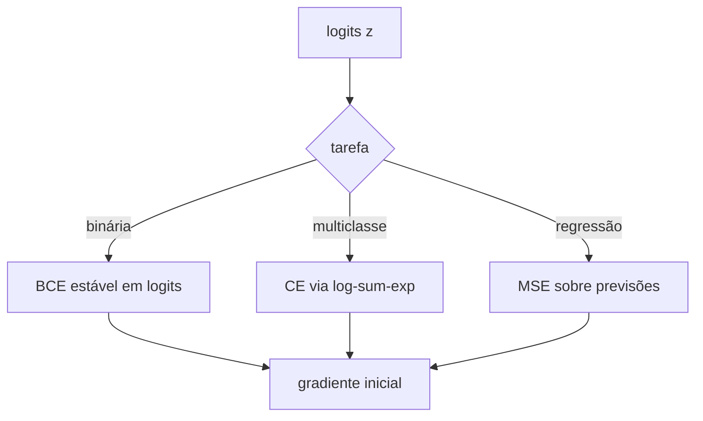
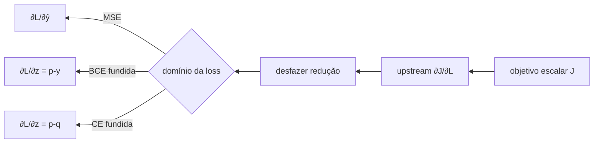

<!-- mirandastech-aula-v2 -->

# Aula 11 — Backward das losses

Na [aula anterior](10-backward-ativacoes.md), calculamos o gradiente que atravessa sigmoid, tanh e ReLU. Falta, porém, responder à pergunta que inicia todo backward: **qual gradiente sai da loss e chega ao primeiro nó do grafo reverso?**

Considere um classificador que prevê corretamente a classe, mas com confiança insuficiente. O forward produz um número escalar; sozinho, esse número não informa como alterar cada logit. A derivada da loss faz essa tradução. Se a redução for aplicada duas vezes, se o eixo de classes estiver errado ou se probabilidade e logit forem confundidos, o código pode executar sem erro e ainda enviar ao restante da rede um sinal incorreto.

Nesta aula derivaremos, sem autograd e sem saltos algébricos, os backwards de MSE, binary cross-entropy (BCE) e cross-entropy multiclasse (CE). O objetivo não é memorizar três fórmulas: é saber reconstruí-las, conferir shapes e entender por que operações fundidas em logits são numericamente preferíveis.

## Objetivos

Ao final, você deverá ser capaz de:

- distinguir derivada em relação à predição, à probabilidade e ao logit;
- derivar os gradientes da MSE para `none`, `sum` e `mean`;
- mostrar passo a passo por que sigmoid + BCE produz $p-y$;
- derivar o Jacobiano da softmax e provar que softmax + CE produz $\mathbf p-\mathbf q$;
- aplicar corretamente pesos, máscaras, denominadores e gradiente upstream;
- implementar losses estáveis em NumPy puro;
- verificar derivadas por diferenças centrais e teste direcional;
- diagnosticar clipping, dupla média, broadcasting e eixo de classes incorreto.

## Pré-requisitos

- [losses de regressão e classificação binária](06-losses-regressao-classificacao-binaria.md);
- [softmax e cross-entropy multiclasse](07-softmax-cross-entropy-multiclasse.md);
- derivadas locais, VJP e gradiente upstream;
- convenção de exemplos nas linhas e atributos/classes nas colunas.

## Vocabulário essencial

| Termo | Significado |
|---|---|
| loss por elemento | penalidade antes de agregar elementos ou exemplos |
| redução | transformação de várias losses em `none`, soma ou média |
| logit | score real antes de sigmoid ou softmax |
| alvo denso | distribuição $\mathbf q$ sobre as classes; one-hot é um caso particular |
| operação fundida | loss calculada diretamente dos logits, sem materializar logs de probabilidades |
| upstream | derivada recebida da operação seguinte; na raiz escalar, normalmente vale $1$ |
| VJP | produto do upstream pelo Jacobiano local, sem materializar esse Jacobiano |

## 1. Onde o backward começa

Se o objetivo escalar é $J=L$, então

$$
\bar L=\frac{\partial J}{\partial L}=1.
$$

Se $J=aL$ para algum escalar $a$, o backward local deve ser multiplicado por $a$. Isso parece trivial, mas torna a função reutilizável quando uma loss é combinada com outras, por exemplo $J=L_{dados}+\lambda L_{reg}$.

O domínio da derivada deve estar explícito. Para BCE, por exemplo, $\partial L/\partial p$ não é o gradiente que uma camada afim precisa; ela precisa de $\partial L/\partial z$. A regra da cadeia conecta os dois.

## 2. MSE: o fator que depende da convenção

Para $N$ valores previstos — todos os elementos reduzidos, não necessariamente apenas o número de exemplos — definimos

$$
L_{\mathrm{MSE}}=\frac{1}{N}\sum_{r=1}^{N}(\hat y_r-y_r)^2,
$$

onde $\hat y_r$ é a predição, $y_r$ o alvo e $r$ percorre os elementos reduzidos. Para uma saída com shape $(m,d_{out})$ e média global, $N=m\,d_{out}$.

Derivando um elemento $s$:

$$
\frac{\partial L}{\partial \hat y_s}
=\frac{1}{N}\frac{\partial}{\partial \hat y_s}(\hat y_s-y_s)^2
=\boxed{\frac{2}{N}(\hat y_s-y_s)}.
$$

As demais parcelas não dependem de $\hat y_s$ e desaparecem. A fórmula muda com a definição, não por preferência de implementação:

| Definição | Loss | Gradiente em $\hat y$ |
|---|---|---|
| soma | $\sum_r(\hat y_r-y_r)^2$ | $2(\hat y-y)$ |
| média | $N^{-1}\sum_r(\hat y_r-y_r)^2$ | $2(\hat y-y)/N$ |
| meia média | $(2N)^{-1}\sum_r(\hat y_r-y_r)^2$ | $(\hat y-y)/N$ |

### Exemplo resolvido

Para $\hat{\mathbf y}=[2,1]$, $\mathbf y=[1,-1]$ e média sobre $N=2$:

$$
L=\frac{(2-1)^2+(1+1)^2}{2}=\frac{5}{2}=2{,}5,
$$

$$
\frac{\partial L}{\partial\hat{\mathbf y}}
=\frac{2}{2}[1,2]=[1,2].
$$

Um erro recorrente é a função de loss já devolver o gradiente médio e o loop de treinamento dividir novamente pelo lote. Essa **dupla média** reduz artificialmente a atualização por outro fator $N$.

## 3. BCE: da probabilidade ao logit

Para um alvo binário $y\in\{0,1\}$ e probabilidade $p\in(0,1)$, a loss por elemento é

$$
\ell(p,y)=-\left[y\log p+(1-y)\log(1-p)\right].
$$

### 3.1 Derivada em relação à probabilidade

Usando $d\log p/dp=1/p$ e $d\log(1-p)/dp=-1/(1-p)$:

$$
\frac{\partial\ell}{\partial p}
=-\frac{y}{p}+\frac{1-y}{1-p}.
$$

Colocando no mesmo denominador:

$$
\frac{\partial\ell}{\partial p}
=\frac{-y(1-p)+(1-y)p}{p(1-p)}
=\boxed{\frac{p-y}{p(1-p)}}.
$$

Esse gradiente pode ter magnitude enorme perto de $0$ ou $1$. Ele ainda não é o gradiente em relação ao logit.

### 3.2 Compondo com a sigmoid

Se $p=\sigma(z)=1/(1+e^{-z})$, então

$$
\frac{\partial p}{\partial z}=p(1-p).
$$

Pela regra da cadeia,

$$
\frac{\partial\ell}{\partial z}
=\frac{\partial\ell}{\partial p}\frac{\partial p}{\partial z}
=\frac{p-y}{p(1-p)}p(1-p)
=\boxed{p-y}.
$$

O cancelamento é algébrico. Implementar literalmente a fração intermediária, contudo, pode gerar divisão por zero após arredondamento. A forma estável opera nos logits:

$$
\ell(z,y)=\operatorname{softplus}(z)-yz
=\log(1+e^z)-yz.
$$

Como $d\operatorname{softplus}(z)/dz=\sigma(z)$,

$$
\frac{\partial\ell}{\partial z}=\sigma(z)-y.
$$

Em NumPy, `np.logaddexp(0, z)` calcula a softplus sem exigir clipping. A [documentação do NumPy 2.5](https://numpy.org/doc/stable/reference/generated/numpy.logaddexp.html) define `logaddexp` como o logaritmo da soma de exponenciais calculado de modo estável.

### Exemplo resolvido

Com $z=[0,2,-2]$ e $y=[0,1,0]$:

$$
p\approx[0{,}5,\;0{,}880797,\;0{,}119203].
$$

Para redução `mean` sobre três elementos,

$$
\frac{\partial L}{\partial z}
=\frac{p-y}{3}
\approx[0{,}166667,-0{,}039734,0{,}039734].
$$

Observe que o erro de cada logit é escalado uma única vez pelo denominador da redução.

## 4. Softmax + cross-entropy: derivação pelo Jacobiano

Considere logits $\mathbf z\in\mathbb R^K$, probabilidades

$$
p_j=\frac{e^{z_j}}{\sum_{r=1}^{K}e^{z_r}}
$$

e um alvo denso $\mathbf q$ tal que $q_j\geq0$ e $\sum_jq_j=1$. A cross-entropy por exemplo é

$$
\ell(\mathbf p,\mathbf q)=-\sum_{j=1}^{K}q_j\log p_j.
$$

Primeiro,

$$
\frac{\partial\ell}{\partial p_j}=-\frac{q_j}{p_j}.
$$

O Jacobiano da softmax contém termos diagonais e cruzados:

$$
\frac{\partial p_j}{\partial z_k}=p_j(\delta_{jk}-p_k),
$$

onde $\delta_{jk}=1$ quando $j=k$ e $0$ caso contrário. Aplicando a regra da cadeia:

$$
\begin{aligned}
\frac{\partial\ell}{\partial z_k}
&=\sum_{j=1}^{K}\frac{\partial\ell}{\partial p_j}
\frac{\partial p_j}{\partial z_k}\\
&=\sum_j\left(-\frac{q_j}{p_j}\right)p_j(\delta_{jk}-p_k)\\
&=-\sum_j q_j\delta_{jk}+p_k\sum_jq_j\\
&=-q_k+p_k.
\end{aligned}
$$

Logo,

$$
\boxed{\nabla_{\mathbf z}\ell=\mathbf p-\mathbf q}.
$$

Essa fórmula vale para one-hot, label smoothing ou outro alvo probabilístico normalizado. O material institucional [Dive into Deep Learning 1.0.3](https://d2l.ai/chapter_linear-classification/softmax-regression.html) apresenta a mesma derivação e interpreta o gradiente como diferença entre probabilidade prevista e alvo.

### 4.1 Derivação direta em logits

Como $\sum_jq_j=1$,

$$
\ell(\mathbf z,\mathbf q)
=\operatorname{LSE}(\mathbf z)-\mathbf q^\top\mathbf z,
$$

com

$$
\operatorname{LSE}(\mathbf z)=\log\sum_{j=1}^{K}e^{z_j}.
$$

Já que $\partial\operatorname{LSE}/\partial z_k=p_k$, obtemos diretamente $p_k-q_k$. Para estabilidade, calcula-se

$$
\operatorname{LSE}(\mathbf z)=a+\log\sum_j e^{z_j-a},
\qquad a=\max_j z_j.
$$

O estudo de [Blanchard, Higham e Higham (2021)](https://doi.org/10.1093/imanum/draa038) mostra que deslocar pelo máximo evita overflow e é apropriado em aritmética de ponto flutuante, inclusive em baixa precisão.

### Exemplo resolvido

Para $\mathbf z=[2,1,0]$ e classe correta $0$, portanto $\mathbf q=[1,0,0]$:

$$
\mathbf p\approx[0{,}665241,0{,}244728,0{,}090031],
$$

$$
\ell=-\log p_0\approx0{,}407606,
$$

$$
\nabla_{\mathbf z}\ell=\mathbf p-\mathbf q
\approx[-0{,}334759,0{,}244728,0{,}090031].
$$

A soma dos componentes é zero. Isso reflete uma invariância: adicionar a mesma constante a todos os logits não altera a softmax nem a loss.

## 5. Reduções, pesos e máscaras

Para losses por elemento ou por exemplo $\ell_i$, o backward precisa usar exatamente a mesma redução do forward.

| Redução | Forward | Escala do backward local |
|---|---|---|
| `none` | vetor/tensor $\boldsymbol\ell$ | upstream com shape compatível |
| `sum` | $\sum_i\ell_i$ | $1$ |
| `mean` | $N^{-1}\sum_i\ell_i$ | $1/N$ |

Na CE multiclasse, cada exemplo produz uma loss após somar as classes; a média usual divide por $m$, não por $mK$. Na MSE e BCE elementwise desta trilha, a média global divide por todos os elementos reduzidos $N$.

Pesos ou máscaras tornam o denominador parte do contrato. Se

$$
L=\frac{\sum_iw_i\ell_i}{\sum_iw_i},
$$

então

$$
\frac{\partial L}{\partial z_i}
=\frac{w_i}{\sum_rw_r}\frac{\partial\ell_i}{\partial z_i}.
$$

Dividir pelo número total de posições, incluindo posições mascaradas, implementaria outro objetivo. Também é preciso rejeitar $\sum_iw_i=0$.

Para uma raiz escalar, o upstream é $1$. Se o upstream for $a$, todos os gradientes locais são multiplicados por $a$. Para `none`, o upstream pode ser um tensor: sua multiplicação deve ser elementwise e sem broadcasting acidental.

## 6. Contratos de shape e eixo

Adotaremos:

| Objeto | Shape binário | Shape multiclasse |
|---|---:|---:|
| logits | $(m,d_{out})$ | $(m,K)$ |
| alvos | igual aos logits | $(m,K)$ denso ou $(m,)$ esparso |
| loss `none` | igual aos logits | $(m,)$ |
| gradiente em logits | igual aos logits | igual aos logits |

Para alvo esparso multiclasse, converta cada índice de classe em uma linha one-hot somente depois de validar que é inteiro e pertence a $[0,K)$. Nunca permita que um alvo $(m,)$ seja transmitido implicitamente contra logits $(m,K)$: a operação pode falhar ou, em outros shapes, calcular algo diferente do pretendido.

O eixo da softmax é o eixo das classes. Com exemplos nas linhas, é `axis=1`. Normalizar `axis=0` faz cada coluna somar $1$ entre exemplos, acoplando indevidamente amostras distintas.

## 7. Estabilidade: equivalência matemática não basta

No papel, estas rotas são equivalentes:

- sigmoid → probabilidades → BCE;
- logits → softplus menos $yz$;
- softmax → log → CE;
- logits → log-sum-exp menos o logit-alvo.

No computador, as rotas por probabilidades podem arredondar $p$ para $0$ ou $1$, levando a `log(0)` e divisões por zero. Clipping esconde a falha, altera a loss e cria um gradiente artificial na região saturada. A solução é usar a formulação fundida em logits e calcular o gradiente como $p-y$ ou $\mathbf p-\mathbf q$.

Operação fundida não significa “pular matemática”. Significa derivar a composição completa e implementar uma expressão numericamente melhor.

## 8. Gradient checking: o oráculo local

Para uma função escalar $f(\mathbf z)$, a diferença central na coordenada $j$ é

$$
g_j^{num}=\frac{f(\mathbf z+\varepsilon\mathbf e_j)-f(\mathbf z-\varepsilon\mathbf e_j)}{2\varepsilon}.
$$

Compare-a ao gradiente analítico com erro relativo simétrico:

$$
\operatorname{erro}=
\frac{\lVert\mathbf g^{ana}-\mathbf g^{num}\rVert_2}
{\max(1,\lVert\mathbf g^{ana}\rVert_2,\lVert\mathbf g^{num}\rVert_2)}.
$$

O teste deve usar `float64`, valores moderados, mesma redução e $\varepsilon$ nem grande demais nem próximo demais da precisão de máquina. Ele detecta bugs locais; não prova que o objetivo escolhido, os rótulos ou o split de dados estejam corretos.

## 9. Armadilhas e erros comuns

1. **Dividir duas vezes pelo lote:** redução `mean` no backward e nova divisão no otimizador.
2. **Usar derivada da métrica:** acurácia e argmax não substituem a derivada da loss.
3. **Aplicar sigmoid/softmax duas vezes:** a loss “com logits” recebe logits crus.
4. **Derivar em $p$ e entregar como se fosse em $z$:** falta a cadeia da ativação.
5. **Clipping como estabilidade:** muda o objetivo; use softplus/log-sum-exp.
6. **Softmax no eixo errado:** exemplos passam a competir entre si.
7. **Broadcasting de labels:** shapes diferentes podem produzir uma conta válida, mas semanticamente falsa.
8. **Denominador inconsistente com máscara:** altera a escala conforme o padding.
9. **Misturar `sum` e `mean` entre experimentos:** muda a taxa efetiva de aprendizagem.
10. **Ignorar o upstream:** impede compor a loss em objetivos maiores.

## 10. Checklist prático

- [ ] A API declara se recebe previsões, probabilidades ou logits?
- [ ] Forward e backward compartilham a mesma redução?
- [ ] O denominador da média está documentado?
- [ ] Gradiente e entrada diferenciada têm exatamente o mesmo shape?
- [ ] Alvos binários estão em $[0,1]$ e alvos densos somam $1$ por linha?
- [ ] Softmax e log-sum-exp operam no eixo de classes?
- [ ] BCE e CE são calculadas diretamente dos logits?
- [ ] Pesos e máscaras usam numerador e denominador coerentes?
- [ ] O upstream é validado e aplicado uma única vez?
- [ ] Diferenças centrais confirmam MSE, BCE e CE?
- [ ] Logits extremos produzem loss e gradiente finitos?

## 11. Conexões com IA e sistemas reais

O mesmo gradiente $\mathbf p-\mathbf q$ aparece em classificadores de imagens, modelos de linguagem e cabeças de decisão: cada posição prevê uma distribuição e recebe um erro vetorial. Em modelos de linguagem, máscaras removem padding e posições não supervisionadas; por isso o denominador deve contar tokens válidos, não o tamanho bruto do tensor.

Operações fundidas também importam em treinamento de precisão reduzida: evitam intermediários instáveis e reduzem tráfego de memória. Frameworks abstraem esses detalhes, mas implementar a versão NumPy torna possível auditar se a loss, a redução e os logits usados no sistema correspondem ao objetivo declarado.

## 12. Resumo

- MSE média: $2(\hat y-y)/N$.
- Sigmoid + BCE em logits: $(p-y)/N$ sob média elementwise.
- Softmax + CE: $(\mathbf p-\mathbf q)/m$ sob média por exemplo.
- A fórmula simples surge da composição completa; não é uma derivada isolada da CE.
- Redução, pesos, máscaras, eixo e upstream fazem parte da matemática.
- Softplus e log-sum-exp preservam a intenção matemática em ponto flutuante.
- Gradient checking confirma a implementação local antes de montar a rede inteira.

## 13. Exercícios

1. Derive o backward da meia MSE $\frac{1}{2N}\sum_r(\hat y_r-y_r)^2$.
2. Para BCE com $z=0$ e $y=1$, calcule $p$, a loss e $\partial\ell/\partial z$.
3. Mostre que o gradiente softmax + CE soma zero em cada exemplo.
4. Com `mean` e lote duplicado por cópias idênticas, o gradiente de cada cópia aumenta, diminui ou permanece igual?
5. Por que $-q_j/p_j$ não pode ser passado diretamente ao backward de uma camada afim que produziu logits?
6. Uma máscara é $w=[1,1,0,0]$. Compare dividir a soma ponderada por $\sum w$ e por $4$.
7. Para $\mathbf z=[2,1,0]$ e alvo $\mathbf q=[0{,}8,0{,}1,0{,}1]$, calcule o gradiente.
8. Explique por que adicionar $100$ a todos os logits não muda a CE estável.
9. Dê um teste que detecte softmax aplicada em `axis=0` num lote $(m,K)$.
10. Se $J=0{,}7L_{CE}+0{,}3L_{aux}$, qual upstream chega a cada loss?

### Respostas comentadas

1. O fator $2$ da derivada cancela o $1/2$: $\partial L/\partial\hat y=(\hat y-y)/N$.
2. $p=0{,}5$, $\ell=\log2\approx0{,}693147$ e $p-y=-0{,}5$.
3. $\sum_j(p_j-q_j)=\sum_jp_j-\sum_jq_j=1-1=0$. Isso corresponde à invariância por deslocamento dos logits.
4. Cada cópia recebe metade do gradiente original porque o denominador dobra; ao somar as duas contribuições aos parâmetros compartilhados, o gradiente total permanece igual.
5. A camada afim produz $z$, não $p$. Falta multiplicar pelo Jacobiano da softmax; a composição é justamente o que simplifica para $p-q$.
6. Dividir por $2$ calcula a média apenas das posições válidas. Dividir por $4$ reduz todos os gradientes pela metade e faz a escala depender do padding.
7. Usando $\mathbf p\approx[0{,}665241,0{,}244728,0{,}090031]$, resulta $[-0{,}134759,0{,}144728,-0{,}009969]$.
8. O deslocamento cancela no numerador e denominador da softmax; na forma LSE, $\operatorname{LSE}(z+c)=c+\operatorname{LSE}(z)$ e $\mathbf q^\top(z+c)=\mathbf q^\top z+c$.
9. Verifique `np.allclose(P.sum(axis=1), 1)` e que alterar outro exemplo não muda as probabilidades da linha observada.
10. Os upstreams são $0{,}7$ para $L_{CE}$ e $0{,}3$ para $L_{aux}$; cada backward local é multiplicado pelo respectivo peso.

## Referências técnicas

- Zhang et al. [*Dive into Deep Learning*, versão 1.0.3 — Softmax Regression](https://d2l.ai/chapter_linear-classification/softmax-regression.html). Derivação de cross-entropy e gradiente em logits.
- Blanchard, Higham e Higham. [*Accurately computing the log-sum-exp and softmax functions*](https://doi.org/10.1093/imanum/draa038), IMA Journal of Numerical Analysis, 2021. Análise de estabilidade numérica.
- NumPy. [`numpy.logaddexp`, manual 2.5](https://numpy.org/doc/stable/reference/generated/numpy.logaddexp.html). Primitiva usada na BCE estável.
- Goodfellow, Bengio e Courville. [*Deep Learning*, capítulo 6](https://www.deeplearningbook.org/contents/mlp.html). Redes feedforward, funções de custo e backpropagation.

Referências e versões consultadas em **9 de setembro de 2026**.

## Próxima aula

Na **Aula 12 — Regra da cadeia aplicada à rede**, conectaremos loss, ativação e camada afim em um exemplo escalar completo. Cada gradiente local desta aula será propagado até pesos e entrada, tornando visível a backpropagation de ponta a ponta antes da vetorização de uma MLP.
