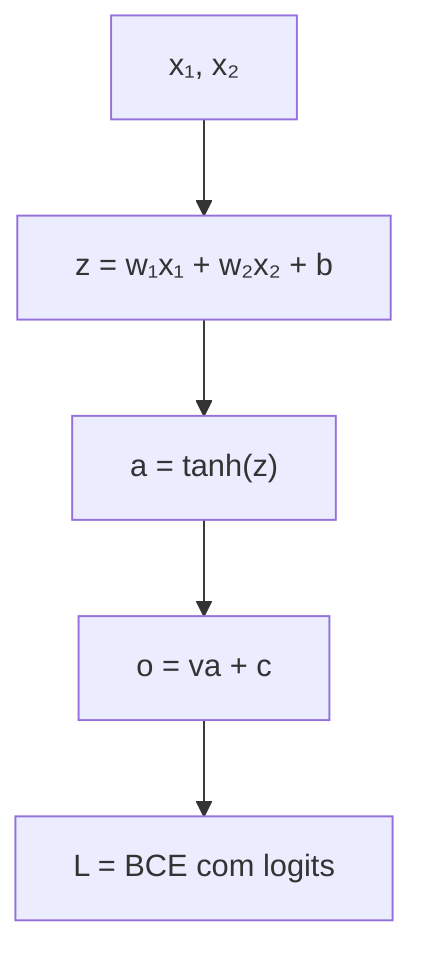
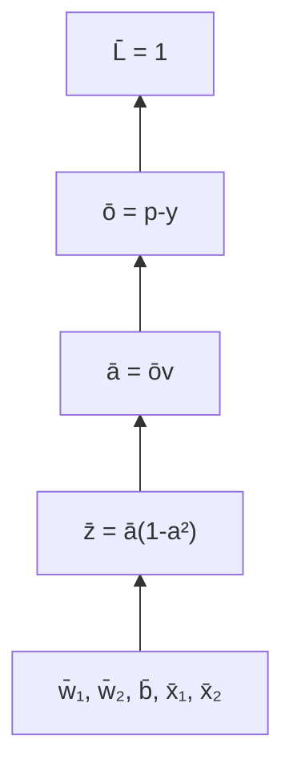

<!-- mirandastech-aula-v2 -->

# Aula 12 — Regra da cadeia aplicada à rede

Nas aulas 08 a 11, construímos peças locais: grafo computacional, backward afim, backward das ativações e backward das losses. Agora vamos encaixá-las. Pela primeira vez na trilha, uma loss escalar será propagada por uma rede inteira até cada parâmetro e cada entrada, sem autograd e sem esconder nenhuma multiplicação.

O problema motivador é simples: uma rede faz uma previsão ruim. Saber que a loss vale `1,16` não diz se o peso $w_1$ deve aumentar ou diminuir. A regra da cadeia transforma essa avaliação global em responsabilidades locais. Cada nó recebe um gradiente upstream, multiplica-o pela própria derivada e envia contribuições aos seus predecessores.

Trabalharemos com um único exemplo e neurônios escalares. Isso evita que álgebra matricial esconda a causalidade computacional. A [Aula 13](#próxima-aula) fará a mesma operação em uma MLP vetorizada.

## Objetivos

Ao final, você deverá ser capaz de:

- decompor uma rede escalar em operações elementares;
- executar o forward em ordem topológica e guardar caches coerentes;
- iniciar o backward na loss escalar com upstream igual a $1$;
- aplicar a regra da cadeia em ordem reversa;
- calcular gradientes de todos os pesos, vieses e entradas;
- distinguir backpropagation de atualização por gradiente descendente;
- acumular gradientes quando uma variável participa de mais de um caminho;
- verificar o resultado com diferenças centrais e teste direcional;
- diagnosticar derivada omitida, sinal trocado, cache inconsistente e saturação.

## Pré-requisitos

- [Backward das ativações](10-backward-ativacoes.md);
- [Backward das losses](11-backward-losses.md);
- derivada da tanh, sigmoid e BCE em logits;
- regra da cadeia de uma variável e noção de grafo computacional.

## Vocabulário

| Termo | Significado nesta aula |
|---|---|
| forward | cálculo das variáveis intermediárias até a loss |
| backward | cálculo dos gradientes em ordem inversa |
| parâmetro | variável treinável, como peso ou viés |
| cache | valor do forward necessário para a derivada local |
| upstream | derivada da loss em relação à saída do nó atual |
| gradiente local | derivada da saída do nó em relação a uma entrada |
| adjunto | outro nome para o gradiente acumulado associado a um nó |
| acumulação | soma das contribuições que chegam por caminhos diferentes |

## 1. A rede escalar

Considere duas entradas, uma unidade oculta com tanh e uma saída binária:

$$
\begin{aligned}
z &= w_1x_1+w_2x_2+b,\\
a &= \tanh(z),\\
o &= va+c,\\
p &= \sigma(o),\\
L &= -\left[y\log p+(1-y)\log(1-p)\right].
\end{aligned}
$$

$z$ é a pré-ativação oculta; $a$ é sua ativação; $o$ é o logit de saída; $p$ é a probabilidade prevista; $L$ é a BCE. Para estabilidade, implementaremos a última linha diretamente como

$$
L=\operatorname{softplus}(o)-yo.
$$

Pesos e vieses entram nos nós afins, embora o diagrama destaque o fluxo principal. O forward segue as setas; o backward percorrerá o grafo ao contrário.

## 2. Regra da cadeia como produto de sensibilidades

Se $u=f(t)$ e $J=g(u)$, então

$$
\frac{dJ}{dt}=\frac{dJ}{du}\frac{du}{dt}.
$$

Em um caminho mais longo, multiplicamos uma derivada local por vez. Por exemplo:

$$
\frac{\partial L}{\partial w_1}
=\frac{\partial L}{\partial o}
\frac{\partial o}{\partial a}
\frac{\partial a}{\partial z}
\frac{\partial z}{\partial w_1}.
$$

Cada fator responde a uma pergunta local:

| Fator | Pergunta |
|---|---|
| $\partial L/\partial o$ | como a loss reage ao logit? |
| $\partial o/\partial a$ | como o logit reage à ativação? |
| $\partial a/\partial z$ | como a tanh reage à pré-ativação? |
| $\partial z/\partial w_1$ | como a pré-ativação reage ao peso? |

Backpropagation reorganiza esses produtos para reutilizar resultados compartilhados. Em vez de recalcular o prefixo $\partial L/\partial o\cdot\partial o/\partial a\cdot\partial a/\partial z$ para cada peso, calculamos uma vez o adjunto de $z$ e o distribuímos.

## 3. Forward resolvido, valor por valor

Usaremos:

$$
x_1=1{,}5,\quad x_2=-0{,}5,\quad
w_1=0{,}8,\quad w_2=-0{,}4,\quad b=0{,}1,
$$

$$
v=-1{,}2,\quad c=0{,}3,\quad y=1.
$$

### 3.1 Unidade oculta

$$
z=(0{,}8)(1{,}5)+(-0{,}4)(-0{,}5)+0{,}1=1{,}5.
$$

$$
a=\tanh(1{,}5)\approx0{,}905148.
$$

### 3.2 Saída e loss

$$
o=(-1{,}2)(0{,}905148)+0{,}3\approx-0{,}786178.
$$

$$
p=\sigma(o)\approx0{,}3130.
$$

Como $y=1$, a rede atribui probabilidade baixa à classe correta. A loss é

$$
L=\operatorname{softplus}(o)-o\approx1{,}1616.
$$

O cache mínimo deste exemplo contém $x_1,x_2,w_1,w_2,v,z,a,o,p,y$. Não se deve executar um novo forward com parâmetros diferentes no meio do backward.

## 4. Backward resolvido

Usaremos a notação de barra

$$
\bar u=\frac{\partial L}{\partial u}.
$$

Ela evita repetir frações longas. Na raiz:

$$
\bar L=\frac{\partial L}{\partial L}=1.
$$

### 4.1 BCE em logits

Da aula anterior:

$$
\bar o=\frac{\partial L}{\partial o}=p-y.
$$

Como $p\approx0{,}3130$ e $y=1$:

$$
\bar o\approx-0{,}6870.
$$

O sinal negativo diz que aumentar $o$ localmente reduziria a loss.

### 4.2 Camada de saída

Como $o=va+c$:

$$
\bar v=\bar o\frac{\partial o}{\partial v}=\bar o\,a,
$$

$$
\bar c=\bar o\frac{\partial o}{\partial c}=\bar o,
$$

$$
\bar a=\bar o\frac{\partial o}{\partial a}=\bar o\,v.
$$

Numericamente:

$$
\bar v\approx-0{,}6218,\qquad
\bar c\approx-0{,}6870,\qquad
\bar a\approx0{,}8244.
$$

### 4.3 Tanh

Como $a=\tanh(z)$:

$$
\frac{\partial a}{\partial z}=1-a^2.
$$

Logo,

$$
\bar z=\bar a(1-a^2)
\approx0{,}8244(1-0{,}905148^2)
\approx0{,}1490.
$$

### 4.4 Camada oculta

Para $z=w_1x_1+w_2x_2+b$:

$$
\begin{aligned}
\bar w_1&=\bar z\,x_1\approx0{,}2235,\\
\bar w_2&=\bar z\,x_2\approx-0{,}0745,\\
\bar b&=\bar z\approx0{,}1490,\\
\bar x_1&=\bar z\,w_1\approx0{,}1192,\\
\bar x_2&=\bar z\,w_2\approx-0{,}0596.
\end{aligned}
$$

Os gradientes das entradas não são usados para atualizar este modelo, mas são essenciais quando $x_1$ e $x_2$ são saídas de uma camada anterior.

## 5. Tabela de rastreamento

Uma tabela torna a auditoria menos sujeita a saltos:

| Nó | Forward | Derivada local | Upstream recebido | Resultados do backward |
|---|---:|---:|---:|---|
| BCE | $L\approx1{,}1616$ | $\partial L/\partial o=p-y$ | $1$ | $\bar o\approx-0{,}6870$ |
| saída afim | $o=va+c$ | $a,1,v$ | $\bar o$ | $\bar v,\bar c,\bar a$ |
| tanh | $a=\tanh z$ | $1-a^2$ | $\bar a$ | $\bar z$ |
| oculta afim | $z=w_1x_1+w_2x_2+b$ | $x_1,x_2,1,w_1,w_2$ | $\bar z$ | $\bar w_1,\bar w_2,\bar b,\bar x_1,\bar x_2$ |

O forward calcula e guarda. O backward consome o cache e gradientes upstream. Misturar os dois sentidos dentro de uma função grande dificulta testes e favorece o uso de valores desatualizados.

## 6. Produto por caminho e reutilização

Expandindo $\bar w_1$:

$$
\bar w_1=(p-y)\,v\,(1-a^2)\,x_1.
$$

Para $w_2$, apenas o último fator muda:

$$
\bar w_2=(p-y)\,v\,(1-a^2)\,x_2.
$$

O prefixo

$$
\delta_z=(p-y)v(1-a^2)
$$

é reutilizado. Esse $\delta_z$ é o “sinal de erro” da unidade oculta. Em redes maiores, reverse-mode automatic differentiation aplica a mesma estratégia: cada nó recebe a soma dos adjuntos de jusante e executa um VJP local.

O material [CS231n](https://cs231n.github.io/optimization-2/) descreve backpropagation como aplicação recursiva da regra da cadeia em circuitos computacionais. O [Dive into Deep Learning 1.0.3](https://d2l.ai/chapter_multilayer-perceptrons/backprop.html) destaca que o backward percorre o grafo em ordem inversa e reutiliza variáveis intermediárias do forward.

## 7. Ramificações exigem soma

Se uma variável $u$ influencia a loss por duas rotas, a derivada total é

$$
\frac{\partial L}{\partial u}
=\left.\frac{\partial L}{\partial u}\right|_{caminho\ 1}
+\left.\frac{\partial L}{\partial u}\right|_{caminho\ 2}.
$$

Considere um parâmetro compartilhado $r$ em

$$
o=ra+rx+c.
$$

Então

$$
\bar r=\bar o\,a+\bar o\,x=\bar o(a+x).
$$

Sobrescrever a primeira contribuição com a segunda perde um caminho. Esse erro reaparece em conexões residuais, compartilhamento de embeddings e redes recorrentes. Um motor de autodiferenciação deve **acumular**, não apenas atribuir.

## 8. Backpropagation não é gradiente descendente

Backpropagation calcula gradientes. O otimizador os usa. Com taxa $\eta>0$:

$$
\theta_{novo}=\theta-\eta\nabla_\theta L.
$$

Para $w_1$, como $\bar w_1>0$, um passo pequeno diminui $w_1$. Para $v$, como $\bar v<0$, o mesmo passo aumenta $v$. O sinal do gradiente não é uma instrução isolada “aumente/diminua”; a atualização contém o sinal negativo do gradiente descendente.

Uma taxa pequena deve reduzir a loss localmente:

$$
L(\theta-\eta g)\approx L(\theta)-\eta\lVert g\rVert_2^2.
$$

Isso é um teste de sanidade, não garantia para qualquer $\eta$. Passos grandes podem atravessar a região em que a aproximação linear é válida.

## 9. Verificação numérica completa

Para cada parâmetro $\theta_j$:

$$
g_j^{num}=\frac{L(\theta_j+h)-L(\theta_j-h)}{2h}.
$$

A verificação deve reconstruir o forward inteiro em cada perturbação. Reutilizar um cache antigo faria a loss não corresponder ao parâmetro perturbado.

Além da checagem coordenada, escolha uma direção unitária $d$ e compare:

$$
\frac{L(\theta+hd)-L(\theta-hd)}{2h}
\quad\text{com}\quad
\nabla_\theta L^\top d.
$$

Diferenças centrais validam a implementação; não validam o modelo causal, os dados ou a escolha da loss. O [CS231n](https://cs231n.github.io/optimization-1/) recomenda a diferença central por ser mais precisa que a diferença para frente em condições comparáveis.

## 10. O que acontece quando uma derivada some

Se alguém propagar $\bar a$ diretamente como $\bar z$, omitirá o fator $1-a^2$. Neste exemplo, $a\approx0{,}905$, então o fator correto é apenas cerca de $0{,}181$. Os gradientes anteriores à tanh ficariam aproximadamente $5{,}53$ vezes maiores.

O bug é perigoso porque:

- a loss ainda é calculada corretamente;
- os shapes continuam válidos;
- os sinais podem até coincidir;
- o treinamento pode aparentar progresso com taxa ajustada por acaso.

Gradient checking localiza a divergência. Uma tabela de adjuntos ajuda a identificar o primeiro nó cujo valor analítico não coincide com o numérico.

## 11. Saturação vista no caminho completo

O fator $1-a^2$ controla quanto do gradiente da saída alcança a camada oculta. Se $z=0$, ele vale $1$. Se $z=6$, $\tanh(z)\approx0{,}999988$ e o fator cai para aproximadamente $2{,}46\times10^{-5}$.

Isso não significa que “a BCE parou de aprender”: $\bar o=p-y$ pode continuar grande. O bloqueio ocorre antes da tanh, por uma derivada local pequena. Separar adjuntos por nó permite distinguir loss saturada, ativação saturada e pesos de saída pequenos.

## 12. Armadilhas e erros comuns

1. **Executar backward na ordem do forward:** uma derivada upstream ainda não existe quando o nó é visitado.
2. **Esquecer $\bar L=1$:** a raiz escalar precisa iniciar a propagação.
3. **Omitir uma derivada local:** equivale a supor que o nó é identidade.
4. **Trocar $p-y$ por $y-p$:** inverte todos os gradientes anteriores.
5. **Atualizar parâmetros durante o backward:** nós posteriores passam a usar versões incompatíveis.
6. **Usar cache de outro forward:** o gradiente deixa de corresponder à loss observada.
7. **Sobrescrever ramificações:** contribuições devem ser somadas.
8. **Confundir gradiente de entrada com parâmetro:** $\bar x$ é propagado, mas não necessariamente otimizado.
9. **Confiar apenas na queda da loss:** uma implementação errada pode cair temporariamente.
10. **Testar só um parâmetro:** bugs de sinal ou fatores podem afetar apenas um caminho.

## 13. Checklist prático

- [ ] O grafo contém todas as operações do forward?
- [ ] Cada nó guarda apenas o cache necessário e coerente?
- [ ] A loss escalar inicia com upstream $1$?
- [ ] O backward percorre a ordem topológica inversa?
- [ ] Cada etapa multiplica upstream pela derivada local?
- [ ] Contribuições de caminhos distintos são somadas?
- [ ] Parâmetros permanecem imutáveis até o backward terminar?
- [ ] Cada gradiente tem o mesmo domínio da variável diferenciada?
- [ ] Todos os parâmetros e entradas passam no gradient check?
- [ ] Um teste direcional confirma o vetor completo?
- [ ] Um passo pequeno em $-g$ reduz a loss?
- [ ] Adjuntos permanecem finitos em casos moderados e extremos?

## 14. Resumo

- Forward calcula e guarda intermediários em ordem topológica.
- Backward começa em $\bar L=1$ e percorre o grafo ao contrário.
- Cada nó combina upstream e derivada local.
- Um caminho multiplica sensibilidades; ramificações somam contribuições.
- O adjunto de uma unidade é reutilizado para todos os seus predecessores.
- Backpropagation calcula gradientes; gradiente descendente atualiza parâmetros.
- Diferenças centrais, teste direcional e passo de descida são verificações complementares.
- Saturação pode ser localizada inspecionando os adjuntos em cada nó.

## 15. Exercícios

1. Expanda $\partial L/\partial w_2$ como produto de derivadas locais.
2. Por que $\bar c=\bar o$?
3. Se $v=0$, quais gradientes ficam necessariamente zero?
4. Se $x_1=0$, $\bar w_1$ é zero? E $\bar x_1$?
5. Calcule o fator local da tanh para $a=0{,}8$.
6. Em $o=ra+rx+c$, por que `dr = do*x` está incompleto?
7. Qual a diferença conceitual entre $\bar x_1$ e $\bar w_1$?
8. Por que não se deve atualizar $v$ antes de calcular $\bar a$?
9. Se $J=2L$, qual é o upstream inicial em $L$?
10. Um passo pequeno em $+g$ tende a fazer o quê com a loss?

### Respostas comentadas

1. $(p-y)\,v\,(1-a^2)\,x_2$. Cada fator corresponde a BCE, saída afim, tanh e afim oculta.
2. Como $\partial o/\partial c=1$, a cadeia dá $\bar c=\bar o\cdot1$.
3. $\bar a=\bar o v=0$; portanto $\bar z$, $\bar w_1$, $\bar w_2$, $\bar b$, $\bar x_1$ e $\bar x_2$ zeram. $\bar v=\bar o a$ e $\bar c=\bar o$ podem permanecer não nulos.
4. $\bar w_1=\bar z x_1=0$. Já $\bar x_1=\bar z w_1$ não depende do valor de $x_1$ diretamente e pode ser não zero.
5. $1-a^2=1-0{,}64=0{,}36$.
6. O parâmetro $r$ participa de dois produtos. Falta $\bar o a$; o correto é $\bar r=\bar o(a+x)$.
7. $\bar w_1$ mede sensibilidade a um parâmetro treinável; $\bar x_1$ mede sensibilidade à entrada e seria enviado a uma camada anterior.
8. $\bar a=\bar o v$ deve usar o mesmo $v$ que gerou $o$. Atualizar antes mistura dois estados do modelo.
9. $\partial J/\partial L=2$; todos os gradientes de $L$ são multiplicados por 2.
10. Pela aproximação local, $L(\theta+\eta g)\approx L(\theta)+\eta\|g\|^2$: tende a aumentar.

## Referências técnicas

- Rumelhart, Hinton e Williams. [*Learning representations by back-propagating errors*](https://doi.org/10.1038/323533a0). *Nature*, 323, 533–536, 1986.
- Zhang et al. [*Dive into Deep Learning*, versão 1.0.3 — Forward Propagation, Backward Propagation, and Computational Graphs](https://d2l.ai/chapter_multilayer-perceptrons/backprop.html).
- Stanford University. [CS231n — Backpropagation, Intuitions](https://cs231n.github.io/optimization-2/).
- Goodfellow, Bengio e Courville. [*Deep Learning*, capítulo 6](https://www.deeplearningbook.org/contents/mlp.html). MIT Press, 2016.

Referências verificadas em **9 de setembro de 2026**.

## Próxima aula

Na **Aula 13 — Backprop vetorizado em uma MLP**, substituiremos escalares por lotes e matrizes. A lógica permanecerá a mesma, mas rastrearemos shapes, reduções e gradientes de uma rede de duas camadas sem autograd.
