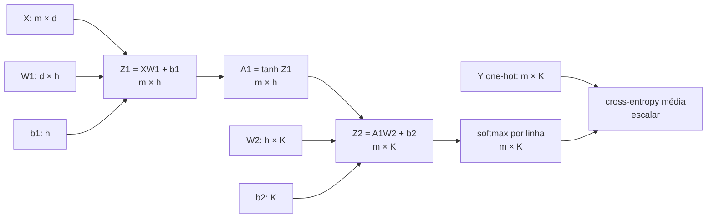
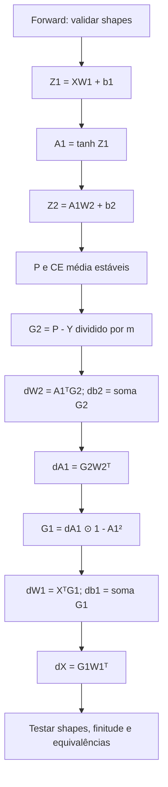

<!-- mirandastech-aula-v2 -->

# Aula 13 — Backprop vetorizado em uma MLP

> **Trilha:** M5 — Redes neurais do zero  
> **Objetivo central:** implementar, com NumPy e sem autograd, o forward e o backward vetorizados de uma MLP de duas camadas para classificação multiclasse.

[](https://colab.research.google.com/github/joaopaulomirandamatias/ai-lab/blob/main/04-deep-learning/m5-redes-neurais-do-zero/notebooks/13-backprop-vetorizado-mlp-laboratorio.ipynb)

Na aula anterior, seguimos um único exemplo por um grafo escalar. Isso revelou a lógica da regra da cadeia, mas não é a forma como uma rede processa dados reais. Se um lote contém 256 registros, repetir o mesmo código 256 vezes em Python é lento, prolixo e fácil de implementar de maneira inconsistente.

Nesta aula, cada linha de uma matriz será um exemplo. As operações locais continuam as mesmas; o que muda é a álgebra que acumula, de uma vez, as contribuições de todo o lote. A meta não é decorar quatro fórmulas: é conseguir reconstruí-las verificando **dependências, shapes e redução da loss**.

## 1. O problema motivador

Considere uma triagem que recebe (m) registros, cada um descrito por (d) atributos, e deve produzir probabilidades para (K) classes. Uma MLP com (h) unidades ocultas realiza:

1. uma transformação afim da entrada;
2. uma não linearidade `tanh`;
3. outra transformação afim;
4. softmax e cross-entropy média.

O forward pode ser expresso com poucas multiplicações de matrizes. Para treinar a rede, o backward deve devolver gradientes com exatamente os mesmos shapes dos parâmetros. Um `transpose` errado, uma soma no eixo errado ou uma média aplicada duas vezes pode produzir números plausíveis e, ainda assim, treinar outro objetivo.



## 2. Objetivos de aprendizagem

Ao final, você deverá ser capaz de:

- definir uma convenção de shapes e mantê-la em toda a rede;
- executar o forward estável de uma MLP de duas camadas;
- derivar (dW), (db) e (dX) de uma camada afim vetorizada;
- propagar o gradiente por `tanh` e por softmax com cross-entropy;
- distinguir soma, média e média duplicada no backward;
- provar numericamente a equivalência entre lote vetorizado e cálculo por exemplo;
- acumular micro-lotes de tamanhos diferentes sem alterar o objetivo;
- usar contratos de shape e testes numéricos para localizar erros.

## 3. Pré-requisitos

- produto de matrizes e transposição;
- regra da cadeia e derivadas locais;
- backward de camada afim, ativações e losses;
- softmax e cross-entropy;
- broadcasting e eixos no NumPy.

## 4. Vocabulário

| Termo | Significado nesta aula |
|---|---|
| lote ou *batch* | conjunto de (m) exemplos processados juntos |
| dimensão de entrada (d) | número de atributos de cada exemplo |
| largura oculta (h) | número de unidades na camada intermediária |
| classes (K) | número de logits e probabilidades por exemplo |
| cache | intermediários do forward necessários no backward |
| gradiente upstream | sensibilidade recebida do nó seguinte |
| redução | regra que transforma losses individuais em um escalar |
| VJP | produto vetor–Jacobiana usado pelo modo reverso |
| micro-lote | parte de um lote maior processada separadamente |

## 5. Convenção: exemplos nas linhas

Adotaremos uma única convenção:

\[
X\in\mathbb{R}^{m\times d},\quad
W_1\in\mathbb{R}^{d\times h},\quad
b_1\in\mathbb{R}^{h},
\]

\[
W_2\in\mathbb{R}^{h\times K},\quad
b_2\in\mathbb{R}^{K},\quad
Y\in\{0,1\}^{m\times K}.
\]

Cada linha de (X) é um exemplo e cada linha one-hot de (Y) identifica sua classe. O NumPy transmite (b_1) às (m) linhas de (XW_1), e faz o mesmo com (b_2).

| Quantidade | Shape | Papel |
|---|---:|---|
| (X) | (m\times d) | entradas |
| (Z_1,A_1) | (m\times h) | pré-ativação e ativação ocultas |
| (Z_2,P,Y) | (m\times K) | logits, probabilidades e alvos |
| (mathcal{L}) | escalar | loss média do lote |
| (dW_1,db_1) | (d\times h, h) | gradientes da primeira camada |
| (dW_2,db_2) | (h\times K, K) | gradientes da segunda camada |
| (dX) | (m\times d) | gradiente em relação às entradas |

Shapes são contratos semânticos. Duas matrizes compatíveis para multiplicação não significam necessariamente uma derivação correta. Sempre registre o que cada eixo representa.

## 6. Forward vetorizado

### 6.1 Duas camadas

O forward é:

\[
Z_1=XW_1+b_1,
\qquad
A_1=\tanh(Z_1),
\]

\[
Z_2=A_1W_2+b_2.
\]

Para estabilidade, o softmax de cada linha subtrai seu maior logit:

\[
P_{ik}=\frac{\exp(Z_{2,ik}-c_i)}
{\sum_{j=1}^{K}\exp(Z_{2,ij}-c_i)},
\qquad c_i=\max_j Z_{2,ij}.
\]

Subtrair (c_i) não muda a distribuição porque o mesmo fator aparece no numerador e no denominador. Evita, porém, que `exp` transborde quando há logits grandes.

### 6.2 Cross-entropy média

Com alvos one-hot, a loss é:

\[
\mathcal{L}=-\frac{1}{m}
\sum_{i=1}^{m}\sum_{k=1}^{K}Y_{ik}\log P_{ik}.
\]

O fator (1/m) define o objetivo como média. Ele aparecerá **uma vez** no gradiente. Se a aplicação deseja a soma, as fórmulas mudam por um fator (m); nenhuma das duas escolhas é universalmente errada, mas forward e backward precisam concordar.

### 6.3 Cache mínimo e explícito

Para o backward, armazenaremos (X,W_1,Z_1,A_1,W_2,P,Y) e (m). Não é necessário guardar tudo indiscriminadamente. Um cache explícito:

- torna as dependências auditáveis;
- impede ler parâmetros já atualizados;
- facilita testar cada etapa;
- troca memória por menos recomputação.

Em treinamento real, esse custo de memória explica por que o backward demanda manter intermediários que a inferência poderia descartar.

## 7. Backward da saída

A composição softmax + cross-entropy média simplifica o gradiente em relação aos logits:

\[
G_2\equiv\frac{\partial\mathcal{L}}{\partial Z_2}
=\frac{P-Y}{m},
\qquad G_2\in\mathbb{R}^{m\times K}.
\]

Cada linha de (P-Y) soma zero. Isso reflete a invariância do softmax à adição de uma constante a todos os logits da mesma linha.

Como (Z_2=A_1W_2+b_2), o backward da camada afim é:

\[
\frac{\partial\mathcal{L}}{\partial W_2}=A_1^\top G_2,
\qquad
\frac{\partial\mathcal{L}}{\partial b_2}=\sum_{i=1}^{m}G_{2,i:},
\]

\[
\frac{\partial\mathcal{L}}{\partial A_1}=G_2W_2^\top.
\]

Confira os shapes:

- (A_1^\top G_2:(h\times m)(m\times K)=h\times K), igual a (W_2);
- a soma das linhas de (G_2) produz (K) componentes, igual a (b_2);
- (G_2W_2^\top:(m\times K)(K\times h)=m\times h), igual a (A_1).

O gradiente do bias é uma **soma** porque o mesmo (b_2) participou de todas as linhas no forward. A divisão por (m) já está em (G_2).

## 8. Backward da camada oculta

Para (A_1=\tanh(Z_1)), a derivada elemento a elemento é (1-A_1^2). Logo:

\[
G_1\equiv\frac{\partial\mathcal{L}}{\partial Z_1}
=\left(\frac{\partial\mathcal{L}}{\partial A_1}\right)
\odot(1-A_1^2),
\]

em que (odot) é o produto de Hadamard.

Aplicando novamente o backward afim a (Z_1=XW_1+b_1):

\[
\frac{\partial\mathcal{L}}{\partial W_1}=X^\top G_1,
\qquad
\frac{\partial\mathcal{L}}{\partial b_1}=\sum_{i=1}^{m}G_{1,i:},
\]

\[
\frac{\partial\mathcal{L}}{\partial X}=G_1W_1^\top.
\]

Novamente:

- (X^\top G_1:(d\times m)(m\times h)=d\times h);
- (db_1) tem (h) componentes;
- (G_1W_1^\top:(m\times h)(h\times d)=m\times d).

## 9. Por que a multiplicação de matrizes acumula o lote

Observe um elemento de (dW_2):

\[
(dW_2)_{jk}=\sum_{i=1}^{m}A_{1,ij}G_{2,ik}.
\]

Para cada exemplo (i), (A_{1,ij}G_{2,ik}) é a contribuição ao peso que liga a unidade oculta (j) à classe (k). O produto (A_1^\top G_2) calcula todas essas somas de uma vez. Vetorizar não altera a matemática: reorganiza somas independentes para usar operações densas eficientes.

O mesmo vale para (X^\top G_1). A transposição alinha o eixo de exemplos, que deve ser contraído. Essa leitura por índices é um antídoto melhor que decorar onde colocar `.T`.

## 10. Exemplo resolvido

Considere (m=2), (d=2), (h=2), (K=2):

\[
X=\begin{bmatrix}1&2\\-1&1\end{bmatrix},\quad
W_1=\begin{bmatrix}0{,}5&-0{,}2\\0{,}3&0{,}4\end{bmatrix},\quad
b_1=\begin{bmatrix}0{,}1&-0{,}1\end{bmatrix}.
\]

O primeiro forward produz:

\[
Z_1=\begin{bmatrix}1{,}2&0{,}5\\-0{,}1&0{,}5\end{bmatrix},
\qquad
A_1\approx\begin{bmatrix}0{,}8337&0{,}4621\\-0{,}0997&0{,}4621\end{bmatrix}.
\]

Use:

\[
W_2=\begin{bmatrix}0{,}7&-0{,}5\\-0{,}3&0{,}8\end{bmatrix},\quad
b_2=\begin{bmatrix}0{,}05&-0{,}05\end{bmatrix},\quad
Y=\begin{bmatrix}1&0\\0&1\end{bmatrix}.
\]

Então:

\[
Z_2\approx\begin{bmatrix}0{,}4949&-0{,}0971\\-0{,}1584&0{,}3695\end{bmatrix},
\]

\[
P\approx\begin{bmatrix}0{,}6438&0{,}3562\\0{,}3710&0{,}6290\end{bmatrix},
\qquad
\mathcal{L}\approx0{,}4520.
\]

O primeiro gradiente é:

\[
G_2=\frac{P-Y}{2}\approx
\begin{bmatrix}-0{,}1781&0{,}1781\\0{,}1855&-0{,}1855\end{bmatrix}.
\]

A partir dele, calculamos (dW_2=A_1^\top G_2), (db_2=\sum_iG_{2,i:}), propagamos para (G_1) e repetimos a regra afim. O laboratório imprime todos os valores e confirma que o resultado vetorizado coincide, até precisão numérica, com a média dos gradientes calculados separadamente para os dois exemplos.

## 11. Algoritmo completo



Uma implementação mínima é:

```python
def backward(cache):
    X, W1, A1, W2, P, Y = (
        cache[n] for n in ("X", "W1", "A1", "W2", "P", "Y")
    )
    m = X.shape[0]

    G2 = (P - Y) / m
    dW2 = A1.T @ G2
    db2 = G2.sum(axis=0)
    dA1 = G2 @ W2.T

    G1 = dA1 * (1.0 - A1**2)
    dW1 = X.T @ G1
    db1 = G1.sum(axis=0)
    dX = G1 @ W1.T

    return {"W1": dW1, "b1": db1, "W2": dW2, "b2": db2}, dX
```

Em código didático, prefira clareza a mutações engenhosas. Retorne gradientes com chaves correspondentes aos parâmetros e verifique cada shape.

## 12. Vetorização versus laço por exemplo

Se (ell_i) é a loss do exemplo (i), então:

\[
\mathcal{L}=\frac{1}{m}\sum_{i=1}^{m}\ell_i
\quad\Longrightarrow\quad
\nabla_\theta\mathcal{L}
=\frac{1}{m}\sum_{i=1}^{m}\nabla_\theta\ell_i.
\]

Portanto, um oráculo simples para testar a versão vetorizada é:

1. calcular o gradiente do lote completo;
2. calcular cada exemplo como um lote de tamanho 1;
3. tirar a média dos gradientes individuais;
4. comparar componente a componente.

Esse teste detecta eixos errados, transpostas equivocadas e fatores (m) ausentes. Ele não prova sozinho que a derivada individual está correta; a próxima aula introduzirá gradient checking sistemático por diferenças centrais.

## 13. Micro-lotes e redução correta

Às vezes o lote lógico de (m) exemplos não cabe na memória. Dividimos os dados em micro-lotes com tamanhos (m_1,\dots,m_R). Se cada micro-lote retorna um gradiente **médio** (g_r), o gradiente do lote completo é:

\[
g=\frac{1}{m}\sum_{r=1}^{R}m_r g_r,
\qquad m=\sum_{r=1}^{R}m_r.
\]

Fazer ((g_1+\cdots+g_R)/R) só é equivalente quando todos os micro-lotes têm o mesmo tamanho. O último costuma ser menor, logo a média ingênua dá peso excessivo a seus exemplos.

Uma alternativa operacional é acumular gradientes de **soma** e dividir pelo total (m) uma única vez. Independentemente da estratégia, documente a redução usada pela loss.

## 14. Invariantes úteis

Uma implementação saudável deve satisfazer:

- **shapes:** cada (dW_ell) tem o shape de (W_ell), cada (db_ell) o de (b_ell), e (dX) o de (X);
- **finitude:** loss, probabilidades e gradientes não contêm `nan` ou `inf`;
- **normalização:** cada linha de (P) soma 1;
- **logits:** cada linha de (G_2) soma aproximadamente zero;
- **permutação:** reordenar as linhas de (X,Y) não muda loss nem gradientes de parâmetros; apenas reordena (dX);
- **equivalência:** o gradiente vetorizado é a média dos gradientes individuais;
- **descida local:** para um passo suficientemente pequeno, mover parâmetros na direção (-\nabla\mathcal{L}) reduz a loss;
- **imutabilidade do cache:** alterar parâmetros depois do forward não deve reescrever intermediários já guardados.

Invariantes são especialmente valiosos porque produzem contraprovas pequenas. Um treinamento longo que “parece convergir” é um teste muito menos localizado.

## 15. Erros comuns e como diagnosticá-los

| Sintoma | Causa provável | Teste recomendado |
|---|---|---|
| gradiente (m) vezes menor | média aplicada na loss e novamente em (dW/db) | compare com laço por exemplo |
| `db` com shape (m\times h) | broadcasting não foi reduzido | exija `db.shape == b.shape` |
| erro de `matmul` | convenções de linhas/colunas misturadas | anote os shapes antes de cada `@` |
| loss `nan` | softmax ou log implementado sem estabilidade | use log-sum-exp por linha |
| último micro-lote domina | média das médias sem pesos | compare com gradiente do lote completo |
| backward muda após atualização | cache guarda referência mutável inadequada | copie parâmetros necessários |
| gradientes finitos, mas direção errada | transposta ou sinal incorreto | teste passo pequeno e verificação numérica |
| treino depende da ordem das linhas | redução/eixo incorreto | teste invariância a permutação |

### Broadcasting silencioso

O broadcasting correto no forward é conveniente: (b) é adicionado a cada linha. No backward, porém, essa expansão precisa ser desfeita por uma soma no eixo dos exemplos. Usar `mean(axis=0)` depois de já dividir (G) por (m) introduz uma segunda média.

### `squeeze` indiscriminado

Evite remover eixos sem especificá-los. Um lote de tamanho 1 pode desaparecer e fazer o código assumir outra semântica. Nesta aula, matrizes de ativações permanecem bidimensionais mesmo quando (m=1).

## 16. Complexidade e memória

As multiplicações dominantes do forward e do backward custam, em ordem de grandeza:

\[
O(mdh+mhK).
\]

O backward tem custo da mesma ordem do forward, mas precisa dos intermediários. Vetorização não muda a classe assintótica; reduz overhead interpretado e permite que bibliotecas numéricas usem kernels otimizados e paralelismo.

Lotes maiores aumentam o trabalho por chamada e a memória para ativações. Micro-lotes reduzem o pico de memória, mas exigem acumulação cuidadosa. Esse compromisso reaparecerá em PyTorch, arquiteturas profundas e grandes modelos.

## 17. Checklist prático

- [ ] Defini exemplos nas linhas e mantive a convenção.
- [ ] Validei (X,Y,W_1,b_1,W_2,b_2) antes do forward.
- [ ] Calculei softmax e cross-entropy de forma estável.
- [ ] Registrei se a loss usa soma ou média.
- [ ] Apliquei o fator (1/m) exatamente uma vez.
- [ ] Reduzi gradientes de bias com soma sobre exemplos.
- [ ] Conferi que cada gradiente tem o shape do valor derivado.
- [ ] Comparei lote vetorizado com cálculo por exemplo.
- [ ] Testei lote unitário e permutação das linhas.
- [ ] Ponderei micro-lotes por quantidade de exemplos.
- [ ] Verifiquei finitude e uma pequena etapa de descida.
- [ ] Mantive o notebook publicado sem outputs ou credenciais.

## 18. Laboratório reproduzível

O notebook da aula implementa tudo com NumPy puro. Ele inclui:

- exemplo numérico resolvido;
- MLP de duas camadas com forward estável e cache explícito;
- backward vetorizado com contratos de shape;
- equivalência com cálculo por exemplo;
- teste de permutação;
- acumulação correta de micro-lotes desiguais;
- contraprova da média duplicada;
- verificação numérica curta e etapa de descida;
- gráfico didático do erro de escala provocado pela média duplicada.

Dependências mínimas:

```text
Python >= 3.11
NumPy >= 1.26
Matplotlib >= 3.8
nbformat >= 5.9 (somente para validação do arquivo)
```

Os dados são sintéticos e a seed é fixa. Não há downloads, segredos ou serviços externos.

## 19. Resumo

- Vetorização processa exemplos nas linhas sem mudar a regra da cadeia.
- A multiplicação (A^\top G) soma as contribuições do lote aos pesos.
- O backward do broadcasting soma o gradiente no eixo expandido.
- Para softmax + cross-entropy média, (dZ=(P-Y)/m).
- Transpostas devem ser deduzidas por índices e shapes, não decoradas.
- Forward e backward precisam concordar sobre soma ou média.
- Micro-lotes médios devem ser combinados com pesos proporcionais a seus tamanhos.
- Equivalência por exemplo, permutação, finitude e shapes são contratos fortes.

## 20. Exercícios

### 1. Rastreie os shapes

Para (m=32), (d=10), (h=8) e (K=4), dê os shapes de (Z_1,A_1,Z_2,dW_2,dA_1,dW_1,dX).

### 2. Derive um elemento

Expanda ((dW_1)_{pq}) como uma soma sobre os exemplos.

### 3. Bias e broadcasting

Por que (db_1) é uma soma sobre o eixo 0 e não uma cópia de (G_1)?

### 4. Média duplicada

Se (G_2=(P-Y)/m) e o código usa `dW2 = (A1.T @ G2) / m`, por qual fator o gradiente fica incorreto?

### 5. Micro-lotes

Dois micro-lotes têm 7 e 3 exemplos e retornam gradientes médios (g_1) e (g_2). Escreva a combinação correta.

### 6. Permutação

O que deve acontecer com (dW_1) e (dX) quando as linhas de (X,Y) são permutadas pela mesma permutação?

### 7. Lote unitário

Explique por que (m=1) é um caso de borda útil para testar a implementação.

### 8. Passo de descida

Por que uma loss maior após um único passo não prova imediatamente que o gradiente está errado?

### 9. Projeto

Adapte a rede para ativação ReLU. Quais objetos do forward devem entrar no cache e qual linha do backward muda?

## 21. Respostas comentadas

### 1.

(Z_1,A_1:m\times h=32\times8); (Z_2:32\times4); (dW_2:8\times4); (dA_1:32\times8); (dW_1:10\times8); (dX:32\times10). O gradiente sempre tem o shape da variável em relação à qual se deriva.

### 2.

\[
(dW_1)_{pq}=\sum_{i=1}^{m}X_{ip}G_{1,iq}.
\]

O eixo dos exemplos é contraído; (p) identifica uma entrada e (q), uma unidade oculta.

### 3.

Cada componente de (b_1) foi reutilizado em todas as (m) linhas. Pela regra de acumulação em ramificações, as contribuições dessas utilizações precisam ser somadas. O resultado tem shape (h), igual ao bias.

### 4.

O gradiente fica (m) vezes menor que o correto, pois o fator (1/m) foi aplicado duas vezes.

### 5.

\[
g=\frac{7g_1+3g_2}{10}.
\]

A média simples ((g_1+g_2)/2) daria aos três últimos exemplos o mesmo peso agregado dos sete primeiros.

### 6.

(dW_1) deve permanecer igual porque a soma sobre exemplos não depende da ordem. (dX) deve sofrer exatamente a mesma permutação nas linhas, pois há um gradiente correspondente a cada entrada.

### 7.

Ele expõe `squeeze` acidental, mantém as fórmulas válidas e permite comparar diretamente a versão vetorizada com a derivação de um exemplo da aula anterior.

### 8.

Mesmo um gradiente correto pode aumentar a loss se a taxa for grande demais ou se houver problemas numéricos. Reduza progressivamente o passo; para um ponto diferenciável e gradiente não nulo, passos suficientemente pequenos na direção negativa devem reduzir localmente a função.

### 9.

Guarde (Z_1) ou a máscara (Z_1>0). Substitua `G1 = dA1 * (1 - A1**2)` por `G1 = dA1 * (Z1 > 0)`, adotando explicitamente a convenção de derivada zero em (Z_1=0). O restante do backward afim não muda.

## 22. Conexões com sistemas reais

Frameworks de deep learning executam a mesma lógica em tensores maiores, constroem o grafo e produzem VJPs automaticamente. Entender a versão NumPy ajuda a:

- depurar shapes e reduções em PyTorch;
- implementar camadas ou kernels personalizados;
- compreender acumulação de gradientes e treinamento distribuído;
- estimar custo de memória das ativações;
- auditar diferenças entre loss por exemplo, por token e por lote;
- reconhecer bugs que autograd calcula fielmente porque o forward especificou o objetivo errado.

Autograd elimina a derivação manual repetitiva; não escolhe a unidade de análise, a redução correta, o split dos dados nem o objetivo científico.

## 23. Próxima aula

Na **Aula 14 — Gradient checking**, transformaremos a verificação numérica curta deste laboratório em um procedimento sistemático: diferenças centrais, escolha de (\varepsilon), erro relativo, amostragem de coordenadas e diagnóstico de pontos não diferenciáveis.

## Referências

### Técnicas e primárias

- RUMELHART, D. E.; HINTON, G. E.; WILLIAMS, R. J. [Learning representations by back-propagating errors](https://doi.org/10.1038/323533a0). *Nature*, v. 323, p. 533–536, 1986.
- ZHANG, A. et al. [Forward Propagation, Backward Propagation, and Computational Graphs](https://d2l.ai/chapter_multilayer-perceptrons/backprop.html). *Dive into Deep Learning*, versão web consultada em 9 set. 2026.
- STANFORD UNIVERSITY. [Neural Networks: Backpropagation](https://cs231n.github.io/optimization-2/). CS231n, versão web consultada em 9 set. 2026.
- GOODFELLOW, I.; BENGIO, Y.; COURVILLE, A. [Deep Learning — Chapter 6: Deep Feedforward Networks](https://www.deeplearningbook.org/contents/mlp.html). MIT Press, 2016.

### Documentação do laboratório

- NUMPY DEVELOPERS. [Broadcasting](https://numpy.org/doc/stable/user/basics.broadcasting.html). Documentação estável, consultada em 9 set. 2026.
- NUMPY DEVELOPERS. [`numpy.matmul`](https://numpy.org/doc/stable/reference/generated/numpy.matmul.html). Documentação estável, consultada em 9 set. 2026.
