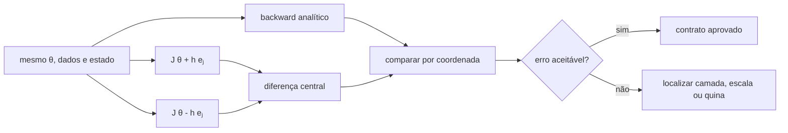
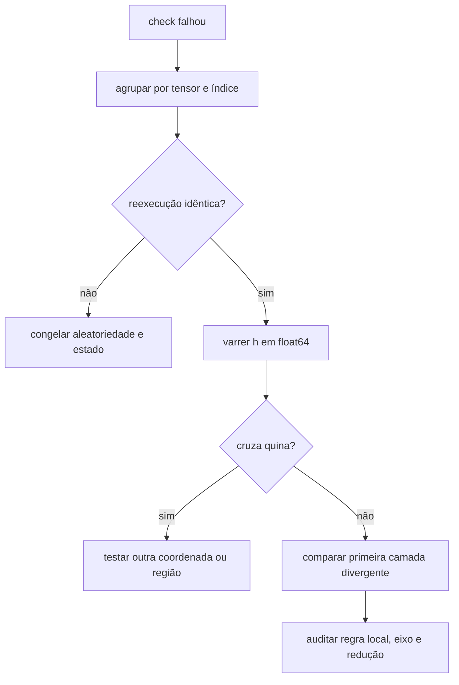

<!-- mirandastech-aula-v2 -->

# Aula 14 — Gradient checking: diferenças centrais e erro relativo

> **Trilha:** M5 — Redes neurais do zero  
> **Objetivo central:** verificar gradientes analíticos de uma rede com aproximações numéricas, sem confundir erro de implementação com limitações da aritmética finita ou pontos não diferenciáveis.

[](https://colab.research.google.com/github/joaopaulomirandamatias/ai-lab/blob/main/04-deep-learning/m5-redes-neurais-do-zero/notebooks/14-gradient-checking-laboratorio.ipynb)

Na Aula 13, implementamos o backward vetorizado de uma MLP e conferimos algumas coordenadas. Agora transformaremos aquela verificação em um protocolo confiável. O problema parece simples: comparar a derivada escrita à mão com uma inclinação calculada perturbando o parâmetro. Na prática, uma escolha ruim do passo, uma loss estocástica, uma troca de estado ou uma quina da ReLU pode acusar um erro que não existe — ou esconder um erro real.

Gradient checking é um **teste de desenvolvimento**. Ele é lento demais para treinar uma rede, mas excelente para validar uma implementação pequena antes que o erro seja multiplicado por milhares de etapas.

## 1. Problema motivador

Uma MLP retorna loss decrescente, porém aprende mais devagar do que o esperado. Shapes, sinais e valores são finitos. O erro pode estar em qualquer ponto:

- uma transposta incorreta;
- uma média aplicada duas vezes;
- o backward do bias reduzido no eixo errado;
- a derivada de uma ativação omitida;
- um termo de regularização presente no forward e ausente no backward.

Observar apenas a curva de treino não localiza a causa. Gradient checking cria um oráculo independente: calcula a inclinação da **função realmente executada** e a compara ao gradiente analítico.

## 2. Objetivos de aprendizagem

Ao final, você deverá ser capaz de:

- derivar diferenças para frente e centrais com expansão de Taylor;
- explicar o compromisso entre erro de truncamento e arredondamento;
- escolher e varrer um passo (h) compatível com escala e precisão;
- comparar gradientes com erro absoluto e relativo simétrico;
- verificar todas as coordenadas, uma amostra ou direções aleatórias;
- empacotar parâmetros sem perder shapes e ordem;
- tornar o teste determinístico diante de dropout e estado mutável;
- reconhecer falsos alarmes em ReLU, `max` e outras quinas;
- injetar um defeito e localizar a primeira camada divergente;
- definir critérios de aprovação proporcionais à profundidade e à escala.

## 3. Pré-requisitos

- regra da cadeia e backpropagation;
- MLP vetorizada com loss escalar;
- arrays NumPy, cópias, shapes e índices;
- noções de série de Taylor e ponto flutuante.

## 4. Vocabulário

| Termo | Significado |
|---|---|
| gradiente analítico | resultado do backward derivado pela regra da cadeia |
| gradiente numérico | inclinação aproximada por avaliações perturbadas da loss |
| coordenada | um elemento escalar de um tensor de parâmetros |
| passo (h) | tamanho da perturbação positiva e negativa |
| truncamento | erro por omitir termos da série de Taylor |
| arredondamento | erro imposto pela representação e pelas operações em ponto flutuante |
| erro relativo | diferença normalizada pela magnitude dos valores comparados |
| teste direcional | comparação entre (d^\top g) e a derivada ao longo de (d) |
| quina | ponto em que a derivada clássica não existe |
| máscara congelada | mesma realização aleatória reutilizada nas avaliações perturbadas |

## 5. Duas formas de calcular o gradiente

Se (J(\theta)) é uma loss escalar e (\theta_j) uma coordenada, o backward produz

\[
g_j^{ana}=\frac{\partial J}{\partial\theta_j}.
\]

O gradiente numérico não conhece o backward. Ele pergunta: quanto (J) muda quando somente (\theta_j) muda um pouco?



Os dois caminhos devem compartilhar exatamente os mesmos parâmetros-base, dados, redução, regularização e estado. A independência está no método de diferenciação, não na função avaliada.

## 6. Diferença para frente

Pela expansão de Taylor:

\[
J(\theta_j+h)=J(\theta_j)+hJ'(\theta_j)
+\frac{h^2}{2}J''(\xi),
\]

para algum (\xi) próximo de (\theta_j). Rearranjando:

\[
g_j^{frente}=\frac{J(\theta_j+h)-J(\theta_j)}{h}
=J'(\theta_j)+O(h).
\]

O erro de truncamento é de primeira ordem: reduzir (h) por 10 tende, antes do arredondamento dominar, a reduzir o erro por aproximadamente 10.

Essa fórmula precisa da loss-base e de uma avaliação por coordenada. É útil para explicar a ideia, mas não é a melhor escolha padrão.

## 7. Diferença central

Expanda nos dois sentidos:

\[
J(\theta_j+h)=J(\theta_j)+hJ'(\theta_j)
+\frac{h^2}{2}J''(\theta_j)+\frac{h^3}{6}J'''(\xi_+),
\]

\[
J(\theta_j-h)=J(\theta_j)-hJ'(\theta_j)
+\frac{h^2}{2}J''(\theta_j)-\frac{h^3}{6}J'''(\xi_-).
\]

Subtrair cancela os termos pares. Assim:

\[
g_j^{central}=\frac{J(\theta_j+h)-J(\theta_j-h)}{2h}
=J'(\theta_j)+O(h^2).
\]

A diferença central exige duas avaliações por coordenada, mas seu erro de truncamento é de segunda ordem. Por isso é a escolha padrão para gradient checking em `float64`.

| Método | Avaliações adicionais | Truncamento | Uso recomendado |
|---|---:|---:|---|
| para frente | 1 por coordenada, além da base | (O(h)) | introdução ou orçamento muito restrito |
| central | 2 por coordenada | (O(h^2)) | padrão de verificação |
| direcional central | 2 por direção | (O(h^2)) | triagem rápida em muitos parâmetros |

## 8. Por que (h\) não deve ser “o menor possível”

Dois erros competem:

1. **truncamento:** diminui quando (h) diminui;
2. **arredondamento e cancelamento:** cresce quando subtraímos losses quase iguais e dividimos por um (h) minúsculo.

Uma aproximação útil para a diferença central é:

\[
E(h)\approx C_t h^2+C_r\frac{u}{h},
\]

em que (u) é a precisão de máquina e (C_t,C_r) dependem da função e das escalas. O mínimo ideal é proporcional a (u^{1/3}), mas não existe um (h) universal porque os coeficientes e a escala de (\theta_j) variam.

Para `float64`, (h=10^{-5}) é um ponto inicial frequente em redes pequenas e suaves. A prática correta é **varrer** valores, por exemplo de (10^{-2}) a (10^{-10}), e procurar uma faixa estável. Em `float32`, o arredondamento domina muito antes; faça o check em `float64` sempre que possível.

Uma perturbação relativa também ajuda quando os parâmetros têm escalas distintas:

\[
h_j=h_0\max(1,|\theta_j|).
\]

Ela evita que o mesmo passo seja enorme para um parâmetro de (10^{-8}) e irrelevante para outro de (10^5).

## 9. Erro absoluto não basta

O erro absoluto é:

\[
E_{abs}=|g_j^{ana}-g_j^{num}|.
\]

Um erro (10^{-6}) é pequeno se o gradiente vale 100, mas grande se ele vale (10^{-7}). Usaremos o erro relativo simétrico:

\[
E_{rel}=\frac{|g_j^{ana}-g_j^{num}|}
{\max(\tau,|g_j^{ana}|,|g_j^{num}|)},
\]

em que (\tau) é um piso, como (10^{-12}), para impedir divisão por zero.

Quando ambos os gradientes são próximos de zero, reporte também o erro absoluto. Uma normalização relativa pode amplificar ruído irrelevante. O relatório deve guardar:

- nome do tensor e índice;
- valores analítico e numérico;
- erros absoluto e relativo;
- (h_j) usado;
- maior erro por tensor e no modelo.

Limiares são heurísticas, não teoremas. Em uma rede pequena, suave e `float64`, erros relativos abaixo de (10^{-7}) são uma boa meta. Redes profundas acumulam mais erro; uma divergência de (10^{-2}) numa operação simples merece investigação imediata.

## 10. Exemplo resolvido

Considere (J(w)=(w-3)^2), logo (J'(w)=2(w-3)). Em (w=1{,}5), o gradiente analítico é (-3).

Com (h=10^{-2}):

\[
g^{central}=\frac{(1{,}51-3)^2-(1{,}49-3)^2}{0{,}02}
=-3.
\]

Para esta função quadrática, a diferença central é exata salvo arredondamento, pois os termos de ordem superior a 2 são zero. Já a diferença para frente é:

\[
g^{frente}=\frac{(1{,}51-3)^2-(1{,}5-3)^2}{0{,}01}
=-2{,}99.
\]

O erro (0{,}01) corresponde ao termo (O(h)). Em uma rede, a função é mais complexa; a varredura de (h) mostrará uma região em que a diferença central melhora e, depois, piora por cancelamento.

## 11. Empacotar sem perder a estrutura

Uma MLP possui matrizes e vetores. Para percorrer coordenadas, podemos empacotá-los em um vetor (\vartheta\), mas precisamos registrar:

- ordem fixa dos nomes;
- shape de cada tensor;
- intervalo de índices no vetor;
- dtype;
- cópia independente para cada perturbação.

O desempacotamento deve ser a operação inversa. Um teste obrigatório é:

\[
\operatorname{pack}(\operatorname{unpack}(\vartheta))=\vartheta.
\]

Não perturbe uma *view* que compartilha memória com o parâmetro-base. Um único elemento alterado acidentalmente em duas avaliações invalida a aproximação.

## 12. Protocolo coordenado

Para cada coordenada selecionada (j):

1. copie (\vartheta) para `plus` e `minus`;
2. calcule (h_j=h_0\max(1,|\vartheta_j|));
3. altere somente `plus[j] += h_j` e `minus[j] -= h_j`;
4. execute o forward completo duas vezes;
5. calcule a diferença central;
6. compare com o elemento correspondente do gradiente empacotado;
7. restaure ou descarte as cópias;
8. registre o diagnóstico.

Complexidade: para (p) coordenadas, o check completo custa (2p) forwards, além de um forward/backward analítico. Use-o em redes e lotes pequenos.

## 13. Checagem total, amostrada e direcional

| Estratégia | Custo | O que localiza | Limitação |
|---|---:|---|---|
| todas as coordenadas | (2p) forwards | tensor e índice exatos | inviável para (p) grande |
| amostra estratificada | (2s) forwards | índices sorteados em cada tensor | pode não atingir o defeito |
| direções aleatórias | 2 forwards por direção | inconsistência global | não localiza a coordenada |

No teste direcional, escolha (d\) unitário:

\[
g_{dir}^{ana}=d^\top\nabla J(\vartheta),
\]

\[
g_{dir}^{num}=\frac{J(\vartheta+hd)-J(\vartheta-hd)}{2h}.
\]

Várias direções aleatórias tornam improvável que um erro grande fique sempre ortogonal aos vetores testados. Um fluxo eficiente é: teste direcional para triagem; se falhar, check coordenado por tensor.

## 14. Determinismo é parte do contrato

Gradient checking assume que (J(\vartheta)) é a mesma função em todas as chamadas. Antes de comparar:

- use o mesmo lote e a mesma redução;
- desligue data augmentation aleatória;
- congele a máscara de dropout ou use modo de avaliação;
- congele estatísticas de camadas com estado;
- não atualize parâmetros ou buffers;
- mantenha o mesmo termo de regularização;
- use a mesma seed, quando houver aleatoriedade inevitável;
- verifique que duas avaliações idênticas retornam a mesma loss.

Reinicializar a seed dentro do forward pode mascarar um projeto estocástico inadequado. Para o teste, prefira passar explicitamente a máscara ou o estado.

## 15. Quinas e falsos alarmes

ReLU, `abs`, `max` e hinge loss não são diferenciáveis em certos pontos. Para (f(x)=\max(0,x)), em (x=0):

- uma implementação pode definir o gradiente analítico como 0;
- a diferença central cruza a quina e retorna (1/2).

Nenhum dos dois representa uma derivada clássica, pois ela não existe. Isso não prova um bug.

Como agir:

1. evite inicializar exatamente em quinas durante o teste;
2. reduza (h) e verifique se (f(x-h)) e (f(x+h)) permanecem na mesma região ativa;
3. teste operações suaves isoladamente;
4. registre a convenção de subgradiente;
5. trate coordenadas que cruzam quinas separadamente.

Não aumente o limiar global só para silenciar uma quina: isso pode esconder defeitos em coordenadas suaves.

## 16. Localização por camada

Um check que retorna apenas “falhou” desperdiça informação. Agrupe o relatório por tensor:

| Resultado | Hipótese principal |
|---|---|
| (W_2,b_2) passam; (W_1,b_1) falham | backward da ativação ou propagação para a camada oculta |
| pesos passam; biases falham | redução do broadcasting |
| tudo difere por fator (m) | soma/média inconsistente |
| regularização falha apenas nos pesos | termo (\lambda W) ausente ou escalado errado |
| falha muda a cada execução | aleatoriedade ou estado mutável |
| poucos índices falham perto de zero | possível quina |



Injetar defeitos conhecidos é um teste do próprio verificador. Se remover a derivada da `tanh` não fizer o check falhar em (W_1,b_1), o oráculo ou a cobertura estão inadequados.

## 17. Implementação mínima

```python
def central_difference(loss_fn, theta, index, base_step=1e-5):
    h = base_step * max(1.0, abs(theta[index]))
    plus = theta.copy()
    minus = theta.copy()
    plus[index] += h
    minus[index] -= h
    numeric = (loss_fn(plus) - loss_fn(minus)) / (2.0 * h)
    return numeric, h


def relative_error(analytic, numeric, floor=1e-12):
    scale = max(floor, abs(analytic), abs(numeric))
    return abs(analytic - numeric) / scale
```

`loss_fn` deve desempacotar `theta` e executar o forward completo. Nunca use o cache do ponto-base para (\vartheta+h e_j) ou (\vartheta-h e_j).

## 18. Armadilhas comuns

1. **Usar `float32`:** o ruído de arredondamento domina passos pequenos.
2. **Escolher um único (h):** uma coincidência pode mascarar ou criar falha.
3. **Comparar só erro absoluto:** gradientes pequenos e grandes exigem escalas distintas.
4. **Reutilizar cache:** a loss perturbada precisa de um novo forward.
5. **Perturbar parâmetros no lugar:** o ponto-base deixa de ser constante.
6. **Esquecer regularização:** numérico e analítico derivam objetivos diferentes.
7. **Sortear novo dropout:** cada avaliação mede outra função.
8. **Cruzar uma quina:** diferença central mistura regiões com derivadas distintas.
9. **Checar apenas um tensor:** o defeito pode estar fora da amostra.
10. **Usar gradient checking no treino:** custo cresce linearmente com parâmetros.
11. **Aceitar limiar sem contexto:** profundidade, dtype e condicionamento importam.
12. **Não testar o verificador:** um oráculo defeituoso pode aprovar tudo.

## 19. Checklist prático

- [ ] A loss retorna um único escalar?
- [ ] O forward e o backward usam a mesma redução?
- [ ] Parâmetros e avaliações estão em `float64`?
- [ ] A função é determinística para entradas idênticas?
- [ ] O empacotamento preserva nomes, ordem e shapes?
- [ ] Cada perturbação altera somente uma coordenada?
- [ ] O forward é refeito após cada perturbação?
- [ ] Uso diferença central e passo relativo à escala?
- [ ] Varri (h) e identifiquei uma faixa estável?
- [ ] Reporto erros absoluto e relativo?
- [ ] Agrupo falhas por tensor e índice?
- [ ] Verifico se a perturbação cruzou uma quina?
- [ ] Executo direções aleatórias ou amostra estratificada quando (p) é grande?
- [ ] Injetei ao menos um defeito que o teste precisa detectar?
- [ ] Desativei o check no caminho normal de treinamento?

## 20. Laboratório reproduzível

O notebook usa a MLP de duas camadas da Aula 13 e implementa:

- empacotamento reversível de parâmetros;
- check exaustivo de todas as coordenadas;
- varredura de (h) em `float64` e `float32`;
- comparação entre diferença para frente e central;
- amostragem estratificada por tensor;
- cinco testes direcionais;
- localização de um defeito injetado no backward da `tanh`;
- contraprova em uma quina da ReLU;
- máscara estocástica variável versus congelada;
- auditoria final com asserts e arquivo publicado sem outputs.

Dependências mínimas:

```text
Python >= 3.11
NumPy >= 1.26
Matplotlib >= 3.8
nbformat >= 5.9 (validação do arquivo)
```

Os dados são sintéticos, a seed é fixa e não há downloads, segredos ou frameworks de deep learning.

## 21. Resumo

- Gradient checking compara backward analítico com inclinações numéricas independentes.
- Diferenças centrais têm truncamento (O(h^2)) e custam dois forwards por coordenada.
- Reduzir (h) demais piora o resultado por arredondamento e cancelamento.
- `float64`, varredura de passos e erro relativo tornam o diagnóstico mais confiável.
- Check completo localiza; amostragem economiza; direções fazem triagem global.
- Aleatoriedade e estado devem ser congelados.
- Quinas podem produzir divergências legítimas entre subgradiente e secante.
- Relatórios por tensor revelam a primeira camada provavelmente defeituosa.
- O verificador também precisa ser testado com defeitos injetados.

## 22. Exercícios

### 1. Ordem do erro

Se o truncamento domina, o que acontece ao erro da diferença para frente e da central quando (h) é dividido por 10?

### 2. Erro relativo

Compare (g^{ana}=10^{-7}) e (g^{num}=2\times10^{-7}). O erro absoluto parece pequeno. Qual é o erro relativo usando (\max(|g^{ana}|,|g^{num}|))?

### 3. Custo

Quantos forwards adicionais exige um check central completo de 12.000 parâmetros?

### 4. Escala

Com (h_0=10^{-5}) e (\theta_j=300), qual passo relativo será usado?

### 5. Direcional

Por que uma única direção não localiza qual coordenada está errada?

### 6. ReLU

Calcule a diferença central da ReLU em zero. Compare com a convenção analítica (f'(0)=0).

### 7. Dropout

Por que apenas fixar uma seed no início do programa pode ser insuficiente?

### 8. Diagnóstico

Se (W_2,b_2) passam e (W_1,b_1) falham, qual operação deve ser investigada primeiro?

### 9. Projeto

Adicione regularização (\lambda\|W_1\|_F^2/2) ao forward. Qual termo deve entrar em (dW_1)?

## 23. Respostas comentadas

### 1.

A diferença para frente, (O(h)), tende a melhorar cerca de 10 vezes. A central, (O(h^2)), tende a melhorar cerca de 100 vezes. Isso vale somente antes do arredondamento dominar.

### 2.

\[
E_{rel}=\frac{10^{-7}}{2\times10^{-7}}=0{,}5.
\]

O erro absoluto é (10^{-7}), mas a discrepância representa metade da maior magnitude: é relevante.

### 3.

(2p=24.000) forwards adicionais, mais o forward/backward analítico. Isso explica por que modelos grandes exigem amostragem ou testes direcionais.

### 4.

\[
h_j=10^{-5}\max(1,300)=0{,}003.
\]

### 5.

Ela compara apenas uma projeção (d^\top g). Muitos vetores de erro distintos podem gerar a mesma projeção; falhar indica inconsistência, mas não identifica o índice.

### 6.

\[
\frac{\operatorname{ReLU}(h)-\operatorname{ReLU}(-h)}{2h}
=\frac{h-0}{2h}=\frac12.
\]

A divergência para 0 decorre da quina, não necessariamente de um bug.

### 7.

O gerador avança a cada chamada. As avaliações de (J(\theta+h)) e (J(\theta-h)) podem receber máscaras diferentes. Passe a mesma máscara explicitamente ou restaure um estado idêntico.

### 8.

O backward entre as camadas: derivada da ativação oculta e cálculo de (dA_1=G_2W_2^\top). A camada de saída provavelmente está coerente.

### 9.

Como

\[
\frac{\partial}{\partial W_1}\frac{\lambda}{2}\|W_1\|_F^2
=\lambda W_1,
\]

adicione (\lambda W_1) ao gradiente proveniente dos dados.

## 24. Conexões com IA e sistemas reais

Mesmo usando autograd, gradient checking continua útil para:

- funções customizadas e kernels acelerados;
- backward escrito manualmente;
- diferenciação implícita e operações científicas;
- perdas com redução, máscara ou pesos incomuns;
- integração entre componentes implementados em linguagens diferentes;
- testes de regressão após otimizações de desempenho.

Ele verifica a coerência local entre uma função e seu gradiente. Não verifica se a loss representa o problema certo, se os dados têm leakage, se a arquitetura generaliza ou se o sistema é seguro.

## 25. Próxima aula

Na **Aula 15 — Inicialização de pesos**, usaremos gradientes já verificados para estudar outro problema: como evitar simetria e preservar a escala de ativações e gradientes com inicializações Xavier/Glorot e He/Kaiming.

## Referências

### Técnicas e institucionais

- STANFORD UNIVERSITY. [CS231n — Gradient Checks](https://cs231n.github.io/neural-networks-3/#gradcheck). Consultado em 9 set. 2026.
- STANFORD UNIVERSITY. [CS231n — Computing the Gradient](https://cs231n.github.io/optimization-1/). Consultado em 9 set. 2026.
- UNIVERSITY OF ILLINOIS URBANA-CHAMPAIGN. [Finite Difference Method](https://cs357.cs.illinois.edu/textbook/assets/slides/19-Finite-Difference.pdf). Material institucional consultado em 9 set. 2026.
- BROWN UNIVERSITY. [Numerical differentiation: finite differences](https://www.dam.brown.edu/people/alcyew/handouts/numdiff.pdf). Material institucional consultado em 9 set. 2026.
- BAYDIN, A. G. et al. [Automatic Differentiation in Machine Learning: a Survey](https://jmlr.org/papers/v18/17-468.html). *Journal of Machine Learning Research*, v. 18, 2018.

### Documentação do laboratório

- NUMPY DEVELOPERS. [Floating-point error handling](https://numpy.org/doc/stable/reference/routines.err.html). Documentação estável consultada em 9 set. 2026.
- NUMPY DEVELOPERS. [`numpy.finfo`](https://numpy.org/doc/stable/reference/generated/numpy.finfo.html). Documentação estável consultada em 9 set. 2026.

