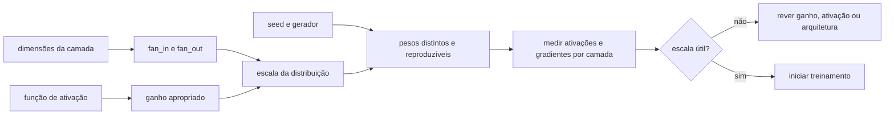
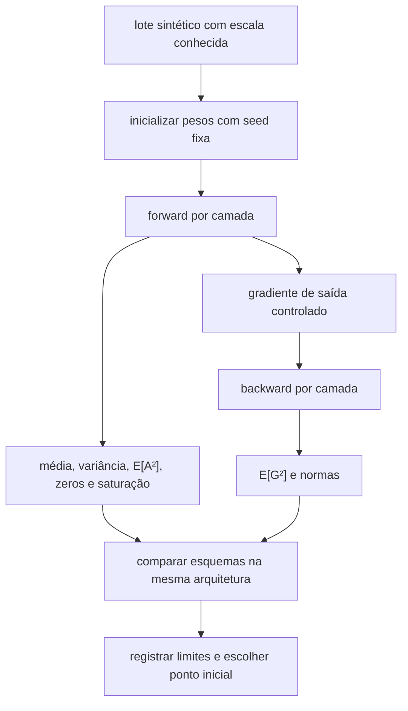

<!-- mirandastech-aula-v2 -->

# Aula 15 — Inicialização de pesos: simetria, Xavier/Glorot e He/Kaiming

> **Trilha:** M5 — Redes neurais do zero  
> **Objetivo central:** inicializar uma MLP de modo que neurônios possam se especializar e que sinais mantenham escala útil ao atravessar as camadas.  
> **Implementação:** NumPy puro, sem autograd.

[](https://colab.research.google.com/github/joaopaulomirandamatias/ai-lab/blob/main/04-deep-learning/m5-redes-neurais-do-zero/notebooks/15-inicializacao-pesos-laboratorio.ipynb)

## 1. O problema: uma rede correta que não aprende

Nas aulas anteriores, construímos o forward, derivamos o backward e auditamos os gradientes. Ainda assim, uma MLP pode começar o treino em uma situação ruim. Considere uma rede profunda para classificar falhas em sensores:

- pesos todos iguais fazem neurônios ocultos receberem e produzirem a mesma informação;
- pesos muito pequenos fazem o sinal encolher a cada camada;
- pesos muito grandes empurram `tanh` e sigmoid para regiões saturadas ou fazem ativações ReLU crescerem sem controle;
- uma escala adequada para `tanh` pode ser inadequada para ReLU.

Inicialização não é um detalhe cosmético. Ela define o ponto inicial da otimização e a escala dos sinais que chegam ao forward e ao backward. O objetivo não é tornar cada camada perfeitamente estável — as hipóteses usadas são aproximações —, mas evitar um começo previsivelmente degenerado.

## 2. Objetivos de aprendizagem

Ao concluir a aula, você será capaz de:

1. explicar por que pesos idênticos preservam a simetria entre neurônios;
2. distinguir a inicialização de pesos da inicialização de biases;
3. derivar a relação entre `fan_in`, variância dos pesos e segundo momento das ativações;
4. calcular as escalas Xavier/Glorot e He/Kaiming nas versões normal e uniforme;
5. escolher a inicialização a partir da ativação, e não por hábito;
6. medir ativações e gradientes por camada em uma rede não treinada;
7. reconhecer limites das hipóteses de independência, média zero e largura grande;
8. registrar seed, distribuição, ganho, `fan_in`, `fan_out` e dtype como parte da proveniência.

## 3. Pré-requisitos

- forward vetorizado e convenção `X @ W + b`;
- derivadas de `tanh`, ReLU e Leaky ReLU;
- backward da camada afim e regra da cadeia;
- variância, esperança e independência aproximada;
- gradient checking da Aula 14.

## 4. Vocabulário

| Termo | Significado nesta aula |
|---|---|
| `fan_in` | número de entradas que alimentam um neurônio |
| `fan_out` | número de saídas produzidas pela camada |
| ganho | fator que ajusta a escala à não linearidade |
| quebra de simetria | fazer neurônios começarem com parâmetros diferentes |
| propagação de variância | acompanhar como a escala estatística muda por camada |
| segundo momento | $\mathbb{E}[A^2]$; inclui variância e média ao quadrado |
| saturação | região em que a derivada de uma ativação fica próxima de zero |
| inicialização independente | amostragem distinta para cada peso, sob uma distribuição declarada |

## 5. Dois requisitos diferentes

Uma boa inicialização atende a dois problemas que não devem ser confundidos:

1. **quebrar simetria:** neurônios da mesma camada precisam começar com pesos diferentes para aprender características diferentes;
2. **controlar escala:** ativações e gradientes não devem desaparecer nem explodir já no primeiro forward/backward.

Aleatoriedade resolve o primeiro requisito, mas não garante o segundo. Sortear cada peso de $\mathcal{N}(0,1)$ quebra a simetria e, mesmo assim, pode tornar uma rede profunda numericamente inútil.



## 6. Por que pesos iguais não quebram simetria

Considere dois neurônios ocultos $j$ e $k$ com os mesmos pesos de entrada, mesmo bias e mesmos pesos de saída. Para toda entrada $x$:

\[
z_j=x^\top w_j+b_j=x^\top w_k+b_k=z_k,
\]

logo $a_j=\phi(z_j)=\phi(z_k)=a_k$. Como os dois também influenciam a camada seguinte da mesma maneira, a regra da cadeia produz gradientes iguais:

\[
\frac{\partial L}{\partial w_j}
=
\frac{\partial L}{\partial w_k}.
\]

Uma atualização determinística com a mesma taxa $\eta$ preserva a igualdade:

\[
w_j' = w_j-\eta\frac{\partial L}{\partial w_j}
=w_k-\eta\frac{\partial L}{\partial w_k}=w_k'.
\]

Os neurônios continuam clones. A largura nominal da camada não se transforma em representações diferentes.

### Pesos zero e biases zero não são equivalentes

Inicializar **todos os pesos** de uma MLP com zero é um caso extremo de simetria. Em uma rede com saída também zerada, o gradiente que retorna à primeira camada pode ser zero; a rede aprende, no máximo, o bias da saída no início.

Biases ocultos, por outro lado, podem começar em zero quando os pesos correspondentes são amostrados independentemente. Os pesos diferentes já quebram a simetria. Isso não significa que bias zero seja obrigatório: algumas arquiteturas ou ativações podem motivar outra escolha, que deve ser documentada.

## 7. Derivando a escala da camada afim

Para um neurônio sem bias no instante inicial:

\[
z_j=\sum_{i=1}^{n_{in}}w_{ij}x_i.
\]

Suponha, como aproximação, que $x_i$ e $w_{ij}$ sejam independentes, tenham média zero e que os termos da soma não tenham covariância. Então:

\[
\operatorname{Var}(z_j)
=\sum_{i=1}^{n_{in}}
\operatorname{Var}(w_{ij}x_i)
=n_{in}\operatorname{Var}(W)\operatorname{Var}(X).
\]

Aqui:

- $n_{in}=\text{fan\_in}$;
- $W$ representa um peso da camada;
- $X$ representa uma entrada típica;
- $z_j$ é o pré-logit do neurônio $j$.

Para preservar aproximadamente a variância antes da ativação, desejaríamos:

\[
\operatorname{Var}(W)\approx\frac{1}{\text{fan\_in}}.
\]

No backward ocorre uma soma relacionada ao número de destinos. Preservar a escala do gradiente sugere uma condição envolvendo `fan_out`. Quando entrada e saída diferem, não podemos satisfazer exatamente as duas condições com uma única variância escalar. Xavier/Glorot usa um compromisso entre elas.

> **Hipóteses, não garantias:** depois de algumas camadas, ativações podem ter média diferente de zero, pesos e sinais deixam de ser independentes e correlações aparecem. A derivação oferece um bom ponto inicial, que precisa ser medido.

## 8. Variância versus segundo momento

Para qualquer variável aleatória $A$:

\[
\mathbb{E}[A^2]=\operatorname{Var}(A)+\mathbb{E}[A]^2.
\]

Com `tanh` e entradas aproximadamente simétricas, a média tende a ficar próxima de zero; variância e segundo momento ficam parecidos. Após ReLU, as ativações são não negativas e sua média não é zero. Por isso, acompanhar apenas `np.var(A)` pode esconder parte da energia do sinal. No laboratório mediremos ambos, com ênfase em $\mathbb{E}[A^2]$ para ReLU.

## 9. Xavier/Glorot

Glorot e Bengio propuseram equilibrar os requisitos de forward e backward por:

\[
\operatorname{Var}(W)=\frac{2}{\text{fan\_in}+\text{fan\_out}}.
\]

Para uma distribuição normal de média zero:

\[
W_{ij}\sim\mathcal{N}\left(
0,\frac{2}{\text{fan\_in}+\text{fan\_out}}
\right),
\quad
\sigma=\sqrt{\frac{2}{\text{fan\_in}+\text{fan\_out}}}.
\]

Para uma uniforme simétrica $U(-a,a)$, sabemos que $\operatorname{Var}(W)=a^2/3$. Igualando as variâncias:

\[
a=\sqrt{\frac{6}{\text{fan\_in}+\text{fan\_out}}}.
\]

Xavier é uma escolha inicial natural para ativações aproximadamente lineares ao redor de zero, especialmente `tanh`. Não elimina a saturação da sigmoid; o trabalho original destaca que a média positiva da sigmoid logística pode empurrar camadas superiores para regiões saturadas.

## 10. He/Kaiming para retificadores

Se $Z$ tem distribuição simétrica em torno de zero, a ReLU zera aproximadamente metade dos valores. Para o segundo momento:

\[
\mathbb{E}[\operatorname{ReLU}(Z)^2]
\approx\frac12\mathbb{E}[Z^2].
\]

Para compensar essa redução, He e colaboradores derivaram:

\[
\operatorname{Var}(W)=\frac{2}{\text{fan\_in}},
\quad
\sigma=\sqrt{\frac{2}{\text{fan\_in}}}.
\]

Na versão uniforme simétrica equivalente:

\[
a=\sqrt{3\operatorname{Var}(W)}
=\sqrt{\frac{6}{\text{fan\_in}}}.
\]

Para Leaky ReLU com inclinação negativa $\alpha$, uma aproximação do ganho é:

\[
g=\sqrt{\frac{2}{1+\alpha^2}},
\qquad
\sigma=\frac{g}{\sqrt{\text{fan\_in}}}.
\]

Quando $\alpha=0$, recuperamos ReLU e $g=\sqrt{2}$. O ganho depende da função realmente usada no forward; configurar Leaky ReLU e inicializar como se fosse `tanh` quebra o contrato.

## 11. Exemplo resolvido

Uma camada densa recebe 128 atributos e produz 64 ativações.

### Xavier normal

\[
\sigma_X=\sqrt{\frac{2}{128+64}}
=\sqrt{\frac{1}{96}}
\approx0{,}102062.
\]

### Xavier uniforme

\[
a_X=\sqrt{\frac{6}{192}}
\approx0{,}176777,
\]

portanto $W_{ij}\sim U(-0{,}176777,0{,}176777)$.

### He normal para ReLU

\[
\sigma_H=\sqrt{\frac{2}{128}}=0{,}125.
\]

### He uniforme

\[
a_H=\sqrt{\frac{6}{128}}
\approx0{,}216506.
\]

A distribuição normal e a uniforme não geram os mesmos pesos, mas as versões acima têm a mesma variância-alvo dentro de cada família. Com amostras finitas, a variância observada oscila; não a force a ser exatamente igual à teórica normalizando a matriz depois do sorteio, pois isso altera a distribuição e cria dependência entre elementos.

## 12. Comparação prática

| Esquema | Variância-alvo | Uso inicial típico | Risco principal |
|---|---:|---|---|
| todos zero | $0$ | nenhum para pesos ocultos | simetria e gradiente bloqueado |
| normal com $\sigma=0{,}01$ | $10^{-4}$ | rede rasa, somente após medir | sinal pode desaparecer |
| normal com $\sigma=1$ | $1$ | raramente apropriado | explosão ou saturação |
| Xavier/Glorot | $2/(fan_{in}+fan_{out})$ | `tanh`, ativações próximas de lineares | pode encolher ReLU profunda |
| He/Kaiming | $2/fan_{in}$ | ReLU e variantes com ganho ajustado | não garante estabilidade em qualquer arquitetura |

Uma regra curta — “Xavier para `tanh`, He para ReLU” — é útil para começar, mas não substitui a auditoria por camada.

## 13. `fan_in` e `fan_out` dependem da operação

Na convenção desta trilha, uma matriz densa tem shape `(fan_in, fan_out)` e o forward é:

```python
Z = X @ W + b
```

Logo, para `W.shape == (128, 64)`, `fan_in=128` e `fan_out=64`. Bibliotecas podem armazenar matrizes transpostas e inferir os fãs conforme sua própria convenção. Copiar uma fórmula sem conferir o shape é um erro silencioso.

Em convoluções, o fã inclui canais e área do kernel, além de detalhes de grupos. Esse caso será formalizado na trilha M7; não reutilize cegamente apenas o número de canais.

## 14. Implementação explícita

```python
import numpy as np

def init_dense(rng, fan_in, fan_out, scheme, alpha=0.0):
    if fan_in <= 0 or fan_out <= 0:
        raise ValueError("fan_in e fan_out devem ser positivos")

    if scheme == "xavier_normal":
        std = np.sqrt(2.0 / (fan_in + fan_out))
        return rng.normal(0.0, std, size=(fan_in, fan_out))

    if scheme == "he_normal":
        gain = np.sqrt(2.0 / (1.0 + alpha**2))
        std = gain / np.sqrt(fan_in)
        return rng.normal(0.0, std, size=(fan_in, fan_out))

    raise ValueError(f"esquema desconhecido: {scheme}")
```

Passe o gerador explicitamente. `np.random.seed(...)` global torna dependências entre células ou componentes mais difíceis de auditar. Um `Generator` local deixa claro quem consome aleatoriedade.

## 15. O protocolo de auditoria antes do treino

Faça um forward e um backward sintéticos antes de gastar épocas de treinamento:

1. fixe a seed e gere um lote com escala conhecida;
2. construa a rede com a mesma largura, profundidade, ativação e dtype do experimento;
3. registre média, variância, segundo momento, mínimo, máximo e fração de zeros por camada;
4. injete um gradiente de saída controlado e registre normas ou segundos momentos no backward;
5. repita com mais de uma seed para separar padrão de acaso;
6. compare inicializações sob exatamente as mesmas entradas;
7. guarde configuração e resultados como artefato.



Não existe um intervalo universal que todas as camadas devam obedecer. Procure tendências geométricas: queda ou crescimento sistemático ao longo da profundidade, saturação crescente e diferenças de muitas ordens de grandeza.

## 16. Biases, camada de saída e dados

### Biases

Zero é um padrão razoável para biases densos quando pesos são independentes. Bias positivo pequeno em ReLU às vezes é sugerido para reduzir unidades inicialmente inativas, mas pode deslocar a média e não é uma solução universal.

### Camada de saída

A ativação e a loss da saída importam. Em classificação com softmax, logits iniciais gigantes produzem probabilidades excessivamente confiantes; pesos muito pequenos podem ser deliberados na cabeça final, desde que o gradiente continue útil. Documente quando a cabeça usa uma regra diferente do corpo.

### Escala dos dados

Xavier e He partem de hipóteses sobre a escala das entradas. Atributos em unidades muito diferentes invalidam o diagnóstico. Padronizar entradas com estatísticas do conjunto de treino continua necessário; inicialização não corrige preprocessing inadequado nem data leakage.

## 17. Armadilhas e limites

1. **Inicializar todos os pesos com zero:** preserva simetria.
2. **Usar aleatoriedade sem escala:** quebra simetria, mas pode explodir o sinal.
3. **Trocar `fan_in` por `fan_out`:** altera a variância, sobretudo em gargalos.
4. **Ignorar a ativação:** ReLU descarta metade do eixo; `tanh` satura.
5. **Medir só variância após ReLU:** a média positiva também compõe o segundo momento.
6. **Normalizar a amostra de pesos após sorteá-la:** muda a lei amostral esperada.
7. **Usar a mesma matriz em camadas distintas:** não é independência reprodutível; é compartilhamento de parâmetros.
8. **Confundir seed fixa com pesos iguais:** a seed reproduz a sequência; chamadas sucessivas ainda produzem amostras diferentes.
9. **Acreditar que a inicialização evita todo vanishing/exploding:** correlações, profundidade, arquitetura e treino quebram as hipóteses.
10. **“Consertar” tudo com normalização:** normalização tem estado, custo e efeitos próprios; será estudada na Aula 22.
11. **Omitir dtype:** `float32` e `float64` têm precisão e custo diferentes.
12. **Escolher pela loss final após muitas tentativas no teste:** isso transforma a inicialização em hiperparâmetro contaminado.

Inicialização também não torna um modelo causal, justo, seguro ou bem calibrado. Ela resolve um problema numérico e de parametrização no início da otimização.

## 18. Checklist prático

- [ ] Cada matriz tem shape e convenção documentados?
- [ ] `fan_in` e `fan_out` foram calculados a partir da operação real?
- [ ] Pesos de neurônios distintos são amostras distintas?
- [ ] A distribuição tem média próxima de zero?
- [ ] A escala é coerente com a ativação?
- [ ] Para Leaky ReLU, o ganho usa o mesmo $\alpha$ do forward?
- [ ] Biases e cabeça de saída têm políticas explícitas?
- [ ] Entradas usam escala compatível, sem estatísticas do teste?
- [ ] Seed, gerador, dtype e distribuição foram registrados?
- [ ] Forward registra variância e segundo momento por camada?
- [ ] Backward registra normas ou segundos momentos por camada?
- [ ] A comparação mantém arquitetura e entradas constantes?
- [ ] Mais de uma seed confirma a tendência?
- [ ] O teste externo não foi usado para escolher a inicialização?

## 19. Laboratório reproduzível

O notebook desta aula usa somente NumPy e Matplotlib para:

- conferir empiricamente as variâncias-alvo de Xavier e He, normais e uniformes;
- demonstrar que inicialização idêntica mantém neurônios clones após uma atualização;
- mostrar que uma seed fixa reproduz pesos sem torná-los iguais;
- propagar um lote por 20 camadas `tanh` e ReLU;
- medir média, variância, segundo momento, zeros e saturação;
- comparar pesos pequenos, grandes, Xavier e He;
- propagar um gradiente sintético no sentido inverso;
- validar o ganho de Leaky ReLU;
- repetir o diagnóstico para várias seeds;
- executar contratos automáticos e publicar o notebook sem outputs.

Dependências mínimas:

```text
Python >= 3.11
NumPy >= 1.26
Matplotlib >= 3.8
nbformat >= 5.9 (validação do arquivo)
```

Os dados são sintéticos e não há downloads, credenciais, frameworks de deep learning ou autograd.

## 20. Resumo

- Pesos distintos quebram a simetria; aleatoriedade sem escala não basta.
- Para uma camada afim, $\operatorname{Var}(Z)\approx fan_{in}\operatorname{Var}(W)\operatorname{Var}(X)$ sob hipóteses simplificadoras.
- Xavier usa $2/(fan_{in}+fan_{out})$ e equilibra forward/backward, sendo um ponto inicial comum para `tanh`.
- He usa $2/fan_{in}$ para compensar o corte da ReLU no segundo momento.
- Leaky ReLU ajusta o ganho por $\sqrt{2/(1+\alpha^2)}$.
- A normal e a uniforme podem compartilhar a mesma variância-alvo.
- Bias zero não recria a simetria quando os pesos já são distintos.
- Para ReLU, segundo momento é mais informativo do que variância isolada.
- Inicialização é uma hipótese mensurável, não uma garantia de estabilidade ou sucesso.

## 21. Exercícios

### 1. Simetria

Dois neurônios têm pesos de entrada e saída idênticos. Por que dados diferentes no lote não bastam para fazê-los se especializar?

### 2. Xavier normal

Calcule o desvio-padrão Xavier para `fan_in=256` e `fan_out=128`.

### 3. Xavier uniforme

Qual é o limite $a$ da uniforme simétrica para a camada do exercício anterior?

### 4. He normal

Calcule o desvio-padrão He para uma camada ReLU com `fan_in=256`.

### 5. Leaky ReLU

Qual ganho aproximado corresponde a $\alpha=0{,}1$?

### 6. Shape

Na convenção `X @ W`, `X.shape=(32,100)` e `W.shape=(100,40)`. Quais são `fan_in`, `fan_out` e o shape de `Z`?

### 7. Segundo momento

Uma ativação tem média 0,5 e variância 0,75. Calcule $\mathbb{E}[A^2]$.

### 8. Diagnóstico

Em uma MLP ReLU de 20 camadas, $\mathbb{E}[A^2]$ cai aproximadamente pela metade a cada camada com Xavier. Qual hipótese você testaria primeiro?

### 9. Proveniência

Liste os campos mínimos para reproduzir a inicialização de uma matriz.

### 10. Limite conceitual

Por que preservar variância no primeiro forward não prova que o treinamento será estável?

## 22. Respostas comentadas

### 1.

Cada exemplo produz a mesma ativação nos dois neurônios porque eles calculam a mesma função. Com conexões de saída também iguais, os gradientes são iguais; uma atualização determinística preserva a igualdade. É preciso uma assimetria nos parâmetros ou no mecanismo de atualização.

### 2.

\[
\sigma_X=\sqrt{\frac{2}{256+128}}
=\sqrt{\frac{1}{192}}
\approx0{,}072169.
\]

### 3.

\[
a_X=\sqrt{\frac{6}{384}}=0{,}125.
\]

### 4.

\[
\sigma_H=\sqrt{\frac{2}{256}}
\approx0{,}088388.
\]

### 5.

\[
g=\sqrt{\frac{2}{1+0{,}1^2}}
=\sqrt{\frac{2}{1{,}01}}
\approx1{,}407195.
\]

### 6.

`fan_in=100`, `fan_out=40` e `Z.shape=(32,40)`. O bias, se presente, deve ser compatível com `(40,)` ou `(1,40)`.

### 7.

\[
\mathbb{E}[A^2]=0{,}75+0{,}5^2=1{,}0.
\]

### 8.

Testaria He/Kaiming mantendo entradas, arquitetura e seeds comparáveis. A escala Xavier não compensa explicitamente a perda de segundo momento causada pela ReLU.

### 9.

Seed e algoritmo do gerador, distribuição, parâmetros da distribuição ou ganho, `fan_in`, `fan_out`, shape, dtype e política de bias. Também convém registrar versão do NumPy e ordem das chamadas ao gerador.

### 10.

Durante o treino, pesos mudam, sinais tornam-se correlacionados, médias se deslocam e a arquitetura introduz efeitos não modelados pela derivação. Taxa de aprendizagem, dados, loss e otimizador também afetam a estabilidade.

## 23. Conexões com IA e sistemas reais

Os mesmos princípios aparecem em classificadores, modelos multimodais e redes usadas dentro de sistemas de IA. Uma inicialização inadequada pode produzir treinamento lento, métricas instáveis entre seeds ou falhas numéricas antes que qualquer avaliação de generalização faça sentido.

Em pesquisa, a inicialização faz parte do protocolo experimental: comparar arquiteturas com seeds ou ganhos distintos sem declarar isso prejudica a atribuição causal. Em produção, o artefato final contém pesos treinados, mas reexecutar treinamento, fine-tuning ou recuperação após falha exige reconstruir o estado inicial e a sequência aleatória.

Arquiteturas residuais, normalização, convoluções, recorrência e atenção refinam este quadro. Elas não anulam a ideia central: identifique a operação, calcule sua conectividade, escolha uma escala coerente e meça o que realmente atravessa a rede.

## 24. Próxima aula

Na **Aula 16 — Vanishing e exploding gradients**, deixaremos de observar apenas o ponto inicial isolado e quantificaremos como produtos repetidos de Jacobianos e normas por camada fazem gradientes desaparecer ou explodir.

## Referências

### Artigos primários

- GLOROT, X.; BENGIO, Y. [Understanding the difficulty of training deep feedforward neural networks](https://proceedings.mlr.press/v9/glorot10a.html). *Proceedings of Machine Learning Research*, v. 9, p. 249–256, 2010. Consultado em 9 set. 2026.
- HE, K. et al. [Delving Deep into Rectifiers: Surpassing Human-Level Performance on ImageNet Classification](https://arxiv.org/abs/1502.01852). ICCV, 2015. Consultado em 9 set. 2026.

### Materiais técnicos e institucionais

- ZHANG, A. et al. [Dive into Deep Learning 1.0.3 — Numerical Stability and Initialization](https://d2l.ai/chapter_multilayer-perceptrons/numerical-stability-and-init.html). Consultado em 9 set. 2026.
- STANFORD UNIVERSITY. [CS231n — Setting up the data and the model](https://cs231n.github.io/neural-networks-2/). Consultado em 9 set. 2026.
- NUMPY DEVELOPERS. [`numpy.random.Generator`](https://numpy.org/doc/stable/reference/random/generator.html). Documentação estável consultada em 9 set. 2026.

