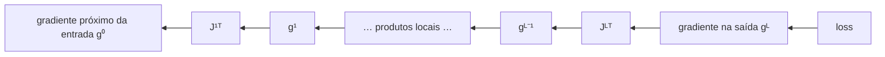
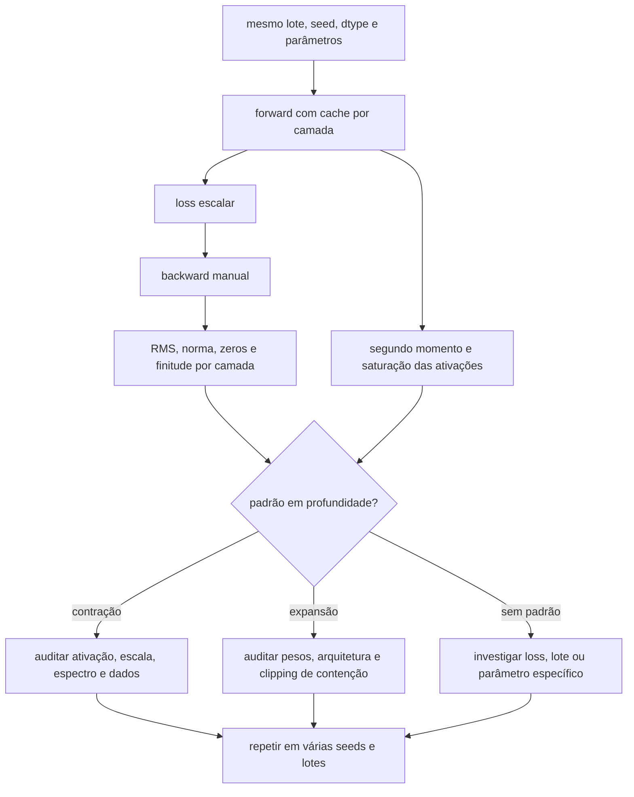

<!-- mirandastech-aula-v2 -->

# Aula 16 — Vanishing e exploding gradients: produtos de Jacobianos e diagnóstico por camada

> **Trilha:** M5 — Redes neurais do zero  
> **Objetivo central:** explicar, medir e distinguir gradientes que desaparecem ou explodem ao atravessar muitas transformações.  
> **Implementação:** NumPy puro, backward manual e nenhuma dependência de autograd.

[](https://colab.research.google.com/github/joaopaulomirandamatias/ai-lab/blob/main/04-deep-learning/m5-redes-neurais-do-zero/notebooks/16-vanishing-exploding-gradients-laboratorio.ipynb)

## 1. O problema: a loss existe, mas o crédito não chega

Imagine uma MLP profunda que analisa sinais de sensores. A camada de saída erra e produz um gradiente finito. Ao inspecionar a rede, porém, vemos dois cenários:

- nas primeiras camadas, gradientes como $10^{-12}$ mal alteram os pesos;
- em outra configuração, normas acima de $10^{8}$ tornam uma atualização destrutiva.

O backward está matematicamente correto e passou pelo gradient checking. O defeito não é necessariamente uma derivada errada: a própria composição de muitas transformações pode contrair ou ampliar o sinal de crédito.

**Vanishing gradient** é o encolhimento sistemático do gradiente conforme ele volta às camadas distantes da loss. **Exploding gradient** é o crescimento sistemático. Ambos prejudicam a atribuição de crédito: quais parâmetros anteriores deveriam mudar para reduzir o erro?

## 2. Objetivos de aprendizagem

Ao concluir esta aula, você será capaz de:

1. escrever o backward profundo como produto de Jacobianos;
2. relacionar valores singulares e derivadas das ativações à escala do gradiente;
3. demonstrar contração e expansão exponenciais em uma cadeia escalar;
4. distinguir gradiente pequeno saudável de vanishing estrutural;
5. medir RMS, norma, razão e escala logarítmica por camada;
6. identificar saturação, unidades ReLU inativas, overflow e underflow;
7. explicar o que inicialização, clipping, ativações e atalhos residuais podem ou não resolver;
8. criar contratos executáveis para o fluxo de gradientes antes do treinamento.

## 3. Pré-requisitos

- regra da cadeia e VJP;
- backward de camada afim e ativações;
- backprop vetorizado de uma MLP;
- norma euclidiana, norma espectral e valores singulares;
- inicializações Xavier/Glorot e He/Kaiming da Aula 15.

## 4. Vocabulário

| Termo | Significado |
|---|---|
| atribuição de crédito | transportar o efeito da loss até parâmetros anteriores |
| Jacobiano local | derivadas de uma transformação em relação à sua entrada |
| norma espectral | maior valor singular de uma matriz |
| RMS do gradiente | raiz da média dos quadrados; comparável entre tensores de tamanhos diferentes |
| razão de fluxo | escala do gradiente numa camada dividida pela escala na saída |
| underflow | valor representável arredondado para zero ou subnormal |
| overflow | resultado além do intervalo do dtype, geralmente `inf` |
| saturação | região em que a derivada da ativação fica próxima de zero |
| clipping global | reescala conjunta quando a norma total excede um limite |

## 5. Intuição: multiplicar muitas vezes

Considere a cadeia escalar

\[
h_L=c,h_{L-1}=c^L h_0.
\]

Se a loss for $L=h_L$, então

\[
\frac{\partial L}{\partial h_0}=c^L.
\]

Para 50 transformações:

- $c=0{,}8$ produz $0{,}8^{50}\approx1{,}427\times10^{-5}$;
- $c=1$ preserva o gradiente;
- $c=1{,}2$ produz $1{,}2^{50}\approx9{,}100\times10^3$.

Cada fator parece moderado. A profundidade transforma um pequeno desvio sistemático em uma mudança de muitas ordens de grandeza. Redes usam matrizes e não linearidades, mas a ideia permanece: o backward multiplica fatores locais.

## 6. Da regra da cadeia ao produto de Jacobianos

Adote vetores-coluna para a derivação:

\[
z^{(\ell)}=W^{(\ell)}a^{(\ell-1)}+b^{(\ell)},
\qquad
a^{(\ell)}=\phi\left(z^{(\ell)}\right).
\]

O Jacobiano local da camada em relação à ativação anterior é

\[
J_\ell
=\frac{\partial a^{(\ell)}}{\partial a^{(\ell-1)}}
=D_\ell W^{(\ell)},
\]

em que

\[
D_\ell=\operatorname{diag}\left(\phi'(z^{(\ell)})\right).
\]

Se $g^{(L)}=\nabla_{a^{(L)}}\mathcal{L}$, a regra da cadeia dá

\[
g^{(0)}
=J_1^\top J_2^\top\cdots J_L^\top g^{(L)}.
\]

Na convenção vetorizada do código, com amostras nas linhas e `Z = A @ W + b`, o mesmo cálculo aparece como:

```python
G_Z = G_A * activation_derivative(Z)
G_previous = G_Z @ W.T
```

Não misture a orientação matricial da derivação com o shape do código; a transformação matemática é a mesma.



## 7. O papel dos valores singulares

A norma submultiplicativa fornece o limite

\[
\|g^{(0)}\|_2
\leq
\left(\prod_{\ell=1}^{L}\|J_\ell\|_2\right)
\|g^{(L)}\|_2,
\]

onde $\|J_\ell\|_2=\sigma_{\max}(J_\ell)$ é o maior valor singular.

- Se todas as normas locais forem menores que 1 por uma margem relevante, o limite contrai exponencialmente.
- Se fatores maiores que 1 se alinham com a direção do gradiente, pode ocorrer explosão.
- Uma norma local maior que 1 **permite**, mas não garante, crescimento: direções singulares, rotações e cancelamentos importam.
- Controlar apenas $\sigma_{\max}$ não garante que todas as direções sejam preservadas; valores singulares mínimos próximos de zero ainda apagam componentes.

O objetivo idealizado seria manter valores singulares do Jacobiano total próximos de 1 — às vezes chamado de isometria dinâmica. Em redes reais, isso é difícil e dependente dos dados; usamos estatísticas por camada como aproximação operacional.

## 8. Ativações alteram o fluxo

### Sigmoid

\[
\sigma'(z)=\sigma(z)(1-\sigma(z))\leq\frac14.
\]

Mesmo no melhor ponto, uma cadeia de 20 derivadas contribui no máximo $(1/4)^{20}\approx9{,}095\times10^{-13}$ antes de considerar os pesos. Em saturação, o fator é ainda menor.

### `tanh`

\[
\tanh'(z)=1-\tanh^2(z)\leq1.
\]

Perto de zero, a derivada pode preservar bem o sinal. Para $|z|$ grande, `tanh` satura em $\pm1$ e a derivada tende a zero.

### ReLU

\[
\operatorname{ReLU}'(z)=
\begin{cases}
1,&z>0,\\
0,&z<0.
\end{cases}
\]

No ramo ativo, não há contração causada pela derivada. No ramo negativo, o caminho é bloqueado. Uma unidade sempre negativa para os dados pode ficar “morta”. Isso não é idêntico ao vanishing gradual, mas ambos reduzem o crédito que chega a certos parâmetros.

### Leaky ReLU

O ramo negativo usa uma inclinação $\alpha>0$, evitando bloqueio completo. Ainda assim, repetir muitos fatores $\alpha<1$ pode contrair uma direção.

## 9. Inicialização ajuda, mas não encerra o problema

Xavier e He tentam preservar variância ou segundo momento sob hipóteses de independência, largura e distribuição. Elas melhoram o ponto inicial, mas:

- não controlam exatamente o espectro do Jacobiano total;
- não impedem que os pesos mudem durante o treino;
- não removem saturação causada por entradas fora de escala;
- não corrigem profundidade ou arquitetura inadequadas;
- não garantem comportamento igual em todas as seeds;
- não substituem inspeção do backward real.

Uma rede pode ter ativações com escala aparentemente estável e gradientes ruins, ou o inverso. Forward e backward precisam ser medidos separadamente.

## 10. Exemplo resolvido com três camadas

Considere uma cadeia escalar com ativações locais cujas derivadas são $0{,}5$, $0{,}2$ e $0{,}1$, e pesos escalares $1{,}4$, $0{,}8$ e $1{,}1$. Se o gradiente da saída é 2:

\[
g^{(0)}
=2(1{,}1\times0{,}1)(0{,}8\times0{,}2)(1{,}4\times0{,}5).
\]

Passo a passo:

\[
g^{(2)}=2\times0{,}11=0{,}22,
\]

\[
g^{(1)}=0{,}22\times0{,}16=0{,}0352,
\]

\[
g^{(0)}=0{,}0352\times0{,}7=0{,}02464.
\]

O gradiente diminuiu cerca de 81 vezes em somente três transformações. Nenhum fator isolado era zero. O diagnóstico correto observa a sequência inteira.

## 11. Gradiente pequeno nem sempre é vanishing

Um gradiente pode ser pequeno por razões saudáveis:

- a previsão já está próxima do alvo;
- o parâmetro tem pouca influência naquele lote;
- a loss foi dividida por um lote grande;
- a feature correspondente está quase sempre zero;
- regularização ou máscara excluem aquele caminho.

Chame de vanishing quando houver **padrão sistemático relacionado à distância da loss**, por exemplo RMS reduzindo muitas ordens de grandeza nas camadas anteriores, em vários lotes e seeds.

Também diferencie:

| Sintoma | Pergunta diagnóstica |
|---|---|
| gradiente pequeno em todas as camadas | a loss/residual já é pequena ou a redução mudou? |
| queda progressiva em direção à entrada | derivadas e Jacobianos estão contraindo? |
| zeros apenas em unidades ReLU | estão inativas para o lote ou permanentemente mortas? |
| tensor sem gradiente | o grafo foi desconectado ou o parâmetro está congelado? |
| `nan` ou `inf` | houve overflow, operação inválida ou atualização anterior destrutiva? |

## 12. Métricas que devem ser registradas

Para um tensor de gradiente $G$ com $n$ elementos:

### Norma L2

\[
\|G\|_2=\sqrt{\sum_{i=1}^{n}G_i^2}.
\]

Ela cresce naturalmente com o número de elementos. Compare tensores de mesmo shape ou registre o tamanho.

### RMS

\[
\operatorname{RMS}(G)=
\sqrt{\frac1n\sum_{i=1}^{n}G_i^2}
=\frac{\|G\|_2}{\sqrt n}.
\]

RMS facilita comparar camadas com números diferentes de parâmetros.

### Razão de fluxo

\[
r_\ell=\frac{\operatorname{RMS}(g^{(\ell)})}
{\operatorname{RMS}(g^{(L)})+\varepsilon}.
\]

Reporte $\log_{10}(r_\ell)$ quando as escalas cobrem muitas ordens de grandeza. Uma razão de $10^{-8}$ significa oito ordens abaixo da saída, mas não define sozinha um limiar universal de falha.

### Estatísticas complementares

- máximo absoluto e percentis;
- fração exatamente zero;
- fração saturada da ativação;
- norma do gradiente por parâmetro;
- norma do peso e, durante treino, razão atualização/peso;
- presença de `nan`, `inf` ou valores subnormais;
- valores singulares em redes pequenas de diagnóstico.

## 13. Diagnóstico reproduzível



O protocolo deve manter constante tudo que não está sob teste. Comparar Xavier em `tanh` com He em ReLU muda dois fatores e impede atribuir a causa.

## 14. Explosão pode estar finita

Não espere `inf` para agir. Em `float64`, $10^{100}$ ainda é finito, mas uma atualização dessa escala já é inútil. O diagnóstico deve usar limites operacionais e razões entre camadas, não apenas `np.isfinite`.

O crescimento também pode aparecer como:

- loss oscilando abruptamente;
- parâmetros saltando muitas vezes a própria norma;
- extrema sensibilidade a pequenas mudanças no lote;
- resultados muito diferentes entre seeds;
- overflow somente após algumas atualizações.

O problema de estabilidade precede a falha numérica explícita.

## 15. Gradient clipping: contenção, não cura

No clipping por norma global, concatene conceitualmente todos os gradientes em $g$. Para limite $\tau>0$:

\[
\tilde g
=g\min\left(1,\frac{\tau}{\|g\|_2+\varepsilon}\right).
\]

Se $\|g\|_2>\tau$, a norma cai para aproximadamente $\tau$ e a direção é preservada. Isso evita uma atualização explosiva, mas:

- não recupera gradientes que já desapareceram;
- não corrige saturação ou inicialização inadequada;
- pode ocultar explosão persistente se as normas pré-clipping não forem registradas;
- introduz um hiperparâmetro que deve ser escolhido sem consultar o teste.

Pascanu, Mikolov e Bengio justificaram clipping por norma no contexto de RNNs. Aqui o usamos somente como mecanismo matemático de contenção; RNNs e sequências serão estudadas em M7.

## 16. Estratégias e seu alcance

| Estratégia | Ajuda principalmente em | Limite |
|---|---|---|
| Xavier/He coerente | escala inicial | hipóteses aproximadas e temporárias |
| ativação não saturante | contração por derivadas pequenas | ReLU pode bloquear caminhos |
| padronização das entradas | saturação e escala desigual | deve usar somente estatísticas de treino |
| clipping global | picos/explosão | trata sintoma, não vanishing |
| conexões residuais | caminho alternativo para sinal/gradiente | arquitetura será aprofundada em M7 |
| normalização | escala das ativações | possui estado e efeitos próprios; Aula 22 |
| menor profundidade | produto mais curto | pode reduzir capacidade ou mudar o problema |
| dtype mais amplo | overflow/underflow tardios | não corrige a dinâmica matemática |

Taxa de aprendizagem não aparece no backward antes da atualização. Reduzi-la pode limitar o dano de um gradiente grande, mas não altera o produto de Jacobianos que o produziu. SGD e learning rate serão formalizados na Aula 18.

## 17. Armadilhas comuns

1. **Olhar apenas a norma global:** uma camada pode explodir e outra desaparecer.
2. **Comparar L2 entre shapes distintos:** use também RMS e tamanho.
3. **Medir somente o forward:** ativação estável não prova gradiente estável.
4. **Culpar profundidade sem conferir a redução da loss:** soma e média mudam a escala global.
5. **Confundir ReLU morta com vanishing suave:** registre zeros e pré-ativações.
6. **Concluir pela primeira seed:** direções singulares dependem da amostra.
7. **Esperar `nan`:** valores finitos já podem ser operacionalmente explosivos.
8. **Aplicar clipping antes de registrar:** perde-se a evidência do problema.
9. **Aumentar dtype e declarar resolvido:** apenas adia underflow ou overflow.
10. **Usar clipping para vanishing:** reescalar somente acima de um limite não aumenta gradientes pequenos.
11. **Mudar ativação, inicialização e dados ao mesmo tempo:** a ablação deixa de identificar causa.
12. **Escolher limiar com o conjunto de teste:** contamina a avaliação final.

## 18. Checklist prático

- [ ] O backward usado no diagnóstico já passou por gradient checking?
- [ ] A loss e sua redução estão documentadas?
- [ ] Shapes e orientação das matrizes estão explícitos?
- [ ] Forward e backward reutilizam o mesmo cache?
- [ ] Registro RMS e L2, não apenas máximo?
- [ ] Meço ativações e gradientes em todas as camadas?
- [ ] Registro saturação e fração zero?
- [ ] Comparo com a escala do gradiente da saída?
- [ ] Uso escala logarítmica quando necessário?
- [ ] Verifico `nan`, `inf`, zero e subnormais?
- [ ] Repito em vários lotes e seeds?
- [ ] Mantenho constantes dados, arquitetura e dtype na ablação?
- [ ] Registro normas antes e depois do clipping?
- [ ] Não interpreto clipping como solução para vanishing?
- [ ] Separo diagnóstico inicial de comportamento após atualizações?

## 19. Laboratório reproduzível

O notebook em NumPy puro executa:

- cadeia escalar com fatores $0{,}8$, $1$ e $1{,}2$;
- demonstração de underflow em `float32`;
- produtos matriciais com valores singulares controlados;
- MLPs `tanh` com pesos pequenos, Xavier e pesos grandes;
- MLPs ReLU com He subescalado, correto e superescalado;
- forward e backward instrumentados por camada;
- comparação de RMS, saturação, zeros e finitude;
- clipping global com verificação de norma e direção;
- repetição em cinco seeds;
- auditoria final por contratos executáveis.

Dependências mínimas:

```text
Python >= 3.11
NumPy >= 1.26
Matplotlib >= 3.8
nbformat >= 5.9 (validação do arquivo)
```

Os dados são sintéticos, a seed é fixa e o notebook publicado não contém outputs, segredos, downloads ou autograd.

## 20. Resumo

- Backprop profundo multiplica Jacobianos locais transpostos.
- Pequenas contrações ou expansões sistemáticas tornam-se exponenciais com a profundidade.
- Derivadas de sigmoid e `tanh` saturada favorecem vanishing; ReLU bloqueia caminhos negativos.
- Normas espectrais maiores que 1 permitem explosão, mas direções e cancelamentos importam.
- Inicialização adequada melhora o começo, sem garantir estabilidade durante o treino.
- RMS permite comparar tensores de tamanhos diferentes; L2 deve vir acompanhada do shape.
- Gradiente pequeno saudável não é vanishing: procure padrão por profundidade, lote e seed.
- `isfinite` é necessário, mas insuficiente.
- Clipping contém explosões e preserva direção, mas não restaura gradientes desaparecidos.
- Diagnóstico confiável registra forward e backward antes de escolher uma intervenção.

## 21. Exercícios

### 1. Cadeia escalar

Calcule $0{,}9^{30}$ e interprete o resultado como razão entre gradiente de entrada e de saída.

### 2. Sigmoid

Qual é o maior produto possível de dez derivadas sigmoid, ignorando pesos?

### 3. Jacobiano

Para $a^{(\ell)}=\phi(W^{(\ell)}a^{(\ell-1)}+b)$, escreva o Jacobiano local.

### 4. Limite de norma

Se quatro Jacobianos têm norma espectral no máximo $0{,}5$, qual é o limite multiplicativo sobre a norma do gradiente?

### 5. RMS

Um gradiente com quatro elementos iguais a 3 tem qual norma L2 e qual RMS?

### 6. Diagnóstico

Todos os gradientes diminuíram pelo mesmo fator depois que a redução da loss mudou de soma para média sobre 128 exemplos. Isso prova vanishing?

### 7. ReLU

Uma camada tem 70% de gradientes exatamente zero. Quais duas estatísticas você consultaria antes de concluir?

### 8. Clipping

Um gradiente tem norma 50 e o limite é 5. Por qual fator ele será multiplicado, desprezando $\varepsilon$?

### 9. Finitude

Por que um gradiente $10^{80}$ em `float64` pode ser uma explosão mesmo sendo finito?

### 10. Experimento

Descreva uma ablação honesta para comparar Xavier e He numa MLP ReLU.

## 22. Respostas comentadas

### 1.

\[
0{,}9^{30}\approx0{,}042391.
\]

O gradiente próximo da entrada tem cerca de 4,24% da escala de saída nessa cadeia idealizada.

### 2.

Como $\sigma'(z)\leq1/4$:

\[
\left(\frac14\right)^{10}
=\frac{1}{1.048.576}
\approx9{,}537\times10^{-7}.
\]

### 3.

\[
J_\ell=D_\ell W^{(\ell)},
\quad
D_\ell=\operatorname{diag}(\phi'(z^{(\ell)})).
\]

### 4.

\[
\prod_{\ell=1}^{4}0{,}5=0{,}0625.
\]

A norma na entrada é limitada por 6,25% da norma na saída sob essas cotas.

### 5.

\[
\|G\|_2=\sqrt{4\times3^2}=6,
\qquad
\operatorname{RMS}(G)=\sqrt{(4\times9)/4}=3.
\]

### 6.

Não. A média introduz um fator global $1/128$ em todas as camadas. Vanishing requer queda adicional e sistemática conforme aumenta a distância da loss.

### 7.

Consulte a fração de pré-ativações negativas e a fração de ativações/gradientes zero por unidade ao longo de vários lotes. Assim distinguimos máscara ReLU esperada de unidades persistentemente mortas.

### 8.

\[
\frac{5}{50}=0{,}1.
\]

A direção é preservada e a nova norma torna-se 5.

### 9.

O intervalo representável não define escala útil para otimização. Uma atualização proporcional a $10^{80}$ destruiria parâmetros muito antes de produzir `inf`.

### 10.

Mantenha dados, split, arquitetura, ativação ReLU, loss, dtype, lote e conjunto de seeds. Altere somente a regra de inicialização. Meça forward e backward antes do treino e, depois, compare treino/validação sem usar o teste para escolher.

## 23. Conexões com IA, pesquisa e sistemas reais

Em redes profundas, gradientes ruins tornam experimentos caros e difíceis de reproduzir. Duas execuções podem divergir porque pequenas diferenças de seed alinham o sinal com direções singulares diferentes. Relatar somente a melhor execução esconde esse risco.

Em modelos sequenciais, a profundidade também aparece no tempo; por isso o problema foi central no desenvolvimento de LSTM e, depois, arquiteturas com caminhos mais curtos. Em Transformers e grandes modelos, atalhos residuais, normalização, escala de inicialização e precisão numérica formam um sistema conjunto. Esses mecanismos serão estudados em seus módulos próprios, sem tratá-los como soluções mágicas antecipadas.

Em operação, normas por camada podem integrar telemetria de treinamento. Alertas devem observar tendências, percentis e comparação com históricos, não um limiar universal. O artefato científico precisa registrar dados, seed, dtype, arquitetura, inicialização e métricas pré-clipping para permitir reprodução e diagnóstico causal.

## 24. Próxima aula

Na **Aula 17 — Mini-batch, epoch e embaralhamento**, transformaremos o backward correto e diagnosticado em um estimador de gradiente sobre subconjuntos de dados, preservando unidade de análise, cobertura e reprodutibilidade.

## Referências

### Artigos primários

- GLOROT, X.; BENGIO, Y. [Understanding the difficulty of training deep feedforward neural networks](https://proceedings.mlr.press/v9/glorot10a.html). *Proceedings of Machine Learning Research*, v. 9, p. 249–256, 2010. Consultado em 9 set. 2026.
- BENGIO, Y.; SIMARD, P.; FRASCONI, P. [Learning long-term dependencies with gradient descent is difficult](https://ieeexplore.ieee.org/document/279181). *IEEE Transactions on Neural Networks*, v. 5, n. 2, p. 157–166, 1994. Consultado em 9 set. 2026.
- PASCANU, R.; MIKOLOV, T.; BENGIO, Y. [On the difficulty of training Recurrent Neural Networks](https://proceedings.mlr.press/v28/pascanu13.html). *Proceedings of Machine Learning Research*, v. 28, p. 1310–1318, 2013. Consultado em 9 set. 2026.

### Materiais técnicos

- GOODFELLOW, I.; BENGIO, Y.; COURVILLE, A. [Deep Learning — Deep Feedforward Networks](https://www.deeplearningbook.org/contents/mlp.html). MIT Press, 2016. Consultado em 9 set. 2026.
- ZHANG, A. et al. [Dive into Deep Learning 1.0.3 — Numerical Stability and Initialization](https://d2l.ai/chapter_multilayer-perceptrons/numerical-stability-and-init.html). Consultado em 9 set. 2026.

