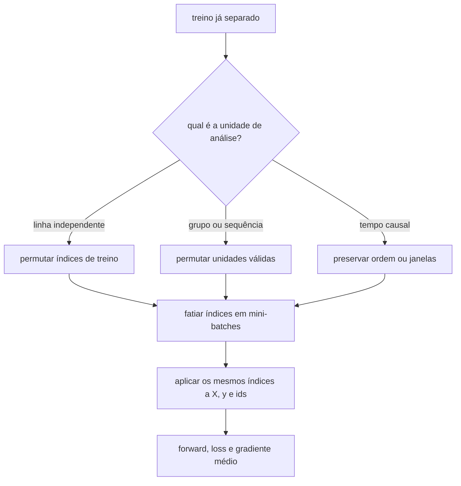
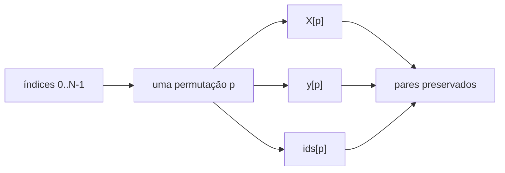

<!-- mirandastech-aula-v2 -->

# Aula 17 — Mini-batch, epoch e embaralhamento: estimador de gradiente e laço de dados

> **Trilha:** M5 — Redes neurais do zero  
> **Objetivo central:** construir um iterador de mini-batches correto, reproduzível e coerente com a unidade de análise.  
> **Implementação:** NumPy puro; os parâmetros permanecem fixos para isolar o estimador de gradiente.

[](https://colab.research.google.com/github/joaopaulomirandamatias/ai-lab/blob/main/04-deep-learning/m5-redes-neurais-do-zero/notebooks/17-mini-batch-epoch-embaralhamento-laboratorio.ipynb)

## 1. O problema: o backward cabe na memória, os dados não

Nas aulas anteriores, calculamos o gradiente de uma MLP para um lote inteiro. Em um sistema real, milhões de exemplos podem não caber juntos na memória. Mesmo quando cabem, esperar o gradiente completo antes de cada atualização desperdiça a possibilidade de aprender após processar uma fração dos dados.

A solução operacional é dividir o conjunto de treino em **mini-batches**. Porém, um laço aparentemente simples pode:

- separar uma entrada de seu rótulo ao embaralhar arrays independentemente;
- repetir ou omitir exemplos sem registrar a decisão;
- dar peso excessivo ao último lote, que costuma ser menor;
- misturar entidades entre treino e validação;
- destruir ordem temporal ou estrutura sequencial;
- produzir uma ordem impossível de reconstruir após uma interrupção.

Mini-batch não é apenas uma otimização de memória. Ele define qual estimativa do gradiente o treinamento observa em cada passo.

## 2. Objetivos de aprendizagem

Ao concluir esta aula, você será capaz de:

1. distinguir exemplo, batch, mini-batch, step e epoch;
2. derivar o gradiente médio de um mini-batch;
3. explicar quando esse gradiente é um estimador não enviesado;
4. relacionar tamanho do lote, variância e custo computacional;
5. implementar cobertura exata, `drop_last` e embaralhamento por índices;
6. agregar corretamente lotes de tamanhos diferentes;
7. separar embaralhamento de treino, divisão de dados e unidade de análise;
8. registrar seeds e estado suficiente para retomar uma execução.

## 3. Pré-requisitos

- risco empírico e derivadas de losses;
- forward e backward vetorizados;
- média, variância e amostragem;
- data leakage, splits por grupo e splits temporais;
- inicialização e diagnóstico de gradientes das Aulas 15 e 16.

## 4. Vocabulário

| Termo | Significado |
|---|---|
| exemplo | uma unidade observacional $(x_i,y_i)$ |
| batch completo | todos os $N$ exemplos usados numa avaliação do gradiente |
| mini-batch | subconjunto de $B$ exemplos, usualmente $1<B<N$ |
| batch size | número real de exemplos do lote atual |
| step ou iteração | processamento de um lote; na próxima aula, incluirá uma atualização |
| epoch | passagem definida sobre o conjunto de treino |
| permutação | reordenação sem repetição dos índices |
| amostragem com reposição | cada sorteio pode repetir um índice já usado |
| `drop_last` | descartar o último lote se ele tiver menos de $B$ exemplos |
| unidade de análise | entidade independente que pode ser dividida sem leakage |

## 5. Risco empírico e gradiente completo

Considere o conjunto de treino

\[
\mathcal{D}=\{(x_i,y_i)\}_{i=1}^{N}
\]

e parâmetros $\theta$. O risco empírico médio é

\[
J(\theta)=\frac{1}{N}\sum_{i=1}^{N}\ell_i(\theta),
\]

onde $\ell_i(\theta)=\ell(f(x_i;\theta),y_i)$ é a loss do exemplo $i$. Seu gradiente completo é

\[
g(\theta)=\nabla_\theta J(\theta)
=\frac{1}{N}\sum_{i=1}^{N}\nabla_\theta\ell_i(\theta).
\]

Para um mini-batch $\mathcal{B}$ com $b=|\mathcal{B}|$, usamos

\[
\widehat g_{\mathcal{B}}(\theta)
=\frac{1}{b}\sum_{i\in\mathcal{B}}\nabla_\theta\ell_i(\theta).
\]

Cada símbolo importa:

- $N$: quantidade total de exemplos de treino;
- $B$: tamanho nominal configurado;
- $b$: tamanho real do lote atual, que pode ser menor no fim da época;
- $\theta$: parâmetros no instante em que o gradiente é avaliado;
- $g$: gradiente de todos os exemplos;
- $\widehat g_{\mathcal{B}}$: estimativa calculada no lote.

Usar a **média** torna a escala do gradiente aproximadamente comparável entre lotes. Se usássemos a soma, dobrar $b$ dobraria a escala esperada e alteraria implicitamente a relação com o learning rate.

## 6. Quando o estimador é não enviesado?

Se os $B$ índices forem sorteados uniforme e independentemente **com reposição**, mantendo $\theta$ fixo, então

\[
\mathbb{E}[\widehat g_{\mathcal{B}}(\theta)]=g(\theta).
\]

Se a covariância do gradiente de um exemplo é $\Sigma$, a covariância da média cai como

\[
\operatorname{Cov}(\widehat g_{\mathcal{B}})=\frac{\Sigma}{B}.
\]

Essa igualdade não diz que cada lote aponta na direção exata. Diz que, sobre muitas amostras independentes, a média das estimativas recupera o gradiente completo.

Na prática, é comum embaralhar o conjunto e percorrê-lo **sem reposição**. Para uma amostra uniforme de tamanho $B$, a correção de população finita reduz a variância:

\[
\operatorname{Cov}(\widehat g_{\mathcal{B}})
=\frac{N-B}{N-1}\frac{\Sigma_N}{B},
\]

em que $\Sigma_N=\frac1N\sum_i(g_i-g)(g_i-g)^\top$. Quando $B=N$, a variância é zero.

Há uma nuance essencial: depois que alguns índices foram consumidos numa época, o próximo lote depende dos anteriores. Além disso, durante o treinamento, $\theta$ muda entre lotes. Portanto, uma época embaralhada não é simplesmente “um gradiente completo parcelado”. A igualdade exata abaixo vale somente quando todos os gradientes são avaliados no **mesmo** $\theta$:

\[
g(\theta)=\frac{1}{N}\sum_{k=1}^{K}b_k\widehat g_k(\theta),
\qquad \sum_{k=1}^{K}b_k=N.
\]

## 7. Tamanho do lote: três regimes

| Regime | Tamanho | Vantagem principal | Limite principal |
|---|---:|---|---|
| online | $B=1$ | resposta após cada exemplo | alta variância e pouco aproveitamento vetorial |
| mini-batch | $1<B<N$ | equilíbrio entre ruído, memória e vetorização | exige política de lotes e tuning conjunto |
| full-batch | $B=N$ | gradiente empírico exato | alto custo por passo e memória elevada |

Lotes maiores reduzem a variância do estimador, mas o ganho não é gratuito nem indefinido. Hardware, largura de banda de memória, paralelismo, comunicação distribuída e learning rate interferem. Não existe batch size universalmente ótimo.

O fluxo é:



## 8. Epoch não é sinônimo de uma quantidade fixa de steps

Sem descartar o último lote:

\[
K=\left\lceil\frac{N}{B}\right\rceil.
\]

Com `drop_last=True`:

\[
K=\left\lfloor\frac{N}{B}\right\rfloor.
\]

### Exemplo resolvido

Para $N=103$ e $B=16$:

1. $103=6\times16+7$;
2. sem descarte, há sete lotes: seis de 16 e um de 7;
3. com `drop_last`, há seis lotes e somente 96 exemplos são vistos;
4. sete exemplos ficam de fora naquela época.

Se a ordem não mudar, `drop_last` omite sempre os mesmos exemplos. Se a ordem mudar, as omissões giram, mas a cobertura de cada época continua incompleta. Descartar pode ser justificável por requisitos de shape ou estatísticas da arquitetura, mas precisa ser uma escolha explícita e auditável.

## 9. O último lote e a média das médias

Suponha que seis lotes de 16 tenham loss média 1 e o último lote de 7 tenha loss média 8. A média ingênua das sete médias é

\[
\frac{6\times1+8}{7}=2.
\]

Mas a média por exemplo correta é

\[
\frac{6\times16\times1+7\times8}{103}
=\frac{152}{103}\approx1{,}4757.
\]

O mesmo vale para gradientes e métricas aditivas: agregue somas e contagens ou faça média ponderada por $b_k$. A média simples entre lotes só é correta quando todos têm o mesmo tamanho.

## 10. Embaralhe índices, não arrays isolados

O padrão seguro é produzir uma única permutação $p$ e indexar todas as estruturas:

```python
p = rng.permutation(len(X))
X_epoch = X[p]
y_epoch = y[p]
ids_epoch = ids[p]
```

Embaralhar `X` e `y` com duas chamadas independentes destrói o pareamento. Mesmo usar a mesma seed em dois geradores é uma solução frágil quando os arrays têm shapes ou caminhos de consumo diferentes. O índice é o contrato explícito.



## 11. Reprodutibilidade por época

Uma seed global usada como estado mutável reproduz a execução completa apenas se exatamente as mesmas chamadas ocorrerem na mesma ordem. Para retomar diretamente a época 37, derive seu gerador da seed-base e do número da época:

```python
seed_sequence = np.random.SeedSequence([BASE_SEED, epoch])
rng = np.random.default_rng(seed_sequence)
indices = rng.permutation(n)
```

Assim, a ordem da época é uma função de `(BASE_SEED, epoch)`, não do histórico acidental do processo. Registre também:

- versão do NumPy;
- bit generator, por exemplo `PCG64`;
- $N$, batch size e `drop_last`;
- identidade ou hash do conjunto de treino;
- política de unidade de análise.

A documentação do NumPy alerta que `Generator` não promete o mesmo bitstream entre versões. Seed fixa é necessária, mas não basta para reprodução de longo prazo.

## 12. Embaralhamento não corrige um split errado

O procedimento metodológico é:

1. definir a unidade independente;
2. separar treino, validação e teste;
3. ajustar transformações somente no treino;
4. embaralhar apenas unidades permitidas dentro do treino;
5. formar lotes.

Se um paciente aparece no treino e na validação, embaralhar as linhas não remove o leakage. Se a tarefa prevê o futuro, permutar todas as datas antes do split cria uma avaliação retrocausal. Se cada exemplo é uma janela de uma série, permutar elementos internos da janela destrói o significado temporal.

| Estrutura | Política típica | O que não fazer |
|---|---|---|
| linhas i.i.d. | permutar índices de treino | permutar `X` e `y` separadamente |
| várias linhas por entidade | separar por entidade; depois ordenar ou permutar entidades | deixar a mesma entidade em splits distintos |
| série temporal | split cronológico; batches em ordem ou janelas válidas | usar futuro para prever passado |
| sequência de tokens | permutar sequências, não tokens internos | destruir ordem linguística |
| dados distribuídos | particionar índices sem sobreposição e registrar sampler | cada worker repetir o conjunto inteiro sem intenção |

## 13. Dados ordenados e correlação entre lotes

Arquivos frequentemente chegam ordenados por classe, região, usuário ou tempo. Sem embaralhamento, lotes consecutivos podem representar populações muito diferentes. O gradiente do primeiro lote pode ficar longe do gradiente completo e a sequência pode ter forte autocorrelação.

Embaralhar não torna os dados independentes por magia. Ele apenas reduz padrões de ordem acidentais quando a unidade de análise permite a permutação. Dependências reais continuam existindo e devem ser modeladas no split e no sampler.

Uma auditoria útil compara:

- distribuição de rótulos ou variáveis-chave por lote;
- norma e direção do gradiente por lote;
- cobertura e duplicação de IDs;
- autocorrelação de estatísticas entre lotes;
- dispersão sobre várias seeds.

## 14. Um iterador mínimo e verificável

```python
import numpy as np

def batch_indices(n, batch_size, *, seed, epoch, shuffle=True, drop_last=False):
    if n <= 0 or batch_size <= 0:
        raise ValueError("n e batch_size devem ser positivos")
    indices = np.arange(n)
    if shuffle:
        rng = np.random.default_rng(np.random.SeedSequence([seed, epoch]))
        indices = rng.permutation(indices)

    stop = n if not drop_last else n - (n % batch_size)
    for start in range(0, stop, batch_size):
        batch = indices[start:min(start + batch_size, n)]
        if len(batch) == batch_size or not drop_last:
            yield batch
```

Contratos mínimos:

```python
batches = list(batch_indices(103, 16, seed=20260917, epoch=0))
flat = np.concatenate(batches)

assert [len(b) for b in batches] == [16, 16, 16, 16, 16, 16, 7]
assert len(flat) == len(np.unique(flat)) == 103
assert np.array_equal(np.sort(flat), np.arange(103))
```

Esse iterador não atualiza parâmetros. Na próxima aula, cada lote alimentará uma regra de SGD com learning rate explícito.

## 15. Armadilhas e erros comuns

### “Uma epoch sempre vê todos os exemplos”

Não com `drop_last`, amostragem com reposição ou limites artificiais de steps.

### “Shuffle torna o gradiente de cada lote correto”

Cada lote continua ruidoso. O embaralhamento controla a ordem, não garante proximidade em uma realização.

### “Basta tirar a média das métricas por batch”

Não quando tamanhos diferem. Pondere pela quantidade de exemplos ou agregue numerador e denominador apropriados.

### “Batch size só muda velocidade”

Ele altera a variância do estimador, a frequência de atualizações, a memória, a eficiência vetorial e a interação com o learning rate.

### “Seed fixa resolve reprodutibilidade”

Ainda faltam versão, gerador, dados, estado, política de lotes e determinismo das operações.

### “Posso embaralhar antes de separar”

Somente se a unidade for realmente i.i.d. Grupos e tempo exigem splits estruturados antes do shuffle interno de treino.

### “Duplicação é impossível sem reposição”

Pode ocorrer por bugs de borda, workers distribuídos mal particionados ou concatenação incorreta. Verifique IDs, não apenas shapes.

## 16. Checklist prático

- [ ] A unidade de análise está declarada.
- [ ] O split foi feito antes do embaralhamento de treino.
- [ ] Grupos e ordem temporal foram preservados quando necessários.
- [ ] Uma única lista de índices governa `X`, `y`, IDs e metadados.
- [ ] `batch_size`, `drop_last`, seed e número da época estão registrados.
- [ ] A cobertura por época é testada com IDs únicos.
- [ ] O último lote é tratado com seu tamanho real.
- [ ] Losses e gradientes usam redução coerente (`mean` ou `sum`).
- [ ] Agregações entre lotes são ponderadas corretamente.
- [ ] A retomada de uma época produz a mesma permutação.
- [ ] Estatísticas por lote são auditadas para detectar ordem acidental.
- [ ] O conjunto de teste permanece intocado.

## 17. Resumo

- O gradiente de mini-batch é a média dos gradientes dos exemplos selecionados.
- Sob amostragem uniforme com reposição e parâmetros fixos, ele é não enviesado e sua variância cai aproximadamente como $1/B$.
- Uma permutação sem reposição cobre cada índice uma vez, mas cria dependência entre lotes.
- Epoch, step e batch são unidades distintas.
- `drop_last` altera cobertura; o último lote altera pesos de agregação.
- Embaralhe índices uma vez e aplique-os a todas as estruturas alinhadas.
- Shuffle ocorre dentro do treino e nunca repara leakage de entidade ou de tempo.
- Reprodutibilidade exige seed, versão, gerador, dados e política de amostragem.

## 18. Exercícios

### 1. Contagem de lotes

Para $N=1.000$ e $B=128$, quantos steps há com e sem `drop_last`? Quantos exemplos são descartados?

### 2. Variância

Sob amostragem com reposição, o que acontece com a variância do gradiente médio ao passar de $B=8$ para $B=32$?

### 3. Correção finita

Calcule o fator multiplicador de $\Sigma_N$ para $N=100$ e $B=20$ na amostragem sem reposição.

### 4. Média das médias

Dois lotes têm tamanhos 10 e 2 e losses médias 1 e 7. Compare a média ingênua com a média correta por exemplo.

### 5. Pareamento

Explique por que executar `rng.permutation(X)` e depois `rng.permutation(y)` é incorreto, mesmo usando o mesmo objeto `rng`.

### 6. Epoch e gradiente completo

Quando a média ponderada dos gradientes de todos os lotes de uma época é exatamente igual ao gradiente completo?

### 7. `drop_last`

Um dataset está ordenado e as últimas 11 linhas pertencem a uma classe rara. Qual falha ocorre com $B=64$, `drop_last=True` e ordem fixa?

### 8. Unidade de análise

Há dez medições por paciente. Descreva a ordem correta de split, shuffle e formação de batches.

### 9. Retomada

Por que `SeedSequence([seed, epoch])` facilita retomar diretamente uma época quando comparada a um único gerador global mutável?

### 10. Experimento

Proponha uma verificação empírica da relação entre batch size e variância do estimador sem atualizar $\theta$.

## 19. Respostas comentadas

### 1.

Sem descarte, $\lceil1000/128\rceil=8$ steps; o último tem 104 exemplos. Com descarte, $\lfloor1000/128\rfloor=7$ steps e 104 exemplos são omitidos.

### 2.

Como $\operatorname{Cov}(\widehat g)=\Sigma/B$, a variância cai para $8/32=1/4$ do valor anterior, sob as hipóteses declaradas.

### 3.

\[
\frac{N-B}{N-1}\frac1B
=\frac{80}{99}\frac1{20}
=\frac{4}{99}\approx0{,}040404.
\]

### 4.

A média ingênua é $(1+7)/2=4$. A correta é

\[
\frac{10\times1+2\times7}{12}=2.
\]

### 5.

As duas chamadas consomem estados diferentes e geram permutações diferentes. As linhas deixam de corresponder aos rótulos. Gere índices uma vez e reutilize-os.

### 6.

Quando os lotes particionam todos os $N$ exemplos sem repetição e todos os gradientes são avaliados no mesmo $\theta$. Durante treinamento normal, $\theta$ muda após cada step, então a identidade não se aplica diretamente.

### 7.

As linhas raras podem ser omitidas em todas as épocas. O modelo nunca recebe sinal dessas observações, e métricas de cobertura podem parecer normais se apenas o número de batches for monitorado.

### 8.

Primeiro separe pacientes inteiros em treino, validação e teste. Depois, dentro do treino, permute pacientes ou unidades de amostragem compatíveis. Só então forme batches; nenhuma medição do mesmo paciente pode cruzar splits.

### 9.

A permutação torna-se função direta da seed e da época. Não é necessário reproduzir todas as chamadas aleatórias anteriores para reconstruir a ordem da época desejada.

### 10.

Fixe dados, modelo e $\theta$. Para cada $B$, sorteie milhares de lotes independentes, calcule seus gradientes e estime a variância entre realizações. Compare a média com o gradiente completo e a variância com a curva proporcional a $1/B$.

## 20. Conexões com IA, pesquisa e sistemas reais

Em visão, áudio e linguagem, o pipeline de dados frequentemente domina o custo do treinamento. Mini-batches permitem operações matriciais eficientes, pré-busca e paralelismo. Mas acelerar um sampler metodologicamente errado apenas produz evidência inválida mais rápido.

Em pesquisa, batch size faz parte do protocolo experimental. Comparar modelos com o mesmo número de épocas, mas batches diferentes, muda o número de updates. Uma comparação honesta registra exemplos processados, steps, tempo, learning rate e seeds.

Em sistemas distribuídos, cada worker deve receber uma partição coordenada. A cobertura global precisa ser auditada, porque duplicações silenciosas mudam a distribuição efetiva. Para retomar checkpoints, salve o número da época, step, sampler e identidade dos dados, além dos parâmetros.

Em LLMs, “exemplo” pode conter quantidades muito diferentes de tokens. Agrupamento por comprimento e contagem de tokens tornam a definição de batch mais sofisticada. Esses detalhes serão tratados nos módulos de Transformers e LLMs; aqui permanece o princípio: explicitar a unidade que determina custo, média e cobertura.

## 21. Próxima aula

Na **Aula 18 — SGD e learning rate**, aplicaremos os gradientes de cada mini-batch aos parâmetros, estudando curvas de loss, estabilidade, convergência e a interação entre escala do gradiente e tamanho do passo.

## Referências

### Fonte primária

- BOTTOU, L. [Stochastic Gradient Tricks](https://leon.bottou.org/papers/bottou-tricks-2012). In: *Neural Networks: Tricks of the Trade*, p. 430–445, Springer, 2012. Consultado em 9 set. 2026.

### Materiais técnicos oficiais e abertos

- GOODFELLOW, I.; BENGIO, Y.; COURVILLE, A. [Deep Learning — Optimization for Training Deep Models](https://www.deeplearningbook.org/contents/optimization.html). MIT Press, 2016. Consultado em 9 set. 2026.
- ZHANG, A. et al. [Dive into Deep Learning 1.0.3 — Minibatch Stochastic Gradient Descent](https://d2l.ai/chapter_optimization/minibatch-sgd.html). Consultado em 9 set. 2026.
- NUMPY DEVELOPERS. [Random Generator — NumPy 2.5](https://numpy.org/doc/stable/reference/random/generator.html). Consultado em 9 set. 2026.
