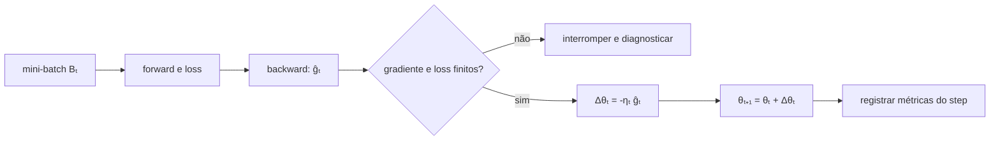
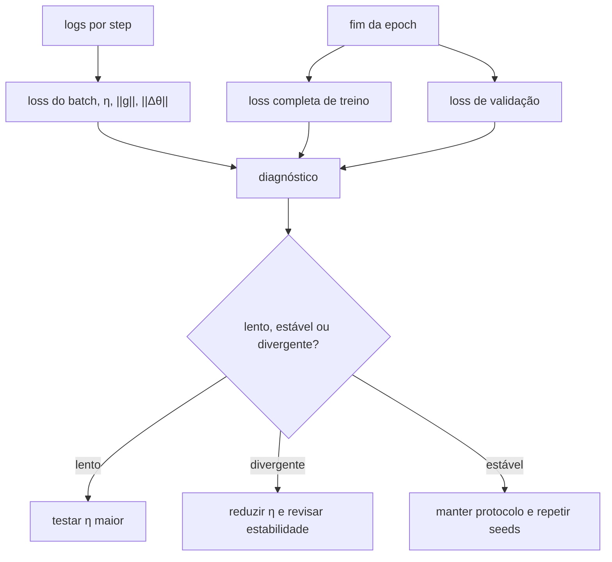

<!-- mirandastech-aula-v2 -->

# Aula 18 — SGD e learning rate: curvas de loss, estabilidade e convergência

> **Trilha:** M5 — Redes neurais do zero  
> **Objetivo central:** transformar o gradiente de um mini-batch em atualizações estáveis, mensuráveis e reproduzíveis.  
> **Implementação:** NumPy puro, sem autograd e sem momentum.

[](https://colab.research.google.com/github/joaopaulomirandamatias/ai-lab/blob/main/04-deep-learning/m5-redes-neurais-do-zero/notebooks/18-sgd-learning-rate-laboratorio.ipynb)

## 1. O problema: o gradiente está correto, mas a loss piora

Imagine que o forward, o backward e o gradient checking foram aprovados. Ainda assim, três treinamentos da mesma rede mostram comportamentos opostos:

- com learning rate pequeno, a loss quase não muda;
- com um valor intermediário, cai de forma consistente;
- com um valor grande, oscila e explode.

O gradiente responde **para onde** a loss cresce localmente. Ele não determina **quanto** devemos mover os parâmetros. Essa distância é controlada pelo learning rate. Um backward perfeito pode ser inutilizado por um passo inadequado.

Nesta aula, SGD significa a atualização direta com o gradiente de um exemplo ou mini-batch. Momentum, Nesterov e estados auxiliares pertencem à Aula 19.

## 2. Objetivos de aprendizagem

Ao concluir esta aula, você será capaz de:

1. implementar a atualização SGD sem framework;
2. explicar o learning rate como escala do deslocamento no espaço de parâmetros;
3. derivar a faixa de estabilidade para uma função quadrática;
4. distinguir convergência monótona, oscilatória, marginal e divergente;
5. relacionar curvatura, condicionamento, batch size e ruído;
6. interpretar curvas de loss por step e por epoch;
7. comparar learning rates com orçamento e split honestos;
8. implementar schedules simples e retomar o treino de forma reproduzível;
9. criar contratos para detectar `nan`, explosão e ausência de progresso.

## 3. Pré-requisitos

- gradiente, derivada direcional e Hessiana;
- forward e backward vetorizados de uma MLP;
- gradient checking;
- vanishing e exploding gradients;
- mini-batch, epoch, embaralhamento e redução média da Aula 17.

## 4. Vocabulário

| Termo | Significado |
|---|---|
| SGD | descida usando uma estimativa estocástica do gradiente |
| learning rate | escalar positivo que controla a amplitude da atualização |
| step | uma aplicação da regra de atualização |
| trajetória | sequência de parâmetros visitados pelo otimizador |
| curvatura | rapidez com que o gradiente muda em uma direção |
| overshooting | passo que atravessa a região de menor loss |
| schedule | regra que faz o learning rate variar com o step |
| noise floor | região de flutuação causada por gradientes ruidosos e passo constante |
| condicionamento | razão entre maiores e menores curvaturas relevantes |

## 5. A regra de atualização

Se o mini-batch no step $t$ produz o gradiente médio $\widehat g_t$, o SGD básico aplica

\[
\theta_{t+1}=\theta_t-\eta_t\widehat g_t,
\]

onde:

- $\theta_t\in\mathbb{R}^P$ reúne os $P$ parâmetros antes do step;
- $\widehat g_t\in\mathbb{R}^P$ é o gradiente estimado no mesmo ponto $\theta_t$;
- $\eta_t>0$ é o learning rate;
- $\Delta\theta_t=-\eta_t\widehat g_t$ é a atualização.

O sinal negativo busca reduzir a loss porque o gradiente aponta para a maior subida local. A aproximação de Taylor explica a intuição:

\[
J(\theta+\Delta\theta)
\approx J(\theta)+\nabla J(\theta)^\top\Delta\theta.
\]

Escolhendo $\Delta\theta=-\eta\nabla J(\theta)$:

\[
J(\theta+\Delta\theta)
\approx J(\theta)-\eta\|\nabla J(\theta)\|_2^2.
\]

Essa é uma afirmação **local**. Se $\eta$ for grande, termos de segunda ordem deixam de ser desprezíveis e a loss pode aumentar.



## 6. Exemplo resolvido: uma quadrática em uma dimensão

Considere

\[
J(\theta)=\frac{1}{2}\lambda\theta^2,
\qquad \lambda>0.
\]

O gradiente é $\nabla J(\theta)=\lambda\theta$. A atualização fica

\[
\theta_{t+1}
=\theta_t-\eta\lambda\theta_t
=(1-\eta\lambda)\theta_t.
\]

Após $t$ steps:

\[
\theta_t=(1-\eta\lambda)^t\theta_0.
\]

Para convergir a zero, o módulo do multiplicador deve ser menor que 1:

\[
|1-\eta\lambda|<1
\iff 0<\eta<\frac{2}{\lambda}.
\]

Com $\lambda=10$ e $\theta_0=4$:

| $\eta$ | multiplicador | comportamento |
|---:|---:|---|
| 0,02 | 0,8 | convergência monótona lenta |
| 0,10 | 0 | chega ao mínimo em um step nesta quadrática ideal |
| 0,15 | -0,5 | converge alternando os lados |
| 0,20 | -1 | oscila sem reduzir a amplitude |
| 0,21 | -1,1 | diverge com oscilação crescente |

O limite $2/\lambda$ não é receita universal. Ele é exato para esta quadrática e oferece uma lente para entender redes: direções com alta curvatura toleram passos menores.

## 7. Várias dimensões e o papel da maior curvatura

Para

\[
J(\theta)=\frac12\theta^\top H\theta,
\]

com $H$ simétrica definida positiva, temos

\[
\theta_{t+1}=(I-\eta H)\theta_t.
\]

Nas direções dos autovetores de $H$, cada componente é multiplicada por $1-\eta\lambda_j$. A estabilidade exige

\[
0<\eta<\frac{2}{\lambda_{\max}(H)}.
\]

Se $\lambda_{\max}\gg\lambda_{\min}$, um passo pequeno o bastante para a direção íngreme avança lentamente na direção plana. A razão

\[
\kappa(H)=\frac{\lambda_{\max}}{\lambda_{\min}}
\]

é o número de condição. Ravinas mal condicionadas motivarão momentum na próxima aula.

## 8. SGD não exige queda em todo step

Em mini-batch SGD, $\widehat g_t$ aproxima o gradiente do risco total. Um lote pode aumentar a loss de outro lote ou até a loss completa naquele step. Portanto:

- uma subida isolada não prova divergência;
- a tendência deve ser observada em janelas e avaliações consistentes;
- `nan`, `inf` ou crescimento sustentado de muitas ordens de grandeza são alertas fortes;
- a validação deve ser avaliada sem atualizar parâmetros.

Com learning rate constante, o ruído do estimador pode impedir que os parâmetros se fixem exatamente no mínimo. Perto dele, o gradiente verdadeiro fica pequeno, mas a variância do mini-batch permanece. Surge um **noise floor**: a trajetória flutua numa vizinhança cuja escala depende de $\eta$, batch size e geometria.

## 9. Learning rate muito pequeno, adequado ou grande

| Sinal observado | Hipótese possível | Verificação |
|---|---|---|
| loss quase horizontal | $\eta$ pequeno, gradiente pequeno ou bug | normas de gradiente e atualização |
| queda rápida e estável | faixa útil | repetir seeds e verificar validação |
| serrilhado moderado | ruído de mini-batch | média móvel e loss por epoch |
| oscilação crescente | $\eta$ alto ou gradiente explosivo | normas antes/depois de multiplicar por $\eta$ |
| `nan`/`inf` | overflow, loss instável ou passo extremo | primeiro step não finito e logits |
| treino cai, validação piora | sobreajuste, não simples falha de SGD | curva de validação e regularização |

Gradient clipping limita a norma de $g$, mas não transforma automaticamente um learning rate ruim em bom. Ele também pode esconder explosões que deveriam ser diagnosticadas.

## 10. O learning rate depende da escala do gradiente

Na Aula 17, adotamos redução média. Se uma implementação soma gradientes, a norma cresce aproximadamente com o tamanho do lote. Reutilizar o mesmo $\eta$ muda o passo efetivo.

Para cada tensor, podemos registrar

\[
r_t=\frac{\|\Delta\theta_t\|_2}{\|\theta_t\|_2+\varepsilon}.
\]

Esse **update-to-parameter ratio** ajuda a detectar atualizações irrelevantes ou destrutivas, mas não possui limiar universal. Biases próximos de zero, normalizações e parametrizações diferentes exigem interpretação por componente e histórico.

## 11. Curvas que realmente informam

Durante o treino, registre pelo menos:

- loss do mini-batch antes da atualização;
- loss completa de treino em pontos definidos;
- loss e métricas de validação;
- learning rate corrente;
- norma do gradiente e da atualização;
- exemplos processados, step e epoch;
- seed, batch size e versão dos dados.



A loss média dos batches mistura valores calculados em parâmetros diferentes. Ela não é idêntica à loss completa medida no fim da epoch. Ambas são úteis, mas respondem a perguntas diferentes.

## 12. Comparação honesta de learning rates

Uma busca responsável:

1. fixa dados, split, arquitetura, inicialização e orçamento;
2. escolhe candidatos em escala logarítmica, como $10^{-4},10^{-3},10^{-2},10^{-1}$;
3. treina cada candidato apenas com treino;
4. seleciona pelo conjunto de validação;
5. repete seeds para estimar variabilidade;
6. avalia o teste reservado uma única vez após a decisão.

Comparar somente o número de epochs pode ser enganoso se batch sizes diferirem: o número de updates muda. Relate também steps e exemplos processados. Não escolha $\eta$ pela curva de teste.

## 13. Learning rate variável

Substituir $\eta$ por $\eta_t$ permite passos maiores no início e menores perto de uma solução. Exemplos simples:

### Constante

\[
\eta_t=\eta_0.
\]

É um baseline importante. Pode atingir uma região útil rapidamente, mas manter flutuação.

### Decaimento polinomial

\[
\eta_t=\eta_0(1+\beta t)^{-\alpha},
\qquad \alpha,\beta>0.
\]

### Degraus

\[
\eta_t=\eta_0\gamma^{\lfloor t/s\rfloor},
\qquad 0<\gamma<1,
\]

onde $s$ é o intervalo entre reduções.

Na aproximação estocástica clássica, condições conhecidas são

\[
\sum_{t=1}^{\infty}\eta_t=\infty,
\qquad
\sum_{t=1}^{\infty}\eta_t^2<\infty.
\]

A primeira evita parar cedo demais; a segunda limita a acumulação de ruído. Elas dependem de hipóteses matemáticas que redes profundas geralmente não satisfazem integralmente. São fundamentos, não garantia automática para qualquer MLP.

## 14. Implementação mínima

```python
def sgd_step(params, grads, learning_rate):
    if learning_rate <= 0:
        raise ValueError("learning_rate deve ser positivo")
    updated = {}
    for name, value in params.items():
        grad = grads[name]
        if value.shape != grad.shape:
            raise ValueError(f"shape incompatível em {name}")
        if not np.isfinite(grad).all():
            raise FloatingPointError(f"gradiente não finito em {name}")
        updated[name] = value - learning_rate * grad
    return updated
```

Para depuração, prefira uma função sem mutação silenciosa. Depois de validar shapes e valores, uma implementação in-place pode reduzir alocações:

```python
for name in params:
    params[name] -= learning_rate * grads[name]
```

Não atualize um parâmetro antes de terminar o backward se algum gradiente ainda depende do valor antigo.

## 15. Estado necessário para retomar

Retomar somente os pesos não reproduz a trajetória. Um checkpoint de treinamento precisa, conforme o caso:

- parâmetros $\theta$;
- step e epoch;
- posição dentro da epoch;
- seed e política do sampler;
- schedule e learning rate corrente;
- hashes dos dados e do código;
- dtype e versões do ambiente.

SGD puro não possui velocidade acumulada. Na Aula 19, momentum adicionará estado e ampliará o contrato do checkpoint.

## 16. Armadilhas e erros comuns

### Atualizar na direção positiva

`theta += eta * grad` realiza subida para uma loss que deve ser minimizada.

### Aplicar a média duas vezes

Se a derivada da loss média já contém $1/B$, dividir o gradiente novamente por $B$ reduz o passo indevidamente.

### Misturar soma e média entre camadas

Isso faz o learning rate ter significados diferentes conforme batch size e implementação.

### Julgar pelo primeiro batch

Um lote pode ser atípico. Observe tendência, cobertura e avaliação completa.

### Mudar learning rate e inicialização ao mesmo tempo

Sem controle de variáveis, não sabemos qual mudança causou o resultado.

### Escolher pela melhor seed

Isso superestima desempenho. Relate distribuição ou média e dispersão de seeds predefinidas.

### Usar o teste para ajustar $\eta$

O teste deixa de ser evidência externa e vira parte do treinamento experimental.

### Tratar redução de loss como prova de generalização

SGD otimiza o objetivo de treino. Generalização exige validação, teste reservado e análise de erros.

## 17. Checklist prático

- [ ] O sinal da atualização é negativo para minimização.
- [ ] Cada gradiente possui o mesmo shape de seu parâmetro.
- [ ] A loss usa redução documentada e coerente.
- [ ] Learning rates são comparados em escala logarítmica.
- [ ] Dados, split, inicialização e orçamento permanecem fixos.
- [ ] O teste não participa da escolha.
- [ ] Loss, learning rate, normas e contadores são registrados.
- [ ] Há verificações de `nan`, `inf` e explosão sustentada.
- [ ] Curvas por step e avaliações por epoch são diferenciadas.
- [ ] Múltiplas seeds são usadas para a conclusão experimental.
- [ ] O checkpoint contém estado suficiente para retomar.
- [ ] O resultado não atribui causalidade além da ablação executada.

## 18. Resumo

- SGD aplica $\theta_{t+1}=\theta_t-\eta_t\widehat g_t$.
- O gradiente fornece direção local; o learning rate controla distância.
- Numa quadrática, a maior curvatura limita o passo estável.
- Passos pequenos são lentos; passos grandes podem oscilar ou divergir.
- Gradientes de mini-batch tornam a curva ruidosa e podem criar um noise floor.
- Curvas úteis separam loss de batch, treino completo e validação.
- Learning rate deve ser escolhido no treino/validação sob orçamento controlado.
- Schedules podem reduzir o passo, mas suas garantias exigem hipóteses explícitas.

## 19. Exercícios

### 1. Atualização escalar

Para $J(\theta)=\frac12(4)\theta^2$, $\theta_0=3$ e $\eta=0{,}1$, calcule $\theta_1$ e $J(\theta_1)$.

### 2. Faixa estável

Qual é a faixa de learning rate que converge para a quadrática com $\lambda=25$?

### 3. Oscilação

Para $\lambda=10$ e $\eta=0{,}15$, explique por que o sinal alterna e a magnitude diminui.

### 4. Fronteira

O que ocorre em $\eta=2/\lambda$ no modelo quadrático ideal?

### 5. Duas curvaturas

Se a Hessiana tem autovalores 1 e 100, qual é o limite superior estrito para $\eta$? Por que a direção de curvatura 1 pode continuar lenta?

### 6. Redução

Um código troca gradiente médio por soma em lotes de 32 e mantém $\eta$. Qual é o efeito esperado na escala da atualização?

### 7. Loss de epoch

Por que a média das losses observadas antes de cada update não é igual, em geral, à loss completa medida ao fim da epoch?

### 8. Noise floor

Por que learning rate constante pode impedir estabilização exata perto do mínimo com mini-batches?

### 9. Protocolo

Descreva como comparar quatro learning rates sem contaminar o teste.

### 10. Diagnóstico

A loss vira `nan` no terceiro step. Liste quatro verificações prioritárias.

## 20. Respostas comentadas

### 1.

O gradiente inicial é $4\times3=12$:

\[
\theta_1=3-0{,}1\times12=1{,}8,
\]

\[
J(1{,}8)=\frac12\times4\times1{,}8^2=6{,}48.
\]

A loss caiu de 18 para 6,48.

### 2.

\[
0<\eta<\frac{2}{25}=0{,}08.
\]

Os extremos não pertencem à faixa de convergência estrita.

### 3.

O multiplicador é $1-0{,}15\times10=-0{,}5$. O sinal negativo alterna o lado; o módulo 0,5 reduz a distância à metade por step.

### 4.

O multiplicador é $-1$. A trajetória alterna entre valores de mesma magnitude e a loss não diminui: estabilidade marginal, não convergência.

### 5.

É necessário $0<\eta<2/100=0{,}02$. Na direção com $\lambda=1$, o fator $1-\eta$ fica próximo de 1, então o progresso por step é pequeno.

### 6.

Se todas as demais convenções forem iguais, a soma multiplica o gradiente e a atualização aproximadamente por 32. Isso pode transformar uma configuração estável em divergente.

### 7.

Cada batch foi avaliado em um $\theta_t$ diferente. A avaliação de fim de epoch usa um único parâmetro final em todos os exemplos.

### 8.

O gradiente verdadeiro diminui perto do mínimo, mas o estimador continua ruidoso. Multiplicar esse ruído por um $\eta$ constante mantém deslocamentos aleatórios.

### 9.

Fixe split, inicialização, batches, orçamento e seeds. Treine cada candidato, escolha pela validação e somente então avalie uma vez o modelo selecionado no teste reservado.

### 10.

Verifique: primeira loss ou gradiente não finito; learning rate; estabilidade numérica da loss/logits; norma dos gradientes e ativações; também shapes e redução para excluir broadcasting ou média duplicada.

## 21. Conexões com IA, pesquisa e sistemas reais

Treinar redes é um experimento dinâmico, não apenas calcular uma métrica final. Logs de learning rate, normas e perdas permitem explicar por que uma execução falhou e tornam comparações científicas auditáveis.

Em grandes modelos, uma escolha ruim de learning rate pode desperdiçar horas de aceleradores antes que o problema seja percebido. Monitoramento de valores não finitos, checkpoints e validações intermediárias são controles de custo e confiabilidade.

Em pesquisa, relatar apenas “usamos SGD” é insuficiente. Batch size, redução, schedule, orçamento, seed e critério de seleção influenciam a trajetória. Uma conclusão causal sobre learning rate exige alterar esse fator mantendo os demais controlados.

O SGD básico também serve como baseline intelectual. Frameworks e otimizadores adaptativos escondem detalhes úteis, mas todos ainda dependem de gradientes, escala de passo, estado e critérios de parada.

## 22. Próxima aula

Na **Aula 19 — Momentum e Nesterov**, adicionaremos memória à atualização para amortecer oscilações e acelerar o avanço em ravinas mal condicionadas, comparando a nova dinâmica com o SGD puro desta aula.

## Referências

### Artigo primário

- ROBBINS, H.; MONRO, S. [A Stochastic Approximation Method](https://projecteuclid.org/journals/annals-of-mathematical-statistics/volume-22/issue-3/A-Stochastic-Approximation-Method/10.1214/aoms/1177729586.short). *The Annals of Mathematical Statistics*, v. 22, n. 3, p. 400–407, 1951. Consultado em 9 set. 2026.

### Materiais técnicos oficiais e abertos

- GOODFELLOW, I.; BENGIO, Y.; COURVILLE, A. [Deep Learning — Optimization for Training Deep Models](https://www.deeplearningbook.org/contents/optimization.html). MIT Press, 2016. Consultado em 9 set. 2026.
- ZHANG, A. et al. [Dive into Deep Learning 1.0.3 — Stochastic Gradient Descent](https://d2l.ai/chapter_optimization/sgd.html). Consultado em 9 set. 2026.
- STANFORD CS231N. [Neural Networks Part 3: Learning and Evaluation](https://cs231n.github.io/neural-networks-3/). Consultado em 9 set. 2026.
