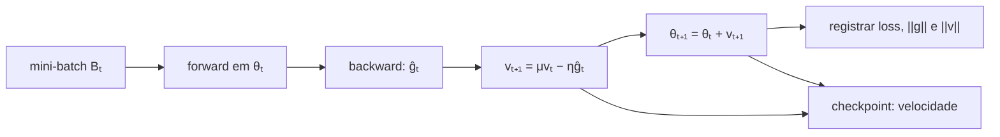
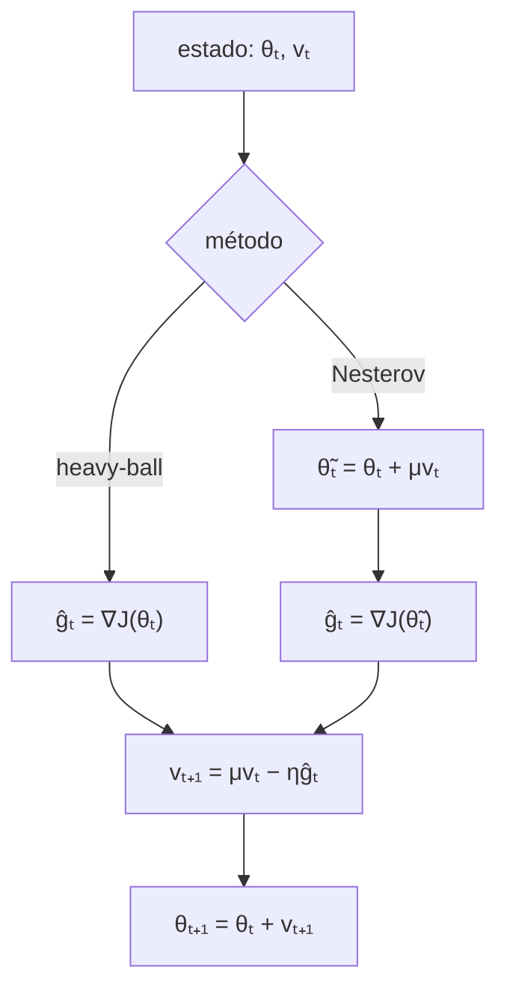

<!-- mirandastech-aula-v2 -->

# Aula 19 — Momentum e Nesterov: velocidade, amortecimento e ravinas

> **Trilha:** M5 — Redes neurais do zero  
> **Objetivo central:** adicionar memória ao SGD, entender a dinâmica resultante e implementar momentum clássico e Nesterov em NumPy puro.  
> **Implementação:** sem autograd, sem classes de otimizadores prontas e com convenções explícitas.

[](https://colab.research.google.com/github/joaopaulomirandamatias/ai-lab/blob/main/04-deep-learning/m5-redes-neurais-do-zero/notebooks/19-momentum-nesterov-laboratorio.ipynb)

## 1. O problema: SGD ziguezagueia dentro da ravina

Na Aula 18, uma quadrática mal condicionada revelou um conflito. A direção de alta curvatura exige learning rate pequeno; com esse mesmo passo, a direção quase plana avança devagar. O SGD atravessa repetidamente as paredes da ravina enquanto progride pouco ao longo dela.

Imagine ajustar uma MLP em que duas combinações de parâmetros possuem curvaturas muito diferentes. Os gradientes na direção íngreme alternam de sinal: esquerda, direita, esquerda. Já a componente ao longo da ravina aponta de modo persistente para o mínimo. Usar apenas o gradiente atual descarta esse padrão temporal.

**Momentum** mantém uma velocidade. Componentes persistentes se acumulam; oscilações que alternam de sinal tendem a se cancelar. **Nesterov** acrescenta uma pergunta: em vez de medir o gradiente onde estamos, o que acontece se o medirmos no ponto para o qual a velocidade já nos levaria?

Momentum modifica a otimização, não a função objetivo. Regularização, capacidade e generalização ficam para a Aula 20.

## 2. Objetivos de aprendizagem

Ao concluir esta aula, você será capaz de:

1. implementar SGD com momentum clássico, tensor por tensor;
2. interpretar velocidade, coeficiente de momentum e amortecimento;
3. expandir a velocidade como uma soma ponderada de gradientes passados;
4. explicar por que momentum ajuda em ravinas mal condicionadas;
5. derivar a recorrência do heavy-ball em uma quadrática;
6. implementar Nesterov avaliando o gradiente no *lookahead*;
7. distinguir convenções de momentum que parecem iguais, mas mudam a escala efetiva;
8. testar invariantes como $\mu=0$ e retomada exata de checkpoint;
9. comparar otimizadores com orçamento, batches e splits controlados.

## 3. Pré-requisitos

- gradiente, Hessiana, autovalores e número de condição;
- forward e backward vetorizados;
- redução média da loss e mini-batches;
- inicialização e propagação de normas;
- SGD, learning rate, schedules e checkpoints da Aula 18.

## 4. Vocabulário

| Termo | Significado nesta aula |
|---|---|
| velocidade $v_t$ | estado que combina atualizações anteriores e gradiente atual |
| momentum $\mu$ | fração da velocidade anterior preservada, usualmente $0\leq\mu<1$ |
| amortecimento | perda gradual da influência de gradientes antigos |
| heavy-ball | método clássico de Polyak com termo inercial |
| memória efetiva | horizonte aproximado de contribuições relevantes, da ordem de $1/(1-\mu)$ |
| ravina | região com curvaturas muito diferentes entre direções |
| lookahead | posição antecipada $\theta_t+\mu v_t$ usada por Nesterov |
| estado do otimizador | velocidades e contadores necessários além dos parâmetros |

## 5. Momentum clássico: uma convenção completa

Adotaremos a convenção de **velocidade como atualização**:

\[
v_{t+1}=\mu v_t-\eta\widehat g_t,
\qquad
\theta_{t+1}=\theta_t+v_{t+1},
\qquad v_0=0,
\]

onde:

- $\theta_t\in\mathbb{R}^P$ contém os parâmetros antes do step;
- $\widehat g_t$ é o gradiente médio do mini-batch avaliado em $\theta_t$;
- $\eta>0$ é o learning rate;
- $\mu\in[0,1)$ é o coeficiente de momentum;
- $v_t$ tem o mesmo shape e dtype de $\theta_t$.

Quando $\mu=0$, recuperamos exatamente o SGD:

\[
v_{t+1}=-\eta\widehat g_t,
\qquad
\theta_{t+1}=\theta_t-\eta\widehat g_t.
\]

Esse caso-limite é um teste de unidade essencial. Se duas implementações, alimentadas pelos mesmos batches, não coincidem para $\mu=0$, há erro de sinal, ordem ou redução.



## 6. A velocidade como memória exponencial

Expandindo a recorrência com $v_0=0$:

\[
v_{t+1}
=-\eta\sum_{k=0}^{t}\mu^{t-k}\widehat g_k.
\]

Gradientes recentes recebem peso maior; os antigos decaem geometricamente. A soma dos pesos até $t$ é

\[
\sum_{j=0}^{t}\mu^j=\frac{1-\mu^{t+1}}{1-\mu}.
\]

Para um gradiente constante $g$, a velocidade converge para

\[
v_\infty=-\frac{\eta}{1-\mu}g.
\]

Logo, aumentar $\mu$ sem reconsiderar $\eta$ pode ampliar muito o passo sustentado. Com $\mu=0{,}9$, o ganho assintótico é 10; com $\mu=0{,}99$, é 100. A aproximação $1/(1-\mu)$ também fornece uma intuição do horizonte de memória: cerca de 10 steps para 0,9 e 100 para 0,99. Não é uma janela rígida.

### Exemplo resolvido

Considere $g=2$, $\eta=0{,}1$, $\mu=0{,}9$ e $v_0=0$:

\[
v_1=-0{,}2,
\]

\[
v_2=0{,}9(-0{,}2)-0{,}2=-0{,}38,
\]

\[
v_3=0{,}9(-0{,}38)-0{,}2=-0{,}542.
\]

O limite é $-0{,}1\times2/(1-0{,}9)=-2$. A velocidade não salta diretamente para esse valor: há uma fase de aquecimento.

## 7. Por que momentum ajuda numa ravina

Separe o gradiente em duas direções:

- na direção íngreme, o sinal alterna após cruzar a ravina;
- na direção plana, o sinal permanece por muitos steps.

Na soma exponencial, componentes alternantes se cancelam parcialmente. Componentes persistentes se reforçam. Isso reduz zigue-zague e aumenta o deslocamento útil ao longo da ravina.

| Componente do gradiente | Sequência ilustrativa | Efeito da memória |
|---|---|---|
| parede íngreme | $+,-,+,-$ | cancelamento parcial |
| eixo da ravina | $+,+,+,+$ | acumulação |
| ruído sem viés | sinais irregulares | filtragem parcial, não eliminação |
| viés sistemático | mesmo sentido errado | acumulação do erro |

Momentum não sabe qual direção é “boa”. Ele explora persistência temporal. Se os gradientes estiverem contaminados, mal escalados ou errados, a memória pode prolongar o defeito.

## 8. Heavy-ball em uma quadrática

Como $v_t=\theta_t-\theta_{t-1}$, a regra pode ser escrita como

\[
\theta_{t+1}
=\theta_t-\eta\nabla J(\theta_t)
+\mu(\theta_t-\theta_{t-1}).
\]

Para

\[
J(\theta)=\frac12\lambda\theta^2,
\qquad \lambda>0,
\]

temos

\[
\theta_{t+1}
=(1+\mu-\eta\lambda)\theta_t-\mu\theta_{t-1}.
\]

Buscando soluções da forma $\theta_t=r^t$, obtemos o polinômio característico

\[
r^2-(1+\mu-\eta\lambda)r+\mu=0.
\]

Convergência linear exige que ambas as raízes tenham módulo menor que 1. Para $0\leq\mu<1$, o teste de estabilidade dessa recorrência escalar resulta em

\[
0<\eta\lambda<2(1+\mu).
\]

Essa faixa é exata para a quadrática escalar sob esta convenção. Não é licença para usar learning rate maior em qualquer MLP: não convexidade, ruído, mudança de curvatura e precisão finita alteram a dinâmica. Mesmo dentro da região estável, pode haver oscilação e transientes grandes.

Em uma quadrática fortemente convexa com autovalores em $[m,L]$, parâmetros heavy-ball clássicos são

\[
\eta^*=\frac{4}{(\sqrt{L}+\sqrt{m})^2},
\qquad
\mu^*=\left(\frac{\sqrt{L}-\sqrt{m}}{\sqrt{L}+\sqrt{m}}\right)^2.
\]

Eles dependem de hipóteses fortes e do conhecimento de $m$ e $L$. Servem como resultado analítico e contraprova de que $\eta$ e $\mu$ são acoplados, não como hiperparâmetros universais.

## 9. Nesterov: gradiente no ponto antecipado

Na forma operacional adotada aqui:

\[
\widetilde\theta_t=\theta_t+\mu v_t,
\]

\[
\widehat g_t=\nabla J(\widetilde\theta_t),
\]

\[
v_{t+1}=\mu v_t-\eta\widehat g_t,
\qquad
\theta_{t+1}=\theta_t+v_{t+1}.
\]

O heavy-ball mede a inclinação em $\theta_t$. Nesterov primeiro antecipa o deslocamento inercial e mede a inclinação em $\widetilde\theta_t$. Se a velocidade estiver prestes a atravessar uma parede, o gradiente antecipado pode corrigir o curso antes da atualização final.



O *lookahead* não é apenas uma variável para logging. O forward e o backward do mini-batch precisam usar os parâmetros antecipados. Depois, a velocidade atualiza o parâmetro original. Em uma MLP, isso exige cuidado para não sobrescrever $\theta_t$ antes de produzir todos os gradientes.

## 10. Convenções diferentes não podem ser misturadas

Outra implementação comum armazena uma média móvel de gradientes:

\[
m_{t+1}=\mu m_t+(1-\mu)\widehat g_t,
\qquad
\theta_{t+1}=\theta_t-\eta m_{t+1}.
\]

Ela inclui o fator $1-\mu$ que não aparece na velocidade adotada nesta aula. Com gradiente constante, $m_t\to g$, enquanto nossa velocidade tende a $-\eta g/(1-\mu)$. Copiar o mesmo valor numérico de $\eta$ entre as duas fórmulas muda a escala da trajetória.

Também há formas algébricas de Nesterov usadas por bibliotecas que atualizam buffers em ordem diferente. Elas podem ser equivalentes após mudança de variáveis, mas comparar linha a linha sem declarar a parametrização cria falsos bugs. Ao auditar código, registre:

- o que o buffer armazena: gradiente filtrado ou atualização;
- onde o gradiente é avaliado;
- se existe fator $1-\mu$;
- quando parâmetros e buffer são mutados;
- como weight decay é incorporado — assunto da próxima aula.

## 11. Implementação mínima em NumPy

```python
def momentum_step(params, grads, velocity, learning_rate, momentum):
    if learning_rate <= 0 or not 0 <= momentum < 1:
        raise ValueError("hiperparâmetros inválidos")

    new_params, new_velocity = {}, {}
    for name, value in params.items():
        grad = grads[name]
        old_v = velocity[name]
        if value.shape != grad.shape or value.shape != old_v.shape:
            raise ValueError(f"shape incompatível em {name}")
        if not np.isfinite(grad).all():
            raise FloatingPointError(f"gradiente não finito em {name}")

        v = momentum * old_v - learning_rate * grad
        new_velocity[name] = v
        new_params[name] = value + v

    return new_params, new_velocity
```

Para Nesterov, crie primeiro `lookahead[name] = params[name] + momentum * velocity[name]`; execute forward/backward inteiramente nesse dicionário; então chame a mesma atualização com os gradientes obtidos no *lookahead*.

Funções sem mutação silenciosa tornam testes de ordem e shape mais fáceis. Depois de validar a implementação, operações in-place podem reduzir alocações.

## 12. Estado, checkpoints e retomada exata

Momentum torna o otimizador explicitamente stateful. Salvar apenas $\theta$ e reiniciar $v=0$ produz outro experimento, mesmo que os próximos batches sejam idênticos.

Um checkpoint reproduzível deve conter pelo menos:

- todos os parâmetros e todas as velocidades;
- step, epoch e posição dentro da epoch;
- estado do gerador aleatório ou ordem futura dos batches;
- learning rate, $\mu$ e schedule;
- redução da loss, batch size e dtype;
- hashes de dados e código.

Teste recomendado: execute $K$ steps, salve, retome por $R$ steps e compare bit a bit — ou dentro de tolerância documentada — com uma execução contínua de $K+R$ steps. Em seguida, zere deliberadamente a velocidade e confirme que o teste detecta a divergência.

## 13. Comparação experimental honesta

Momentum e Nesterov adicionam hiperparâmetros. Uma comparação justa deve:

1. fixar split, inicialização, sequência de batches, dtype e orçamento de updates;
2. definir previamente grades de $\eta$ e $\mu$ para cada método;
3. selecionar configurações somente na validação;
4. usar o mesmo critério de parada ou o mesmo orçamento;
5. repetir seeds predefinidas;
6. consultar o teste reservado apenas após a escolha final.

Dar ao momentum uma busca extensa e comparar contra um único learning rate ruim de SGD não demonstra superioridade. Usar o mesmo $\eta$ também não garante justiça, porque as convenções possuem escalas efetivas diferentes. O comparável é o protocolo de seleção e o orçamento.

Registre, além da loss:

\[
r_t=\frac{\|v_{t+1}\|_2}{\|\theta_t\|_2+\varepsilon},
\qquad
c_t=\frac{v_{t+1}^\top v_t}{\|v_{t+1}\|_2\|v_t\|_2+\varepsilon}.
\]

$r_t$ mede a atualização relativa; $c_t$ mede alinhamento entre velocidades consecutivas. São instrumentos de diagnóstico, não limites universais.

## 14. Armadilhas e erros comuns

### Usar o gradiente no ponto errado em Nesterov

Calcular `grad(params)` e apenas adicionar `mu * velocity` depois implementa heavy-ball com outra escrita, não o Nesterov definido nesta aula.

### Esquecer que $\eta$ e $\mu$ interagem

Momentum alto aumenta memória e passo sustentado. Ajustar somente $\mu$ pode causar overshooting ou explosão.

### Inicializar velocidade com os parâmetros

A inicialização padrão desta convenção é zero com mesmo shape e dtype. Copiar pesos injeta um deslocamento arbitrário no primeiro step.

### Reiniciar velocidade a cada epoch

Isso corta a memória em fronteiras artificiais e muda o algoritmo. Reinicie apenas se o protocolo declarar uma razão experimental.

### Reutilizar buffer com shape compatível, mas parâmetro errado

Dois tensores podem compartilhar shape. Identifique velocidades por nome estável e valide o conjunto de chaves.

### Misturar redução soma e média

Se a escala do gradiente muda com batch size, a combinação $\eta$–$\mu$ também muda.

### Confundir otimização com regularização

Chegar mais rápido a baixa loss de treino não prova melhor generalização. Essa separação será central na Aula 20.

### Declarar Nesterov sempre superior

O benefício depende da geometria, ruído, parametrização e ajuste. Em alguns problemas, SGD ou heavy-ball podem empatar ou vencer sob o mesmo orçamento.

## 15. Checklist prático

- [ ] A convenção da velocidade está escrita junto ao código.
- [ ] $v_0=0$ e cada velocidade replica shape e dtype do parâmetro.
- [ ] O teste $\mu=0$ coincide com SGD sob os mesmos batches.
- [ ] Em Nesterov, forward e backward usam o *lookahead*.
- [ ] Learning rate e momentum são escolhidos conjuntamente na validação.
- [ ] Split, inicialização, batches, seeds e orçamento são controlados.
- [ ] Loss, normas de gradiente, velocidade e atualização são registradas.
- [ ] Há interrupção para `nan`, `inf` e crescimento sustentado.
- [ ] O checkpoint inclui velocidade e estado do sampler.
- [ ] Retomada é comparada com uma execução contínua.
- [ ] O teste reservado não participa da seleção.
- [ ] Conclusões distinguem velocidade de otimização e generalização.

## 16. Resumo

- Momentum adiciona memória exponencial às atualizações do SGD.
- Na convenção adotada, $v_{t+1}=\mu v_t-\eta g_t$ e $\theta_{t+1}=\theta_t+v_{t+1}$.
- Gradientes alternantes tendem a se cancelar; componentes persistentes se acumulam.
- Em quadráticas, a dinâmica é uma recorrência de segunda ordem controlada conjuntamente por $\eta$, $\mu$ e curvatura.
- Nesterov avalia o gradiente no ponto antecipado $\theta_t+\mu v_t$.
- Fórmulas com ou sem $1-\mu$ não compartilham automaticamente o mesmo learning rate efetivo.
- A velocidade faz parte do checkpoint e da identidade do experimento.
- Melhor otimização de treino não implica melhor generalização.

## 17. Exercícios

### 1. Dois steps de momentum

Com $\theta_0=3$, $v_0=0$, gradientes $g_0=4$ e $g_1=2$, $\eta=0{,}1$ e $\mu=0{,}9$, calcule $v_1$, $\theta_1$, $v_2$ e $\theta_2$.

### 2. Caso-limite

Mostre que $\mu=0$ recupera SGD.

### 3. Memória

Qual é o ganho assintótico da velocidade para gradiente constante quando $\mu=0{,}95$?

### 4. Gradientes alternantes

Para $g_t=(-1)^t g$, explique por que a memória não acumula magnitude como no caso constante.

### 5. Estabilidade quadrática

Com $\lambda=20$ e $\mu=0{,}8$, qual é a faixa de $\eta$ prevista pela recorrência escalar?

### 6. Parâmetros analíticos

Calcule $\eta^*$ e $\mu^*$ para uma quadrática com $m=1$ e $L=9$.

### 7. Lookahead

Se $\theta_t=2$, $v_t=-0{,}5$ e $\mu=0{,}8$, em qual ponto Nesterov avalia o gradiente?

### 8. Convenções

Por que copiar $\eta=0{,}01$ de uma regra com $(1-\mu)g_t$ para outra sem esse fator pode alterar a trajetória?

### 9. Checkpoint

Quais estados adicionais ao parâmetro são necessários para retomar exatamente um treino com momentum e batches embaralhados?

### 10. Protocolo

Descreva uma comparação honesta entre SGD, heavy-ball e Nesterov.

## 18. Respostas comentadas

### 1.

\[
v_1=0{,}9(0)-0{,}1(4)=-0{,}4,
\qquad \theta_1=3-0{,}4=2{,}6.
\]

\[
v_2=0{,}9(-0{,}4)-0{,}1(2)=-0{,}56,
\qquad \theta_2=2{,}6-0{,}56=2{,}04.
\]

O segundo deslocamento incorpora parte do primeiro.

### 2.

Substituindo $\mu=0$: $v_{t+1}=-\eta g_t$ e $\theta_{t+1}=\theta_t-\eta g_t$, exatamente a regra de SGD.

### 3.

O fator é $1/(1-0{,}95)=20$. Portanto, sob gradiente constante, $v_\infty=-20\eta g$ nesta convenção.

### 4.

Termos consecutivos entram com sinais opostos. A soma geométrica alternada produz cancelamento parcial, ao contrário da soma de termos com mesmo sinal.

### 5.

\[
0<\eta\lambda<2(1+\mu)
\Rightarrow
0<\eta<\frac{3{,}6}{20}=0{,}18.
\]

O limite pertence ao modelo quadrático escalar e é estrito.

### 6.

Como $\sqrt m=1$ e $\sqrt L=3$:

\[
\eta^*=\frac4{(3+1)^2}=0{,}25,
\qquad
\mu^*=\left(\frac{3-1}{3+1}\right)^2=0{,}25.
\]

### 7.

\[
\widetilde\theta_t=2+0{,}8(-0{,}5)=1{,}6.
\]

### 8.

Na média móvel, o gradiente novo entra multiplicado por $1-\mu$; na velocidade desta aula, entra inteiro. Para $\mu=0{,}9$, a contribuição imediata difere por fator 10 antes de qualquer reparametrização de $\eta$.

### 9.

Velocidades, step, epoch, posição na epoch, estado do gerador ou ordem dos batches, schedule, $\eta$, $\mu$, redução, dtype e versões/hashes relevantes.

### 10.

Fixe dados, split, inicialização, batches, seeds e número de updates. Dê a cada método uma grade predefinida comparável, selecione pela validação, repita seeds e consulte o teste uma única vez após a escolha.

## 19. Conexões com IA, pesquisa e sistemas reais

Em redes profundas, momentum pode reduzir o custo para atingir uma loss-alvo, mas seu estado aumenta a memória do treinamento e o tamanho do checkpoint. Em larga escala, reiniciar buffers após uma falha pode desperdiçar computação mesmo quando os pesos foram recuperados.

Em pesquisa, “SGD com momentum 0,9” é descrição incompleta. É preciso informar a convenção, learning rate, schedule, batch size, redução, inicialização, orçamento e política de retomada. Sem isso, uma reprodução pode implementar outro algoritmo mantendo o mesmo nome.

Em sistemas reais, contratos de shape, finitude e identidade entre parâmetro e buffer evitam corrupção silenciosa. Logs de normas permitem distinguir um gradiente explosivo de velocidade acumulada excessiva.

Nesterov também antecipa uma ideia recorrente em IA: usar estado para avaliar uma ação futura antes de confirmá-la. Aqui, porém, tudo permanece determinístico e local ao otimizador; não há planejamento agentic ou inferência simbólica.

## 20. Próxima aula

Na **Aula 20 — Regularização**, separaremos objetivo de treino e capacidade de generalização. Implementaremos L2, L1 e early stopping, observando como cada escolha interage com o otimizador sem confundir momentum com regularização.

## Referências

### Artigos e livros primários

- POLYAK, B. T. [Some Methods of Speeding Up the Convergence of Iteration Methods](https://doi.org/10.1016/0041-5553(64)90137-5). *USSR Computational Mathematics and Mathematical Physics*, v. 4, n. 5, p. 1–17, 1964. Consultado em 9 set. 2026.
- NESTEROV, Y. [Introductory Lectures on Convex Optimization: A Basic Course](https://link.springer.com/book/10.1007/978-1-4419-8853-9). Springer, 2004. Consultado em 9 set. 2026.
- SUTSKEVER, I. et al. [On the Importance of Initialization and Momentum in Deep Learning](https://proceedings.mlr.press/v28/sutskever13.html). *Proceedings of ICML*, v. 28, p. 1139–1147, 2013. Consultado em 9 set. 2026.

### Materiais técnicos abertos

- GOODFELLOW, I.; BENGIO, Y.; COURVILLE, A. [Deep Learning — Optimization for Training Deep Models](https://www.deeplearningbook.org/contents/optimization.html). MIT Press, 2016. Consultado em 9 set. 2026.
- ZHANG, A. et al. [Dive into Deep Learning 1.0.3 — Momentum](https://d2l.ai/chapter_optimization/momentum.html). Consultado em 9 set. 2026.
- STANFORD CS231N. [Neural Networks Part 3: Learning and Evaluation](https://cs231n.github.io/neural-networks-3/). Consultado em 9 set. 2026.
