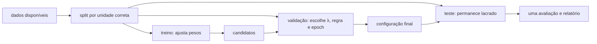
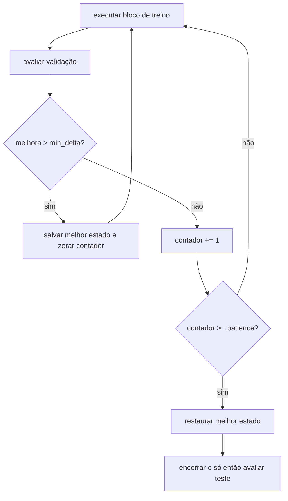

<!-- mirandastech-aula-v2 -->

# Aula 20 — Regularização: L2, L1, early stopping e capacidade

> **Trilha:** M5 — Redes neurais do zero  
> **Objetivo central:** controlar a generalização de uma MLP sem confundir baixa loss de treino com desempenho fora da amostra.  
> **Implementação:** NumPy puro, com penalidades e early stopping explícitos.

[](https://colab.research.google.com/github/joaopaulomirandamatias/ai-lab/blob/main/04-deep-learning/m5-redes-neurais-do-zero/notebooks/20-regularizacao-laboratorio.ipynb)

## 1. O problema: a rede aprende até o ruído

Uma MLP larga pode reduzir continuamente a loss de treino. Isso parece sucesso até observarmos a validação: ela melhora, atinge um mínimo e volta a piorar. A rede deixou de aprender apenas a estrutura estável e passou a ajustar particularidades do conjunto finito — inclusive ruído.

O objetivo real de aprendizado não é memorizar o treino. Queremos baixo risco em novos exemplos da mesma população. Como a distribuição verdadeira é desconhecida, usamos treino para ajustar parâmetros, validação para escolher configurações e teste reservado para estimar desempenho após todas as decisões.

**Regularização** é qualquer modificação do algoritmo de aprendizado destinada a reduzir erro de generalização, ainda que possa aumentar o erro de treino. Nesta aula, estudaremos três mecanismos mensuráveis:

- L2, que penaliza o quadrado dos pesos;
- L1, que penaliza seus valores absolutos e pode induzir esparsidade;
- early stopping, que limita o tempo de otimização usando validação.

Dropout é um mecanismo diferente e pertence à Aula 21.

## 2. Objetivos de aprendizagem

Ao concluir esta aula, você será capaz de:

1. distinguir capacidade, otimização, sobreajuste e generalização;
2. formular objetivos regularizados com convenções explícitas;
3. derivar e implementar os gradientes da penalidade L2;
4. explicar o subgradiente da norma L1 e aplicar *soft-thresholding*;
5. relacionar L2 acoplada e weight decay no SGD;
6. implementar early stopping com `patience`, `min_delta` e restauração do melhor estado;
7. excluir biases da penalidade segundo uma política documentada;
8. escolher hiperparâmetros apenas com treino e validação;
9. executar ablações sem contaminar o teste.

## 3. Pré-requisitos

- treino, validação e teste reservado;
- MSE, BCE e redução média;
- forward e backpropagation de uma MLP;
- mini-batch, epoch, SGD, learning rate e momentum;
- normas $L_1$ e $L_2$ de vetores.

## 4. Vocabulário

| Termo | Significado |
|---|---|
| capacidade | variedade de funções que o modelo e o algoritmo conseguem representar/ajustar |
| erro de treino | desempenho nos exemplos usados para atualizar parâmetros |
| erro de generalização | desempenho esperado em novos exemplos da população |
| gap de generalização | diferença observada entre métricas de treino e dados não usados no ajuste |
| regularizador | modificação que expressa preferência por certas soluções |
| hiperparâmetro $\lambda$ | intensidade da penalidade, escolhido sem usar o teste |
| esparsidade | presença de muitos parâmetros exatamente iguais a zero |
| subgradiente | generalização do gradiente para pontos não diferenciáveis |
| patience | número tolerado de avaliações sem melhora relevante |
| restore best | restauração do estado com melhor métrica de validação |

## 5. Capacidade não é apenas número de parâmetros

Largura, profundidade, ativações e conectividade influenciam as funções que uma rede pode representar. Porém, a capacidade efetiva também depende de:

- escala e inicialização dos pesos;
- duração e algoritmo de treinamento;
- quantidade, diversidade e ruído dos dados;
- restrições e penalidades;
- precisão numérica e orçamento computacional.

Uma MLP com mais parâmetros que exemplos pode memorizar rótulos arbitrários, mas isso não implica que sempre generalizará mal. Redes sobreparametrizadas também podem generalizar. Portanto, “parâmetros maiores que amostras” é alerta para medir, não sentença automática.

| Situação | Treino | Validação | Hipótese inicial |
|---|---:|---:|---|
| ambos ruins | ruim | ruim | baixa capacidade, features inadequadas ou falha de otimização |
| treino bom, validação ruim | bom | ruim | sobreajuste ou mudança de distribuição |
| ambos bons | bom | bom | faixa útil; ainda falta teste reservado |
| treino pior que validação | maior loss | menor loss | ruído/augmentação no treino, avaliação inconsistente ou amostra atípica |

O gap sozinho não identifica a causa. Sempre confira distribuição, pipeline, redução da loss e ausência de leakage.

## 6. O protocolo antes da fórmula

Separe os dados antes de ajustar a rede:



Se exemplos da mesma pessoa, máquina ou sequência temporal aparecem em mais de um split, a independência pode ser ilusória. Regularização não corrige vazamento. A unidade de análise e o instante de disponibilidade das features continuam válidos.

## 7. Objetivo regularizado e convenção de escala

Se a loss média de dados é

\[
J_{\text{dados}}(\theta)
=\frac1N\sum_{i=1}^{N}\ell(f(x_i;\theta),y_i),
\]

definimos

\[
J_{\text{total}}(\theta)
=J_{\text{dados}}(\theta)+\lambda\Omega(\theta),
\qquad \lambda\geq0.
\]

$\Omega$ é a penalidade. A convenção importa. Se outro código soma losses em vez de calcular a média, reutilizar o mesmo $\lambda$ muda a força relativa da regularização. Registre:

- se a loss de dados é média ou soma;
- quais tensores entram em $\Omega$;
- fatores como $1/2$;
- se a penalidade é aplicada por step ou por epoch;
- como batch size e número de updates são controlados.

Nesta aula, penalizamos `W1` e `W2`, não `b1` e `b2`. Excluir biases é uma política comum porque eles deslocam unidades sem controlar diretamente a sensibilidade às entradas. Não é lei: a política deve ser explícita e consistente.

## 8. Regularização L2

Adotaremos

\[
\Omega_2(W)=\frac12\sum_l\|W^{(l)}\|_F^2,
\]

onde $\|W\|_F^2=\sum_{i,j}W_{ij}^2$. O objetivo fica

\[
J_{L2}=J_{\text{dados}}+\frac{\lambda}{2}\sum_l\|W^{(l)}\|_F^2.
\]

Para cada matriz de pesos:

\[
\frac{\partial J_{L2}}{\partial W^{(l)}}
=\frac{\partial J_{\text{dados}}}{\partial W^{(l)}}
+\lambda W^{(l)}.
\]

O fator $1/2$ cancela o 2 da derivada. O gradiente do bias permanece o gradiente da loss de dados segundo nossa política.

### Exemplo resolvido

Considere $W=[2,-1]$, gradiente de dados $g=[0{,}4,0{,}2]$ e $\lambda=0{,}1$:

\[
\nabla_W J_{L2}
=g+\lambda W
=[0{,}4,0{,}2]+[0{,}2,-0{,}1]
=[0{,}6,0{,}1].
\]

Com $\eta=0{,}05$:

\[
W_{novo}=W-\eta\nabla_WJ_{L2}
=[1{,}97,-1{,}005].
\]

L2 não “empurra todos os pesos diretamente a zero” no mesmo ritmo; o gradiente de dados continua competindo com a penalidade.

## 9. L2 acoplada e weight decay no SGD

No SGD puro:

\[
W_{t+1}
=W_t-\eta(g_t+\lambda W_t)
=(1-\eta\lambda)W_t-\eta g_t.
\]

Assim, adicionar $\lambda W$ ao gradiente é algebricamente igual a decair pesos por $1-\eta\lambda$ e aplicar o gradiente de dados, para esta ordem e para SGD.

Essa equivalência não deve ser generalizada sem cuidado. Com momentum, pré-condicionamento adaptativo ou ordens diferentes de atualização, penalidade acoplada e decay desacoplado podem produzir trajetórias distintas. Também é erro aplicar `grad += lambda * W` e depois multiplicar novamente `W` por `1 - eta*lambda`: isso conta L2 duas vezes.

## 10. Regularização L1

A penalidade L1 é

\[
\Omega_1(W)=\sum_l\|W^{(l)}\|_1
=\sum_{l,i,j}|W^{(l)}_{ij}|.
\]

Para $w\neq0$:

\[
\frac{d|w|}{dw}=\operatorname{sign}(w).
\]

Em $w=0$, a função não é diferenciável. Seu subgradiente é o intervalo

\[
\partial|w|_{w=0}=[-1,1].
\]

Uma atualização ingênua com `sign` pode atravessar zero e oscilar sem produzir esparsidade exata. Uma etapa proximal aplica primeiro o gradiente dos dados:

\[
z=W_t-\eta g_t,
\]

e depois o operador de *soft-thresholding*:

\[
W_{t+1}=S_{\eta\lambda}(z),
\]

\[
S_\tau(z)=\operatorname{sign}(z)\max(|z|-\tau,0).
\]

Se $|z|\leq\eta\lambda$, o parâmetro vira exatamente zero. Isso torna a evidência de esparsidade auditável.

| Aspecto | L2 | L1 proximal |
|---|---|---|
| penalidade | quadrado | valor absoluto |
| suavidade | diferenciável | quina em zero |
| efeito típico | encolhimento distribuído | muitos zeros possíveis |
| parâmetros correlacionados | tende a compartilhar peso | pode selecionar de modo instável |
| implementação | soma $\lambda W$ ao gradiente | gradiente de dados + soft-threshold |

Em redes, zeros individuais não garantem redução de latência em hardware denso. Esparsidade útil para deploy depende de formato estruturado e suporte do runtime.

## 11. Early stopping

Early stopping trata o número de updates como controle de capacidade efetiva. A cada intervalo definido:

1. mede-se a validação sem atualizar parâmetros;
2. se a melhora exceder `min_delta`, salva-se o estado;
3. caso contrário, incrementa-se um contador;
4. ao atingir `patience`, encerra-se o treino;
5. restaura-se o melhor estado, não o último.



`patience=0` costuma reagir ao ruído de uma única avaliação. Patience muito grande reduz o efeito regularizador e aumenta custo. `min_delta` deve estar na escala da métrica. O intervalo de avaliação também faz parte da regra.

Early stopping usa repetidamente a validação. Se experimentarmos muitas arquiteturas, seeds e regras até obter um resultado agradável, também podemos sobreajustar à validação. Para conclusões de pesquisa, mantenha um teste externo e, quando necessário, validação aninhada.

## 12. Implementação mínima

```python
WEIGHT_KEYS = ("W1", "W2")

def add_l2_gradient(grads, params, strength):
    result = {name: grad.copy() for name, grad in grads.items()}
    for name in WEIGHT_KEYS:
        result[name] += strength * params[name]
    return result

def soft_threshold(value, threshold):
    return np.sign(value) * np.maximum(np.abs(value) - threshold, 0.0)
```

O forward e o backward de dados não precisam conhecer $\lambda$. Separar responsabilidades facilita gradient checking, evita penalizar bias sem querer e permite ablação com o mesmo código.

## 13. Escolha honesta de $\lambda$

Uma grade simples pode conter $0,10^{-5},10^{-4},10^{-3},10^{-2}$. Para cada candidato:

- reinicie da mesma distribuição de inicialização ou use seeds predefinidas;
- mantenha batches, orçamento e learning rate controlados;
- treine apenas no conjunto de treino;
- escolha pelo critério de validação declarado;
- relate loss de dados e penalidade separadamente;
- avalie o teste apenas depois da escolha.

O melhor $\lambda$ depende da escala da loss, parametrização, dados, arquitetura e duração do treino. “$10^{-4}$ sempre funciona” não é regra científica.

## 14. Armadilhas e erros comuns

### Somar a penalidade à métrica reportada como previsão

Para comparar qualidade preditiva, reporte a loss de dados. O objetivo total serve para otimização. Misturá-los oculta se a melhoria veio das previsões ou apenas de pesos menores.

### Penalizar bias por acidente

Iterar sobre todos os parâmetros sem lista explícita pode incluir biases. Teste quais chaves entram na penalidade.

### Escolher $\lambda$ no teste

O teste vira validação e deixa de ser evidência externa.

### Parar no último estado

Quando patience termina, o último modelo é geralmente pior que o melhor observado. Restaure o snapshot.

### Monitorar treino para early stopping

A loss de treino pode continuar caindo durante o sobreajuste. O sinal de parada deve vir de dados não usados nos updates.

### Declarar zeros com tolerância sem informar

Valores pequenos não são zeros. Relate o limiar ou use uma operação proximal que produza zeros exatos.

### Confundir regularização e reparo de pipeline

L2 não corrige leakage, rótulos errados, split inválido ou bug de broadcasting.

### Comparar objetivos totais com $\lambda$ diferentes

Cada candidato possui outra função objetivo. Compare a métrica preditiva na validação, não apenas $J_{total}$.

## 15. Checklist prático

- [ ] A unidade de análise e o split evitam leakage.
- [ ] O teste permanece lacrado durante seleção e parada.
- [ ] A redução da loss de dados está documentada.
- [ ] O fator $1/2$ da L2 e a convenção de $\lambda$ estão explícitos.
- [ ] Somente tensores listados recebem penalidade.
- [ ] O gradiente L2 foi conferido por diferenças finitas.
- [ ] L1 trata a quina em zero conscientemente.
- [ ] Esparsidade informa zeros exatos e total de parâmetros.
- [ ] Early stopping declara métrica, intervalo, `min_delta` e `patience`.
- [ ] O melhor estado é restaurado.
- [ ] Candidatos usam inicialização, orçamento e dados controlados.
- [ ] Loss preditiva e penalidade são registradas separadamente.
- [ ] A conclusão não promete generalização fora da população avaliada.

## 16. Resumo

- Capacidade é propriedade do modelo, do algoritmo, dos dados e do orçamento de treino.
- Regularização busca reduzir erro de generalização, podendo aumentar erro de treino.
- L2 adiciona $\lambda W$ ao gradiente das matrizes penalizadas.
- No SGD puro, L2 acoplada equivale ao weight decay sob convenções específicas.
- L1 é não diferenciável em zero; soft-thresholding pode produzir esparsidade exata.
- Early stopping usa validação, patience e restauração do melhor estado.
- $\lambda$, regra de parada e arquitetura são escolhidos sem consultar o teste.
- Nenhum regularizador corrige dados contaminados ou avaliação inválida.

## 17. Exercícios

### 1. Penalidade L2

Calcule $\Omega_2$ para $W=[2,-1,3]$ usando o fator $1/2$.

### 2. Gradiente L2

Se $g_{dados}=[0{,}2,-0{,}4]$, $W=[3,-2]$ e $\lambda=0{,}1$, qual é o gradiente total?

### 3. Weight decay

Com $W=5$, $g=2$, $\eta=0{,}01$ e $\lambda=0{,}2$, calcule um step de SGD com L2.

### 4. Soft-threshold

Calcule $S_{0{,}2}(0{,}1)$, $S_{0{,}2}(0{,}7)$ e $S_{0{,}2}(-0{,}5)$.

### 5. Subgradiente

Por que `sign(0)=0` é uma escolha válida, mas não a única, para a norma L1?

### 6. Bias

Por que excluir biases da penalidade pode ser razoável? Isso é obrigatório?

### 7. Early stopping

O melhor valor de validação ocorreu na epoch 42, mas o treino parou na 50. Qual estado deve ser entregue?

### 8. Min delta

Qual é o risco de usar `min_delta=0` numa curva de validação ruidosa?

### 9. Leakage

Por que testar cinco valores de $\lambda$ e escolher o melhor resultado de teste invalida o teste reservado?

### 10. Diagnóstico

Treino e validação estão ruins mesmo com $\lambda=0$. Cite quatro hipóteses antes de aumentar regularização.

## 18. Respostas comentadas

### 1.

\[
\Omega_2=\frac12(2^2+(-1)^2+3^2)=\frac12(14)=7.
\]

### 2.

\[
g_{total}=g_{dados}+\lambda W
=[0{,}2,-0{,}4]+[0{,}3,-0{,}2]
=[0{,}5,-0{,}6].
\]

### 3.

\[
W_{novo}=5-0{,}01(2+0{,}2\times5)=4{,}97.
\]

Equivalentemente: $(1-0{,}002)5-0{,}02=4{,}97$.

### 4.

Os resultados são $0$, $0{,}5$ e $-0{,}3$. Magnitudes abaixo do limiar viram zero; as demais encolhem pelo limiar.

### 5.

Em zero, o conjunto subgradiente é $[-1,1]$. Zero pertence a esse intervalo, mas outros valores também satisfazem a definição.

### 6.

Biases controlam deslocamentos e não diretamente a sensibilidade às entradas; excluí-los evita penalizar esse ajuste de nível. Não é obrigatório: é uma política que precisa ser declarada.

### 7.

O snapshot da epoch 42. O estado da epoch 50 apenas acionou a regra de parada e pode ter validação pior.

### 8.

Melhoras minúsculas causadas por ruído podem reiniciar patience indefinidamente. Um `min_delta` coerente com a escala evita tratar flutuação irrelevante como progresso.

### 9.

O teste participou de uma decisão. O maior entre cinco resultados contém viés de seleção e já não estima de forma externa o pipeline escolhido.

### 10.

Capacidade insuficiente, learning rate inadequado, inicialização ruim, erro no backward, features pouco informativas, rótulos inconsistentes ou undertraining. Regularização adicional tende a piorar underfitting.

## 19. Conexões com IA, pesquisa e sistemas reais

Em grandes modelos, regularização afeta qualidade, custo e reprodutibilidade. Early stopping pode economizar aceleradores, mas exige checkpoints versionados e validações comparáveis. Uma falha ao restaurar o melhor estado converte economia em regressão silenciosa.

Em pesquisa, ablações devem separar arquitetura, regularizador e duração. Se L2 e early stopping mudam simultaneamente, não sabemos qual mecanismo causou o resultado. Relate distribuição entre seeds, não apenas a melhor execução.

Em sistemas reais, a população pode mudar. Um $\lambda$ escolhido em validação histórica não garante robustez após drift. Monitoramento pós-deploy e reavaliação pertencem ao ciclo operacional estudado mais adiante.

L1 pode reduzir parâmetros numericamente, mas ganho de memória ou latência exige suporte a esparsidade. Evidência algorítmica e evidência de sistema são medições diferentes.

## 20. Próxima aula

Na **Aula 21 — Dropout do zero**, implementaremos máscaras de Bernoulli e *inverted dropout*, distinguindo modo de treino e inferência e verificando a esperança das ativações sem depender de frameworks.

## Referências

### Artigos e capítulos primários

- TIBSHIRANI, R. [The Lasso Page — artigo original e recursos](https://tibshirani.su.domains/lasso.html). *Journal of the Royal Statistical Society: Series B*, v. 58, n. 1, p. 267–288, 1996. Consultado em 9 set. 2026.
- PRECHELT, L. [Early Stopping — But When?](https://link.springer.com/chapter/10.1007/3-540-49430-8_3). In: *Neural Networks: Tricks of the Trade*, p. 55–69. Springer, 1998/2002. Consultado em 9 set. 2026.
- ZHANG, C. et al. [Understanding Deep Learning Requires Rethinking Generalization](https://arxiv.org/abs/1611.03530). *ICLR*, 2017. Consultado em 9 set. 2026.

### Materiais técnicos abertos

- GOODFELLOW, I.; BENGIO, Y.; COURVILLE, A. [Deep Learning — Regularization for Deep Learning](https://www.deeplearningbook.org/contents/regularization.html). MIT Press, 2016. Consultado em 9 set. 2026.
- GOODFELLOW, I.; BENGIO, Y.; COURVILLE, A. [Deep Learning — Practical Methodology](https://www.deeplearningbook.org/contents/guidelines.html). MIT Press, 2016. Consultado em 9 set. 2026.
- PARIKH, N.; BOYD, S. [Proximal Algorithms](https://web.stanford.edu/~boyd/papers/prox_algs.html). *Foundations and Trends in Optimization*, v. 1, n. 3, p. 123–231, 2014. Consultado em 9 set. 2026.
