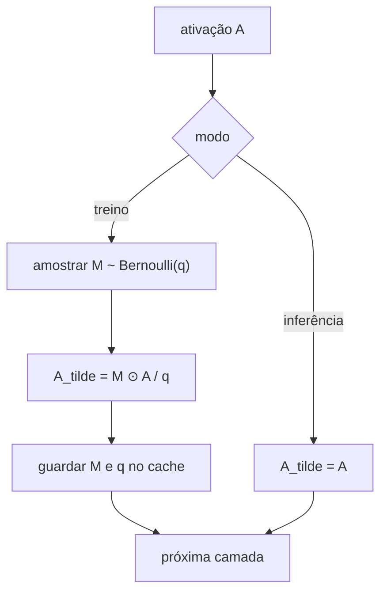
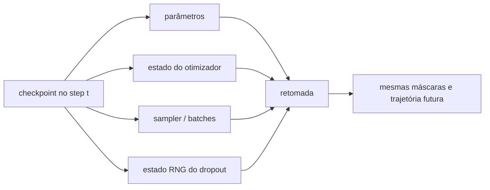

<!-- mirandastech-aula-v2 -->

# Aula 21 — Dropout do zero: máscaras de Bernoulli, escala e modos

> **Trilha:** M5 — Redes neurais do zero  
> **Objetivo central:** implementar dropout sem autograd e demonstrar, por esperança, variância e gradientes, o que muda entre treino e inferência.  
> **Implementação:** NumPy puro, seed controlada e máscara explícita no cache.

[](https://colab.research.google.com/github/joaopaulomirandamatias/ai-lab/blob/main/04-deep-learning/m5-redes-neurais-do-zero/notebooks/21-dropout-do-zero-laboratorio.ipynb)

## 1. O problema: unidades que dependem demais umas das outras

Na Aula 20, L1, L2 e early stopping controlaram capacidade por penalidade ou duração do treino. Dropout introduz outro mecanismo: durante cada atualização, algumas ativações são zeradas aleatoriamente. A rede não pode presumir que uma unidade específica estará sempre disponível e precisa aprender representações que tolerem essas ausências.

Imagine uma MLP de detecção de fraude. Duas unidades ocultas podem formar uma combinação muito específica para memorizar poucos exemplos de treino. Se uma delas for removida aleatoriamente em parte dos updates, a combinação deixa de ser uma dependência garantida. Isso adiciona ruído estruturado ao caminho forward.

Mas “zerar neurônios” é uma descrição incompleta. Uma implementação correta precisa responder:

- qual probabilidade significa “manter” e qual significa “descartar”;
- por que as ativações sobreviventes são reescaladas;
- qual máscara o backward deve reutilizar;
- por que treino e inferência executam caminhos diferentes;
- como reproduzir um experimento sem repetir a mesma máscara;
- como verificar gradientes quando a função é estocástica.

## 2. Objetivos de aprendizagem

Ao concluir esta aula, você será capaz de:

1. definir dropout por uma máscara de Bernoulli;
2. distinguir probabilidade de descarte \(p\) e de retenção \(q=1-p\);
3. derivar esperança e variância do *inverted dropout*;
4. implementar forward e backward com shapes preservados;
5. separar explicitamente os modos `training=True` e `training=False`;
6. realizar gradient checking com máscara congelada;
7. controlar o estado do gerador aleatório em checkpoints;
8. identificar máscaras compartilhadas acidentalmente pelo lote;
9. selecionar \(q\) na validação sem consultar o teste;
10. explicar limites da interpretação de “ensemble de sub-redes”.

## 3. Pré-requisitos

- variáveis de Bernoulli, esperança e variância;
- forward e backward de uma MLP;
- regra da cadeia e gradient checking;
- mini-batch, seed e estado do gerador aleatório;
- regularização, treino, validação e teste reservado.

## 4. Vocabulário

| Termo | Significado nesta aula |
|---|---|
| probabilidade de retenção \(q\) | chance de uma ativação permanecer ativa |
| probabilidade de descarte \(p\) | chance de zerar a ativação; \(p=1-q\) |
| máscara \(M\) | tensor de zeros e uns amostrado de Bernoulli |
| inverted dropout | escala \(1/q\) aplicada durante o treino |
| modo de treino | caminho estocástico que amostra máscara |
| modo de inferência | caminho determinístico, sem descarte |
| coadaptação | dependência entre unidades que funciona apenas em combinações específicas |
| estado do RNG | estado do gerador que determina a sequência futura de máscaras |
| máscara congelada | máscara mantida fixa para comparar derivadas |

## 5. Da ativação à variável aleatória

Seja \(A\in\mathbb{R}^{B\times H}\) a ativação de um mini-batch com \(B\) exemplos e \(H\) unidades. Para cada elemento:

\[
M_{ij}\sim\operatorname{Bernoulli}(q),
\qquad
P(M_{ij}=1)=q,
\qquad 0<q\leq1.
\]

No *inverted dropout*, o forward de treino é

\[
\widetilde A=\frac{M\odot A}{q},
\]

onde \(\odot\) é o produto elemento a elemento. Uma unidade descartada recebe zero; uma sobrevivente recebe \(A_{ij}/q\).

Condicionando em \(A\):

\[
\mathbb E[\widetilde A_{ij}\mid A_{ij}]
=\frac{A_{ij}}q\mathbb E[M_{ij}]
=\frac{A_{ij}}q q
=A_{ij}.
\]

Essa igualdade explica a escala. Sem dividir por \(q\), a ativação média de treino cairia para \(qA\). Com a convenção invertida, a escala esperada já coincide com a inferência.

## 6. O preço da preservação da média: variância

Preservar a esperança não torna o operador idêntico. Como \(\operatorname{Var}(M)=q(1-q)\):

\[
\operatorname{Var}(\widetilde A_{ij}\mid A_{ij})
=\frac{A_{ij}^2}{q^2}q(1-q)
=A_{ij}^2\frac{1-q}{q}.
\]

Quanto menor \(q\), maior o ruído. Para \(q=0{,}5\), a variância condicional é \(A_{ij}^2\). Para \(q=0{,}9\), é aproximadamente \(0{,}111A_{ij}^2\).

| \(q\) | descarte \(p\) | escala dos sobreviventes | variância relativa \((1-q)/q\) |
|---:|---:|---:|---:|
| 1,00 | 0,00 | 1,000 | 0,000 |
| 0,90 | 0,10 | 1,111 | 0,111 |
| 0,75 | 0,25 | 1,333 | 0,333 |
| 0,50 | 0,50 | 2,000 | 1,000 |
| 0,25 | 0,75 | 4,000 | 3,000 |

Logo, dropout forte pode destruir sinal e dificultar otimização. O melhor \(q\) é hiperparâmetro experimental, não constante universal.

## 7. Exemplo resolvido

Considere

\[
A=[2,-1,0{,}5],\quad q=0{,}5,\quad M=[1,0,1].
\]

Então

\[
\widetilde A
=\frac{[1,0,1]\odot[2,-1,0{,}5]}{0{,}5}
=[4,0,1].
\]

Em uma única amostra, os valores sobreviventes dobram. Repetindo muitas máscaras, cada posição sobrevive em cerca de metade das vezes e sua média retorna a \(A\).

O exemplo também mostra por que não devemos interpretar \(\widetilde A\) como uma versão “menor” determinística de \(A\). Ela é uma realização aleatória de um operador cujo primeiro momento foi preservado.

## 8. Treino e inferência são contratos diferentes



No modo de treino, cada forward consome aleatoriedade e guarda a máscara. No modo de inferência padrão, dropout é identidade:

\[
\widetilde A=A.
\]

Não se amostra máscara na validação usada para comparar modelos nem no teste reservado. Caso contrário, a métrica muda a cada chamada e mede uma configuração diferente.

O artigo original também descreve a convenção de treinar sem a escala \(1/q\) e reduzir pesos ou ativações no teste. As convenções podem ser algebricamente relacionadas, mas não devem ser misturadas. Nesta aula, toda implementação usa *inverted dropout*.

## 9. Backward: a mesma máscara retorna

Se \(G=\partial L/\partial\widetilde A\) é o gradiente upstream, então, mantendo \(M\) fixo:

\[
\frac{\partial L}{\partial A}
=G\odot\frac{M}{q}.
\]

Ativações descartadas recebem gradiente zero. As sobreviventes recebem o mesmo fator \(1/q\) do forward.

Não derivamos em relação a \(M\): a máscara é uma amostra discreta, não um parâmetro aprendido. Também não amostramos uma nova máscara no backward. Fazer isso quebraria o grafo efetivamente usado no forward.

Para \(q=1\), \(M\) é um tensor de uns e forward/backward viram identidades exatas. Esse é um teste unitário obrigatório.

## 10. Shapes e independência da máscara

Para dropout elemento a elemento em uma camada densa:

\[
A.shape=M.shape=\widetilde A.shape=(B,H).
\]

Criar uma máscara com shape \((1,H)\) e permitir broadcasting faz todos os exemplos do lote perderem as mesmas unidades. Isso é outro operador, não a implementação declarada. O código pode rodar sem erro e ainda assim estar metodologicamente errado.

Existem variantes que compartilham máscaras de propósito, por exemplo ao longo de dimensões espaciais ou temporais. Elas precisam de outra justificativa e contrato de shape. Nesta aula, cada exemplo e cada unidade recebem uma amostra independente.

## 11. Aleatoriedade reproduzível não é máscara repetida

Uma seed fixa inicializa uma **sequência** reproduzível:

```python
rng = np.random.default_rng(20260921)
mask = rng.random(activations.shape) < keep_prob
```

Recriar o gerador com a mesma seed dentro de cada forward repete a mesma máscara para sempre. Isso remove grande parte da diversidade que define dropout.

O estado do RNG pertence ao estado do experimento. Para retomar exatamente um treino, um checkpoint precisa guardar:

- parâmetros e estado do otimizador;
- step, epoch e posição do sampler;
- estado do RNG de batches;
- estado do RNG de dropout;
- hiperparâmetros e modo da rede.



Salvar somente os pesos pode produzir previsões de inferência iguais naquele instante, mas não reproduz os próximos updates.

## 12. Gradient checking sob stochasticidade

Diferenças centrais avaliam

\[
g_{\text{num},j}
=\frac{J(\theta_j+h)-J(\theta_j-h)}{2h}.
\]

Se cada lado amostra uma máscara diferente, a diferença contém a mudança de \(\theta\) **e** ruído do dropout. O quociente pode explodir quando \(h\) é pequeno.

O procedimento correto para testar o backward é:

1. amostrar uma máscara;
2. congelá-la;
3. usar a mesma máscara no forward analítico;
4. reutilizá-la em \(J(\theta+h)\) e \(J(\theta-h)\);
5. comparar gradientes longe de quinas de outras operações.

Isso verifica a derivada da sub-rede amostrada. Não transforma o treinamento inteiro em determinístico.

## 13. Onde colocar dropout

Em uma MLP básica, um contrato comum é:

\[
Z^{(1)}=XW^{(1)}+b^{(1)},\quad
A^{(1)}=\phi(Z^{(1)}),\quad
\widetilde A^{(1)}=\operatorname{Dropout}(A^{(1)}),\quad
Z^{(2)}=\widetilde A^{(1)}W^{(2)}+b^{(2)}.
\]

Aplicá-lo depois da ativação torna o cache e o backward diretos. Não se costuma descartar logits de saída de uma classificação comum, pois isso altera o objeto cuja loss é calculada. Dropout na entrada existe, mas muda a semântica para corrupção de features.

A ordem relativa a normalização não é neutra. BatchNorm usa estatísticas do lote; LayerNorm usa estatísticas por exemplo. Esse assunto pertence à Aula 22. Por enquanto, registre exatamente a posição do dropout em vez de copiar uma receita.

## 14. Implementação mínima em NumPy

```python
def dropout_forward(a, keep_prob, rng, training):
    if not 0 < keep_prob <= 1:
        raise ValueError("keep_prob deve estar em (0, 1]")
    if not training or keep_prob == 1:
        return a.copy(), None

    mask = rng.random(a.shape) < keep_prob
    out = a * mask / keep_prob
    return out, (mask, keep_prob)

def dropout_backward(upstream, cache):
    if cache is None:
        return upstream.copy()
    mask, keep_prob = cache
    if mask.shape != upstream.shape:
        raise ValueError("máscara e gradiente devem ter o mesmo shape")
    return upstream * mask / keep_prob
```

O argumento `training` não deve ser inferido do conteúdo dos dados. Ele é estado explícito do modelo. A validação dentro do laço de treino chama `training=False`, mesmo que os parâmetros ainda estejam sendo ajustados.

## 15. Dropout como ensemble: intuição com limite

Cada máscara seleciona uma sub-rede reduzida que compartilha parâmetros com todas as demais. A interpretação clássica é que o treino percorre muitas sub-redes e a inferência sem dropout aproxima uma combinação de suas previsões.

“Aproxima” é a palavra importante. Em redes não lineares, em geral:

\[
f(\mathbb E[\widetilde A])\neq\mathbb E[f(\widetilde A)].
\]

Portanto, a rede determinística de inferência não é necessariamente a média exata das previsões de todas as máscaras. A metáfora de ensemble ajuda a intuição, mas não substitui medição.

Manter dropout ativo deliberadamente na inferência para obter várias amostras é outra técnica, frequentemente chamada *Monte Carlo dropout*. Ela exige protocolo de incerteza e calibração; não é o modo padrão implementado aqui.

## 16. Seleção experimental honesta

Trate \(q\) como hiperparâmetro. Um protocolo pode comparar \(q\in\{1{,}0,0{,}9,0{,}7,0{,}5\}\):

1. separe treino, validação e teste antes de treinar;
2. fixe arquitetura, orçamento, inicialização e regra de avaliação;
3. use streams aleatórios predefinidos e registre as seeds;
4. compare candidatos pela métrica de validação declarada;
5. escolha \(q\) sem olhar o teste;
6. treine ou restaure a configuração escolhida;
7. consulte o teste uma única vez.

Dropout altera a dinâmica; o mesmo learning rate pode não ser ótimo para todos os valores. Em um estudo cuidadoso, ajuste hiperparâmetros com orçamento equivalente ou declare a comparação como ablação limitada.

## 17. Armadilhas e erros comuns

### Usar \(p\) onde o código espera \(q\)

Se a API recebe `drop_prob=0.2`, então \(q=0{,}8\). Se recebe `keep_prob=0.8`, o significado é o mesmo. Nomeie sem ambiguidade.

### Esquecer a escala \(1/q\)

A magnitude média muda entre treino e inferência.

### Escalar também na inferência

No inverted dropout, inferência é identidade. Aplicar \(q\) novamente reduz o sinal duas vezes.

### Reamostrar no backward

O gradiente deixa de corresponder ao forward executado.

### Recriar RNG por chamada

A rede recebe a mesma sub-rede a cada step.

### Usar dropout na validação sem intenção

A seleção passa a depender de ruído de avaliação. Para a métrica padrão, use modo determinístico.

### Compartilhar máscara pelo lote via broadcasting

Shape \((1,H)\) não implementa amostras independentes em \((B,H)\).

### Fazer gradient check com máscaras diferentes

O erro numérico mede ruído estocástico dividido por \(2h\), não apenas a derivada.

### Declarar que dropout sempre melhora

Ele pode causar underfitting, aumentar tempo de convergência ou ser redundante em determinado regime. Validação decide.

### Confundir zeros temporários com compressão

Dropout zera ativações durante o treino. Os pesos continuam densos e a inferência padrão usa toda a rede.

## 18. Checklist prático

- [ ] A API distingue `keep_prob` de `drop_prob`.
- [ ] \(0<q\leq1\) é validado.
- [ ] A máscara tem exatamente o shape da ativação.
- [ ] Forward e backward reutilizam a mesma máscara e a mesma escala.
- [ ] \(q=1\) produz identidade exata.
- [ ] O RNG é criado uma vez e avança a cada chamada de treino.
- [ ] Checkpoints incluem o estado do RNG.
- [ ] Validação e teste usam `training=False`.
- [ ] Gradient checking congela a máscara.
- [ ] A posição do dropout na arquitetura está documentada.
- [ ] A métrica compara candidatos somente na validação.
- [ ] O teste continua lacrado até a decisão final.
- [ ] Conclusões não confundem regularização com garantia de generalização.

## 19. Resumo

- Dropout multiplica ativações por uma máscara de Bernoulli durante o treino.
- Com retenção \(q\), inverted dropout usa \(M\odot A/q\).
- A escala preserva a esperança, mas adiciona variância \(A^2(1-q)/q\).
- A inferência padrão é determinística e não aplica nova escala.
- O backward reutiliza a máscara: \(G\odot M/q\).
- Máscaras devem preservar shape e independência declarada.
- Seed fixa reproduz uma sequência; reinicializar a seed repete a mesma máscara.
- Gradient checking exige máscara congelada.
- Dropout aproxima o efeito de muitas sub-redes, mas não calcula sempre a média exata.
- A intensidade é escolhida na validação, nunca no teste.

## 20. Exercícios

### 1. Forward

Calcule inverted dropout para \(A=[1,-2,3]\), \(q=0{,}5\) e \(M=[0,1,1]\).

### 2. Esperança

Demonstre que \(\mathbb E[M A/q]=A\) quando \(M\sim\operatorname{Bernoulli}(q)\).

### 3. Variância

Qual é a variância condicional quando \(A=2\) e \(q=0{,}8\)?

### 4. Backward

Se \(G=[1,4,-2]\), \(q=0{,}5\) e \(M=[0,1,1]\), calcule \(\partial L/\partial A\).

### 5. Inferência

Por que não multiplicamos ativações por \(q\) no teste usando inverted dropout?

### 6. Shape

Uma ativação tem shape \((32,128)\), mas a máscara tem \((1,128)\). Qual comportamento emerge?

### 7. RNG

Por que `default_rng(SEED)` dentro de cada forward é um defeito?

### 8. Gradient checking

Por que máscaras distintas em \(J(\theta+h)\) e \(J(\theta-h)\) invalidam a comparação?

### 9. Ensemble

Por que a rede determinística não é sempre a média exata das sub-redes?

### 10. Protocolo

Descreva como escolher entre \(q=1{,}0\), \(0{,}8\) e \(0{,}5\) preservando o teste.

## 21. Respostas comentadas

### 1.

\[
\widetilde A=[0,-4,6].
\]

Os sobreviventes foram divididos por \(0{,}5\).

### 2.

\[
\mathbb E[MA/q]=(A/q)\mathbb E[M]=(A/q)q=A.
\]

### 3.

\[
\operatorname{Var}(\widetilde A\mid A)
=A^2\frac{1-q}{q}
=4\frac{0{,}2}{0{,}8}
=1.
\]

### 4.

\[
\frac{\partial L}{\partial A}
=G\odot M/q
=[0,8,-4].
\]

### 5.

A escala \(1/q\) já foi aplicada às unidades sobreviventes durante o treino para preservar a esperança. Na inferência, o operador é identidade; multiplicar por \(q\) reduziria o sinal indevidamente.

### 6.

Broadcasting aplica a mesma decisão de retenção a todos os 32 exemplos para cada uma das 128 unidades. O código roda, mas implementa máscara compartilhada pelo lote.

### 7.

Cada chamada reinicia a mesma sequência e produz a mesma máscara para o mesmo shape. A seed deve inicializar o stream uma vez, e o estado deve avançar.

### 8.

O numerador mistura a perturbação do parâmetro com uma mudança discreta de sub-rede. Dividir essa diferença por \(2h\) não aproxima o gradiente do forward analítico.

### 9.

Camadas posteriores podem ser não lineares; em geral, a função da esperança não é a esperança da função. A inferência com escala é uma aproximação eficiente.

### 10.

Treine os três candidatos apenas no treino, com protocolo e orçamento declarados; compare a métrica determinística na validação; escolha \(q\); só então execute uma avaliação no teste reservado.

## 22. Conexões com IA, pesquisa e sistemas reais

Em redes grandes, dropout adiciona aleatoriedade aos updates e pode elevar o orçamento necessário para convergir. Comparações devem registrar seeds e distribuição entre execuções. Um único resultado favorável não separa efeito real de variação aleatória.

Em sistemas auditáveis, o modo da rede faz parte da configuração. Servir um modelo acidentalmente em modo de treino produz respostas variáveis e degrada reprodutibilidade. Testes de integração devem repetir a mesma entrada em inferência e exigir saída idêntica.

Em checkpoints distribuídos, o estado aleatório precisa acompanhar pesos, otimizador e sampler. Sem isso, uma retomada pode parecer válida pela loss inicial, mas seguir outra trajetória.

Dropout não corrige leakage, distribuição deslocada nem rótulo inconsistente. Ele regulariza o ajuste sob o protocolo fornecido; a validade do experimento continua dependendo dos dados e da avaliação.

## 23. Próxima aula

Na **Aula 22 — Normalização quando apropriado**, estudaremos padronização de entradas, LayerNorm e BatchNorm conceitual e manualmente. O foco será distinguir estatísticas, eixos, parâmetros aprendidos e comportamento entre treino e inferência.

## Referências

### Fontes primárias

- SRIVASTAVA, N. et al. [Dropout: A Simple Way to Prevent Neural Networks from Overfitting](https://www.jmlr.org/papers/v15/srivastava14a.html). *Journal of Machine Learning Research*, v. 15, n. 56, p. 1929–1958, 2014. Consultado em 9 set. 2026.
- GAL, Y.; GHAHRAMANI, Z. [Dropout as a Bayesian Approximation: Representing Model Uncertainty in Deep Learning](https://proceedings.mlr.press/v48/gal16.html). *ICML*, 2016. Consultado em 9 set. 2026.

### Materiais técnicos abertos

- GOODFELLOW, I.; BENGIO, Y.; COURVILLE, A. [Deep Learning — Regularization for Deep Learning](https://www.deeplearningbook.org/contents/regularization.html). MIT Press, 2016. Consultado em 9 set. 2026.
- ZHANG, A. et al. [Dive into Deep Learning 1.0.3 — Dropout](https://d2l.ai/chapter_multilayer-perceptrons/dropout.html). Consultado em 9 set. 2026.
