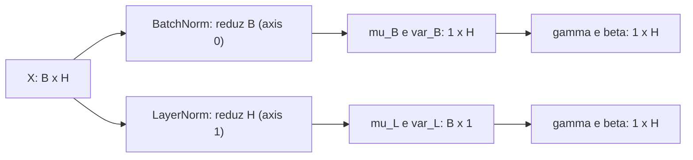
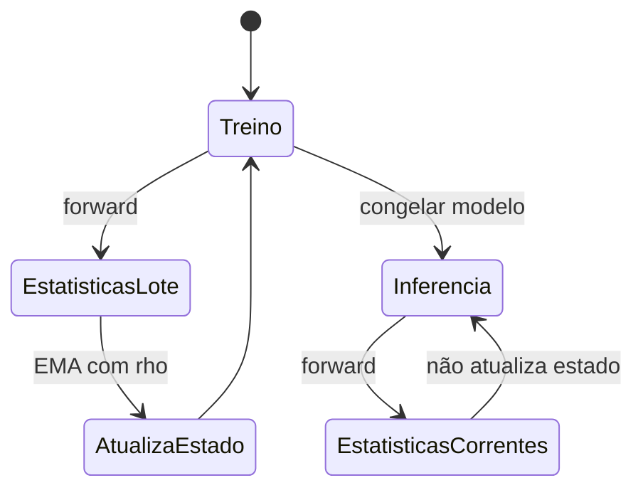

<!-- mirandastech-aula-v2 -->

# Aula 22 — Normalização quando apropriado: padronização, LayerNorm e BatchNorm

Na produção, “normalizar” pode significar operações bem diferentes. Uma equipe padroniza as colunas de entrada uma vez, usando somente o treino; outra insere uma camada que recalcula estatísticas em cada mini-batch; uma terceira normaliza as unidades de cada exemplo. As três decisões alteram números, gradientes e comportamento na inferência de maneiras distintas.

Imagine uma MLP que recebe idade em anos, renda em reais e uma contagem de eventos. Se as escalas diferem por ordens de grandeza, a superfície de otimização pode formar uma ravina estreita: um único *learning rate* é grande demais numa direção e pequeno demais em outra. Mesmo após padronizar a entrada, as ativações internas continuam mudando enquanto os pesos aprendem. Batch Normalization (BatchNorm) e Layer Normalization (LayerNorm) atacam essa segunda questão, porém reduzem eixos diferentes e mantêm estados diferentes.

Esta aula constrói as três alternativas em NumPy puro. O objetivo não é decorar uma camada “obrigatória”, mas saber responder: **o que é normalizado, com quais observações, quando as estatísticas são calculadas e qual estado precisa chegar à produção?**

> **Laboratório reproduzível:** [abra no Colab](https://colab.research.google.com/github/joaopaulomirandamatias/ai-lab/blob/main/04-deep-learning/m5-redes-neurais-do-zero/notebooks/22-normalizacao-laboratorio.ipynb) ou execute o [notebook no GitHub](../notebooks/22-normalizacao-laboratorio.ipynb).

## Objetivos

Ao final, você deverá ser capaz de:

1. padronizar entradas sem vazar informação de validação ou teste;
2. identificar os eixos reduzidos por BatchNorm e LayerNorm em um tensor denso de shape `(B, H)`;
3. implementar *forward* e *backward* das duas normalizações;
4. explicar o papel de $\varepsilon$, $\gamma$ e $\beta$;
5. distinguir o modo de treino do modo de inferência da BatchNorm;
6. diagnosticar dependência do lote, lote unitário e estatísticas correntes ruins;
7. decidir quando padronização, BatchNorm, LayerNorm ou nenhuma delas é apropriada.

## Pré-requisitos

- broadcasting, eixos e `keepdims` da [Aula 03](03-mlp-camadas-densas-shapes.md);
- MLP vetorizada e regra da cadeia da [Aula 13](13-backprop-vetorizado-mlp.md);
- gradient checking da [Aula 14](14-gradient-checking.md);
- mini-batches da [Aula 17](17-mini-batch-epoch-embaralhamento.md);
- dropout e modos treino/inferência da [Aula 21](21-dropout-do-zero.md).

## Vocabulário mínimo

| Termo | Significado nesta aula |
|---|---|
| padronização | subtrair uma média e dividir por um desvio-padrão |
| eixo reduzido | eixo cujos elementos participam do cálculo de média e variância |
| estatística do lote | média ou variância calculada no mini-batch atual |
| estatística corrente | estimativa persistida por média móvel para uso na inferência |
| parâmetro afim | ganho $\gamma$ e deslocamento $\beta$, aprendidos por gradiente |
| modo de treino | execução que pode usar o lote atual e atualizar estado |
| modo de inferência | execução determinística com estado congelado |

## 1. Uma família de operações, três contratos

Para um conjunto $S$ de valores a normalizar, a operação básica é

$$
\mu_S=\frac{1}{m}\sum_{k\in S}x_k,
\qquad
\sigma_S^2=\frac{1}{m}\sum_{k\in S}(x_k-\mu_S)^2,
$$

$$
\widehat{x}_k=\frac{x_k-\mu_S}{\sqrt{\sigma_S^2+\varepsilon}},
\qquad
y_k=\gamma_k\widehat{x}_k+\beta_k.
$$

Aqui, $m=|S|$ é o número de valores no grupo, $\mu_S$ é a média, $\sigma_S^2$ é a variância populacional (`ddof=0`), $\varepsilon>0$ evita divisão por zero, e $\gamma$, $\beta$ restauram escala e deslocamento aprendíveis. O que muda é a definição de $S$.

| Técnica | Grupo usado nas estatísticas | Quando as estatísticas nascem | Estado na inferência |
|---|---|---|---|
| padronização de entrada | exemplos do **treino**, por feature | antes do treinamento | média e variância do treino |
| BatchNorm densa | exemplos do mini-batch, por unidade | em cada passo de treino | médias e variâncias correntes |
| LayerNorm densa | unidades de uma camada, por exemplo | em toda chamada | nenhum estado corrente |

Padronizar a entrada e normalizar ativações não são operações substitutas. A primeira fixa a escala do dado observado; as outras pertencem ao modelo e agem sobre representações que mudam com os parâmetros.

## 2. Padronização de entrada sem data leakage

Considere $X_{\text{treino}}\in\mathbb{R}^{N_{tr}\times D}$. Para cada feature $j$:

$$
\mu_j=\frac{1}{N_{tr}}\sum_{i=1}^{N_{tr}}x_{ij},
\qquad
\sigma_j^2=\frac{1}{N_{tr}}\sum_{i=1}^{N_{tr}}(x_{ij}-\mu_j)^2,
$$

$$
x'_{ij}=\frac{x_{ij}-\mu_j}{\sqrt{\sigma_j^2+\varepsilon}}.
$$

O contrato tem duas fases:

1. `fit(X_treino)`: estima $\mu$ e $\sigma^2$ uma única vez;
2. `transform(X)`: reutiliza essas estatísticas em treino, validação, teste e produção.

Calcular estatísticas em todo o conjunto antes do split deixa validação e teste influenciarem o treinamento. É um vazamento mesmo sem rótulos: a distribuição futura entrou no pipeline. Em séries temporais, a regra é ainda mais estrita — cada treino só pode usar o passado permitido pela janela de avaliação.

```python
def fit_standardizer(X, eps=1e-8):
    mean = X.mean(axis=0, keepdims=True)
    var = X.var(axis=0, keepdims=True)
    return mean, var, eps

def transform(X, state):
    mean, var, eps = state
    return (X - mean) / np.sqrt(var + eps)
```

Uma feature constante tem variância zero. O $\varepsilon$ impede `NaN`, mas o resultado será zero para os exemplos iguais à média. Isso não cria informação; em geral, a coluna deve ser removida ou tratada explicitamente.

## 3. Eixos: a decisão que define a camada

Se $X\in\mathbb{R}^{B\times H}$ contém $B$ exemplos e $H$ unidades ocultas:

- BatchNorm reduz `axis=0`: cada coluna usa os $B$ exemplos;
- LayerNorm reduz `axis=1`: cada linha usa as $H$ unidades.



| Objeto | Shape em BatchNorm | Shape em LayerNorm |
|---|---:|---:|
| entrada $X$ | `(B, H)` | `(B, H)` |
| média e variância | `(1, H)` | `(B, 1)` |
| $\widehat{X}$ | `(B, H)` | `(B, H)` |
| $\gamma,\beta$ | `(1, H)` | `(1, H)` |
| saída $Y$ | `(B, H)` | `(B, H)` |

`keepdims=True` preserva as dimensões reduzidas e torna o broadcasting auditável. Em uma CNN, BatchNorm costuma reduzir lote e dimensões espaciais, mantendo o canal; isso será retomado no módulo de arquiteturas. Nesta aula, o contrato é exclusivamente denso `(B, H)`.

## 4. Por que aprender $\gamma$ e $\beta$?

Sem a transformação afim, cada grupo é forçado a média aproximadamente zero e variância aproximadamente um. Isso pode remover uma escala ou um deslocamento úteis. Com

$$Y=\gamma\odot\widehat{X}+\beta,$$

a camada pode recuperar outra distribuição — inclusive aproximar a identidade para distribuições compatíveis. O símbolo $\odot$ representa multiplicação elemento a elemento. Como $\gamma,\beta\in\mathbb{R}^{1\times H}$, cada unidade mantém ganho e deslocamento próprios.

Os gradientes são diretos. Se $G=\partial L/\partial Y$:

$$
\frac{\partial L}{\partial \beta}=\sum_{i=1}^{B}G_i,
\qquad
\frac{\partial L}{\partial \gamma}=\sum_{i=1}^{B}G_i\odot\widehat{X}_i.
$$

A soma é sobre o lote porque $\gamma$ e $\beta$ são compartilhados entre exemplos. A redução da loss (`mean` ou `sum`) já deve estar refletida em $G$; não divida novamente por $B$.

## 5. BatchNorm: treino e inferência são programas diferentes

Durante o treino, BatchNorm usa $\mu_B$ e $\sigma_B^2$ do mini-batch. Para inferência, depender dos demais exemplos seria instável e poderia tornar a previsão de uma pessoa dependente de quem chegou junto. Por isso, a camada mantém estimativas correntes. Adotaremos a convenção

$$
\mu_{run}\leftarrow\rho\mu_{run}+(1-\rho)\mu_B,
$$

$$
\sigma^2_{run}\leftarrow\rho\sigma^2_{run}+(1-\rho)\sigma_B^2,
$$

com $0\leq\rho<1$. Quanto maior $\rho$, maior a memória. Bibliotecas usam nomes e convenções diferentes para o coeficiente de atualização; ao reproduzir uma implementação, confira a documentação e a convenção de variância.



Um esqueleto correto é:

```python
def batchnorm_forward(X, gamma, beta, state, training=True):
    if training:
        mean = X.mean(axis=0, keepdims=True)
        var = X.var(axis=0, keepdims=True)
        state["mean"] = state["rho"] * state["mean"] + (1-state["rho"]) * mean
        state["var"] = state["rho"] * state["var"] + (1-state["rho"]) * var
    else:
        mean, var = state["mean"], state["var"]
    xhat = (X - mean) / np.sqrt(var + state["eps"])
    return gamma * xhat + beta
```

No checkpoint entram pesos, $\gamma$, $\beta$, médias e variâncias correntes, além das convenções de $\rho$ e $\varepsilon$. Esquecer o estado não é um pequeno desvio: muda a função servida.

### Dependência do lote

Em treino, a saída de um exemplo depende de seus companheiros. Trocar os outros $B-1$ elementos altera média, variância e a própria saída do exemplo fixo. Isso injeta ruído que pode regularizar, mas também cria problemas com lotes pequenos, não representativos ou agrupados por fonte.

Com $B=1$ numa camada densa, $\mu_B=X$ e $\sigma_B^2=0$; logo $\widehat{X}=0$ e $Y=\beta$. A camada perde o sinal naquele passo. Acumular gradientes não corrige automaticamente o *forward*: BatchNorm viu micro-batches unitários, não o lote efetivo agregado.

## 6. LayerNorm: estatísticas por exemplo

LayerNorm calcula, para cada linha $i$:

$$
\mu_i=\frac{1}{H}\sum_{j=1}^{H}x_{ij},
\qquad
\sigma_i^2=\frac{1}{H}\sum_{j=1}^{H}(x_{ij}-\mu_i)^2.
$$

Depois aplica $\gamma_j$ e $\beta_j$ por unidade. Cada exemplo carrega as próprias estatísticas, portanto:

- a saída não depende dos outros elementos do lote;
- treino e inferência executam a mesma fórmula;
- não existem estatísticas correntes;
- lote unitário funciona desde que as $H$ unidades não sejam todas iguais.

Isso a torna apropriada quando o tamanho do lote é pequeno ou variável e em representações sequenciais. Mais tarde, a trilha de Transformers mostrará por que LayerNorm se tornou central nessas arquiteturas; aqui basta dominar seu contrato numérico.

LayerNorm não garante que cada feature tenha média zero no conjunto de dados. Ela garante média zero **entre as features de cada exemplo**, antes de $\gamma$ e $\beta$. Confundir essas afirmações leva a testes errados.

## 7. Backward vetorizado de uma normalização

A mesma derivação serve para as duas camadas. Seja $D=G\odot\gamma=\partial L/\partial\widehat{X}$ e seja $m$ o tamanho do grupo normalizado. Para cada grupo:

$$
\frac{\partial L}{\partial X}
=\frac{1}{m\sqrt{\sigma^2+\varepsilon}}
\left[
mD-\sum D-\widehat{X}\odot\sum(D\odot\widehat{X})
\right].
$$

As somas usam os mesmos eixos do *forward*:

- BatchNorm: `axis=0`, $m=B$;
- LayerNorm: `axis=1`, $m=H$.

```python
def norm_backward(dy, xhat, gamma, inv_std, axis):
    dxhat = dy * gamma
    m = dy.shape[axis]
    s1 = dxhat.sum(axis=axis, keepdims=True)
    s2 = (dxhat * xhat).sum(axis=axis, keepdims=True)
    dx = inv_std * (m * dxhat - s1 - xhat * s2) / m
    dgamma = (dy * xhat).sum(axis=0, keepdims=True)
    dbeta = dy.sum(axis=0, keepdims=True)
    return dx, dgamma, dbeta
```

Para LayerNorm, o `dx` reduz `axis=1`, mas `dgamma` e `dbeta` continuam reduzindo o lote (`axis=0`): os parâmetros afins são compartilhados entre exemplos. Essa assimetria é uma fonte frequente de bugs.

Dois invariantes ajudam a depurar $dX$. Dentro de cada grupo, a soma dos gradientes de entrada tende a zero; quando $\varepsilon$ é desprezível, o produto interno entre $dX$ e $\widehat{X}$ também tende a zero. Eles complementam, mas não substituem, o gradient check por diferenças centrais.

## 8. Exemplo resolvido: os eixos mudam a resposta

Considere

$$
X=\begin{bmatrix}1&2\\3&4\end{bmatrix},
\quad \gamma=\begin{bmatrix}1&1\end{bmatrix},
\quad \beta=\begin{bmatrix}0&0\end{bmatrix},
$$

ignorando $\varepsilon$ apenas para a conta manual.

**BatchNorm:** a primeira coluna $[1,3]$ tem média $2$ e desvio $1$, virando $[-1,1]$. A segunda coluna $[2,4]$ tem média $3$ e também vira $[-1,1]$. Portanto

$$\widehat{X}_{BN}=\begin{bmatrix}-1&-1\\1&1\end{bmatrix}.$$

**LayerNorm:** a primeira linha $[1,2]$ tem média $1{,}5$ e desvio $0{,}5$, virando $[-1,1]$. A segunda linha também vira $[-1,1]$. Assim,

$$\widehat{X}_{LN}=\begin{bmatrix}-1&1\\-1&1\end{bmatrix}.$$

As técnicas usam a mesma equação escalar e produzem matrizes diferentes porque respondem a perguntas diferentes.

## 9. Onde posicionar a normalização

Em uma MLP, uma ordem comum é

$$Z=XW+b\longrightarrow \text{Norm}(Z)\longrightarrow \phi(\cdot)\longrightarrow \text{Dropout}.$$

Normalizar antes ou depois da ativação muda a função e a distribuição vista pela camada seguinte. A ordem acima é uma convenção frequente, não uma lei universal. Para um experimento comparável, fixe:

- posição da normalização;
- existência ou não do viés da camada afim;
- $\varepsilon$, $\rho$ e inicialização de $\gamma,\beta$;
- política de mini-batch;
- modos treino/inferência.

O viés imediatamente antes de BatchNorm costuma ser redundante, pois a subtração da média o cancela no treino e $\beta$ oferece deslocamento. Ainda assim, removê-lo é uma decisão de parametrização que deve ser documentada.

## 10. Quando usar — e quando parar

| Situação | Candidata | Motivo ou ressalva |
|---|---|---|
| features de entrada com escalas muito distintas | padronização | melhora condicionamento; ajustar só no treino |
| lotes grandes e representativos em rede densa/CNN | BatchNorm | estatísticas do lote tendem a ser estáveis |
| lote pequeno, variável ou unitário | LayerNorm | não depende de outros exemplos |
| inferência deve ser independente da composição do lote | LayerNorm ou BatchNorm em `eval` | nunca use BatchNorm em modo treino no serviço |
| dados temporais ou agrupados | depende | eixos podem misturar futuro, entidades ou domínios |
| rede rasa que já treina de modo estável | talvez nenhuma | complexidade e estado podem não se pagar |
| dimensão normalizada quase constante | nenhuma solução automática | variância minúscula amplifica ruído; investigue os dados |

Normalização não substitui inicialização correta, *learning rate* bem escolhido, clipping quando necessário nem inspeção dos dados. Também não garante generalização. O artigo original da BatchNorm motivou o método pela redução de *internal covariate shift*; estudos posteriores encontraram explicações complementares, como permitir passos maiores e suavizar o comportamento da otimização. Trate o mecanismo como tema empírico, não como slogan fechado.

## 11. Armadilhas e diagnóstico

1. **Vazamento:** ajustar o padronizador antes do split.
2. **Eixo errado:** obter média zero nas linhas quando o contrato era por coluna.
3. **`eps` fora da raiz:** `sqrt(var) + eps` não é `sqrt(var + eps)`.
4. **Dupla média:** dividir gradientes por $B$ depois de a loss já ter feito `mean`.
5. **Estado ausente:** salvar pesos e esquecer estatísticas correntes da BatchNorm.
6. **Modo errado:** avaliar BatchNorm com estatísticas do lote de teste.
7. **Micro-batch:** assumir que acumular gradientes equivale a calcular estatísticas num lote maior.
8. **Convenção opaca:** copiar `momentum` de outra biblioteca sem conferir sua definição.
9. **Variância incompatível:** misturar `ddof=0` e `ddof=1` entre treino, checkpoint e inferência.
10. **Teste frágil:** exigir variância exatamente um apesar de $\varepsilon$.

Uma auditoria útil registra, por camada e modo: shape, eixos reduzidos, média, variância, RMS de entrada/saída, norma de $\gamma$, fração de valores não finitos e distância entre estatísticas do lote e correntes.

## 12. Checklist prático

- [ ] O split ocorreu antes de ajustar qualquer estatística de entrada.
- [ ] Os eixos normalizados estão documentados com shapes.
- [ ] $\varepsilon$ está dentro da raiz e é consistente no forward/backward.
- [ ] $\gamma$ inicia em um e $\beta$ em zero, salvo decisão explícita.
- [ ] BatchNorm alterna corretamente entre `train` e `eval`.
- [ ] O checkpoint inclui estatísticas correntes e hiperparâmetros.
- [ ] O gradient check usa `float64` e estado/máscaras congelados.
- [ ] Há teste para lote unitário e para troca dos companheiros do lote.
- [ ] A comparação mantém seed, arquitetura, passos e protocolo de avaliação.
- [ ] A normalização foi mantida por evidência, não por hábito.

## 13. Exercícios com respostas comentadas

### 1. Eixos

Para $X$ de shape `(32, 128)`, quais shapes têm as médias de BatchNorm e LayerNorm com `keepdims=True`?

**Resposta:** `(1, 128)` para BatchNorm (`axis=0`) e `(32, 1)` para LayerNorm (`axis=1`).

### 2. Vazamento

Por que usar teste sem rótulo no cálculo de média ainda é vazamento?

**Resposta:** porque o pipeline treinado passa a depender da distribuição reservada. A avaliação deixa de simular dados genuinamente futuros.

### 3. Lote unitário

O que acontece à BatchNorm densa em treino quando `B=1`?

**Resposta:** média igual à entrada, variância zero, `xhat=0` e saída igual a $\beta$. O sinal da ativação é eliminado naquele forward.

### 4. Companheiros do lote

Se um exemplo fixo muda de saída quando outros exemplos são trocados, qual camada está em ação?

**Resposta:** BatchNorm em modo treino. LayerNorm não usa outros exemplos; BatchNorm em inferência usa estado congelado.

### 5. Parâmetros afins

Por que $d\beta$ e $d\gamma$ somam sobre `axis=0` também na LayerNorm?

**Resposta:** porque o mesmo par de parâmetros por unidade é compartilhado por todos os exemplos, embora as estatísticas sejam calculadas por linha.

### 6. EMA

Com $\rho=0{,}9$, média corrente $2$ e média do lote $5$, qual é a nova média?

**Resposta:** $0{,}9\cdot2+0{,}1\cdot5=2{,}3$ na convenção adotada aqui.

### 7. `eps`

Por que a variância observada de $\widehat{X}$ pode ser menor que um?

**Resposta:** porque ela vale aproximadamente $\sigma^2/(\sigma^2+\varepsilon)$. Quando a variância é pequena, o efeito de $\varepsilon$ é visível.

### 8. Acumulação de gradientes

Quatro micro-batches de tamanho um reproduzem BatchNorm de lote quatro?

**Resposta:** não. A soma posterior dos gradientes não refaz as médias e variâncias usadas nos quatro forwards.

### 9. Viés antes da BatchNorm

Por que o viés da camada afim pode ser redundante?

**Resposta:** no treino, adicionar o mesmo viés a toda a coluna também o adiciona à média; a subtração cancela ambos. $\beta$ já fornece deslocamento aprendível.

### 10. Decisão experimental

Uma MLP rasa converge de forma estável sem normalização. Deve-se adicionar BatchNorm automaticamente?

**Resposta:** não. Compare sob protocolo controlado e considere custo, estado de inferência e dependência do lote. “Mais camadas” não implica “mais correto”.

## 14. Resumo

- padronização de entrada usa somente estatísticas do treino e as congela;
- BatchNorm reduz o eixo do lote e precisa de estatísticas correntes na inferência;
- LayerNorm reduz o eixo das unidades de cada exemplo e não mantém estado corrente;
- $\gamma$ e $\beta$ devolvem flexibilidade à representação;
- o backward muda principalmente nos eixos das somas;
- lotes pequenos, eixos errados, vazamento e modo de execução são falhas de primeira ordem;
- normalização é uma hipótese arquitetural a validar, não um ritual.

## 15. Conexões com pesquisa e sistemas reais

BatchNorm mostrou que uma transformação inserida no grafo pode mudar radicalmente a treinabilidade de redes profundas. LayerNorm removeu a dependência entre exemplos e abriu um caminho natural para modelos sequenciais. Em sistemas reais, porém, a matemática precisa viajar com engenharia: um serviço deve carregar estado, respeitar `eval`, manter a mesma definição de variância e monitorar mudança de distribuição.

O laboratório testa essas propriedades sem framework: invariantes por eixo, dependência do lote, lote unitário, estatísticas correntes, gradient checks e condicionamento de um problema com features em escalas distintas.

## Próxima aula

Na **Aula 23 — Treino e depuração de uma MLP**, integraremos inicialização, forward, backward, otimização, regularização e normalização num protocolo de diagnóstico: overfit de um lote, testes de sanidade, métricas e análise de erros.

## Referências técnicas

- IOFFE, Sergey; SZEGEDY, Christian. [Batch Normalization: Accelerating Deep Network Training by Reducing Internal Covariate Shift](https://proceedings.mlr.press/v37/ioffe15.html). ICML, 2015.
- BA, Jimmy Lei; KIROS, Jamie Ryan; HINTON, Geoffrey E. [Layer Normalization](https://arxiv.org/abs/1607.06450). arXiv:1607.06450, 2016.
- BJORCK, Nils et al. [Understanding Batch Normalization](https://proceedings.neurips.cc/paper/2018/hash/36072923bfc3cf47745d704feb489480-Abstract.html). NeurIPS, 2018.
- ZHANG, Aston et al. [Batch Normalization](https://d2l.ai/chapter_convolutional-modern/batch-norm.html). *Dive into Deep Learning*, versão 1.0.3. Consultado em 9 set. 2026.
- SCIKIT-LEARN DEVELOPERS. [Preprocessing data](https://scikit-learn.org/stable/modules/preprocessing.html). Documentação 1.9.0. Consultada em 9 set. 2026.
