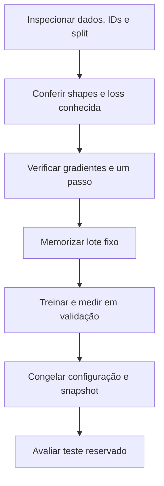
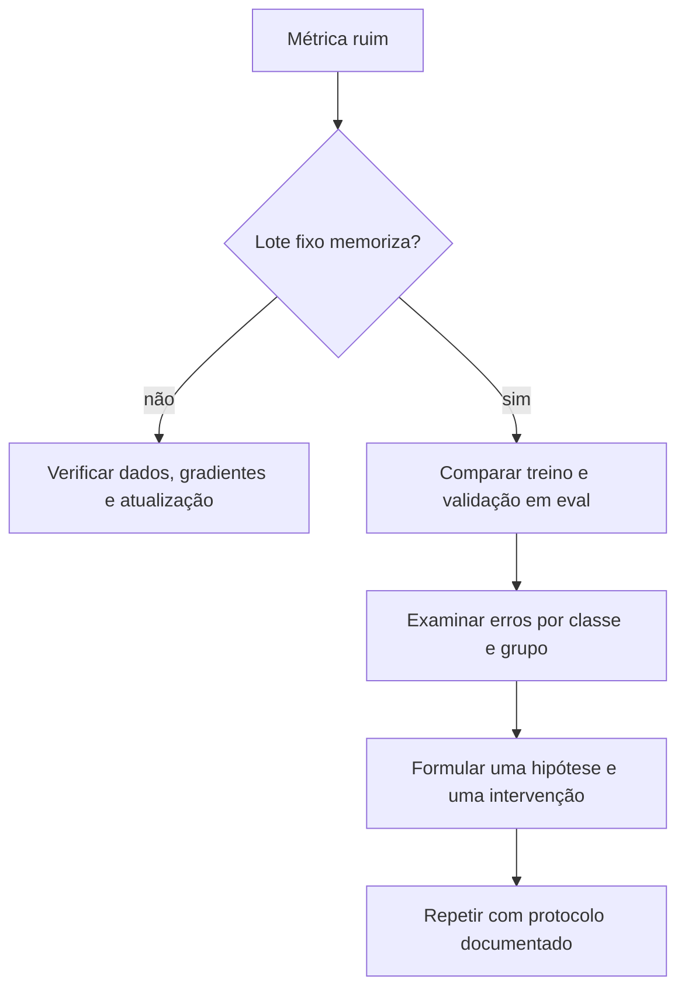

<!-- mirandastech-aula-v2 -->

# Aula 23 — Treino e depuração de uma MLP

Uma rede termina o treinamento, a loss diminui e a acurácia parece boa. Isso prova que a implementação está correta? Ainda não. Um broadcasting indevido pode produzir uma loss escalar válida; um conjunto desbalanceado permite acurácia alta sem reconhecer uma classe rara; uma rede com dados trocados pode memorizar um lote pequeno. Depurar exige reunir evidências que respondam a perguntas diferentes.

Imagine uma MLP que classifica três estados de um equipamento a partir de duas medições. Ela falha justamente no estado menos frequente. Aumentar a largura da rede pode não ajudar: o defeito pode estar no mapeamento dos rótulos, no split, na redução do gradiente ou na métrica. Esta aula organiza um procedimento para distinguir essas causas.

O laboratório usa classes sintéticas, sem representar um equipamento real. A escolha permite conhecer a origem dos dados, introduzir defeitos controlados e verificar numericamente cada diagnóstico. O resultado é um ensaio para o capstone, não sua substituição.

**[Abrir no Colab](https://colab.research.google.com/github/joaopaulomirandamatias/ai-lab/blob/main/04-deep-learning/m5-redes-neurais-do-zero/notebooks/23-treino-depuracao-mlp-laboratorio.ipynb)** · [Notebook executável](../notebooks/23-treino-depuracao-mlp-laboratorio.ipynb)

## Objetivos e pré-requisitos

Ao terminar, você deverá conseguir integrar uma MLP em NumPy, verificar suas derivadas, memorizar um lote de diagnóstico, medir o aprendizado por camada, selecionar um snapshot pela validação e investigar erros por classe. Também deverá explicar o que cada teste deixa de provar.

São pré-requisitos o [backprop vetorizado](13-backprop-vetorizado-mlp.md), o [gradient checking](14-gradient-checking.md), [momentum](19-momentum-nesterov.md), [regularização](20-regularizacao.md), [dropout](21-dropout-do-zero.md) e [normalização](22-normalizacao.md). Não usamos autograd, PyTorch, TensorFlow ou JAX.

| Vocabulário | Significado operacional |
|---|---|
| teste de sanidade | verificação pequena com resposta conhecida |
| overfit de lote | memorizar intencionalmente um subconjunto fixo do treino |
| baseline | referência simples medida no mesmo protocolo |
| instrumentação | registro de quantidades que ajudam a localizar falhas |
| snapshot | cópia dos parâmetros em determinado instante |
| ablação | comparação que retira ou altera um componente para investigar seu efeito |
| análise de erros | inspeção de exemplos e padrões de falha, além das métricas agregadas |

## 1. Três perguntas antes de qualquer busca

**O programa calcula a função pretendida?** Shapes, labels, loss e gradientes respondem a essa pergunta. **O otimizador consegue ajustar o treino?** O teste de um passo e o overfit de lote investigam esse ponto. **O modelo funciona em dados reservados?** Só um protocolo de avaliação pode responder.

Essas perguntas têm dependências. Se o backward falha, não faz sentido comparar taxas de dropout. Se o conjunto contém entradas idênticas com labels incompatíveis, exigir loss zero é um teste impossível. Se a validação orienta todas as decisões, ela não pode ser apresentada como avaliação final independente.



Descrição do fluxo: primeiro validamos dados e cálculo; depois, capacidade de ajuste; finalmente, seleção e avaliação. Uma falha interrompe a progressão e origina um caso mínimo reproduzível.

## 2. O contrato completo da rede

Na configuração mínima, usamos duas camadas afins, tanh e cross-entropy multiclasse. Com exemplos nas linhas:

$$
Z_1=XW_1+b_1,\quad A_1=\tanh(Z_1),\quad Z_2=A_1W_2+b_2.
$$

| Tensor | Shape | Papel |
|---|---|---|
| $X$ | $(B,D)$ | lote de entradas |
| $W_1,b_1$ | $(D,H)$ e $(1,H)$ | primeira camada |
| $A_1$ | $(B,H)$ | representação oculta |
| $W_2,b_2$ | $(H,C)$ e $(1,C)$ | camada de logits |
| $Z_2,P$ | $(B,C)$ | logits e probabilidades |
| $y$ | $(B,)$ | índices inteiros de classes |

$B$ é o tamanho efetivo do lote, $D$ o número de features, $H$ a largura oculta e $C$ o número de classes. Softmax atua em cada linha. A loss é a média das perdas dos exemplos:

$$
L_{dados}=-\frac{1}{B}\sum_{i=1}^{B}\log P_{i,y_i},\qquad
J=L_{dados}+\frac{\lambda}{2}(\|W_1\|_F^2+\|W_2\|_F^2).
$$

$\lambda\geq0$ controla L2; $\|W\|_F^2$ soma os quadrados de todos os pesos. Neste contrato, vieses e parâmetros afins da LayerNorm não recebem penalidade. Essa escolha deve acompanhar o experimento.

Se $Y$ é a matriz one-hot, o backward mínimo é

$$
G_2=\frac{P-Y}{B},\quad
dW_2=A_1^\top G_2+\lambda W_2,\quad db_2=\sum_i G_{2,i},
$$

$$
G_1=(G_2W_2^\top)\odot(1-A_1^2),\quad
dW_1=X^\top G_1+\lambda W_1,\quad db_1=\sum_i G_{1,i}.
$$

$G_2$ e $G_1$ são gradientes dos logits e das pré-ativações ocultas. $\odot$ significa produto elemento a elemento. A divisão por $B$ ocorre uma vez. A soma dos vieses preserva shape `(1, H)` ou `(1, C)` com `keepdims=True`.

Quando LayerNorm ou dropout estão ativos, seus backwards entram entre os mesmos nós do forward. O cache guarda as ativações e a máscara efetivamente usadas. Não se pode gerar uma nova máscara no backward.

## 3. Dados: depuração começa antes da rede

O notebook gera 720 linhas independentes, 240 por classe, em três distribuições gaussianas parcialmente sobrepostas. Separa 432 linhas de treino, 144 de validação e 144 de teste; a padronização usa somente o treino. Cada observação mantém um ID para auditoria e análise posterior.

Verifique quantidade de linhas, finitude, classes presentes, ordem dos rótulos e relação entre IDs e features. IDs disjuntos são necessários, mas não detectam cópias do mesmo registro com IDs diferentes. Em dados reais, procure duplicatas e preserve pessoas, equipamentos ou episódios no mesmo split. Para previsão temporal, respeite o instante em que cada feature estaria disponível.

A inspeção de alguns exemplos deve usar o caminho real de pré-processamento. Um gráfico bonito construído com outro array não detecta uma coluna invertida no array que entra na rede. Um erro comum é embaralhar `X` e `y` separadamente; use a mesma permutação de índices.

## 4. Sanidade com respostas conhecidas

### Logits uniformes

Se todos os logits de uma linha são iguais, $P_{ic}=1/C$. Logo a CE vale $\log C$ para qualquer label válido. Com três classes, $\log3=1{,}0986122886681098$. Isso é uma identidade para logits uniformes, não uma exigência exata para qualquer inicialização aleatória.

```python
import numpy as np

def ce_estavel(logits, labels):
    assert logits.ndim == 2 and len(logits) > 0
    assert labels.shape == (len(logits),) and labels.dtype.kind in "iu"
    assert np.all((labels >= 0) & (labels < logits.shape[1]))
    shift = logits - logits.max(axis=1, keepdims=True)
    logp = shift - np.log(np.exp(shift).sum(axis=1, keepdims=True))
    return -logp[np.arange(len(labels)), labels].mean()

assert np.isclose(ce_estavel(np.zeros((3, 3)), np.array([0, 1, 2])), np.log(3))
```

### Permutação e duplicação

Com modelo determinístico e sem operações que misturem exemplos, permutar conjuntamente entradas e labels preserva a loss média e os gradientes agregados. Duplicar o lote também preserva essa média. Um gradiente que dobra na duplicação pode estar usando soma onde o contrato dizia média.

Esses testes precisam de condições claras: dropout deve estar desligado ou controlado; BatchNorm tem dependência do lote e exige análise própria. LayerNorm por exemplo não introduz essa dependência.

### Rejeição de entradas inválidas

Um teste negativo precisa confirmar que um erro foi detectado. O notebook fornece labels `(B,1)` à CE que exige `(B,)` e verifica a rejeição. Testar apenas entradas válidas não protege contra broadcasting silencioso.

## 5. Gradientes antes de hiperparâmetros

Para o parâmetro escalar $\theta_j$, a diferença central aproxima

$$
g_j^{num}=\frac{J(\theta+h e_j)-J(\theta-h e_j)}{2h},
$$

onde $e_j$ perturba somente a coordenada $j$ e $h$ é o passo numérico. O relatório do notebook usa um erro relativo por tensor:

$$
r=\frac{\|g^{analitico}-g^{num}\|_2}
{\max(10^{-12},\|g^{analitico}\|_2+\|g^{num}\|_2)}.
$$

Isso não é o maior erro relativo por coordenada; um erro concentrado numa entrada pequena pode ficar diluído na norma. Por isso verificamos todas as coordenadas de uma rede pequena, reportamos cada tensor separadamente e combinamos esse check com invariantes funcionais. Em problemas maiores, amostre coordenadas de cada tensor e investigue também erros absolutos.

Usamos `float64`, $h=10^{-5}$ e máscara congelada para dropout. O caso inclui LayerNorm e L2, complementando os testes mínimos. A maior discrepância relativa por tensor foi $5{,}85\times10^{-10}$. Uma divisão extra de `dW1` por três elevou o erro a aproximadamente $0{,}5$; o diagnóstico a rejeitou.

Um check aprovado demonstra concordância local, sob aquelas entradas e estados. Não prova correção global, validade dos labels ou qualidade da avaliação. A [Aula 14](14-gradient-checking.md) detalha passos numéricos, quinas e amostragem.

## 6. Um passo deve fazer o que você espera

Antes do treino longo, calcule todos os gradientes a partir dos pesos antigos, produza a atualização e compare parâmetros. Não atualize `W2` antes de calcular o gradiente da camada anterior: isso mistura dois instantes do modelo.

Na convenção de momentum usada aqui,

$$v_{t+1}=\beta v_t+g_t,\qquad \theta_{t+1}=\theta_t-\eta v_{t+1}.$$

$v$ é a velocidade, $\beta\in[0,1)$ sua memória e $\eta$ o learning rate. O teste inicial usa $\beta=0$ e passo pequeno no mesmo lote; a loss deve diminuir naquele caso controlado. Não transformamos essa expectativa numa promessa de queda a cada passo de SGD.

Se gradientes não nulos coexistem com pesos idênticos, procure taxa zero, atualização de uma cópia descartada ou parâmetros omitidos. O notebook demonstra explicitamente o caso $\eta=0$. Gradiente calculado e gradiente aplicado são fatos diferentes.

## 7. Memorizar um lote: teste necessário, evidência limitada

Escolha poucos exemplos fixos do treino. Desative inicialmente L2, dropout e normalização, mantenha uma arquitetura capaz de representá-los e treine repetidamente nesse lote. Essa simplificação ajuda a localizar problemas no caminho básico.

No laboratório, 12 exemplos, quatro por classe, foram memorizados com uma MLP de 32 unidades: CE caiu de `1,262834` para `0,004291` e acurácia chegou a 100%. São valores do lote de diagnóstico, não do teste.

Por que não exigir CE literalmente zero? Softmax só atribui probabilidade exatamente um no limite de separação dos logits, e precisão finita impõe restrições. Um limiar pequeno documentado é mais útil.

Também existem lotes impossíveis. Repita a mesma entrada três vezes e atribua uma classe distinta a cada cópia. Uma rede determinística produzirá a mesma distribuição nas três linhas. Sua melhor CE média é $\log3$, e a acurácia de uma decisão única é $1/3$. Aumentar a rede não resolve a contradição. Não confunda esse limite dos dados com um backward defeituoso.

## 8. Curvas comparáveis e estado bem definido

O treino completo usa lotes de 37, incluindo o último lote incompleto. Ao fim da época, mede CE de treino e validação em modo eval com os mesmos pesos, sem penalidade L2. Assim, as curvas comparam a mesma grandeza.

A média de losses observadas durante atualizações descreve uma trajetória por diferentes parâmetros; ela não é necessariamente a loss do modelo final da época. Além disso, calcular a média simples de médias de lotes desiguais atribui peso excessivo ao lote pequeno. Para uma avaliação fracionada, some perdas individuais e divida pelo total de exemplos.

Registre por camada normas dos gradientes, estatísticas de ativações e tamanho relativo da atualização:

$$u_l=\frac{\|W_l^{novo}-W_l^{antigo}\|_F}{\max(\delta,\|W_l^{antigo}\|_F)}.$$

$\delta>0$ evita divisão por zero. Esse indicador não tem um valor ideal universal. Vieses que começam em zero, reparametrizações e normalizações mudam sua interpretação. A norma média também pode esconder picos: diante de instabilidade, registre máximos ou quantis por passo.

| Sintoma | Hipótese inicial | Verificação que discrimina |
|---|---|---|
| loss plana, gradientes nulos | saturação ou caminho desconectado | ativações, derivadas e gradientes por camada |
| gradientes não nulos, pesos imóveis | atualização ausente | comparação dos arrays antes/depois |
| lote pequeno não memoriza | cálculo, capacidade ou contradição | gradcheck e inspeção do lote |
| treino melhora, validação piora | overfitting ou mudança de distribuição | curvas em eval, split e análise por grupo |
| acurácia alta, recall de uma classe zero | desequilíbrio mascarado | suporte e matriz de confusão |
| resultados mudam ao avaliar | dropout ativo ou estado mutável | repetição em eval e inspeção dos RNGs |



Descrição do diagnóstico: memorizar um lote direciona a investigação, mas não elimina a possibilidade de bugs. Cada intervenção precisa de uma hipótese e de uma medida capaz de refutá-la.

## 9. Seleção, snapshot e retomada

Comparamos três configurações predefinidas: mínima; L2 com dropout; e LayerNorm. Elas usam o mesmo split, largura de 16 unidades, seed dos pesos compartilhados, embaralhamento, orçamento de 120 épocas e otimizador. Cada execução guarda uma cópia profunda dos pesos na menor CE de validação. Empates preservam a primeira época.

A segunda configuração muda dois mecanismos juntos; portanto é uma comparação de pacote, não uma ablação isolada de dropout ou L2. Para atribuir um efeito, adicione experimentos que mudem uma variável por vez, depois repita com várias seeds. Uma comparação com a mesma taxa também não equivale a dar a cada arquitetura o mesmo orçamento de busca.

O snapshot escolhido serve para inferência. Retomar treinamento requer velocidade do momentum, RNGs, época, posição do lote e contador de passos. Recuperar pesos antigos com velocidade do último passo cria um estado que nunca existiu no treino. Para BatchNorm, também seria necessário persistir estatísticas correntes; para LayerNorm, não.

## 10. Métricas e erros que a média esconde

Adotamos $M_{ab}$ como a quantidade de exemplos da classe real $a$ previstos como $b$. As linhas são classes reais. Para a classe $c$:

$$
recall_c=\frac{M_{cc}}{\sum_bM_{cb}},\qquad
precision_c=\frac{M_{cc}}{\sum_aM_{ac}},
$$

$$F1_c=\frac{2TP_c}{2TP_c+FP_c+FN_c},\qquad
macroF1=\frac{1}{C}\sum_c F1_c.$$

O suporte é a soma da linha. No código, divisões sem denominador recebem zero e o suporte acompanha o relatório. Uma classe ausente exige interpretação explícita; zero numérico não cria observações.

Exemplo resolvido: entre 100 exemplos, 90 são classe 0 e cinco pertencem a cada uma das outras classes. Prever sempre 0 dá acurácia 90%, recall `[1,0,0]` e macro-F1 aproximadamente `0,315789`. A métrica agregada esconde a incapacidade de reconhecer duas classes.

Na validação do laboratório, inspecionamos os erros de maior confiança usando IDs. O exemplo 386, classe real 1, foi previsto como 0 com probabilidade `0,934670`. Isso sugere inspeção da região de sobreposição, mas não prova erro de anotação. Nunca corrija um label apenas porque o modelo discorda dele. Registre hipótese, evidência e decisão.

## 11. Resultados confirmados e limites

| Configuração | Época escolhida | CE de validação |
|---|---:|---:|
| mínima | 4 | 0,284439 |
| L2 + dropout | 4 | 0,283959 |
| LayerNorm | 56 | 0,286990 |

A diferença entre as duas primeiras é pequena; uma seed não permite declarar superioridade geral. A seleção pela validação escolheu L2 + dropout. Somente então o teste reservado foi avaliado: CE `0,261883`, acurácia `0,895833` e macro-F1 `0,895390`. O recall por classe foi `[0,916667; 0,937500; 0,833333]`, com 48 exemplos em cada classe. O baseline constante obteve acurácia `0,333333`.

Esses resultados mostram que o programa aprende sinal deste gerador e que o protocolo produz evidência rastreável. Não demonstram robustez a dados reais, causalidade, segurança operacional, calibração ou superioridade sobre outros classificadores. Se o resultado de teste motivar mudanças, uma nova avaliação independente será necessária.

## 12. Como reproduzir e auditar

O notebook declara Python >=3.11, NumPy >=1.26 e Matplotlib >=3.8; a execução desta edição usou Python 3.12.14, NumPy 2.3.5 e Matplotlib 3.10.8. A seed principal é `20260923`, com fluxos separados para dados, split, pesos, embaralhamento e máscaras. Pequenas diferenças de arredondamento entre ambientes são possíveis.

Execute todas as células em ordem. As figuras são geradas em memória, com legendas e descrição textual; não há download de dataset ou serviço externo obrigatório. O arquivo versionado mantém outputs limpos. Os resultados acima foram obtidos executando uma cópia de validação.

- [ ] IDs, labels e split conferidos antes do ajuste de estatísticas.
- [ ] CE uniforme, shapes e invariantes de lote aprovados.
- [ ] Gradientes verificados e defeito injetado detectado.
- [ ] Um passo modifica os parâmetros pretendidos.
- [ ] Lote de diagnóstico memorizado e contradições tratadas.
- [ ] Curvas comparadas no mesmo modo e instante do modelo.
- [ ] Snapshot escolhido somente pela validação.
- [ ] Teste reservado avaliado após congelar decisões.
- [ ] Métricas por classe acompanhadas de suporte e IDs de erros.
- [ ] Artefato de inferência reproduz a transformação e as previsões.

## 13. Exercícios com respostas comentadas

### 1. A loss inicial deve ser exatamente ln(3)?

**Resposta:** apenas para logits uniformes com CE média sem regularização. Pesos aleatórios podem produzir probabilidades não uniformes; L2 acrescenta outra parcela ao objetivo.

### 2. O gradiente dobrou ao duplicar o lote. O que investigar?

**Resposta:** a redução. Para uma loss média determinística por exemplo, o gradiente agregado deve permanecer igual. Verifique soma versus média e as condições de dropout/BatchNorm.

### 3. O modelo memoriza 12 exemplos. Posso confiar no teste?

**Resposta:** a memorização verifica capacidade de ajuste desse lote. Não valida o split, o caminho dos dados nem a generalização. Continue com os testes independentes.

### 4. Três entradas iguais possuem labels 0, 1 e 2. Qual é o limite?

**Resposta:** para saída determinística compartilhada, a CE média mínima é ln(3), atingida com probabilidades uniformes. A acurácia de uma classe escolhida é 1/3.

### 5. Por que usar cópia profunda do melhor modelo?

**Resposta:** guardar apenas a referência ao dicionário ou arrays que serão alterados pode modificar o snapshot durante passos posteriores. O artefato deve preservar os valores daquela época.

### 6. A rede parece pior em treino do que em validação. Isso prova leakage?

**Resposta:** não. Primeiro compare ambos em eval, com os mesmos pesos e sem penalidade só no treino. Dropout, dificuldade dos exemplos e variabilidade amostral também podem explicar a diferença; investigue o split separadamente.

### 7. L2 + dropout venceu a rede mínima. Dropout causou a melhora?

**Resposta:** o experimento mudou dois mecanismos juntos e usou uma seed. Ele não identifica qual causou a diferença. Faça ablações isoladas e reporte variabilidade.

### 8. Posso retomar o momentum apenas com o snapshot de inferência?

**Resposta:** você pode iniciar outra trajetória, mas não reproduzir a continuação anterior. É preciso guardar velocidade, RNGs e posição de execução compatíveis com os pesos.

### 9. Qual próximo passo se gradientes são não nulos e pesos não mudam?

**Resposta:** audite a taxa e a aplicação da atualização. Compare arrays, confira referências e parâmetros registrados. Aumentar a capacidade não resolve uma atualização ausente.

### 10. O teste ficou abaixo da expectativa. Posso selecionar outra seed usando esse número?

**Resposta:** isso converte o teste em instrumento de seleção. Documente a mudança de protocolo e use novos dados independentes para a avaliação final.

## Resumo e transição

Treinar uma MLP exige contratos de dados, cálculo, atualização e avaliação. Testes pequenos eliminam hipóteses antes do treinamento longo; instrumentação mostra onde procurar; validação seleciona; teste reservado estima o resultado após congelar decisões. Nenhuma verificação isolada substitui essa cadeia de evidências.

Na **Aula 24 — Capstone P5**, aplicaremos o protocolo a MNIST/Fashion-MNIST, com MLP do zero e relatório auditável. O objetivo é preparar uma referência que possa ser reimplementada em PyTorch no M6, comparando precisamente o que o autograd automatiza.

## Referências técnicas

Fontes verificadas em **9 de setembro de 2026**. Os exemplos, defeitos e resultados desta aula são experimentos próprios reproduzíveis no notebook.

1. STANFORD. [CS231n — Learning](https://cs231n.github.io/neural-networks-3/). Notas institucionais sobre sanidade, gradient checking e acompanhamento de treino.
2. GOODFELLOW, Ian; BENGIO, Yoshua; COURVILLE, Aaron. [Deep Learning, capítulo 11 — Practical Methodology](https://www.deeplearningbook.org/contents/guidelines.html). MIT Press, 2016. Diagnóstico guiado por métricas e evidências.
3. ZHANG, Aston et al. [D2L — Forward Propagation, Backward Propagation, and Computational Graphs](https://d2l.ai/chapter_multilayer-perceptrons/backprop.html). Documentação 1.0.3. Base conceitual do grafo e da regularização.
4. NUMPY DEVELOPERS. [Random Generator](https://numpy.org/doc/stable/reference/random/generator.html). Documentação estável consultada; a versão executada está declarada no laboratório.
5. SCIKIT-LEARN DEVELOPERS. [Metrics and scoring](https://scikit-learn.org/stable/modules/model_evaluation.html). Documentação 1.9.0. Referência das métricas; implementação do laboratório feita em NumPy.
