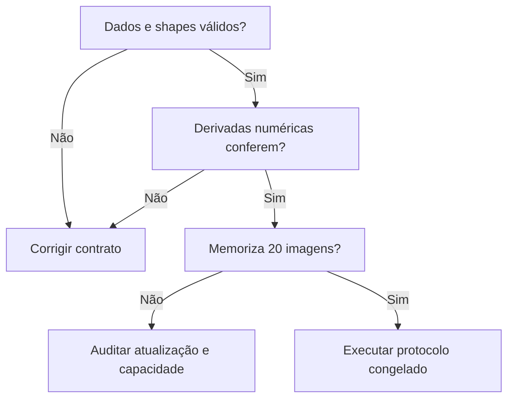
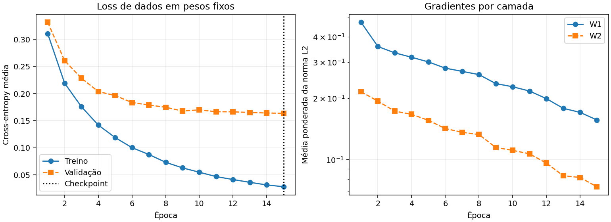
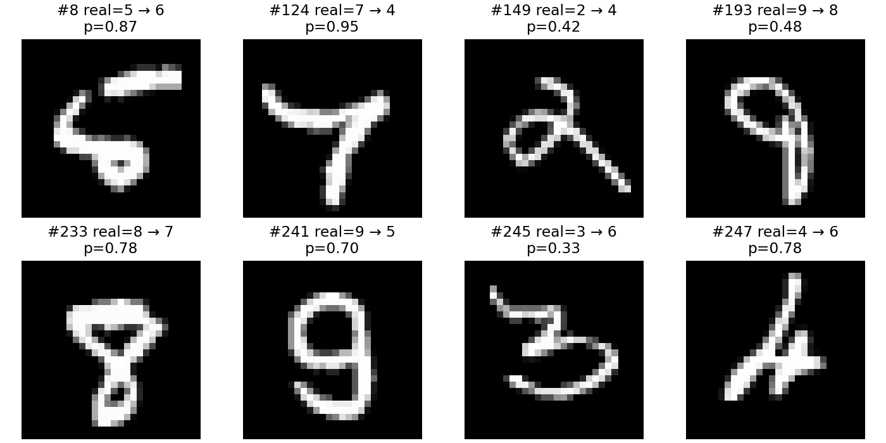

<!-- mirandastech-aula-v2 -->

# Aula 24 — Capstone P5: uma MLP do zero em MNIST

Uma rede que acerta dígitos é útil para estudar aprendizado. Uma rede cujos dados, derivadas, decisões e erros podem ser inspecionados é um entregável de engenharia. Neste capstone, você transforma os componentes construídos no M5 em um experimento completo: lê imagens reais, treina sem autograd, compara alternativas e entrega evidências que outra pessoa consegue reproduzir.

O problema motivador é reconhecer um dígito manuscrito isolado, de 0 a 9. Isso se conecta à leitura de formulários, mas o experimento usa imagens pequenas e previamente preparadas. Ele não implementa segmentação de documentos, localização de campos ou leitura de fotografias reais.

**Entregável P5:** MLP 784 → 64 → 10 em NumPy, baseline linear, ablações controladas, teste reservado e relatório auditável. Escolhemos **MNIST** entre as alternativas previstas no currículo; Fashion-MNIST permanece uma extensão com novo protocolo, sem misturar os dois datasets.

[Laboratório executável](../notebooks/24-capstone-p5-laboratorio.ipynb) · [Resultados numéricos completos](../assets/24-capstone-p5-resultados.json) · [Aula anterior](23-treino-depuracao-mlp.md) · [Currículo M5](../README.md)

O botão abre o notebook publicado no GitHub. Como alternativa, baixe o `.ipynb` e execute todas as células em um kernel Python novo. A aula permanece legível sem Colab, JavaScript ou serviços de exercícios.

## Objetivos, pré-requisitos e vocabulário

Ao concluir, você deverá conseguir:

- explicar cada operação do forward e do backward, com seu shape;
- demonstrar que a loss, os gradientes e o otimizador obedecem aos contratos;
- separar treinamento, seleção por validação e avaliação final;
- interpretar curvas e erros sem transformar uma comparação pequena em conclusão universal;
- entregar pesos de inferência e uma referência numérica para a próxima trilha.

Os pré-requisitos são as aulas 01–23 do M5, especialmente softmax estável, regra da cadeia, gradient checking, mini-batches, momentum e L2. É necessário distinguir divisão por tamanho do lote de regularização e reconhecer que checkpoint contém mais que pesos.

| Termo | Significado neste projeto |
|---|---|
| Exemplo | Uma imagem de 28 × 28 pixels e um rótulo |
| Logit | Escore real de uma classe antes da softmax |
| CE | Cross-entropy média por imagem, medida em nats |
| Ablação | Troca de um fator mantendo os demais definidos |
| Seed | Inicialização do gerador pseudoaleatório de uma execução |
| Fixture | Entrada, parâmetros e resultados fixos para comparação de implementações |
| Teste reservado | Partição oficial que não participa do ajuste nem da seleção |

## 1. O contrato experimental vem antes da acurácia

MNIST fornece arquivos oficiais distintos de treino e teste. O laboratório baixa arquivos IDX compactados por HTTPS, confere seus checksums registrados no código oficial do torchvision e implementa o parser com `gzip`, `struct` e NumPy. **Torchvision não é uma dependência:** nenhuma camada ou derivada pronta é usada.

O parser verifica magic number, contagens, dimensões, comprimento do conteúdo e rótulos no intervalo 0–9. MD5 é usado como identificação dos arquivos conhecidos e detecção de corrupção; o relatório também registra SHA-256. Isso não substitui a confiança na origem dos dados.

Para tornar o experimento viável em CPU, fixamos um protocolo reduzido:

| Partição | Origem | Quantidade | Uso permitido |
|---|---|---:|---|
| Treino | Treino oficial | 10.000, com 1.000 por classe | Gradientes e média por pixel |
| Validação | Treino oficial, índices disjuntos | 2.000, com 200 por classe | Época e configuração |
| Não utilizada | Restante do treino oficial | 48.000 | Fora deste protocolo |
| Teste | Teste oficial | 10.000, distribuição original | Métricas após congelar decisões |

A seed do split é `20260924`. Os índices originais e seus hashes permitem reconstruir a seleção. Um índice do treino e um índice do teste pertencem a arquivos diferentes; comparar apenas seus números não detecta sobreposição. O IDX não traz identificadores de escritores. Logo, o split interno é por imagem, sem uma alegação de separação por pessoa. Também não realizamos uma auditoria de duplicatas visuais.

Cada pixel é transformado por $x_j=u_j/255-\mu_j$, onde $u_j$ é a intensidade original e $\mu_j$ é a média do pixel $j$ **apenas no treino selecionado**. Validação e teste reutilizam esse vetor. Não dividimos pelo desvio por pixel, evitando problemas em pixels constantes. Centralização não é BatchNorm: é um pré-processamento fixo após seu ajuste inicial.

As diferenças de distribuição entre validação balanceada e teste natural devem acompanhar a interpretação. Este resultado não é diretamente comparável a um benchmark treinado com todas as 60.000 imagens ou com data augmentation.

## 2. Reconstruindo o grafo completo

Considere um lote de $B$ imagens, $D=784$ entradas, $H=64$ unidades ocultas e $C=10$ classes. As linhas representam exemplos. O forward é:

$$
Z_1=XW_1+b_1,\qquad A_1=\phi(Z_1),\qquad S=A_1W_2+b_2.
$$

Aqui $\phi$ é ReLU na referência; $S$ contém logits. Os biases são transmitidos por broadcasting ao longo das linhas. Para obter log-probabilidades estáveis, em cada linha definimos $m_i=\max_c S_{ic}$:

$$
\log P_{ic}=S_{ic}-m_i-\log\sum_{k=1}^{C}\exp(S_{ik}-m_i).
$$

Subtrair o máximo evita exponenciar grandes logits positivos. Não aplicamos `log(softmax)` ingênuo nem clipping das probabilidades, que pode deixar a loss e a derivada representando funções diferentes.

A função objetivo é:

$$
J=\underbrace{-\frac{1}{B}\sum_{i=1}^{B}\log P_{i,y_i}}_{L_{\mathrm{dados}}}
+\underbrace{\frac{\lambda}{2}\left(\|W_1\|_F^2+\|W_2\|_F^2\right)}_{R}.
$$

$y_i$ identifica a classe real; $\lambda$ controla L2; $\|\cdot\|_F$ é a norma de Frobenius. Biases não são penalizados. Relatamos CE de dados separadamente da penalidade, pois comparar objetivos com $\lambda$ diferente como se fossem a mesma métrica seria incorreto.

Se $Y$ é a matriz one-hot dos rótulos, o backward completo fica:

$$
G_S=\frac{P-Y}{B},\qquad
G_{W_2}=A_1^TG_S+\lambda W_2,\qquad
G_{b_2}=\sum_i(G_S)_{i,:},
$$

$$
G_{A_1}=G_SW_2^T,\qquad
G_{Z_1}=G_{A_1}\odot\phi'(Z_1),
$$

$$
G_{W_1}=X^TG_{Z_1}+\lambda W_1,\qquad
G_{b_1}=\sum_i(G_{Z_1})_{i,:}.
$$

$G_T$ significa $\partial J/\partial T$, e $\odot$ é multiplicação elemento a elemento. Para ReLU usamos $\phi'(z)=\mathbf{1}_{z>0}$, inclusive a convenção zero na quina. Para tanh, $\phi'(z)=1-\tanh^2(z)$.

| Tensor ou gradiente | Shape |
|---|---|
| $X$ | $(B,784)$ |
| $W_1$, $G_{W_1}$ | $(784,64)$ |
| $b_1$, $G_{b_1}$ | $(64,)$ |
| $Z_1$, $A_1$, $G_{Z_1}$ | $(B,64)$ |
| $W_2$, $G_{W_2}$ | $(64,10)$ |
| $b_2$, $G_{b_2}$ | $(10,)$ |
| $S$, $P$, $G_S$ | $(B,10)$ |

A divisão por $B$ já ocorre em $G_S$; repeti-la em $G_{W_1}$ encolheria indevidamente o gradiente. No último lote, $B$ é seu tamanho real, não o tamanho nominal 128.

### Exemplo resolvido: um logit recebe qual correção?

Considere uma linha com probabilidades $(0{,}1,0{,}7,0{,}2)$ e classe correta 2, usando índices 0, 1, 2. Sua CE é $-\log(0{,}2)\approx1{,}609438$. Em um lote de quatro exemplos, sua contribuição a $G_S$ é $(0{,}025,0{,}175,-0{,}2)$. O sinal negativo na classe correta faz a descida do gradiente aumentar seu logit, mantidas as demais relações locais.

O laboratório generaliza esse cálculo para dez classes. A MLP tem $784\times64+64+64\times10+10=50.890$ parâmetros; o baseline linear possui $784\times10+10=7.850$.

## 3. Inicialização e otimização com estado explícito

Na referência, cada peso de $W_1$ é amostrado de uma normal com desvio $\sqrt{2/784}$, coerente com ReLU. Em $W_2$, usamos Xavier normal, com desvio $\sqrt{2/(64+10)}$. Biases começam em zero. As matrizes de pesos não são todas iguais, portanto a simetria entre unidades é quebrada.

O otimizador mantém uma velocidade $V$ do mesmo shape de cada parâmetro $\theta$:

$$
V_{t+1}=\beta V_t-\eta G_t,\qquad
\theta_{t+1}=\theta_t+V_{t+1}.
$$

Fixamos $\eta=0{,}05$ e $\beta=0{,}9$. O caso $\beta=0$ reproduz SGD. L2 entra em $G_t$; com momentum, não devemos afirmar equivalência automática com qualquer implementação de weight decay desacoplado.

O orçamento é de 15 épocas, com lotes de até 128. Como $10.000=78\times128+16$, cada época contém **79 atualizações**, e cada execução completa, **1.185**. O lote final de 16 não é descartado. O RNG de embaralhamento é separado da inicialização e seu estado acompanha o checkpoint.

Após cada época, a CE de treino e validação é calculada com os mesmos pesos fixos. Não confundimos a média das losses observadas enquanto os pesos mudavam com a avaliação da rede ao final da época.

## 4. Portas de qualidade antes do treinamento completo

O fluxograma representa dependências de evidência: treinar por mais épocas não corrige um parser ou backward errado. O notebook executa as seguintes verificações:

1. **Gradient checking:** todas as 43 coordenadas de uma rede 4 → 5 → 3, para ReLU e tanh, incluindo a penalidade L2. O passo central é $h=10^{-5}\max(1,|\theta_j|)$; as máscaras ReLU das duas perturbações precisam coincidir.
2. **Redução da loss:** duplicar cada exemplo de um lote preserva o gradiente de uma média e a penalidade.
3. **Otimizador:** momentum zero equivale ao passo SGD; uma contraprova com sinal invertido aumenta uma quadrática.
4. **Retomada:** duas épocas seguidas de mais duas, com estado restaurado, produzem exatamente o resultado de quatro contínuas no ambiente executado.
5. **Overfit controlado:** uma rede sem L2 deve memorizar 20 imagens, duas por classe, em 600 passos. Isso testa ajuste, não generalização.

Para cada tensor, reportamos erro absoluto máximo e erro relativo:

$$
e_{\mathrm{rel}}=\frac{\|G-G_{\mathrm{num}}\|_2}{\|G\|_2+\|G_{\mathrm{num}}\|_2+10^{-12}}.
$$

O limite declarado no teste é $10^{-7}$ para ambas as medidas. Uma rede pequena permite examinar todas as coordenadas; isso **não** equivale a testar numericamente os 50.890 parâmetros do modelo grande. Checks de shapes, finitude e laço complementam essa evidência.

## 5. Comparação justa e seleção antecipada

| Configuração | Inicialização de $W_1$ | Ativação | $\lambda$ |
|---|---|---|---:|
| Referência | He | ReLU | $10^{-4}$ |
| Inicialização pequena | Normal, desvio 0,01 | ReLU | $10^{-4}$ |
| Troca de ativação | Mesmos pesos da referência | tanh | $10^{-4}$ |
| Sem L2 | He | ReLU | 0 |

Cada configuração roda com seeds **101, 202 e 303**, mesmo split e mesma ordem de lotes para seeds correspondentes. Escolhemos a configuração com menor média das melhores CEs de validação das três seeds. Dentro de cada execução, o menor valor determina o checkpoint. A seed do modelo final é **101, fixada antes da execução**, e não a mais favorável no teste.

Manter os pesos iniciais ao trocar ReLU por tanh controla um fator, mas não otimiza conjuntamente ativação e inicialização. Uma comparação entre pares otimizados seria outro desenho. Da mesma forma, três seeds medem parte da variação do treinamento, não a incerteza de todos os possíveis splits ou datasets.

O baseline linear usa os mesmos dados, número de épocas, learning rate, momentum e L2, com seed 101. É uma referência de pipeline e capacidade, não uma busca exaustiva do melhor classificador linear. O orçamento iguala atualizações, não operações de ponto flutuante ou tempo de CPU.

## 6. Resultados medidos

Execução de referência em float64, com os dados e o orçamento descritos acima. Todos os números vêm do notebook executado e estão disponíveis no relatório JSON.

| Configuração | CE val seed 101 | Seed 202 | Seed 303 | Média | Desvio amostral |
|---|---:|---:|---:|---:|---:|
| Referência | 0,158878 | 0,169324 | 0,156019 | 0,161407 | 0,007004 |
| Inicialização pequena | 0,163673 | 0,166696 | 0,153781 | 0,161384 | 0,006755 |
| Troca para tanh | 0,184754 | 0,190248 | 0,182627 | 0,185877 | 0,003933 |
| Sem L2 | 0,160950 | 0,171465 | 0,156546 | 0,162987 | 0,007665 |

A regra selecionou **inicialização pequena**, por uma diferença de aproximadamente **0,000024** na CE média em relação à referência. Essa diferença é muito menor que a variação entre seeds observada; o resultado não sustenta uma alegação de superioridade prática. Mantivemos a regra previamente definida, sem promover a seed mais favorável a modelo final.

Na seed final 101, o checkpoint foi a **época 15**, com CE de validação **0,163673**. Sua CE de treino foi **0,028152**, mostrando uma diferença substancial entre ajuste e validação. O orçamento terminou nessa época: não sabemos a trajetória posterior e não estendemos o treino após observar o teste.

| Modelo avaliado no teste oficial | CE | Acurácia | Macro-F1 |
|---|---:|---:|---:|
| MLP selecionada | 0,143557 | 95,70% | 0,956763 |
| Baseline linear | 0,300613 | 91,21% | 0,910853 |

A MLP acertou **9.570 de 10.000 imagens**, contra **9.121** do baseline: diferença descritiva de **4,49 pontos percentuais** neste protocolo. Foram **430 erros**; a maior confusão dirigida foi **4 → 9**, com **28 imagens**. Isso não é uma comparação entre arquiteturas exaustivamente ajustadas.

O pior erro relativo por tensor no gradient checking foi **7,253 × 10⁻¹¹**; o maior erro absoluto foi **3,673 × 10⁻¹¹**. O lote de 20 imagens foi memorizado com CE **0,000166** e acurácia **100%**. As **10/10 auditorias** finais passaram, incluindo retomada exata e exportação sem pickle.

À esquerda, compare os dois conjuntos no mesmo estado dos pesos. O gráfico conserva todas as 15 épocas executadas; neste caso o melhor checkpoint coincide com a última. Em outras execuções, restaurar o melhor estado pode descartar épocas posteriores. À direita, o eixo é logarítmico: a medida é a média ponderada, pelo número de exemplos, das normas de gradiente dos lotes, incluindo L2. Ela não é a norma de um gradiente agregado de toda a época.

### Métricas e análise dos erros

A acurácia é a fração de imagens corretas. Para cada classe $c$, calculamos $F1_c=2TP_c/(2TP_c+FP_c+FN_c)$, com zero se o denominador for zero. O macro-F1 é $\frac{1}{10}\sum_cF1_c$. A matriz de confusão usa **linhas reais e colunas preditas**; sua soma deve ser 10.000 e sua diagonal deve reconciliar com a acurácia.

Os erros mostrados são os primeiros oito na ordem do arquivo, sem seleção por aparência. O relatório textual registra os mesmos índices, rótulos e probabilidades. Inspecione traços interrompidos, formatos parecidos e possível ambiguidade; essas são hipóteses de investigação, não diagnósticos comprovados. Não troque rótulos apenas porque a rede discordou.

Uma predição errada com probabilidade alta é um caso útil para inspeção. Sozinha, ela não estima calibração nem justifica um limiar de operação. Depois da avaliação, o teste não pode ser reutilizado para escolher outra seed e continuar sendo chamado de avaliação independente.

## 7. Laboratório reproduzível e evidências entregues

O notebook requer **Python ≥ 3.10, NumPy ≥ 1.24 e Matplotlib ≥ 3.7**. A execução de referência usa float64, Python 3.12.14, NumPy 2.3.5 e Matplotlib 3.10.8. Não exige GPU. Uma nova execução baixa aproximadamente 12 MB de arquivos gzip e salva cache e saídas em `p5_mnist_saida/`.

As células fazem download, split, implementação, auditoria, treinamento, seleção, avaliação e exportação nessa ordem. Os outputs do arquivo versionado ficam limpos; o relatório JSON e as duas figuras preservam a evidência da execução de referência. A dependência externa de dados é explícita: execução offline requer os quatro gzip íntegros na pasta de cache.

O laboratório gera ainda `split.json`, com os índices selecionados, e `p5_inferencia_fixture.npz`, com pesos, média por pixel e uma fixture de três imagens de treino. O NPZ é lido com `allow_pickle=False`; a ida e volta precisa reproduzir exatamente as log-probabilidades da fixture.

Esse NPZ serve à **inferência e comparação numérica**. Para retomar treinamento, são necessários também velocidade de momentum, RNG, contador de época e estado de seleção. O teste de retomada do notebook exerce esse estado completo em memória no limite entre épocas. Retomada no meio da época exigiria salvar permutação e cursor.

## 8. O que o experimento não prova

Acertar MNIST não demonstra leitura de documentos reais. O laboratório não avalia mudança de domínio, ataques, viés entre grupos demográficos, privacidade ou calibração. Também não demonstra que a arquitetura é ótima ou que o fator vencedor sempre melhora resultados.

Reutilizar uma validação para escolher épocas e configurações introduz viés de seleção; o teste reservado mede o procedimento escolhido, dentro do alcance desse dataset. Não fornecemos teste de significância ou intervalo que transforme três seeds em inferência populacional. Comparações entre diferentes tamanhos de treino, augmentations e modelos exigem controles adicionais.

A MLP achata a imagem e não explora explicitamente vizinhança espacial. CNNs serão estudadas posteriormente. Dropout e normalização interna, já construídos no M5, não são adicionados aqui: sua eficácia exigiria ablações adicionais que não fazem parte do protocolo fixado.

## Checklist de passagem P5

- [ ] Explico o forward e cada derivada com seus shapes, sem consultar um framework.
- [ ] Distingo CE, penalidade L2 e objetivo total.
- [ ] Reconstruo o split e ajusto a transformação somente no treino.
- [ ] Confiro gradient checking por tensor e sei por que quinas exigem cuidado.
- [ ] Demonstro SGD, momentum, cobertura do último lote e retomada com estado.
- [ ] Leio curvas e normas sem confundir métricas calculadas em pesos distintos.
- [ ] Relato baseline, três ablações, seeds e orçamento.
- [ ] Restauro o checkpoint de validação antes de avaliar o teste reservado.
- [ ] Reconcilio matriz de confusão, acurácia e macro-F1.
- [ ] Entrego análise de erros, limitações e fixture para a próxima implementação.

Os testes automáticos sustentam o artefato; este checklist verifica também o domínio do estudante. Uma métrica alta não dispensa a explicação das equações.

## Exercícios com respostas comentadas

### 1. Quantas atualizações são feitas em uma época? E se descartarmos o último lote?

**Resposta:** 79 atualizações com cobertura de 10.000 imagens. Descartar o resto produziria 78 e usaria 9.984 imagens por época. Não seria o protocolo executado.

### 2. Por que não minimizar CE mais L2 na validação para comparar configurações?

**Resposta:** o objetivo penalizado muda com $\lambda$. A seleção deve comparar uma métrica comum de desempenho, aqui CE de dados. L2 continua participando dos gradientes de treino.

### 3. A média por pixel pode usar as 60.000 imagens oficiais de treino?

**Resposta:** neste protocolo, não. Duas mil são validação e 48 mil estão excluídas. Usá-las alteraria o contrato de dados, mesmo sem seus rótulos.

### 4. Uma seed melhor no teste pode substituir a seed 101?

**Resposta:** não preservando a avaliação atual. Isso seleciona pelo teste. Registre a alteração do procedimento e obtenha novos dados independentes para uma avaliação final honesta.

### 5. Por que memorizar 20 imagens não é suficiente para aprovar a rede?

**Resposta:** uma implementação pode memorizar e ainda conter erros em redução de lote, métricas, modos ou splits. É uma evidência de sanidade que deve coexistir com checagens de derivadas e avaliação reservada.

### 6. A tanh perdeu sob pesos He. Podemos concluir que ela é inferior?

**Resposta:** não. A ablação responde à troca de ativação sob pesos e orçamento controlados. Seu melhor par de inicialização, taxa e regularização não foi procurado. A resposta vale igualmente se tanh vencer.

### 7. A norma de gradiente média dos lotes equivale à norma do gradiente médio?

**Resposta:** geralmente não. Gradientes de lotes diferentes podem se cancelar ao serem somados; tomar normas antes da média elimina essa informação direcional. O gráfico declara a primeira medida.

### 8. O NPZ permite continuar exatamente o treino?

**Resposta:** o exportado aqui não. Ele contém o necessário para inferência e fixtures. A velocidade, o RNG e a posição do laço são parte do checkpoint de treinamento, como demonstra o teste em memória.

### 9. Como interpretar uma matriz de confusão com 30 na linha 4, coluna 9?

**Resposta:** trinta imagens rotuladas como 4 foram previstas como 9. A confusão inversa ocupa outra célula. Analise exemplos para formular hipóteses, sem presumir que o número revela sua causa.

### 10. Como transportar este capstone para Fashion-MNIST?

**Resposta:** estabeleça novo protocolo antes dos resultados, verifique arquivos e rótulos da fonte original, mantenha o teste separado e repita as auditorias. Compatibilidade de shape não implica dificuldade, acurácia ou semântica iguais.

## Resumo e transição para M6

O P5 integra um caminho verificável: dados identificáveis, grafo manual, derivadas conferidas, treino com estado, comparação controlada e avaliação reservada. As decisões experimentais fazem parte do modelo entregue tanto quanto seus pesos.

Com esta aula, o currículo M5 chega ao seu capstone. A próxima sequência é **M6 — PyTorch**: começar pela reprodução de operações e fixtures permite entender o que autograd automatiza antes de mudar arquitetura ou protocolo. A comparação deve usar parâmetros, entradas, redução da loss e convenções de eixos iguais.

## Referências técnicas e material complementar

Referências consultadas em **9 de setembro de 2026**. Equações aplicadas, código, protocolo e resultados numéricos desta aula são desenvolvimento próprio do laboratório.

1. PYTORCH VISION. [MNIST: loader oficial e checksums dos arquivos](https://github.com/pytorch/vision/blob/main/torchvision/datasets/mnist.py). Fonte primária de identificação dos dados; versão consultada da branch `main`, sem importar a biblioteca.
2. STANFORD. [CS231n — Learning](https://cs231n.github.io/neural-networks-3/). Notas institucionais sobre gradient checking e diagnóstico.
3. GOODFELLOW, Ian; BENGIO, Yoshua; COURVILLE, Aaron. [Deep Learning, capítulo 11 — Practical Methodology](https://www.deeplearningbook.org/contents/guidelines.html). MIT Press, 2016. Referência metodológica.
4. GLOROT, Xavier; BENGIO, Yoshua. [Understanding the difficulty of training deep feedforward neural networks](https://proceedings.mlr.press/v9/glorot10a.html). AISTATS, 2010. Inicialização e propagação de sinal.
5. HE, Kaiming et al. [Delving Deep into Rectifiers](https://arxiv.org/abs/1502.01852). 2015, versão 1. Inicialização para redes retificadas.

**Material complementar:** [repositório original Fashion-MNIST](https://github.com/zalandoresearch/fashion-mnist), para uma extensão posterior do projeto. Não é a fonte dos dados ou dos resultados apresentados acima.
