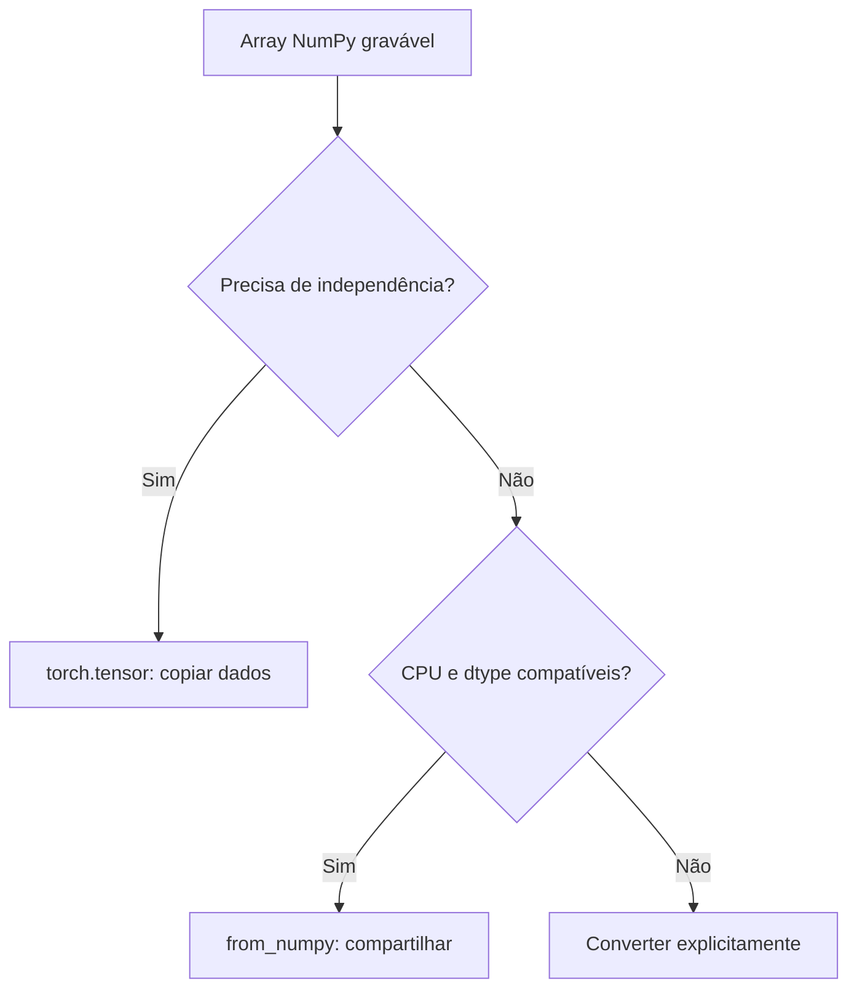

<!-- mirandastech-aula-v2 -->

# Aula 01 — Tensores: a ponte entre NumPy e PyTorch

No P5, você construiu uma MLP em NumPy, calculou suas derivadas e avaliou o resultado em MNIST. Agora surge uma pergunta de engenharia: como transportar esse trabalho para PyTorch sem alterar involuntariamente a função calculada?

Trocar `np` por `torch` não basta. Dois arrays com números visualmente iguais podem ter precisões diferentes, compartilhar memória ou representar eixos distintos. Uma alteração de shape pode até produzir uma loss finita e completamente diferente da pretendida. A primeira tarefa do M6 é tornar esses contratos visíveis.

Nesta aula, usamos **tensores CPU e um forward pequeno**. O objetivo é comparar operações com entradas idênticas. Autograd começa na Aula 03; o uso de `nn.Module`, treinamento e aceleração terá seu lugar no [currículo canônico de 24 aulas](../README.md).

[Laboratório reproduzível](../notebooks/01-tensores-numpy-pytorch-laboratorio.ipynb) · [Anterior: Capstone P5](../../m5-redes-neurais-do-zero/aulas/24-capstone-p5.md)

[](https://colab.research.google.com/github/joaopaulomirandamatias/ai-lab/blob/main/04-deep-learning/m6-pytorch/notebooks/01-tensores-numpy-pytorch-laboratorio.ipynb)

Se preferir, baixe o notebook e execute todas as células em um kernel Python novo. Os exercícios têm respostas abaixo, e o laboratório funciona sem iframe, credenciais, GPU ou download de dataset.

## Objetivos e pré-requisitos

Ao terminar, você deverá identificar o shape, dtype e device de um tensor; escolher conscientemente entre cópia e compartilhamento de memória; implementar uma transformação afim e um forward pequeno em PyTorch; comparar saídas com tolerâncias justificadas; e detectar erros que a biblioteca não consegue reconhecer como erros de intenção.

São pré-requisitos álgebra matricial, arrays NumPy, broadcasting básico e as equações do forward estudadas no M5. Não é necessário conhecer autograd para acompanhar esta aula.

| Vocabulário | Significado operacional |
|---|---|
| Tensor | Estrutura de dados com elementos organizados em eixos, um dtype e um dispositivo |
| Shape | Comprimento de cada eixo; por exemplo, `(B,D)` |
| Dtype | Representação de cada elemento: float32, float64, int64 etc. |
| Device | Local onde o tensor reside, como CPU ou um acelerador |
| Armazenamento compartilhado | Dois objetos acessam os mesmos dados subjacentes |
| Fixture | Entradas e parâmetros fixos usados para conferir uma implementação |
| Tolerância | Critério quantitativo para aceitar diferenças numéricas |

## 1. Tensor não é sinônimo de matriz

Em computação com PyTorch, um tensor pode representar um escalar, um vetor, uma matriz ou dados com mais eixos. O número de eixos, exposto por `ndim`, não é o posto de uma matriz no sentido da álgebra linear.

| Exemplo | Shape | Eixos | Interpretação |
|---|---|---:|---|
| Loss média | `()` | 0 | Um escalar |
| Bias de H unidades | `(H,)` | 1 | Um valor por unidade |
| Lote de features | `(B,D)` | 2 | B exemplos, D atributos |
| Imagens em tons de cinza | `(B,1,28,28)` | 4 | Lote, canal, altura e largura |

O tensor de imagens só ilustra uma organização possível; convoluções pertencem ao M7. Para a MLP, o P5 achatava os pixels em `(B,784)`. O significado de cada eixo é um contrato da aplicação. PyTorch conhece seus tamanhos, mas não sabe que a primeira dimensão deveria representar pacientes, imagens ou instantes.

Uma inspeção útil verifica `shape`, `dtype`, `device` e `requires_grad`. Este último indica participação potencial no acompanhamento de derivadas; mantemos seu valor falso no laboratório. Um tensor comum não calcula gradientes automaticamente apenas por existir.

## 2. Criar dados e controlar sua representação

O laboratório usa `torch.tensor(..., dtype=torch.float64, device="cpu")` para declarar a precisão e o local de armazenamento. Listas de inteiros e listas de números decimais podem levar a tipos inferidos diferentes. Para uma comparação científica, inferência implícita de dtype é uma fonte desnecessária de ambiguidade.

Features e pesos desta aula são float64. Rótulos de classes são índices int64: 0 ou 1 no exemplo pequeno. Não convertemos todos os objetos para float apenas para uniformizar a aparência do código.

| Representação | Uso nesta aula | Cuidado |
|---|---|---|
| `torch.float64` | Referência numérica do forward | Maior consumo por elemento que float32 |
| `torch.float32` | Contraprova de arredondamento e conversão | Nem todo inteiro grande é representável |
| `torch.int64` | Índices e rótulos | Não representa probabilidades contínuas |
| `torch.bool` | Máscaras e condições | Verdadeiro/falso tem semântica própria |

Não existe um dtype universalmente correto. Nesta etapa, precisão dupla facilita inspecionar equivalência; mais adiante, o M6 medirá as trocas entre precisão, memória e desempenho.

## 3. Cópia e compartilhamento: quem pode alterar o dado?

Considere um array de features que será usado como referência. Criar outro objeto Python não garante que exista outro armazenamento. Para arrays NumPy CPU compatíveis, as operações abaixo têm contratos diferentes:

| Operação | Relação com a origem |
|---|---|
| `torch.tensor(array)` | Copia os dados |
| `torch.from_numpy(array)` | Compartilha armazenamento com o array |
| `torch.as_tensor(array)` | Pode compartilhar quando tipo e dispositivo permitem |
| `tensor.clone()` | Cria armazenamento independente |
| `tensor.to(...)` | Pode devolver o próprio tensor se nenhuma conversão for necessária |

No experimento, alterar a origem de `[1,2,3]` para `[10,2,3]` altera o tensor compartilhado, mas preserva a cópia. Alterar o tensor compartilhado também muda o array. Essa propriedade é útil para evitar cópias, mas perigosa quando uma transformação modifica dados que deveriam permanecer fixos.



O diagrama orienta a decisão de armazenamento. Ele não garante que todo layout NumPy seja aceito. O laboratório usa arrays contíguos, graváveis e float64; arrays somente leitura não devem ser modificados por um tensor associado. Layout, strides e views serão aprofundados na Aula 02.

Uma cópia protege a fixture contra mutações acidentais. Já `clone()` não significa desligar um grafo de derivadas: quando existe autograd, a cópia pode manter uma relação diferenciável. A Aula 04 separará cópia de armazenamento de `detach`.

## 4. Conversões explícitas e o contrato de device

O método `.to(...)` retorna um tensor com o tipo e dispositivo solicitados. É importante guardar esse retorno. Chamar `.to(torch.float32)` e ignorar o resultado não transforma o objeto original.

Quando tipo e dispositivo já correspondem ao pedido, `.to(...)` pode retornar o mesmo objeto. Portanto, `novo = antigo.to("cpu")` não é uma garantia de independência. Para uma cópia explícita, há `clone()` ou `to(..., copy=True)`.

O laboratório usa CPU de ponta a ponta. Isso permite a ponte direta com NumPy para tensores compatíveis sem gradientes. Transferência para GPU envolve movimentação de dados e exigirá colocar entradas e parâmetros em dispositivos coerentes; sua execução e seu custo serão tratados na Aula 19. Nenhum resultado desta aula é um benchmark de GPU.

## 5. Da equação afim ao tensor

Preservamos a convenção do M5:

$$
Z=XW+b,\qquad Z_{ij}=\sum_{k=1}^{D}X_{ik}W_{kj}+b_j.
$$

$B$ é o tamanho do lote, $D$ o número de entradas e $H$ o número de unidades de saída. Temos $X\in\mathbb{R}^{B\times D}$, $W\in\mathbb{R}^{D\times H}$, $b\in\mathbb{R}^{H}$ e $Z\in\mathbb{R}^{B\times H}$. O índice $k$ percorre as entradas e desaparece na soma; $i$ e $j$ identificam exemplo e unidade.

No código, `@` realiza o produto matricial. O operador `*` multiplica elemento a elemento, sujeito a broadcasting. O fato de uma operação ser aceita não a torna equivalente à equação.

### Exemplo resolvido

Use as seguintes entradas e parâmetros:

$$
X=\begin{bmatrix}1&2&-1\\0&-1&3\end{bmatrix},\quad
W=\begin{bmatrix}0{,}5&-1\\1&0\\-0{,}5&2\end{bmatrix},\quad
b=\begin{bmatrix}0{,}25&-0{,}5\end{bmatrix}.
$$

A primeira saída é $1(0{,}5)+2(1)+(-1)(-0{,}5)+0{,}25=3{,}25$. A segunda saída dessa linha é $1(-1)+2(0)+(-1)(2)-0{,}5=-3{,}5$. Repetindo o cálculo para o segundo exemplo:

$$
Z=\begin{bmatrix}3{,}25&-3{,}5\\-2{,}25&5{,}5\end{bmatrix}.
$$

O vetor de bias é repetido logicamente entre exemplos. Esta implementação completa pode ser executada em CPU:

```python
import torch

X = torch.tensor([[1., 2., -1.], [0., -1., 3.]], dtype=torch.float64)
W = torch.tensor([[0.5, -1.], [1., 0.], [-0.5, 2.]], dtype=torch.float64)
b = torch.tensor([0.25, -0.5], dtype=torch.float64)
Z = X @ W + b
expected = torch.tensor([[3.25, -3.5], [-2.25, 5.5]], dtype=torch.float64)
torch.testing.assert_close(Z, expected, rtol=0, atol=0)
print(Z)
```

Escolhemos números cuja transformação afim pode ser conferida exatamente neste caso. A igualdade exata não deve ser generalizada para qualquer cadeia de operações de ponto flutuante. Também não devemos presumir que toda API de camada armazena $W$ na orientação acima: `nn.Linear` será estudada na Aula 07.

## 6. Um forward de MLP para testar a migração

Aplicamos ReLU, $A=\max(0,Z)$, elemento a elemento. Logo:

$$
A=\begin{bmatrix}3{,}25&0\\0&5{,}5\end{bmatrix}.
$$

Com $W_2=\begin{bmatrix}0{,}2&-0{,}3\\0{,}4&0{,}1\end{bmatrix}$ e $b_2=(0{,}1,-0{,}2)$, os logits são:

$$
S=AW_2+b_2=\begin{bmatrix}0{,}75&-1{,}175\\2{,}3&0{,}35\end{bmatrix}.
$$

Para conferir a CE já conhecida do M5, calculamos log-probabilidades estáveis por linha:

$$
\log P_{ic}=S_{ic}-m_i-\log\sum_k\exp(S_{ik}-m_i),\qquad m_i=\max_c S_{ic}.
$$

Com rótulos $y=(0,1)$ e duas classes, $L=-\frac12(\log P_{1,0}+\log P_{2,1})$. O notebook executou as duas implementações sobre os mesmos valores e encontrou **CE = 1,109595136439** em NumPy e PyTorch, sem diferença observada na precisão usada.

A segunda imagem fictícia recebe logit maior para a classe errada; portanto uma CE positiva relativamente alta é coerente com o exemplo. Não treinamos nem buscamos uma boa classificação: queremos saber se a mesma função foi transportada corretamente. O backward será conferido em aulas posteriores.

## 7. Precisão: igualdade visual não é igualdade numérica

O laboratório mostra que, em float32, $2^{24}+1$ retorna o mesmo valor representável de $2^{24}$, enquanto float64 preserva esse incremento específico. Isso é uma limitação da representação, não um bug de PyTorch.

Em comparações de valores reais finitos, um critério útil é:

$$
|a-b|\leq \mathrm{atol}+\mathrm{rtol}|b|.
$$

$a$ é o resultado observado, $b$ a referência, `atol` controla discrepâncias perto de zero e `rtol` acompanha sua escala. `torch.testing.assert_close` também verifica atributos como dtype e device por padrão. Não confunda aprovação numérica com autorização para mudar silenciosamente esses atributos.

Para a fixture aleatória compartilhada, usamos `atol=rtol=1e-12` em float64. Para uma comparação após conversão a float32, usamos `1e-6`. Essas tolerâncias são específicas dos pequenos cálculos exercitados, não um padrão universal para todo modelo. Se um teste falhar, investigue eixo, ordem, precisão e dados antes de relaxar o limite.

## 8. Dois defeitos que ensinam mais que um resultado bonito

### Broadcasting silencioso na loss

Considere predições `[1,2,3]` de shape `(3,)` e alvos de shape `(3,1)` com os mesmos números. A subtração resulta em uma matriz `(3,3)`: cada predição é comparada com todos os alvos.

A soma dos nove quadrados é 12; sua média é $12/9=4/3$. O programa entrega **MSE = 1,333333**, embora as predições por exemplo sejam perfeitas. Ao transformar o alvo para `(3,)` e conferir a igualdade dos shapes, a MSE correta é **zero**. Finitude da loss não valida a unidade de comparação.

### Dtypes diferentes no produto matricial

O notebook tenta deliberadamente multiplicar uma matriz float32 por outra float64. A operação densa usada no exemplo levanta `RuntimeError`, capturada como contraprova esperada. Converter explicitamente ambas para o mesmo dtype resolve o contrato. O tratamento não silencia warnings e não é um `except` genérico que deixa um pipeline defeituoso continuar.

| Sintoma | Primeira verificação |
|---|---|
| Loss finita, mas estranha | Shapes e unidade de comparação |
| Referência NumPy mudou sozinha | Memória compartilhada e mutações |
| Produto matricial rejeitado | Dimensões, dtype e device |
| Números próximos, teste exato falha | Precisão, escala e tolerância |
| Mesma seed, pesos diferentes entre bibliotecas | Identidade dos valores gerados, não apenas da seed |

## 9. Reprodutibilidade e resultados do laboratório

Uma seed controla uma sequência de um gerador, em um ambiente. A mesma seed em NumPy e PyTorch não é um contrato de produzir valores iguais. Para conferir uma operação, gere a fixture uma vez e copie os valores para a outra biblioteca. O laboratório usa seed fixa `20260901`, geradores explícitos e entradas determinísticas.

| Verificação executada | Resultado de referência |
|---|---|
| Transformação afim | Matriz esperada conferida exatamente |
| CE do forward NumPy/PyTorch | 1,109595136439; diferença observada zero |
| Fixture aleatória: afim + ReLU | Erro máximo $8{,}881784\times10^{-16}$ |
| MSE com broadcasting incorreto | 1,333333 |
| MSE com shapes coerentes | 0 |
| Float32: $2^{24}+1$ | 16.777.216 |
| Float64: $2^{24}+1$ | 16.777.217 |
| Grupos de auditoria | 9/9 aprovados |

O notebook contém **23 células, 11 de código**, executadas em ordem sem erros não tratados ou avisos inesperados. A exceção de dtype é intencional e verificada. Os outputs ficam limpos no arquivo versionado; os valores acima preservam o resultado confirmado da execução de referência.

As dependências mínimas são **Python 3.10, NumPy 1.24 e PyTorch 2.6**. A execução ocorreu com **Python 3.12.14, NumPy 2.3.5 e PyTorch 2.6.0+cpu**, sem GPU. As instruções do notebook identificam a instalação de referência e apontam para o instalador oficial por plataforma. Declarar um mínimo não significa testar todas as combinações possíveis de versões.

O dataset é sintético e inteiramente definido no código. Não há treinamento, estimativa de desempenho preditivo ou transformação ajustada em dados; portanto não precisamos criar artificialmente splits de treino/teste nesta atividade. No P6 completo, esses contratos serão herdados do P5 e auditados separadamente.

## Checklist prático

- [ ] Anotei o significado e tamanho de cada eixo.
- [ ] Declaro dtype de features, pesos e rótulos conscientemente.
- [ ] Sei se uma conversão copia ou compartilha dados.
- [ ] Não uso `.to(...)` como promessa de cópia independente.
- [ ] Uso `@` para a transformação afim e verifico sua saída.
- [ ] Confiro shapes antes de calcular a loss.
- [ ] Comparo fixtures idênticas, com tolerância declarada.
- [ ] Registro ambiente e limitações da evidência produzida.

## Exercícios com respostas comentadas

### 1. Um tensor de shape `(8,784)` tem quantos elementos e eixos?

**Resposta:** 6.272 elementos e dois eixos. Se o primeiro representa imagens, há oito exemplos. Seu `ndim` não informa o posto algébrico da matriz.

### 2. Um tensor criado com `from_numpy` é uma cópia segura da referência?

**Resposta:** não. Para arrays compatíveis, compartilha armazenamento. Use uma cópia explícita quando a referência não puder ser alterada pelo consumidor.

### 3. Por que `novo = antigo.to("cpu")` pode não proteger contra mutações?

**Resposta:** se `antigo` já estiver no dispositivo solicitado e não houver outra conversão, o retorno pode ser o próprio objeto. A intenção de cópia deve ser expressa separadamente.

### 4. Qual o shape de `(32,784) @ (784,64) + (64,)`?

**Resposta:** `(32,64)`. O eixo 784 é contraído no produto; o bias é aplicado a cada linha. O resultado mantém a identidade dos 32 exemplos.

### 5. Por que `X * W` não substitui `X @ W`?

**Resposta:** o primeiro operador combina elementos, eventualmente por broadcasting; o segundo soma produtos ao longo de um eixo contraído. São operações matemáticas distintas, mesmo quando ambas aceitam os shapes.

### 6. Predição e alvo têm os mesmos números, mas a MSE é 4/3. O que conferir?

**Resposta:** os shapes. No exemplo, `(3,)` e `(3,1)` produziram todos os pares. Para comparação por exemplo, alinhe os eixos e imponha o contrato antes da subtração.

### 7. Duas bibliotecas receberam seed 42. Isso torna seus pesos comparáveis?

**Resposta:** não assegura pesos idênticos. Gere os valores uma vez e transporte-os. Caso contrário, a comparação mistura diferenças de inicialização com diferenças de implementação.

### 8. Float64 elimina arredondamento?

**Resposta:** não. Ele representa mais valores com maior precisão que float32, mas continua finito. O incremento por 1 em $2^{24}$ é apenas uma contraprova específica.

### 9. Posso aumentar `atol` até o teste passar?

**Resposta:** isso enfraquece o teste sem explicar a divergência. Verifique os contratos e justifique a tolerância pelo cálculo e pela precisão usados.

### 10. O forward equivalente significa que o P6 já reproduz o P5?

**Resposta:** não. Faltam paridade dos gradientes, atualização, estado, dados, seleção e avaliação. Esta aula estabelece a primeira evidência de uma sequência de 24 aulas.

## Resumo e próxima aula

Tensores preservam cálculos quando os contratos de eixos, precisão, dispositivo e armazenamento são explícitos. Uma fixture pequena permite comparar valores e investigar diferenças antes de treinar uma rede inteira.

Na **Aula 02 — Eixos, indexação, broadcasting e layout**, aprofundaremos como reorganizar e selecionar dados sem perder sua semântica. Depois, a Aula 03 introduzirá autograd sobre essa base inspecionável.

## Referências técnicas

Fontes oficiais verificadas em **9 de setembro de 2026**. Os exemplos numéricos e as contraprovas são próprios do laboratório. As páginas de `tensor` e `Tensor.to` consultadas são da documentação 2.14; seus comportamentos utilizados aqui foram exercitados no ambiente 2.6.0. Não apresentamos 2.6 como a versão mais recente.

1. PYTORCH. [Tutorial de tensores](https://docs.pytorch.org/tutorials/beginner/basics/tensorqs_tutorial.html). Introdução oficial; página corrente, sujeita a atualização.
2. PYTORCH. [torch.tensor — 2.14](https://docs.pytorch.org/docs/2.14/generated/torch.tensor.html) e [torch.from_numpy — 2.6](https://docs.pytorch.org/docs/2.6/generated/torch.from_numpy.html). Construção, cópia e compartilhamento.
3. PYTORCH. [Tensor.to — 2.14](https://docs.pytorch.org/docs/2.14/generated/torch.Tensor.to.html). Conversão de dtype/device e opção de cópia.
4. PYTORCH. [torch.testing — 2.6](https://docs.pytorch.org/docs/2.6/testing.html). Critérios de comparação e atributos conferidos.
5. PYTORCH. [Reproducibility — 2.6](https://docs.pytorch.org/docs/2.6/notes/randomness.html). Geradores, seeds e limites de reprodutibilidade.
6. PYTORCH. [Instalação de versões anteriores](https://pytorch.org/get-started/previous-versions/). Distribuições por versão e plataforma.

O material complementar de livros e cursos está no [README do M6](../README.md), separado da documentação técnica das APIs.
