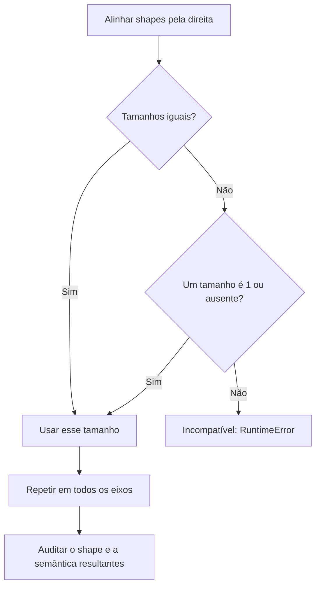
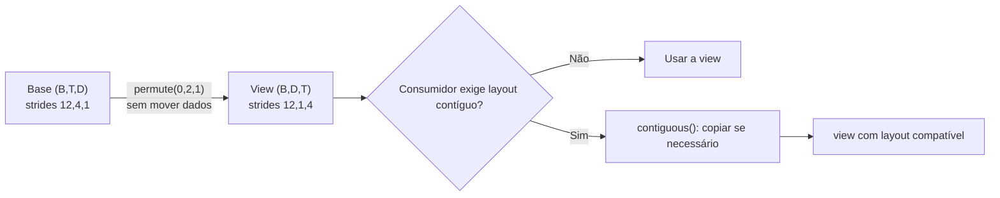
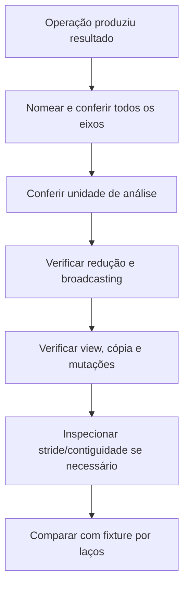

<!-- mirandastech-aula-v2 -->

# Aula 02 — Eixos, indexação, broadcasting e layout

Uma MLP recebe um lote de 32 exemplos, cada um com 784 atributos. Alguém troca um `reshape(32, 784)` por `reshape(-1)`, ou combina uma predição `(32,)` com um alvo `(32,1)`. O programa pode continuar, a loss pode ser finita e o experimento pode estar errado: o primeiro caso apagou a unidade de análise; o segundo comparou cada predição com todos os alvos.

PyTorch conhece tamanhos e posições na memória, mas não sabe que um eixo significa **exemplo**, **atributo** ou **tempo**. Essa semântica é responsabilidade de quem projeta o sistema. Nesta aula, vamos transformar shapes, índices, reduções e layout em contratos verificáveis antes que autograd automatize a regra da cadeia.

[Laboratório reproduzível](../notebooks/02-eixos-broadcasting-layout-laboratorio.ipynb) · [Anterior: tensores, NumPy e PyTorch](01-tensores-numpy-pytorch.md) · [Currículo do M6](../README.md)

[](https://colab.research.google.com/github/joaopaulomirandamatias/ai-lab/blob/main/04-deep-learning/m6-pytorch/notebooks/02-eixos-broadcasting-layout-laboratorio.ipynb)

O notebook roda em CPU, usa somente dados sintéticos e não exige credenciais. Execute todas as células em ordem num kernel novo.

## Objetivos, pré-requisitos e vocabulário

Ao final, você deverá conseguir nomear cada eixo de um tensor; prever o shape de indexações e reduções; usar broadcasting sem criar pares indevidos; distinguir view de cópia; interpretar strides e contiguidade; escolher entre `view`, `reshape`, `permute`, `expand` e `repeat`; e achatar dados preservando a unidade de análise.

São pré-requisitos os contratos de tensor da Aula 01, indexação básica em Python/NumPy e a transformação afim do M5. Autograd, folhas e VJPs começam na Aula 03; aqui todos os tensores permanecem sem acompanhamento de derivadas.

| Termo | Significado operacional |
|---|---|
| Eixo ou dimensão | Direção indexável do tensor, com tamanho e significado declarados |
| Redução | Operação que agrega valores ao longo de um ou mais eixos |
| Broadcasting | Expansão lógica de dimensões compatíveis, sem exigir cópia dos dados |
| View | Tensor que interpreta o mesmo armazenamento de outro tensor |
| Stride | Salto, em elementos, para avançar uma posição em cada eixo |
| Contíguo | Layout compatível com a ordem de memória solicitada |
| Indexação básica | Inteiros, slices, reticências; em geral produz view |
| Indexação avançada | Índices por tensor/lista ou máscara; ao ler, produz cópia |

## 1. Shape é sintaxe; eixos são semântica

Considere $X\in\mathbb{R}^{B\times T\times D}$. Nesta aula:

- $B$ é o número de exemplos no lote;
- $T$ é o número de posições por exemplo;
- $D$ é o número de atributos por posição.

O shape `(2,3,4)` não carrega esses nomes. Poderia significar dois pacientes, três visitas e quatro medições; ou dois documentos, três fragmentos e quatro atributos. A operação `X.mean(dim=1)` é válida nos dois casos, mas só o contrato determina se faz sentido agregar visitas ou fragmentos.

Para índices zero-based, $X_{btd}$ seleciona um escalar. Em PyTorch, `X[1, 2, 3]` acessa o último atributo da última posição do segundo exemplo. O número de elementos é:

$$
\operatorname{numel}(X)=\prod_{j=0}^{n-1}s_j,
$$

em que $n$ é o número de eixos e $s_j$ é o tamanho do eixo $j$. Para `(2,3,4)`, são $2\cdot3\cdot4=24$ elementos.

Uma prática simples evita muitos defeitos: anote shapes com nomes junto à equação. Em vez de “`x` é 3D”, escreva `x: (B,T,D)`. Ao mudar a ordem, escreva a transição: `(B,T,D) -> (B,D,T)`. Não reutilize a mesma letra para semânticas distintas.

| Tensor | Shape | Unidade preservada |
|---|---|---|
| Lote tabular | `(B,D)` | Uma linha por exemplo |
| Sequência de atributos | `(B,T,D)` | Uma sequência por exemplo |
| Imagem para uma MLP | `(B,C,H,W)` antes, `(B,C·H·W)` depois | Uma imagem por exemplo |
| Logits multiclasse | `(B,C)` | Um vetor de classes por exemplo |

Imagens e sequências aparecem apenas para explicar eixos. Suas arquiteturas pertencem ao M7 e aos módulos posteriores.

## 2. Indexar é selecionar e também decidir sobre armazenamento

Indexação básica, como `x[:, 1:, :2]`, normalmente retorna uma view. Nenhum bloco novo precisa ser materializado: o tensor resultante aponta para o armazenamento da base com outro offset, shape e strides. Se a view for modificada, a base reflete a alteração.

Indexação avançada de leitura, como `x[:, torch.tensor([1, 2]), :2]`, retorna uma cópia. Modificar o resultado não altera a origem. Atribuir diretamente por índice, porém, como `x[:, [1,2]] = 0`, é uma operação in-place na base; não confunda leitura com atribuição.

```python
base = torch.arange(12).reshape(3, 4)
view = base[:, 1:3]       # indexação básica
copy = base[:, [1, 2]]    # indexação avançada

view[0, 0] = -1           # base[0, 1] também muda
copy[0, 0] = -2           # base não recebe -2
```

Esse comportamento afeta correção, memória e futura diferenciação. Uma view não é “um tensor independente mais barato”; é outra interpretação dos mesmos dados. Se uma fixture precisa permanecer imutável, use uma cópia explícita e teste a intenção.

### Máscaras booleanas

Com `mask = scores > 0.5`, a expressão `scores[mask]` devolve apenas os valores verdadeiros. Para `scores` de shape `(2,3)`, três correspondências produzem shape `(3,)`: a estrutura linha-coluna desaparece. `mask.nonzero()` preserva as coordenadas, úteis para reconstruir a origem.

| Intenção | Expressão | Cuidado |
|---|---|---|
| Escolher intervalo | `x[:, 2:5]` | Resultado costuma compartilhar armazenamento |
| Escolher posições arbitrárias | `x[:, indices]` | Leitura materializa cópia |
| Filtrar por condição | `x[mask]` | Eixos selecionados podem ser achatados |
| Remover um eixo por índice | `x[0]` | O eixo indexado desaparece |
| Manter eixo unitário | `x[0:1]` | Shape conserva tamanho 1 |

## 3. Reduções: a pergunta correta é “qual eixo some?”

Para $X\in\mathbb{R}^{B\times T\times D}$, a média ao longo das posições é:

$$
\mu_{bd}=\frac{1}{T}\sum_{t=1}^{T}X_{btd}.
$$

`x.mean(dim=1)` produz `(B,D)`: o índice $t$ aparece na soma e desaparece do resultado. `x.mean(dim=1, keepdim=True)` produz `(B,1,D)`, com os mesmos valores e um eixo unitário. Essa segunda forma é particularmente útil para centralizar cada exemplo:

$$
\widetilde X_{btd}=X_{btd}-\mu_{b1d}.
$$

O eixo de tamanho 1 informa onde a média deve ser replicada logicamente. Isso torna o broadcasting audível e facilita asserts.

| Código sobre `(B,T,D)` | Resultado | Interpretação possível |
|---|---|---|
| `x.mean()` | `()` | Um escalar global |
| `x.mean(dim=0)` | `(T,D)` | Média entre exemplos |
| `x.mean(dim=1)` | `(B,D)` | Média entre posições de cada exemplo |
| `x.mean(dim=-1)` | `(B,T)` | Média entre atributos de cada posição |
| `x.mean(dim=1, keepdim=True)` | `(B,1,D)` | Estatística pronta para broadcasting em `T` |

Reduzir o lote durante uma transformação pode causar leakage entre exemplos ou tornar a predição de um elemento dependente dos demais. Isso não significa que toda estatística por lote seja proibida: BatchNorm usa essa decisão deliberadamente e será estudada na Aula 15. O ponto é explicitar a unidade agregada.

## 4. Broadcasting: compatibilidade não implica intenção

Duas dimensões são compatíveis quando, alinhadas **da direita para a esquerda**, têm o mesmo tamanho, uma delas vale 1 ou uma delas não existe. Dimensões ausentes recebem 1 à esquerda. O tamanho resultante é o máximo compatível em cada posição.

Por exemplo:

$$
(B,T,D)+(D)\longrightarrow(B,T,D),
$$

pois `(D)` é lido como `(1,1,D)`. Já `(B,T,D)+(T)` só funciona se $T=D$ ou outra coincidência permitir; mesmo quando funciona por acaso, pode aplicar valores ao eixo errado.



### Exemplo resolvido: padronizar por exemplo e atributo

Para $X$ de shape `(B,T,D)`, queremos média e desvio ao longo de $T$:

$$
\mu_{b1d}=\frac{1}{T}\sum_tX_{btd},\qquad
\sigma_{b1d}=\sqrt{\frac{1}{T}\sum_t(X_{btd}-\mu_{b1d})^2},
$$

$$
Z_{btd}=\frac{X_{btd}-\mu_{b1d}}{\sigma_{b1d}}.
$$

No código, `mean = x.mean(dim=1, keepdim=True)` e `std = x.std(dim=1, keepdim=True, correction=0)` geram `(B,1,D)`. Subtração e divisão expandem o eixo unitário de tamanho 1 para $T$. Na fixture do laboratório, o cálculo vetorizado foi exatamente igual a três laços explícitos, e as médias de `z` ao longo de $T$ foram zero.

Usamos variância populacional (`correction=0`) porque normalizamos todas as três posições da pequena fixture; isso não define o estimador correto para todo problema estatístico.

### Contraprova: loss finita e errada

Predição `p=(1,2,3)` com shape `(3,)` e alvo coluna $y=(1,2,3)^T$ com `(3,1)` geram:

$$
p-y=
\begin{bmatrix}
0&1&2\\
-1&0&1\\
-2&-1&0
\end{bmatrix}.
$$

A média dos nove quadrados é $12/9=4/3$. O modelo parecia perfeito, mas a MSE virou **1,333333** porque cada predição foi comparada com todos os alvos. Depois de `target.squeeze(-1)` e `assert prediction.shape == target.shape`, a MSE correta é zero.

Antes de uma loss elemento a elemento, igualdade de shapes é uma regra de domínio, não uma limitação inconveniente.

## 5. Inserir e remover eixos com intenção

`unsqueeze(dim)` insere um eixo unitário. `squeeze(dim)` remove o eixo indicado somente se seu tamanho for 1. Já `squeeze()` remove todos os eixos unitários.

Considere `(B,D,1)` com $B=1$. `x.squeeze()` produz `(D,)`, apagando ao mesmo tempo o eixo final e o lote. `x.squeeze(-1)` produz `(1,D)` e preserva a unidade de análise. O defeito costuma passar nos lotes maiores e aparecer apenas no último lote unitário.

Uma regra prática: quando o significado do eixo é conhecido, informe `dim`. Use `...` para manter código independente do número de eixos precedentes, por exemplo `x[..., None]` para acrescentar uma dimensão ao final.

## 6. `expand` e `repeat` podem mostrar os mesmos números

Um bias de shape `(1,D)` pode ser apresentado como `(B,D)` de duas formas:

- `bias.expand(B,D)` cria uma view; o eixo expandido usa stride zero;
- `bias.repeat(B,1)` materializa $B$ cópias no armazenamento.

Com float64 e `bias=(10,20,30)`, o laboratório observou 24 bytes no armazenamento de `bias` e da view expandida, contra 96 bytes no tensor repetido quatro vezes. O shape lógico de ambos é `(4,3)`.

Stride zero significa que avançar uma linha continua apontando para os mesmos três valores. Por isso, não faça escrita in-place em uma view expandida quando múltiplas posições representam o mesmo elemento. Se a intenção é apenas participar de uma expressão, broadcasting costuma ser mais claro que chamar `expand` manualmente.

| Operação | Move/copia dados? | Uso principal |
|---|---|---|
| Broadcasting implícito | Não materializa a expansão | Operação elemento a elemento |
| `expand` | View com possíveis strides zero | Expor shape lógico sem repetir armazenamento |
| `repeat` | Materializa repetições | Quando cópias físicas são realmente necessárias |

## 7. Layout e strides: como o índice chega à memória

Um tensor com shape $(s_0,\ldots,s_{n-1})$, strides $(q_0,\ldots,q_{n-1})$, offset $o$ e índice $(i_0,\ldots,i_{n-1})$ localiza o elemento no deslocamento:

$$
o+\sum_{k=0}^{n-1}i_kq_k.
$$

Para um tensor contíguo `(2,3,4)`, os strides são `(12,4,1)`: avançar no último eixo salta um elemento; no intermediário, quatro; no primeiro, doze.

`x.permute(0,2,1)` muda o shape para `(2,4,3)` e os strides para `(12,1,4)`. Os dados não se movem. Assim, `y[1,3,2]` e `x[1,2,3]` apontam para o mesmo valor. A view resultante não é contígua na ordem padrão.



Contiguidade descreve layout, não correção numérica. Muitas operações aceitam tensores não contíguos; algumas fazem cópia internamente ou têm custo diferente. Não acrescente `.contiguous()` indiscriminadamente: isso pode esconder uma cópia grande. Use-o quando o consumidor exigir, e meça desempenho apenas na aula de profiling.

## 8. `view`, `reshape`, `permute` e `contiguous`

Essas operações resolvem problemas diferentes:

| Operação | Contrato essencial |
|---|---|
| `view(shape)` | Reinterpreta o mesmo armazenamento; exige strides compatíveis |
| `reshape(shape)` | Devolve view quando possível e cópia quando necessário; não dependa de qual ocorreu |
| `permute(dims)` | Reordena eixos como view; não reorganiza fisicamente os valores |
| `transpose(a,b)` | Troca dois eixos; caso particular de reordenação |
| `contiguous()` | Retorna o próprio tensor se já estiver no formato; caso contrário, copia |

No laboratório, chamar `view(2,12)` depois de `permute(0,2,1)` levantou `RuntimeError`, como esperado. `reshape(2,12)` funcionou; `permuted.contiguous().view(2,12)` produziu os mesmos valores. A cópia contígua ganhou armazenamento distinto.

Não escreva testes que exijam que `reshape` compartilhe memória. A documentação permite tanto view quanto cópia. Teste os valores, o shape e, apenas quando aliasing fizer parte do contrato, use uma operação que o declare.

## 9. Achatar sem destruir o lote

Uma imagem para MLP pode chegar como $X\in\mathbb{R}^{B\times C\times H\times W}$. O forward espera:

$$
X_{\mathrm{flat}}\in\mathbb{R}^{B\times(CHW)}.
$$

Use `x.reshape(x.shape[0], -1)`. O `-1` pede que PyTorch infira $C\cdot H\cdot W$ pela conservação do número de elementos. `x.reshape(-1)` produz um vetor de tamanho $BCHW$ e mistura todos os exemplos.

Para `(2,1,2,3)`, a forma correta é `(2,6)`; a global é `(12,)`. Ambas preservam 12 números, mas somente a primeira preserva duas unidades de análise. `numel` sozinho é uma verificação necessária, não suficiente.

### Integração com a transformação afim

Uma transformação que atua no último eixo de $X\in\mathbb{R}^{B\times T\times D}$ pode ser escrita:

$$
Y_{bth}=\sum_{d=1}^{D}X_{btd}W_{dh}+b_h,
$$

com $W\in\mathbb{R}^{D\times H}$, $b\in\mathbb{R}^{H}$ e $Y\in\mathbb{R}^{B\times T\times H}$. Em PyTorch, `x @ W + b` aplica a multiplicação nos dois últimos eixos e transmite o bias. Também podemos transformar `(B,T,D)` em `(B·T,D)`, aplicar a afim e restaurar `(B,T,H)`. Na fixture `B=5`, `T=7`, `D=4`, `H=3`, as duas formas coincidiram exatamente.

Essa equivalência vale porque achatamos apenas os eixos independentes $B$ e $T$ e conservamos $D$ como eixo contraído. Trocar a ordem sem registrar a inversa mudaria a associação dos valores.

## 10. Armadilhas e protocolo de depuração



| Sintoma | Hipótese | Verificação |
|---|---|---|
| Loss finita e inesperada | Broadcasting indevido | Imponha igualdade de shapes antes da loss |
| Resultado muda após editar uma seleção | Seleção era view | Faça contraprova de mutação em clone pequeno |
| `view` falha após transposição | Layout incompatível | Inspecione `stride()` e use `reshape` ou cópia consciente |
| Lote de tamanho 1 perde dimensão | `squeeze()` removeu todos os eixos 1 | Use `squeeze(dim)` e assert de shape |
| Uso de memória cresce | `repeat` materializou dados | Prefira broadcasting/`expand` quando a semântica permitir |
| Métrica agrega exemplos errados | `dim` incorreto | Escreva a soma com índices antes do código |

Não use `try/except` para transformar qualquer erro de layout em `.contiguous()` automaticamente. Um erro pode revelar que a ordem semântica dos eixos está errada, e a cópia apenas tornaria esse defeito executável.

## 11. Laboratório e resultados reproduzíveis

O notebook contém **30 células, 14 de código**, com seed fixa `20260902`. As dependências mínimas declaradas são **Python 3.10 e PyTorch 2.6**. A execução de referência ocorreu em CPU com **Python 3.12.14 e PyTorch 2.6.0+cpu**. Não há dataset externo, treinamento, autograd ou benchmark.

| Evidência executada | Resultado |
|---|---|
| Indexação básica | Mutação da view alcançou a base |
| Indexação avançada | Mutação da cópia não alterou a base |
| Broadcasting versus três laços | Erro máximo `0.0` |
| Loss com `(3,)` e `(3,1)` | MSE errada `1.333333`; correta `0.0` |
| `expand(4,3)` versus `repeat(4,1)` | 24 versus 96 bytes de armazenamento em float64 |
| `permute(0,2,1)` | Strides `(12,4,1)` → `(12,1,4)` |
| Afim direta versus achatada/restaurada | Erro máximo `0.0` |
| Auditoria final | **54/54 contratos aprovados**, zero warnings |

As exceções de `view` e os comportamentos de aliasing são contraprovas intencionais e tratadas. O arquivo versionado mantém outputs limpos; os números acima vêm da execução integral de uma cópia de validação. Os bytes dependem do dtype e das dimensões da fixture, não são uma estimativa geral de memória de modelos.

## Checklist prático

- [ ] Nomeei cada eixo e documentei toda mudança de ordem.
- [ ] Preservei a unidade de análise durante `reshape` e `flatten`.
- [ ] Sei quais eixos uma redução elimina e quando usar `keepdim=True`.
- [ ] Alinhei mentalmente os shapes pela direita antes do broadcasting.
- [ ] Exigi shapes iguais quando a loss compara pares correspondentes.
- [ ] Usei `squeeze(dim)` quando o lote pode ter tamanho 1.
- [ ] Sei se uma seleção retorna view ou cópia e evitei mutações inesperadas.
- [ ] Não tratei `reshape` como garantia de compartilhamento.
- [ ] Inspecionei `stride()` antes de atribuir um erro a “bug do PyTorch”.
- [ ] Comparei uma fixture pequena com laços e asserts de shapes.

## Exercícios com respostas comentadas

### 1. Qual é o resultado de reduzir `(B,T,D)` com `sum(dim=(0,1))`?

**Resposta:** `(D,)`. Os índices de lote e posição são somados; apenas o atributo permanece. Com `keepdim=True`, o shape seria `(1,1,D)`.

### 2. `(8,1,64)` e `(32,64)` são broadcastable? Qual o resultado?

**Resposta:** sim. Alinhando pela direita, temos `(8,1,64)` e `(1,32,64)`, resultando em `(8,32,64)`. Isso não prova que cruzar 8 com 32 seja a intenção.

### 3. Por que `(B,) - (B,1)` não compara pares correspondentes?

**Resposta:** o primeiro shape vira `(1,B)`; o resultado é `(B,B)`. Cada linha do alvo encontra todas as predições. Para pares, normalize ambos para `(B,)` ou ambos para `(B,1)` e imponha igualdade.

### 4. Qual a diferença entre `x[0]` e `x[0:1]` para `x` de shape `(B,D)`?

**Resposta:** `x[0]` produz `(D,)`; `x[0:1]` produz `(1,D)`. A segunda forma conserva o eixo do lote.

### 5. Se `y = x[:, 1:3]`, alterar `y` pode mudar `x`?

**Resposta:** sim. O fatiamento básico normalmente é uma view. Se independência for requisito, faça uma cópia explícita e teste a contraprova.

### 6. `reshape` sempre copia quando o tensor não é contíguo?

**Resposta:** não use essa suposição. Ele pode retornar view ou cópia conforme o layout. O contrato do programa deve depender de shape e valores, não dessa escolha, salvo quando você controla aliasing explicitamente.

### 7. O que significa stride zero em `expand`?

**Resposta:** avançar naquele eixo não avança no armazenamento. Várias posições lógicas leem o mesmo elemento. Isso economiza memória, mas torna escrita in-place ambígua e perigosa.

### 8. Por que `x.squeeze()` pode falhar só no último lote?

**Resposta:** se esse lote tiver tamanho 1, o eixo do lote também é removido. Lotes maiores não têm esse eixo unitário. `squeeze` com dimensão declarada preserva o contrato.

### 9. Uma transposição altera os valores?

**Resposta:** ela altera qual índice acessa cada valor, não o armazenamento subjacente. `permute`/`transpose` criam outra interpretação; uma cópia contígua pode depois reorganizar fisicamente os dados preservando a nova ordem lógica.

### 10. Como achatar `(16,3,28,28)` para uma MLP?

**Resposta:** `x.reshape(x.shape[0], -1)`, resultando em `(16,2352)`. `reshape(-1)` misturaria as 16 imagens num único vetor.

## Resumo e próxima aula

Eixos carregam a semântica que PyTorch não pode inferir. Reduções eliminam índices; broadcasting expande dimensões pela direita; indexação decide quais valores e qual armazenamento são usados; strides descrevem a rota até a memória. `view`, `reshape`, `permute`, `expand`, `repeat` e `contiguous` não são sinônimos.

Na **Aula 03 — Autograd: de escalares a VJPs**, esses contratos sustentarão a regra da cadeia. Veremos por que `.backward()` em uma saída não escalar requer um vetor cotangente e compararemos os gradientes automáticos às derivadas manuais do M5.

## Referências técnicas

Fontes oficiais verificadas em **9 de setembro de 2026**. O laboratório executou PyTorch 2.6.0+cpu; os links versionados abaixo documentam os comportamentos usados, sem afirmar que 2.6 seja a versão corrente mais recente.

1. PYTORCH. [Broadcasting semantics — documentação 2.6](https://docs.pytorch.org/docs/2.6/notes/broadcasting.html). Regras de compatibilidade, shape resultante e limites de operações in-place.
2. PYTORCH. [Tensor Views — documentação 2.6](https://docs.pytorch.org/docs/2.6/tensor_view.html). Views, indexação básica/avançada, transposição, `reshape` e contiguidade.
3. PYTORCH. [`Tensor.contiguous` — documentação 2.6](https://docs.pytorch.org/docs/2.6/generated/torch.Tensor.contiguous.html). Retorno no formato de memória solicitado.
4. NUMPY. [Broadcasting](https://numpy.org/doc/stable/user/basics.broadcasting.html). Semântica de referência adotada pelas operações PyTorch compatíveis.

**Material conceitual complementar:** PRINCE, Simon. [Understanding Deep Learning](https://udlbook.github.io/udlbook/), especialmente a notação de tensores e redes. A documentação oficial de PyTorch permanece a referência normativa das APIs.
