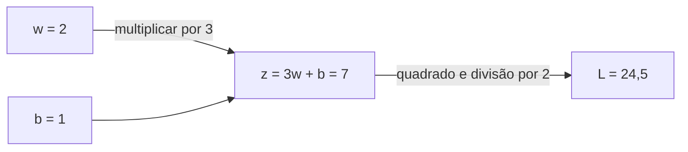
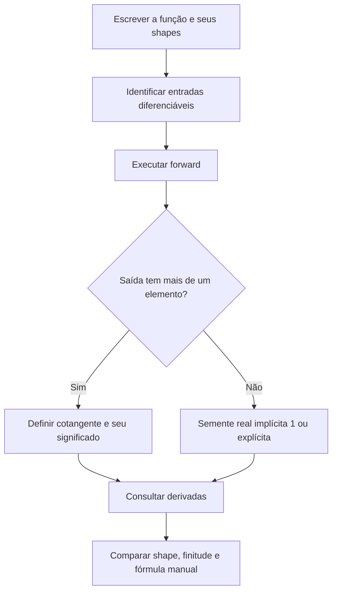

<!-- mirandastech-aula-v2 -->

# Aula 03 — Autograd: de escalares a VJPs

No M5, cada gradiente da MLP tinha uma fórmula e um caminho no grafo. Ao migrar para PyTorch, a linha `loss.backward()` parece substituir páginas de cálculo. Mas o que ela realmente calcula? E por que chamar `predictions.backward()` pode falhar, embora as predições tenham sido calculadas corretamente?

Imagine uma rede que produz três medidas por exemplo. Para mudar os pesos, precisamos declarar como essas medidas participam do objetivo: somar, tirar a média, selecionar uma componente ou aplicar pesos diferentes. Autograd executa a regra da cadeia da função programada. Escolher essa função continua sendo parte do trabalho científico.

Nesta aula, partimos de um escalar e chegamos ao **produto vetor-Jacobiano**, ou VJP. Uma pequena MLP em NumPy fornece a referência independente para suas derivadas automáticas. O foco é entender a consulta de gradientes; o laço de treinamento será construído mais adiante no currículo.

[Anterior: eixos e layout](02-eixos-broadcasting-layout.md) · [Laboratório executável](../notebooks/03-autograd-vjp-laboratorio.ipynb) · [Currículo do M6](../README.md)

[](https://colab.research.google.com/github/joaopaulomirandamatias/ai-lab/blob/main/04-deep-learning/m6-pytorch/notebooks/03-autograd-vjp-laboratorio.ipynb)

Como alternativa, baixe o notebook e execute todas as células em um kernel Python novo. Os dados são sintéticos e o experimento funciona em CPU.

## Objetivos, pré-requisitos e vocabulário

Ao terminar, você deverá explicar o que autograd automatiza; relacionar `requires_grad`, `grad_fn` e `.grad`; calcular uma VJP manualmente; escolher um cotangente com significado; distinguir a VJP do Jacobiano completo e da JVP; e conferir gradientes de pesos e biases com seus shapes.

São pré-requisitos a regra da cadeia, o backward de camadas afins e ativações do M5 e os contratos de eixos das aulas 01–02 do M6. Usaremos somente tensores reais em precisão dupla. Regras para números complexos ficam fora do escopo.

| Termo | Significado nesta aula |
|---|---|
| Diferenciação automática | Composição de derivadas locais das operações executadas |
| Modo reverso | Propagação de sensibilidades da saída em direção às entradas |
| Folha | Tensor de entrada criado pelo usuário, sem operação anterior registrada, nos exemplos desta aula |
| `requires_grad` | Solicita acompanhamento de derivadas para um tensor compatível |
| `grad_fn` | Referência à operação registrada que produziu um tensor intermediário |
| Cotangente | Sensibilidade recebida na saída, com o mesmo shape dela |
| Jacobiano | Matriz com uma derivada de cada saída em relação a cada entrada |
| VJP | Combinação de linhas do Jacobiano determinada pelo cotangente |

## 1. Intuição: mensagens locais que se compõem

Considere $z=3w+b$ e $L=z^2/2$. Se aumentamos $w$ um pouco, $z$ cresce três vezes esse incremento. A resposta local de $L$ a $z$ é $z$. Multiplicar esses dois fatores fornece a resposta de $L$ a $w$.

O modo reverso começa com a sensibilidade da loss em relação a ela mesma, $\partial L/\partial L=1$. Cada operação recebe uma sensibilidade, multiplica pela sua derivada local e envia a contribuição aos operandos. Quando existem vários caminhos até a mesma entrada, as contribuições são somadas.



O desenho mostra o forward. No sentido inverso, a operação quadrática recebe 1 e devolve 7; a transformação afim envia $7\cdot3=21$ para $w$ e $7\cdot1=7$ para $b$.

Autograd registra operações compatíveis durante o forward e aplica esse encadeamento no backward [1]. Isso não é procurar uma expressão simbólica simplificada nem perturbar cada peso por diferenças finitas. As contas continuam sujeitas à precisão de ponto flutuante.

## 2. Primeiro escalar: derivada e atualização são etapas distintas

As equações do exemplo são:

$$
z=3w+b,\qquad L=\frac{z^2}{2},\qquad
\frac{\partial L}{\partial w}=3z,\quad
\frac{\partial L}{\partial b}=z.
$$

Aqui $w$ e $b$ são parâmetros escalares, 3 é uma entrada fixa e $L$ é o objetivo. Em $w=2$ e $b=1$, obtemos $z=7$, $L=24{,}5$, $\partial L/\partial w=21$ e $\partial L/\partial b=7$.

O exemplo completo pode ser executado isoladamente:

```python
import torch

w = torch.tensor(2.0, dtype=torch.float64, requires_grad=True)
b = torch.tensor(1.0, dtype=torch.float64, requires_grad=True)
loss = (3 * w + b).square() / 2
loss.backward()
assert w.grad.item() == 21.0
assert b.grad.item() == 7.0
assert w.item() == 2.0
print(loss.item(), w.grad.item(), b.grad.item())
```

O peso ainda vale 2 depois do backward. A derivada indica uma sensibilidade local; uma atualização como $w\leftarrow w-\eta\,\partial L/\partial w$ exigiria outro passo e a escolha de uma taxa $\eta$. A aula de SGD explícito reunirá essas etapas.

Nos exemplos, `w` e `b` são folhas. O intermediário `z` tem `grad_fn`; isso permite seguir suas dependências. Não precisamos ler `.grad` dos intermediários para obter as derivadas dos parâmetros. O ciclo de vida desses campos será o tema da Aula 04.

## 3. Somar caminhos não é tirar uma média

Se $u=x^2$ e $L=u+3x$, há dois caminhos de $x$ até $L$:

$$
\frac{dL}{dx}=\frac{\partial L}{\partial u}\frac{du}{dx}+3=2x+3.
$$

Em $x=2$, o resultado é 7. Considerar apenas o caminho quadrático produziria 4; tirar a média de 4 e 3 produziria 3,5. Nenhum desses resultados representa a função completa.

Esse mecanismo aparece em parâmetros compartilhados: um bias usado em várias linhas recebe a soma de todas as contribuições. Ele também ajuda a entender redes com vários ramos, embora suas arquiteturas sejam estudadas posteriormente.

## 4. Saídas vetoriais: qual combinação queremos derivar?

Considere $f:\mathbb{R}^n\rightarrow\mathbb{R}^m$, com entrada coluna $x$ e saída coluna $y=f(x)$. Definimos:

$$
J_{ij}(x)=\frac{\partial y_i}{\partial x_j},\qquad
J\in\mathbb{R}^{m\times n}.
$$

O índice $i$ percorre saídas; $j$ percorre entradas. Uma saída escalar tem $m=1$. Quando $m>1$, não existe um único gradiente que represente todas as escolhas de objetivo escalar.

Fixe $v\in\mathbb{R}^m$ e defina $s=v^Ty$. Então:

$$
\nabla_x s=J^Tv,\qquad
(\nabla_xs)_j=\sum_{i=1}^{m}v_i\frac{\partial y_i}{\partial x_j}.
$$

Esse é o produto chamado **VJP**. Na convenção de vetores linha, escreve-se $v^TJ$; usamos seu transposto $J^Tv$ para representar o gradiente como coluna. São a mesma informação, com orientação diferente.

O cotangente $v$ pertence ao espaço das **saídas**. Em uma cadeia maior, ele costuma ser $\nabla_y L$, calculado pela parte posterior do grafo. Não é uma taxa de aprendizagem, uma direção de perturbação de $x$ ou o próprio Jacobiano.

## 5. Exemplo resolvido: de três saídas para duas entradas

Escolhemos uma função pequena que permite conferir cada entrada do Jacobiano:

$$
f(x_1,x_2)=
\begin{bmatrix}
x_1^2+x_2\\
x_1x_2\\
\sin(x_2)
\end{bmatrix},\qquad
J(x)=
\begin{bmatrix}
2x_1&1\\
x_2&x_1\\
0&\cos(x_2)
\end{bmatrix}.
$$

Em $x=(2,0)^T$, $y=(4,0,0)^T$ e:

$$
J=
\begin{bmatrix}4&1\\0&2\\0&1\end{bmatrix}.
$$

Para $v=(1,-2,3)^T$, a primeira componente da VJP é $4(1)+0(-2)+0(3)=4$. A segunda é $1(1)+2(-2)+1(3)=0$. Logo $J^Tv=(4,0)^T$.

Esse zero expressa cancelamento entre contribuições. Não significa que a segunda entrada esteja desconectada de todas as saídas. Uma nova escolha de cotangente pode produzir uma resposta diferente.

O notebook calcula a VJP usando `torch.autograd.grad(y, x, grad_outputs=v)`. Também confirma o resultado por `y.backward(v)` em um forward novo e pela derivada do escalar `(v*y).sum()`.

| Cotangente | Consulta matemática | Resultado na fixture |
|---|---|---|
| $(1,0,0)$ | Gradiente da primeira saída | $(4,1)$ |
| $(0,1,0)$ | Gradiente da segunda saída | $(0,2)$ |
| $(0,0,1)$ | Gradiente da terceira saída | $(0,1)$ |
| $(1,-2,3)$ | Combinação ponderada | $(4,0)$ |

Consultar os três vetores da base e empilhar os retornos reconstrói as três linhas do Jacobiano. Fazemos isso apenas na fixture pequena para enxergar o objeto que a VJP contrai.

## 6. Escolher a API e a semente corretamente

As duas formas centrais desta aula têm contratos diferentes [2–3]:

| Chamada | Retorno e efeito usado aqui |
|---|---|
| `loss.backward()` | Retorna `None`; acumula derivadas nas folhas elegíveis |
| `y.backward(v)` | Aplica o cotangente `v` e acumula a VJP |
| `torch.autograd.grad(loss, (w, b))` | Retorna uma tupla de gradientes solicitados |
| `torch.autograd.grad(y, x, grad_outputs=v)` | Retorna a VJP em relação a `x` |

`autograd.grad` não preenche `.grad` das entradas solicitadas. Isso é conveniente quando queremos comparar um valor com uma fórmula. Já `backward` se encaixará no laço que entrega `.grad` ao otimizador.

Para saídas reais com **mais de um elemento**, omitir a semente é um erro: falta especificar a combinação das saídas. Na prática, uma saída real de um único elemento aceita a semente implícita 1 mesmo com shape `(1,)`, e não apenas com shape `()`. O laboratório testa esse detalhe explicitamente.

Use um cotangente com o mesmo shape, dtype e dispositivo da saída. Não espere que o broadcasting da Aula 02 corrija um `grad_outputs` de shape errado. O notebook captura e verifica a rejeição de uma semente de tamanho 2 para uma saída de tamanho 3.

Para cada consulta independente, recriamos o forward. Não adicionamos `retain_graph=True` por hábito. Reutilização do grafo, limpeza e acúmulo pertencem à próxima aula.

## 7. Soma, média e pesos são cotangentes diferentes

Suponha um vetor de perdas por exemplo $\ell(\theta)\in\mathbb{R}^B$. Para uma soma, uma média ou uma combinação com pesos fixos $\alpha_i$:

$$
L_{\mathrm{soma}}=\sum_i\ell_i,\quad
L_{\mathrm{média}}=\frac1B\sum_i\ell_i,\quad
L_{\alpha}=\sum_i\alpha_i\ell_i.
$$

Os cotangentes correspondentes são, respectivamente, $\mathbf{1}$, $\mathbf{1}/B$ e $\alpha$. Se os pesos não somam 1, a última expressão é uma soma ponderada, não necessariamente uma média.

No laboratório, $\ell_i=(\theta-a_i)^2/2$, com $a=(1,2,4)$ e $\theta=0$. As derivadas individuais são $(-1,-2,-4)$. Portanto:

- soma: $-7$;
- média: $-7/3\approx-2{,}333333$;
- pesos $(0{,}2,0{,}3,0{,}5)$: $-2{,}8$.

Passar `ones_like(losses)` não solicita gradientes separados por exemplo: combina suas contribuições em uma soma. A obtenção de gradientes individuais exige consultas adequadas, como os vetores da base no exemplo anterior.

Em uma MLP, um único parâmetro pode influenciar todos os exemplos. O gradiente retornado mantém o shape do parâmetro; não ganha automaticamente um eixo de lote.

## 8. Broadcasting no forward, soma no backward

Para $Y=X+b$, com $X,Y\in\mathbb{R}^{B\times D}$ e $b\in\mathbb{R}^{D}$, cada saída $Y_{ij}$ usa o mesmo $b_j$. Dado o cotangente $V\in\mathbb{R}^{B\times D}$:

$$
\frac{\partial s}{\partial b_j}=\sum_{i=1}^{B}V_{ij}.
$$

Com $V=[[1,2],[3,4],[5,6]]$, o gradiente do bias é $(9,12)$. A média $(3,4)$ só seria apropriada se a função objetivo incluísse a divisão por três; nesse caso, o cotangente seria $V/3$.

A operação inversa da replicação lógica soma as contribuições que apontam para o mesmo parâmetro. Essa observação conecta a semântica de eixos ao backward afim derivado no M5 e detecta um erro frequente: aplicar uma segunda média a um gradiente que já recebeu a redução da loss.

## 9. VJP e JVP: dois produtos distintos

Uma perturbação de entrada $u\in\mathbb{R}^n$ produz a aproximação $f(x+\varepsilon u)\approx f(x)+\varepsilon Ju$. O produto $Ju$ é a **JVP**, com shape da saída. A VJP $J^Tv$ recebe um cotangente de saída e tem shape da entrada.

| Produto | Vetor fornecido | Resultado | Pergunta respondida |
|---|---|---|---|
| $Ju$ | Direção nas entradas | Variação nas saídas | Como a saída reage a este movimento? |
| $J^Tv$ | Sensibilidade nas saídas | Sensibilidade nas entradas | Como esta combinação das saídas depende da entrada? |

No exemplo de três saídas e duas entradas, $u=(0,1)$ fornece $Ju=(1,2,1)$. A identidade $v^T(Ju)=(J^Tv)^Tu$ dá zero nos dois lados para o $v$ escolhido, e o notebook a verifica.

Quando há muitos parâmetros e uma loss escalar, o modo reverso obtém todas as suas derivadas sem formar explicitamente uma matriz completa de Jacobianos por camada. Isso ajuda a explicar sua utilidade no treinamento. Não elimina o custo de armazenar intermediários necessários ao backward [1,4].

## 10. Integração: MLP pequena com referência independente

A rede do laboratório tem $B=5$ exemplos, $D=3$ entradas, $H=4$ unidades ocultas e $C=2$ saídas. Definimos:

$$
Z=XW_1+b_1,\quad A=\tanh(Z),\quad S=AW_2+b_2,
$$

$$
L=\frac{1}{2BC}\sum_{i=1}^{B}\sum_{c=1}^{C}(S_{ic}-T_{ic})^2.
$$

$T$ contém alvos sintéticos contínuos. A loss é metade da média dos erros quadráticos sobre **todos os elementos**, com shapes de saída e alvo iguais. Não há classificação ou treinamento nesta fixture.

O backward manual em NumPy é:

$$
G_S=\frac{S-T}{BC},\quad G_{W_2}=A^TG_S,\quad
G_{b_2}=\sum_i(G_S)_{i,:},
$$

$$
G_Z=(G_SW_2^T)\odot(1-A^2),\quad
G_{W_1}=X^TG_Z,\quad G_{b_1}=\sum_i(G_Z)_{i,:}.
$$

$G_Q$ denota $\partial L/\partial Q$ e $\odot$ multiplica elemento a elemento. Os fatores da tanh vêm das derivadas locais; a divisão por $BC$ entra uma única vez em $G_S$.

| Parâmetro | Shape do parâmetro e do gradiente |
|---|---|
| $W_1$ | `(3,4)` |
| $b_1$ | `(4,)` |
| $W_2$ | `(4,2)` |
| $b_2$ | `(2,)` |

As entradas e os pesos são gerados uma única vez em NumPy e copiados para PyTorch. Assim, a comparação não confunde geradores aleatórios diferentes com diferenças de implementação. `autograd.grad` devolve os quatro gradientes, conferidos contra as fórmulas acima.

Uma contraprova divide $G_S$ apenas por $B$. Como $C=2$, o gradiente incorreto de $W_2$ fica exatamente duas vezes o correto. Autograd não corrige uma redução programada de maneira errada; precisamos conferir a função objetivo.

## 11. O cotangente não acrescenta a derivada de seus coeficientes

A equivalência entre VJP e gradiente de $v^Tf(x)$ pressupõe $v$ **fixo em relação a $x$**. Quando $v=v(x)$, a função produto tem outro termo:

$$
\nabla_x[v(x)^Tf(x)]=J_f^Tv+J_v^Tf(x).
$$

A consulta VJP com `grad_outputs=v` calcula o primeiro termo. Não inclui automaticamente o segundo como faria a diferenciação da função produto explicitamente construída.

A contraprova usa $f(x)=x^2$ e $v(x)=x$, em $x=2$. A VJP local é $x\cdot2x=8$. A derivada de $x\cdot x^2=x^3$ é $3x^2=12$. O laboratório confirma ambos os números. Não há contradição: são consultas diferentes.

Na cadeia usual de uma loss, o cotangente recebido representa a sensibilidade calculada na saída naquele ponto. Para esta aula trabalhamos com derivadas de primeira ordem e não pedimos construção do grafo das próprias derivadas.

## 12. Limites e depuração prática



| Sintoma | O que investigar primeiro |
|---|---|
| Saída vetorial rejeita backward | Falta do cotangente ou shape incompatível |
| Parâmetros não mudam | Backward calcula derivadas; atualização ainda não foi executada |
| `.grad` segue `None` após `autograd.grad` | A API devolveu a derivada no retorno |
| Gradiente difere por fator constante | Soma, média, tamanho real do lote e número de saídas |
| Uma componente do gradiente é zero | Cancelamento, saturação ou função localmente constante; zero não prova desconexão |
| Gradiente finito, resultado científico incorreto | Objetivo, alvos, eixos e protocolo podem estar errados |

Operações não diferenciáveis, como seleção discreta por `argmax`, não fornecem a derivada útil esperada para treinar classificadores. Em quinas, como ReLU em zero, a biblioteca adota convenções; isso não transforma uma função não diferenciável em uma função suave. Usamos tanh na MLP para manter a comparação suave. O estudo sistemático de quinas e tolerâncias será feito na Aula 05.

Uma verificação direcional adicional compara a diferença central de $L$ com $\sum_Q\langle G_Q,U_Q\rangle$, usando uma direção conjunta normalizada $U$ e passo $h=10^{-5}$. Ela oferece um controle independente pontual, sem substituir uma auditoria completa de todas as coordenadas.

## Laboratório reproduzível e resultados

As dependências mínimas são Python 3.10, NumPy 1.24 e PyTorch 2.6. O ambiente executado foi **Python 3.12.14, NumPy 2.3.5 e PyTorch 2.6.0+cpu**. Usamos float64 e seed `20260903`; não afirmamos igualdade bit a bit entre todas as versões ou plataformas.

O notebook possui **30 células, 14 de código**. As 40 verificações passaram em ordem, sem warnings inesperados. Duas exceções intencionais são capturadas e verificadas: saída vetorial sem cotangente e cotangente de shape errado. A cópia de validação foi executada; o notebook publicado conserva outputs vazios e contadores limpos.

| Verificação | Resultado confirmado |
|---|---|
| Escalar $L=(3w+b)^2/2$ | $L=24{,}5$; gradientes 21 e 7 |
| VJP com três saídas e duas entradas | $(4,0)$ |
| Bias transmitido entre três linhas | Gradiente $(9,12)$ |
| Loss da MLP | `0,6722482370211182` |
| Maior erro absoluto NumPy/autograd | `5,551115×10⁻¹⁷` |
| Erro absoluto do controle direcional | `3,772416×10⁻¹³` |
| VJP com coeficiente variável versus produto | 8 versus 12 |

As comparações manuais usam `atol=rtol=1e-12`. O controle direcional usa `atol=1e-9`, `rtol=1e-8`, pois inclui aproximação por diferenças finitas. Essas tolerâncias são compromissos declarados para as fixtures, não critérios universais.

Não há ajuste de modelo nem estimação de desempenho preditivo; portanto não criamos splits artificiais. Os resultados sustentam paridade local do cálculo, e não generalização. Em sistemas reais, essa camada de evidência ajuda a investigar migrações de modelos e implementações científicas antes de gastar tempo em treinamento.

## Checklist de domínio

- [ ] Explico o caminho de cada derivada até o parâmetro.
- [ ] Distingo calcular gradientes de atualizar pesos.
- [ ] Conheço o efeito da API escolhida sobre `.grad`.
- [ ] Declaro o significado, shape, dtype e device do cotangente.
- [ ] Sei por que `ones_like` soma contribuições em vez de separar exemplos.
- [ ] Confiro a redução por lote e por saída exatamente uma vez.
- [ ] Distingo $J^Tv$, $Ju$ e o Jacobiano completo.
- [ ] Não uso um coeficiente variável como se fosse constante na função produto.
- [ ] Comparo fixtures idênticas com derivadas manuais e tolerâncias justificadas.

## Exercícios com respostas comentadas

### 1. Qual o gradiente de $(3w+b)^2/2$ em $w=0$, $b=2$?

**Resposta:** $z=2$, portanto $\partial L/\partial w=6$ e $\partial L/\partial b=2$. O valor da entrada fixa 3 multiplica apenas a derivada em relação a $w$.

### 2. Backward com $v=(0,1,0)$ devolve o quê no exemplo vetorial?

**Resposta:** $(0,2)$, a segunda linha de $J$ representada como vetor de entrada. Selecionamos a derivada de $x_1x_2$ em $(2,0)$.

### 3. Qual o shape de uma VJP se a entrada tem 100 parâmetros e a saída tem 5 componentes?

**Resposta:** o cotangente tem 5 componentes e a VJP tem 100. O Jacobiano completo teria shape `(5,100)`.

### 4. Passar um vetor de uns devolve o gradiente de cada exemplo separadamente?

**Resposta:** não. Ele solicita a soma das contribuições das saídas. Para separar as consultas, podemos usar cotangentes da base na fixture pequena.

### 5. Trocar a média pela soma na MLP multiplica os gradientes por quanto?

**Resposta:** por $BC=10$. A média original usa todos os dez resíduos. Dividir somente pelo número de exemplos ignora o eixo das saídas.

### 6. Por que `autograd.grad` deixou `w.grad` vazio?

**Resposta:** a derivada está na tupla retornada. Esse comportamento é esperado; a API não a acumula nesse campo.

### 7. O gradiente zero da segunda entrada na VJP $(4,0)$ prova que ela não participa da função?

**Resposta:** não. Ela influencia as três saídas; as contribuições $1-4+3$ se cancelam para o cotangente escolhido.

### 8. Uma saída com shape `(1,)` sempre precisa de semente explícita?

**Resposta:** no caso real exercitado, não. Ela tem um elemento e aceita semente implícita 1. A obrigação relevante aqui ocorre quando há mais de um elemento.

### 9. Para $f(x)=x^2$ e $v=x$, por que 8 e 12 são ambos corretos em $x=2$?

**Resposta:** 8 é a VJP local $v\,f'(x)$. Já 12 é a derivada do produto $v(x)f(x)$, incluindo também $v'(x)f(x)$.

### 10. Paridade de gradientes garante que a rede generaliza?

**Resposta:** não. Ela mostra concordância do cálculo em entradas e parâmetros fixos. Generalização exige dados, splits, seleção e avaliação apropriados, que serão integrados no P6.

## Resumo e transição

Autograd compõe derivadas locais no sentido reverso. Uma loss real de um elemento pode iniciar essa propagação com semente 1; saídas maiores exigem declarar o cotangente. Essa consulta produz uma VJP, cuja interpretação depende dos pesos e reduções escolhidos. O backward manual continua sendo uma referência para entender e verificar o cálculo automatizado.

A próxima é a **Aula 04 — Ciclo de vida do grafo e acúmulo de gradientes**, arquivo previsto `04-grafo-acumulo-gradientes.md`. Estudaremos folhas, limpeza de `.grad`, desconexões e operações in-place, seguindo o currículo sem antecipar o treinamento completo.

## Referências técnicas

Fontes verificadas em **9 de setembro de 2026**. Os exemplos, derivações aplicadas, fixtures e resultados foram produzidos para esta aula. As páginas de API abaixo são da documentação 2.14; os argumentos usados foram exercitados em PyTorch 2.6.0. Não utilizamos recursos exclusivos das versões posteriores.

1. PYTORCH. [Autograd mechanics — 2.6](https://docs.pytorch.org/docs/2.6/notes/autograd.html). Registro das operações, modo reverso e limites das derivadas.
2. PYTORCH. [torch.autograd.grad — 2.14](https://docs.pytorch.org/docs/2.14/generated/torch.autograd.grad.html). Cotangentes e retorno dos gradientes solicitados.
3. PYTORCH. [Tensor.backward — 2.14](https://docs.pytorch.org/docs/2.14/generated/torch.Tensor.backward.html). Semente, regra da cadeia e acúmulo.
4. BAYDIN, A. G. et al. [Automatic Differentiation in Machine Learning: a Survey](https://jmlr.org/papers/v18/17-468.html). JMLR, v. 18, n. 153, p. 1–43, 2018. Referência científica sobre diferenciação automática.

**Material complementar:** [A Gentle Introduction to torch.autograd](https://docs.pytorch.org/tutorials/beginner/blitz/autograd_tutorial.html), tutorial oficial PyTorch, versão exibida 2.14.0+cu130 na consulta. Use os diagramas para revisar o mecanismo após resolver as fixtures.
