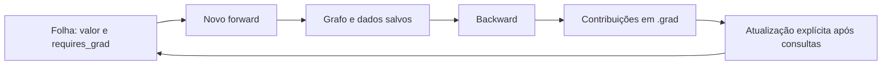
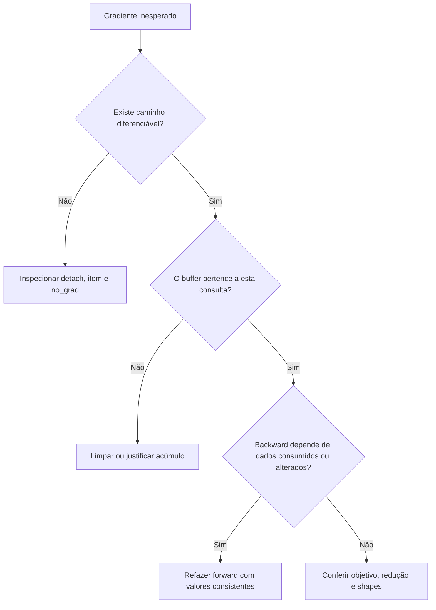

<!-- mirandastech-aula-v2 -->

# Aula 04 — Ciclo de vida do grafo e acúmulo de gradientes

Sua MLP calcula a loss e produz gradientes plausíveis. Na segunda chamada, porém, aparece um erro de grafo já utilizado. Você acrescenta `retain_graph=True`; o erro desaparece, mas os gradientes crescem a cada repetição. Depois, ao guardar uma cópia dos pesos, uma alteração aparentemente isolada também modifica o modelo.

Esses sintomas envolvem três objetos diferentes: **os valores dos tensores, o histórico das operações e os buffers de gradientes**. Controlar um deles não implica controlar os outros. Nesta aula, vamos separar essas responsabilidades antes de construir o laço de treinamento do M6.

[Anterior: Autograd e VJPs](03-autograd-vjp.md) · [Notebook executável](../notebooks/04-grafo-acumulo-gradientes-laboratorio.ipynb) · [Currículo](../README.md)

[](https://colab.research.google.com/github/joaopaulomirandamatias/ai-lab/blob/main/04-deep-learning/m6-pytorch/notebooks/04-grafo-acumulo-gradientes-laboratorio.ipynb)

Como alternativa, baixe o notebook e execute todas as células em ordem. Os experimentos usam somente CPU e dados sintéticos; não exigem credenciais, downloads de datasets ou serviços externos.

## Objetivos, pré-requisitos e vocabulário

Ao terminar, você deverá conseguir identificar folhas e intermediários; explicar quando `.grad` acumula; reconstruir um forward; distinguir `retain_grad`, `retain_graph` e `create_graph`; escolher entre cópia e desconexão; detectar mutações incompatíveis com backward; e acumular micro-lotes desiguais sem mudar o objetivo matemático.

Pré-requisitos: tensores, views e broadcasting das aulas 01–02; regra da cadeia e VJP da Aula 03; médias ponderadas e mini-batches do M5. Trabalhamos com tensores reais em float64. `nn.Module`, otimizadores e treinamento completo terão suas próprias aulas.

| Termo | Papel nesta aula |
|---|---|
| Folha, ou *leaf* | Tensor sem operação anterior registrada no grafo; pode ser uma entrada diferenciável |
| Intermediário | Resultado de uma operação registrada, com `grad_fn` |
| Buffer `.grad` | Campo que pode guardar e acumular derivadas de um tensor |
| Dados salvos | Valores do forward necessários a determinadas derivadas locais |
| Alias | Outro tensor que acessa o mesmo armazenamento |
| In-place | Operação que altera dados existentes, como `add_` ou uma atribuição por índice |
| Desconexão | Interrupção do caminho de diferenciação, como em `detach()` |
| Micro-lote | Parte de um lote maior processada separadamente para acumular contribuições |

## 1. Três estados que não devem ser confundidos

Pense no forward como um cálculo que deixa instruções para uma consulta posterior de derivadas. Algumas instruções precisam conservar valores: para derivar $x^2$, é necessário conhecer $x$. Outras precisam de menos informação. O backward segue essas dependências, enquanto os buffers das folhas recebem as contribuições calculadas.

| Estado | Exemplo | Como muda |
|---|---|---|
| Valor | `x = 2` | Uma atualização ou mutação altera o número |
| Histórico | `loss = x.square()` | O forward registra uma nova dependência |
| Gradiente acumulado | `x.grad = 4` | Backward acrescenta derivadas; limpeza remove ou zera o buffer |

Consequências práticas: zerar `.grad` não refaz o forward; refazer o forward não zera `.grad`; calcular backward não atualiza o parâmetro. Essa separação explica por que um programa pode estar correto em cada operação isolada e errado na sequência delas.



O desenho mostra o ciclo conceitual. A limpeza do buffer será uma decisão explícita antes do conjunto de contribuições que queremos somar. A atualização só deve ocorrer quando as consultas que usam os valores antigos tiverem terminado.

## 2. Folhas, `grad_fn` e retenção do gradiente intermediário

Nos exemplos diferenciáveis, `torch.tensor(..., requires_grad=True)` cria uma folha. Já `z = 3*x` cria um intermediário. Para tensores com `requires_grad=False`, PyTorch também considera `is_leaf=True` por convenção; portanto `is_leaf` sozinho não informa se haverá cálculo de derivadas [2].

Considere:

$$
z=3x,\qquad L=z^2,\qquad
\frac{\partial L}{\partial z}=2z,\qquad
\frac{dL}{dx}=2z\cdot3.
$$

Em $x=2$, $z=6$, logo as derivadas são 12 e 36. O backward precisa da sensibilidade intermediária para chegar a $x$, mas não mantém automaticamente essa sensibilidade no campo `z.grad`.

No notebook, chamamos `z.retain_grad()` **antes** do backward. Depois dele, `z.grad=12` e `x.grad=36`. `z` continua não folha. A chamada solicita armazenamento do gradiente intermediário, sem transformar esse tensor em parâmetro independente.

Evite consultar `.grad` de uma não folha sem retenção apenas para verificar se o campo está vazio: isso gera um aviso. Inspecione primeiro `is_leaf`, `requires_grad` e `grad_fn`. `retain_grad()` é útil na depuração de ativações; não precisa estar em todos os intermediários de uma rede grande.

## 3. Acumular é somar contribuições, não substituir

Se a folha $\theta$ participa de objetivos $L_1,\ldots,L_K$, e não é atualizada entre consultas, o buffer após os backwards representa:

$$
G_K=G_0+\sum_{k=1}^{K}\nabla_\theta L_k(\theta).
$$

$G_0$ é o conteúdo inicial do buffer, tomado como zero quando iniciamos um novo acúmulo. $K$ conta contribuições, não épocas. O mesmo mecanismo serve tanto para uma soma intencional quanto para um erro de limpeza [3].

Para $L=x^2$ e $x=2$, cada novo forward seguido de backward acrescenta 4. Dois forwards sem limpeza deixam `x.grad=8`. O valor de `x` continua 2.

O exemplo pode ser executado isoladamente:

```python
import torch

x = torch.tensor(2.0, dtype=torch.float64, requires_grad=True)
x.square().backward()
assert x.grad.item() == 4.0
x.square().backward()  # novo grafo, mas o mesmo buffer
assert x.grad.item() == 8.0
x.grad = None
x.square().backward()
assert x.grad.item() == 4.0
```

Existem duas formas de iniciar um novo acúmulo: `x.grad = None` remove a referência ao buffer; `x.grad.zero_()` conserva um tensor preenchido com zeros e exige que o campo já exista. Ambas permitem obter 4 no próximo backward desta fixture, mas **ausência e zero não são estados idênticos**.

Uma entrada que participa de $0x$ possui derivada matemática zero. Uma entrada completamente ausente do objetivo não tem caminho consultável. O notebook usa `autograd.grad(..., allow_unused=True, materialize_grads=False)` para obter, respectivamente, um tensor zero e `None` [5]. Não substitua essa distinção por uma regra universal sobre parâmetros que devem ser atualizados; os contratos de otimizadores serão estudados depois.

## 4. Por que o mesmo backward pode falhar na segunda vez?

Por padrão, dados salvos para backward são liberados quando deixam de ser necessários à consulta. Por isso, `loss = x.square(); loss.backward(); loss.backward()` falha no segundo backward da fixture. A referência `loss.grad_fn` pode continuar existindo: enxergar um nó não prova que seus dados salvos estejam disponíveis.

Limpar `x.grad` entre essas duas chamadas não resolve. O buffer e os dados salvos são coisas diferentes. Para uma consulta independente, execute novamente `loss = x.square()`.

Nem toda repetição necessariamente falha: operações que não precisam dos dados já liberados podem permitir outro backward. Não transforme esse caso particular em uma estratégia geral. O laboratório escolhe o quadrado justamente porque ele torna a dependência explícita.

Quando várias losses compartilham um forward, primeiro pergunte se é possível diferenciá-las juntas. Se $u=x^2$, $L_1=u$ e $L_2=3u$, então:

$$
\frac{d(L_1+L_2)}{dx}=2x+6x=8x.
$$

Em $x=2$, o total é 16. O notebook confirma tanto um backward da soma quanto duas consultas, com `retain_graph=True` na primeira. Na segunda, deixamos a retenção no padrão. Os pesos não mudam entre consultas. Reter o grafo para reutilizá-lo não torna válidas derivadas calculadas com parâmetros antigos após uma atualização.

## 5. Três nomes semelhantes, três perguntas diferentes

| Recurso | Pergunta respondida | Uso demonstrado |
|---|---|---|
| `tensor.retain_grad()` | Quero guardar a derivada deste intermediário? | Ler `z.grad` após backward |
| `retain_graph=True` | Preciso consultar novamente este forward? | Duas losses com subgrafo compartilhado |
| `create_graph=True` | Preciso diferenciar o próprio cálculo da derivada? | Segunda derivada de $x^3$ |

Para $L=x^3$, temos $L'=3x^2$ e $L''=6x$. Em $x=2$, ambos valem 12. No laboratório, a primeira chamada a `autograd.grad` usa `create_graph=True`; a segunda deriva o retorno da primeira em relação a $x$.

Uma contraprova usa apenas `retain_graph=True`: a primeira derivada numérica é obtida, mas não tem o histórico de diferenciação necessário à segunda consulta. As flags não são intercambiáveis. Pedir `create_graph=True` também não garante que qualquer derivada retornada terá dependência não constante: essa dependência precisa existir na função.

Usamos retornos de `autograd.grad` no exemplo de segunda ordem, sem preencher `.grad`. A documentação de `backward` alerta para ciclos de referência quando se constrói o grafo das derivadas por essa outra API [3]. Segunda ordem aparece em pesquisa de otimização e sensibilidades; aqui é uma pequena demonstração de contrato, sem antecipar métodos avançados.

## 6. Cópia de dados e corte do grafo são decisões separadas

| Expressão sobre `x` diferenciável | Armazenamento novo? | Caminho até `x`? |
|---|---:|---:|
| `x.clone()` | Sim | Sim |
| `x.detach()` | Não | Não |
| `x.detach().clone()` | Sim | Não |

`detach()` cria um tensor desconectado, mas compartilha o armazenamento [4]. No laboratório, `x=[1,2]`. Após consumir o grafo de uma cópia conectada, somamos 10 pelo alias desconectado: o original passa a `[11,12]`, enquanto o snapshot feito com `detach().clone()` continua `[1,2]`.

Esse experimento isola o compartilhamento; não é uma recomendação para modificar parâmetros pelo alias. Se houver backward pendente que precisa dos valores antigos, a mutação pode invalidá-lo.

Uma cópia feita somente com `clone()` ainda participa da diferenciação. O backward de `x.clone().sum()` produz `[1,1]` em `x.grad`. Portanto, “fiz uma cópia” não significa “cortei o histórico”.

Já `y.detach().clone().requires_grad_()` cria uma nova folha diferenciável. Se $y=x^2$ e calculamos $3y$ por essa folha nova, obtemos derivada 3 em relação a ela, mas nenhum caminho até $x$. Ativar `requires_grad` depois da desconexão não reconstrói as operações anteriores.

Para logs escalares, `loss.item()` produz um número Python. Reconstruir um tensor a partir desse número também não recupera o grafo. Use o escalar para registro; preserve o tensor original enquanto ele ainda for necessário ao backward.

## 7. `no_grad` e a hora de atualizar

O modo `torch.no_grad()` exclui do registro as operações usuais executadas dentro do bloco. Não apaga retroativamente um grafo existente nem limpa buffers. A folha original continua com seu `requires_grad`; algumas funções de criação com argumento explícito `requires_grad` têm tratamento próprio, portanto não use o modo como teste do estado de todo tensor [1].

O laboratório realiza um único passo ilustrativo. Em $x=2$, a derivada de $x^2$ é 4. Depois do backward, aplicamos, dentro de `no_grad`:

$$
x_{\mathrm{novo}}=x-\eta g=2-0{,}1\cdot4=1{,}6.
$$

$\eta=0{,}1$ é uma taxa escolhida para a fixture, e $g=4$ é a derivada antiga. O buffer ainda contém 4 após a atualização. Limpamos o campo e fazemos um novo forward; agora a derivada é $2\cdot1{,}6=3{,}2$.

O exemplo conecta esta aula à SGD do M5. A organização completa por batches, épocas, métricas e otimização fica na Aula 11. `model.eval()` também não será usado como substituto de `no_grad`: ele tem outra função, estudada junto dos modos de avaliação na Aula 14.

## 8. In-place: preservar o valor necessário à derivada

O sufixo `_` costuma indicar mutação, como em `add_`. Atribuições por índice e operações como `+=` também podem alterar armazenamento. Duas situações distintas são verificadas:

1. Tentar `x.add_(1)` diretamente sobre uma folha diferenciável em modo normal é rejeitado.
2. Criar `loss=x.square()`, alterar `x` em `no_grad` e só depois executar backward também é rejeitado, porque o valor salvo foi modificado.

O segundo erro é especialmente instrutivo: desligar o registro da mutação não preserva os dados que o backward precisa. O notebook repete essa contraprova usando `x.detach().add_(1)` e também detecta a alteração.

Há operações in-place válidas; não afirmamos que toda mutação é proibida. A pergunta correta é se a operação respeita o histórico ainda necessário. Evite `.data` como tentativa de silenciar proteções. Para iniciantes, operações fora do lugar no forward e atualizações explícitas após os backwards tornam o raciocínio mais verificável.

## 9. Acúmulo correto com micro-lotes desiguais

Agora usamos uma MLP fixa, com 11 exemplos, 3 entradas, 4 unidades tanh e 2 saídas. Seus parâmetros são $\theta=(W_1,b_1,W_2,b_2)$:

$$
S=\tanh(XW_1+b_1)W_2+b_2,\qquad
L=\frac{1}{2NC}\sum_{i=1}^{N}\sum_{c=1}^{C}(S_{ic}-T_{ic})^2.
$$

$X\in\mathbb R^{N\times3}$ contém entradas; $T,S\in\mathbb R^{N\times C}$ são alvos e saídas, com $N=11$ e $C=2$. Os shapes de $W_1,b_1,W_2,b_2$ são `(3,4)`, `(4,)`, `(4,2)` e `(2,)`. Cada gradiente deve ter o shape do respectivo parâmetro.

Dividimos os exemplos em blocos de tamanhos $b_1=4$, $b_2=4$ e $b_3=3$; aqui $b_k$ indica **tamanho de bloco**, não o bias da rede. Se $L_k$ é metade da média dos resíduos do bloco $k$, então:

$$
L=\sum_{k=1}^{3}\frac{b_k}{N}L_k,\qquad
\nabla_\theta L=\sum_{k=1}^{3}\frac{b_k}{N}\nabla_\theta L_k.
$$

O número de saídas por exemplo é constante, então os pesos dependem somente do número de exemplos. Com máscaras ou quantidades variáveis de elementos válidos, seria necessário usar o denominador real do objetivo.

Cada micro-lote gera um forward novo e libera seus dados salvos no próprio backward. Os buffers dos parâmetros acumulam as contribuições ponderadas; não usamos `retain_graph=True`. Nenhuma atualização ocorre entre blocos.

Dividir cada loss por três é incorreto para essa partição. Cada exemplo nos dois primeiros blocos recebe peso $1/12$, e cada exemplo no último recebe $1/9$, quando todos deveriam receber $1/11$ na média por exemplo. O código pode executar sem erro e ainda derivar o objetivo errado.

A equivalência exige loss separável e computação por exemplo compatível. BatchNorm em treino mistura estatísticas do lote; dropout exige controlar a realização aleatória para uma comparação idêntica. Atualizar os pesos entre blocos também muda os pontos em que as derivadas são avaliadas. Esses casos não são resolvidos apenas multiplicando pelo tamanho do lote.

## 10. Diagnóstico por evidências



Guardar tensores de loss em listas pode manter referências ao histórico; guardar `loss.item()` evita esse vínculo quando o objetivo é apenas acompanhar números. Isso não significa que todos os dados salvos permaneçam após backward: consumo do grafo e duração das referências Python são aspectos relacionados, mas distintos. Medir memória em CPU/GPU ficará para as aulas de profiling.

| Sintoma | Hipótese verificável |
|---|---|
| Gradiente dobra ao repetir | Falta de limpeza entre consultas independentes |
| Erro ao reusar a mesma loss | Dados salvos do forward foram consumidos |
| `grad_fn` existe, mas backward falha | Existência do nó não garante dados salvos disponíveis |
| Snapshot muda junto com pesos | Uso de alias em vez de cópia independente |
| `.grad` ausente | Entrada não usada, não folha sem retenção, desconexão ou API com retorno |
| Erro de versão após mutação | Um valor necessário ao backward foi alterado |
| Micro-lotes não coincidem | Pesos de agregação, operações por lote, aleatoriedade ou atualização intermediária |

## Laboratório e resultados confirmados

Dependências mínimas: Python 3.10 e PyTorch 2.6. Ambiente executado: **Python 3.12.14 e PyTorch 2.6.0+cpu**, em float64, seed `20260904`. O notebook tem **31 células, 15 de código e 55 contratos**. As cinco exceções deliberadas são capturadas e verificadas, sem interromper a execução.

A cópia foi validada em processo Python novo, compilando e executando todas as células de código na ordem, com namespace único e captura de saídas e warnings: nenhum erro ou aviso inesperado. O kernel Jupyter via sockets não pôde iniciar neste ambiente; não alegamos uma execução interativa no Jupyter ou no Colab. O arquivo publicado tem JSON/nbformat 4.5 válido, IDs únicos, outputs vazios e contadores limpos.

| Verificação | Resultado |
|---|---|
| Intermediário $z=3x$, loss $z^2$ | `z.grad=12`, `x.grad=36` |
| Dois forwards de $x^2$ sem limpeza | Buffer 8, parâmetro ainda 2 |
| Soma dos dois objetivos compartilhados | Gradiente 16 |
| Primeira e segunda derivadas de $x^3$ em 2 | 12 e 12 |
| Atualização ilustrativa | Peso 1,6; derivada nova 3,2 |
| Loss da MLP fixa | `0,4730949613928182` |
| Erro máximo: micro-lotes ponderados × lote integral | `1,110223×10⁻¹⁶` |
| Erro máximo com média ingênua dos micro-lotes | `0,0332362961` |

As comparações usam tolerâncias absoluta e relativa de `1e-12`. São adequadas às pequenas fixtures float64; não constituem uma tolerância universal para treinamento, outras precisões ou hardware. Os experimentos não ajustam o modelo, não selecionam hiperparâmetros e não estimam generalização. Por isso, não criamos splits artificiais nem usamos dados de teste como diagnóstico.

## Checklist de domínio

- [ ] Distingo valor, histórico e buffer de gradiente.
- [ ] Sei quais tensores são folhas e quais intermediários têm retenção solicitada.
- [ ] Limpo uma vez antes de cada conjunto intencional de contribuições.
- [ ] Consigo justificar cada uso de retenção ou reconstrução de grafo.
- [ ] Não confundo `retain_graph` com `create_graph`.
- [ ] Escolho compartilhamento, cópia e desconexão conscientemente.
- [ ] Não altero valores necessários a um backward pendente.
- [ ] Calculo a ponderação do último micro-lote pelo denominador correto.
- [ ] Distingo erro de implementação de mudança na função objetivo.

## Exercícios com respostas comentadas

### 1. Três forwards novos de $x^2$, em $x=3$, sem limpeza: qual o buffer?

**Resposta:** cada backward acrescenta 6. Partindo de buffer ausente, o total é 18. O parâmetro permanece 3, pois não houve atualização.

### 2. Zerar `.grad` permite reusar qualquer loss já diferenciada?

**Resposta:** não. A limpeza atua sobre o buffer; os dados salvos do forward podem ter sido liberados. Refazer o forward produz o histórico necessário à nova consulta.

### 3. Por que `z.grad` não é requisito para obter `x.grad`?

**Resposta:** a sensibilidade de `z` pode ser usada internamente e descartada. `retain_grad()` solicita sua conservação no campo do tensor, útil para inspeção.

### 4. Qual expressão produz um snapshot sem conexão nem compartilhamento?

**Resposta:** `x.detach().clone()`. `detach` corta o caminho de diferenciação e `clone` copia os dados. Usar apenas um deles atende somente a uma parte do pedido.

### 5. Reativar `requires_grad` recupera uma dependência perdida por `item()`?

**Resposta:** não. O número Python não conserva a sequência de operações. O novo tensor pode ser uma folha diferenciável, mas o cálculo anterior segue desconectado.

### 6. Por que `no_grad` não resolveu a mutação antes do backward?

**Resposta:** ele evitou registrar a mutação, mas o armazenamento foi alterado. O quadrado ainda precisava do valor anterior para calcular sua derivada.

### 7. Para $L=x^4$, em $x=2$, quais as duas primeiras derivadas?

**Resposta:** $L'=4x^3=32$ e $L''=12x^2=48$. Registrar a primeira consulta com `create_graph=True` permite diferenciar seu cálculo. Reter somente o forward original não tem esse efeito.

### 8. Quais pesos usar em dois micro-lotes de 5 e 6 exemplos?

**Resposta:** $5/11$ e $6/11$ sobre as losses médias locais, se cada exemplo tiver o mesmo denominador interno. A média simples daria massa excessiva ao lote menor.

### 9. O que acontece se a limpeza ocorrer dentro de cada micro-lote?

**Resposta:** as contribuições anteriores são descartadas. Ao final, apenas o gradiente do último bloco permanece, mesmo que sua ponderação esteja correta.

### 10. A paridade por micro-lotes garante paridade com BatchNorm em treino?

**Resposta:** não. Mudar o lote muda suas estatísticas e, consequentemente, a função calculada para cada exemplo. A hipótese de separabilidade utilizada na derivação deixa de valer.

## Resumo e transição

Autograd acompanha operações; `.grad` guarda contribuições; os tensores conservam valores. Administrar esses estados exige uma sequência coerente: reconstruir quando necessário, limpar quando a soma termina e atualizar somente após as consultas que dependem dos valores antigos. Cópia e desconexão também são decisões independentes.

A próxima é a **Aula 05 — Gradient checking e paridade com NumPy**, arquivo previsto `05-gradcheck-paridade-numpy.md`. Com o ciclo de vida do grafo sob controle, poderemos investigar derivadas por parâmetro, precisão dupla, quinas e tolerâncias sem confundir esses problemas com buffers antigos ou caminhos desconectados.

## Referências técnicas

Verificadas em **9 de setembro de 2026**. As páginas 2.14 abaixo descrevem APIs também exercitadas aqui em PyTorch 2.6.0; documentação consultada e ambiente executado são registrados separadamente. As fixtures, contas aplicadas e contraprovas desta aula são originais.

1. PYTORCH. [Autograd mechanics — 2.6](https://docs.pytorch.org/docs/2.6/notes/autograd.html). Registro, modos de gradiente e proteção de dados salvos.
2. PYTORCH. [Tensor.is_leaf — 2.14](https://docs.pytorch.org/docs/2.14/generated/torch.Tensor.is_leaf.html). Folhas, intermediários e retenção de gradientes.
3. PYTORCH. [torch.autograd.backward — 2.14](https://docs.pytorch.org/docs/2.14/generated/torch.autograd.backward.html). Acúmulo e controle de grafos.
4. PYTORCH. [Tensor.detach — 2.14](https://docs.pytorch.org/docs/2.14/generated/torch.Tensor.detach.html). Desconexão e compartilhamento de armazenamento.
5. PYTORCH. [torch.autograd.grad — 2.14](https://docs.pytorch.org/docs/2.14/generated/torch.autograd.grad.html). Retornos, segunda ordem e entradas não usadas.
