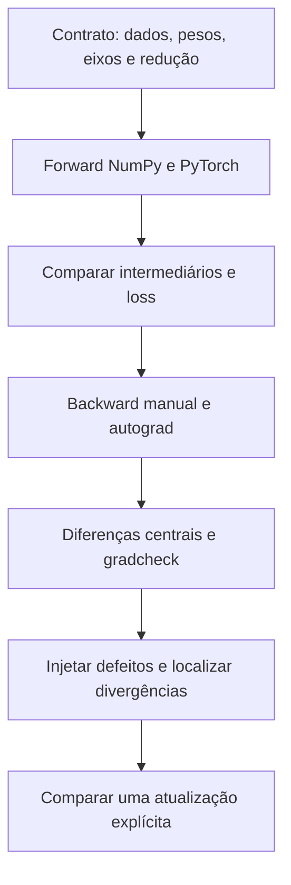
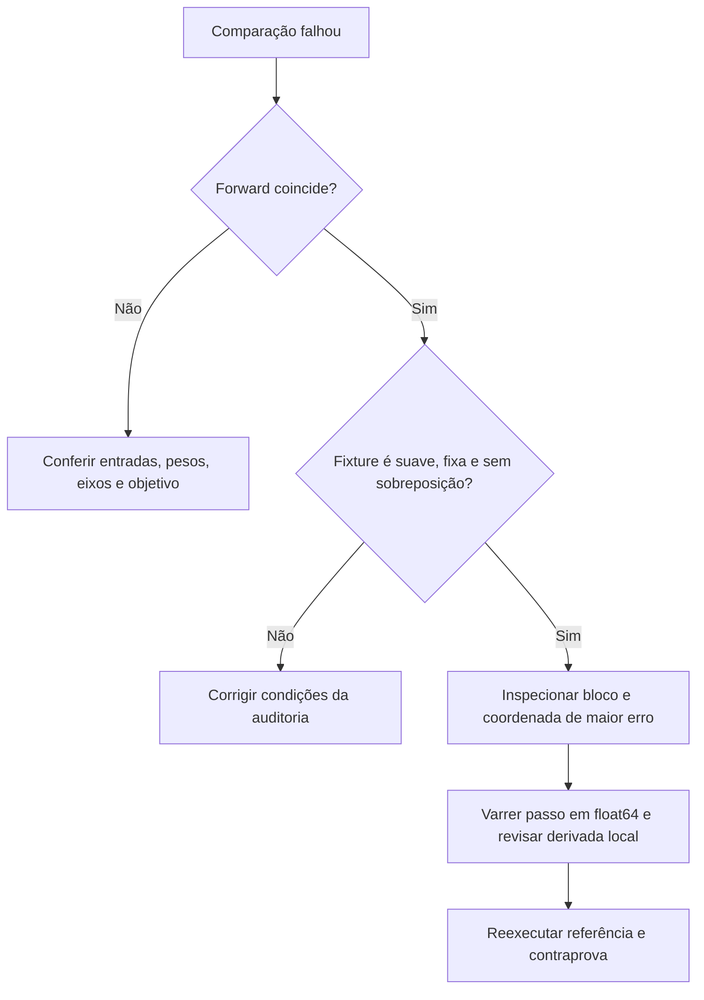

<!-- mirandastech-aula-v2 -->

# Aula 05 — Gradient checking e paridade com NumPy

Você transportou uma MLP do NumPy para PyTorch. Os shapes estão certos, o forward produz números finitos e a loss começa a cair. Isso basta para afirmar que a implementação nova reproduz a anterior?

Uma divisão ausente pode multiplicar todos os gradientes por dois. Uma derivada de ativação esquecida pode alterar somente as primeiras camadas. Ambos os programas podem continuar executando. Antes de comparar curvas de treinamento, precisamos saber **qual função foi implementada e se suas derivadas correspondem ao contrato**.

Nesta aula, construiremos uma auditoria pequena e reproduzível com três referências: backward manual em NumPy, diferenciação automática em PyTorch e diferenças finitas. Também injetaremos defeitos para conferir se os testes conseguem encontrá-los.

[Anterior: grafo e acúmulo](04-grafo-acumulo-gradientes.md) · [Laboratório executável](../notebooks/05-gradcheck-paridade-numpy-laboratorio.ipynb) · [Currículo do M6](../README.md)

[](https://colab.research.google.com/github/joaopaulomirandamatias/ai-lab/blob/main/04-deep-learning/m6-pytorch/notebooks/05-gradcheck-paridade-numpy-laboratorio.ipynb)

Como alternativa, baixe o notebook e execute todas as células em ordem. Os dados são sintéticos; o laboratório funciona em CPU e não precisa de credenciais ou downloads de datasets.

## Objetivos, pré-requisitos e vocabulário

Ao terminar, você deverá comparar gradientes por parâmetro; interpretar tolerâncias absoluta e relativa; usar `torch.autograd.gradcheck`; investigar passo de perturbação, precisão e quinas; identificar entradas com memória sobreposta; e separar consistência de derivadas de correção do objetivo.

São pré-requisitos o backward de MLPs e gradient checking do M5, as VJPs da Aula 03 e o controle do grafo da Aula 04. A novidade é organizar uma auditoria de migração NumPy → PyTorch, incluindo a API de verificação. `nn.Module`, camadas e otimizadores continuam nas aulas seguintes.

| Termo | Significado nesta aula |
|---|---|
| Fixture | Pequeno conjunto fixo de entradas, alvos e parâmetros usado para auditoria |
| Paridade | Concordância entre implementações sob o mesmo contrato e tolerâncias declaradas |
| Gradiente analítico | Derivada calculada por fórmula manual ou por autograd, sem diferenças finitas |
| Gradiente numérico | Estimativa obtida perturbando a entrada e observando a saída |
| Coordenada | Um elemento escalar de um parâmetro tensorial |
| Quina | Ponto onde a derivada clássica não existe, como ReLU em zero |
| Contraprova | Caso deliberadamente incorreto que o procedimento deve rejeitar |

## 1. Uma hierarquia de verificações

Primeiro confira o objetivo escrito em equações. Depois compare entradas, shapes e intermediários do forward. Só então compare a loss e os gradientes. Uma diferença em `Z = X @ W + b` deve ser resolvida antes de atribuir o problema ao backward de `tanh`.



Cada etapa responde a uma pergunta distinta. Dois backwards podem concordar porque ambos derivam uma loss errada. Um gradcheck positivo pode confirmar a consistência dessa mesma função errada. Por isso, o contrato e as referências independentes fazem parte da auditoria.

## 2. Intuição: pequenas perturbações como régua

Se $f$ é suave perto de $x$, mover a entrada um pouco para cada lado ajuda a estimar sua inclinação:

$$
D_h f(x)=\frac{f(x+h)-f(x-h)}{2h}.
$$

$h>0$ é o tamanho da perturbação. A diferença central usa pontos dos dois lados; autograd, por sua vez, compõe derivadas locais das operações executadas. São caminhos de cálculo diferentes [1].

Considere $f(x)=x^3$. Expandindo os dois cubos e subtraindo, obtemos:

$$
D_h f(x)=3x^2+h^2.
$$

Em $x=2$, a derivada exata é 12. Com $h=0{,}01$, a estimativa em aritmética exata é $12{,}0001$. Esse erro $h^2$ não é um defeito do backward: é parte da aproximação.

Exemplo completo, também conferido na validação:

```python
import numpy as np

x, h = 2.0, 0.01
estimate = ((x + h)**3 - (x - h)**3) / (2*h)
np.testing.assert_allclose(estimate, 12.0001, atol=1e-10, rtol=0)
```

Reduzir $h$ diminui o erro de truncamento enquanto as subtrações ainda têm resolução suficiente. Muito perto de zero, o arredondamento pode dominar. Portanto, “quanto menor o passo, melhor” é uma regra incorreta.

## 3. Da função escalar aos parâmetros da rede

Se $L:\mathbb R^P\rightarrow\mathbb R$ depende de $P$ parâmetros escalares, a coordenada $j$ pode ser estimada por:

$$
g_j^{\mathrm{num}}=
\frac{L(\theta+h_j e_j)-L(\theta-h_j e_j)}{2h_j},
\qquad h_j=h\max(1,|\theta_j|).
$$

$\theta$ representa todos os parâmetros, $e_j$ é o vetor que vale 1 na coordenada $j$ e zero nas demais, e $h$ é a escala base escolhida. A regra para $h_j$ é uma convenção explícita deste laboratório; não é a regra de passo interno da API `gradcheck`, que recebe um `eps` próprio.

O notebook usa cópias independentes em cada consulta. Assim, uma perturbação não altera a referência nem contamina a coordenada seguinte. Conferimos no final que os parâmetros originais permanecem iguais aos valores anteriores à auditoria.

Uma verificação completa por coordenada demanda aproximadamente $2P$ avaliações da loss para a parte numérica. É apropriada para nossa fixture de 26 parâmetros. Em redes grandes, auditorias menores e verificações direcionais ajudam a limitar o custo, sem oferecer automaticamente a mesma cobertura.

## 4. Contrato da MLP: mesmos dados e mesmos pesos

A fixture tem $B=5$ exemplos, $D=3$ entradas, $H=4$ unidades ocultas e $C=2$ saídas. Definimos:

$$
Z=XW_1+b_1,\qquad A=\tanh(Z),\qquad S=AW_2+b_2,
$$

$$
L=\frac{1}{2BC}\sum_{i=1}^{B}\sum_{c=1}^{C}(S_{ic}-T_{ic})^2.
$$

$X$ contém entradas; $T$ contém alvos contínuos sintéticos; $S$ contém as saídas da rede. A loss é metade da média dos dez resíduos quadráticos, incluindo os eixos de lote e saída. Não aplicamos regularização, dropout ou normalização nessa MLP, para isolar o cálculo.

| Objeto | Shape | Número de parâmetros |
|---|---|---:|
| $X$ | `(5,3)` | Não é parâmetro da rede |
| $W_1$ | `(3,4)` | 12 |
| $b_1$ | `(4,)` | 4 |
| $W_2$ | `(4,2)` | 8 |
| $b_2$ | `(2,)` | 2 |
| $T,S$ | `(5,2)` | Alvos e saídas |

Geramos tudo uma vez em NumPy e copiamos os arrays para PyTorch em float64. Não basta fornecer o mesmo número de seed a geradores de bibliotecas diferentes: isso não implica os mesmos valores. Aqui, a identidade das entradas é parte explícita do desenho experimental.

O forward compara $Z$, $A$ e $S$, além da loss. Esta última pode coincidir por acaso mesmo quando duas saídas individuais diferem; verificar intermediários restringe as hipóteses de erro.

## 5. Backward manual como referência independente

Chamando $G_Q=\partial L/\partial Q$, temos:

$$
G_S=\frac{S-T}{BC},\qquad
G_{W_2}=A^TG_S,\qquad
G_{b_2}=\sum_i(G_S)_{i,:},
$$

$$
G_Z=(G_SW_2^T)\odot(1-A^2),\qquad
G_{W_1}=X^TG_Z,\qquad
G_{b_1}=\sum_i(G_Z)_{i,:}.
$$

$\odot$ indica multiplicação elemento a elemento. O fator $1-A^2$ é a derivada da tanh, e a divisão por $BC$ entra uma única vez, em $G_S$. Os biases recebem somas sobre o eixo dos exemplos, pois foram compartilhados no forward.

Os gradientes automáticos são obtidos por `torch.autograd.grad(loss, (W1, b1, W2, b2))`. Essa API entrega os tensores no retorno, evitando confundir a comparação com buffers acumulados. Cada tensor precisa ter o shape do respectivo parâmetro e conter somente valores finitos.

A referência NumPy não usa autograd nem importa os gradientes calculados pelo PyTorch. Ainda assim, uma fórmula manual também pode estar errada; as diferenças finitas acrescentam outro caminho de verificação.

## 6. Tolerâncias: escala importa, zeros também

Uma comparação de arrays exige mais que imprimir números com seis casas. Antes de avaliar proximidade, confira shapes e finitude. Algumas funções de comparação aceitam casos de broadcasting ou igualdade de NaNs; isso não é apropriado como aprovação automática desta auditoria [4].

Nos testes numéricos externos usamos, elemento a elemento:

$$
|a_j-b_j|\leq\mathrm{atol}+\mathrm{rtol}|b_j|,
$$

onde $a_j$ é a estimativa numérica, $b_j$ a referência manual, `atol=1e-8` e `rtol=1e-6`. A tolerância absoluta cuida da vizinhança de zero; a relativa acompanha a escala da referência. Essa expressão é orientada por $b$, não é simétrica na troca entre os dois argumentos.

Também registramos a maior diferença absoluta por bloco e uma razão de normas:

$$
r=\frac{\|g^{\mathrm{num}}-g^{\mathrm{ref}}\|_2}
{\max(10^{-12},\|g^{\mathrm{num}}\|_2+\|g^{\mathrm{ref}}\|_2)}.
$$

Essa razão resume o bloco, mas pode esconder uma coordenada ruim. Por isso, o relatório inclui o índice de maior erro e o teste elemento a elemento. Para dois valores $10^{-12}$ e $-10^{-12}$, uma razão relativa sem piso pode valer 1, embora a diferença absoluta seja somente $2\times10^{-12}$.

| Comparação | `atol` | `rtol` | Motivo |
|---|---:|---:|---|
| NumPy manual × autograd e forward | `1e-12` | `1e-12` | Mesmas fixtures float64, sem aproximação numérica da derivada |
| Diferenças centrais × manual | `1e-8` | `1e-6` | Inclui erro de aproximação e cancelamento |
| API `gradcheck` | `1e-5` | `1e-3` | Valores declarados da API 2.6, com `eps=1e-6` |

Não afrouxe tolerâncias apenas para conseguir um resultado positivo. Investigue o tamanho e o padrão do erro antes de mudar o critério. Tolerâncias dependem da função, escala, precisão e hardware; as desta aula não são universais [2–3].

## 7. Precisão dupla e varredura do passo

Uma aproximação informal do erro da diferença central em uma região suave combina um termo proporcional a $h^2$ e outro que cresce quando $h$ diminui, associado ao arredondamento da subtração. Os coeficientes dependem da função e da escala; não há um único $h$ ótimo para todos os problemas.

O notebook audita todas as coordenadas com seis valores de $h$:

| Passo base $h$ | Maior erro absoluto observado |
|---:|---:|
| `1e-1` | `3,081961×10⁻⁴` |
| `1e-3` | `3,096815×10⁻⁸` |
| `1e-5` | `1,385074×10⁻¹¹` |
| `1e-7` | `7,855098×10⁻¹⁰` |
| `1e-9` | `1,478730×10⁻⁷` |
| `1e-11` | `1,724222×10⁻⁵` |

A tabela mostra uma faixa útil, não uma garantia de comportamento monotônico. A estimativa piorou quando tornamos o passo extremamente pequeno.

Uma contraprova ainda mais direta usa $x=1$, $f(x)=x^3$ e $h=10^{-8}$. Em float32, as duas perturbações arredondam para o mesmo número da fixture, produzindo diferença central zero. Em float64, o resultado foi `2,9999999929`, próximo da derivada exata 3. Usar float64 na auditoria não significa que todo treinamento deva usar essa precisão.

## 8. Usar `gradcheck` sem esconder o contrato

O laboratório chama `torch.autograd.gradcheck` com uma função que recebe os quatro parâmetros e retorna a loss. As entradas e os alvos ficam fixos na closure. Todos os parâmetros que queremos auditar precisam estar na tupla de entradas diferenciáveis: um peso capturado silenciosamente pela closure não ganha cobertura por isso.

Usamos `fast_mode=False`, `nondet_tol=0.0` e os valores de passo e tolerância declarados na tabela. O modo completo é adequado à fixture pequena. O teste examina consistência entre gradientes automáticos e perturbações numéricas; não é uma comparação entre curvas de treinamento [1–2].

O notebook também preserva cópias dos parâmetros antes da chamada e verifica que seus valores foram restaurados. X e T são constantes: não afirmamos que seus gradientes foram auditados por essa chamada.

Para demonstrar que o teste detecta um backward incorreto, criamos uma operação diagnóstica mínima com forward $x^2$ e backward errado $3x$. O quadrado nativo passa; a operação defeituosa retorna `False` com `raise_exception=False`. A pequena classe `torch.autograd.Function` existe apenas para injetar o defeito. A MLP normal continua composta de operações nativas.

## 9. Duas contraprovas com causas diferentes

**Defeito na regra da cadeia:** removemos $(1-A^2)$ do backward manual. O forward e todos os shapes permanecem corretos. O erro máximo passa a `0,030405` em $W_1$ e `0,031696` em $b_1$, enquanto $W_2$ e $b_2$ continuam concordando até precisão de máquina. O padrão aponta para a parte anterior à tanh.

**Defeito no objetivo:** multiplicamos a loss por $C=2$, o equivalente a dividir a soma dos resíduos somente por $B$. A função alterada passa em `gradcheck`, pois seu autograd está correto. Mas a loss vira `1,5404001529`, em vez de `0,7702000764`, e todos os gradientes ficam duas vezes maiores que o contrato manual.

Esses dois experimentos explicam por que precisamos de mais de uma evidência. Um gradcheck negativo pode indicar problema de derivada ou de condições numéricas. Um gradcheck positivo não prova que a função representa o experimento pretendido.

## 10. Quinas, aleatoriedade e armazenamento

Em ReLU, $f(x)=\max(0,x)$, a diferença central em zero vale $1/2$ para qualquer $h>0$. PyTorch usa derivada 0 nesse ponto. O gradcheck falha ali, mas passa nos pontos `-0.7` e `0.4` com perturbações pequenas. Uma convenção de subgradiente não transforma a quina em ponto suave.

Antes de acusar o backward, verifique se $x-h$ e $x+h$ atravessam ramos diferentes. Esse cuidado também vale para máximos, valores absolutos e decisões discretas.

| Condição | Risco | Tratamento na auditoria |
|---|---|---|
| Máscara aleatória nova a cada forward | Comparar funções diferentes | Gerar e congelar a máscara antes das consultas |
| `expand` com stride zero | Perturbar uma coordenada afeta outras | Auditar a entrada independente ou fazer cópia quando esse for o contrato |
| Mutação de dados capturados | A função varia durante o check | Trabalhar com fixtures e cópias controladas |
| Saturação forte | Gradientes quase nulos escondem erros | Incluir pontos com sensibilidades úteis |
| Quina | Derivada clássica inexistente | Testar fora da quina e documentar a convenção |

O notebook inspeciona o stride zero produzido por `expand`, sem executar uma perturbação inválida nessa entrada. Depois confere um clone com coordenadas independentes. Clonar muda o espaço de entradas: se o objetivo é testar um parâmetro compartilhado, passe a folha original e faça o `expand` **dentro** da função auditada. Não trate essas duas perguntas como equivalentes [2].

A máscara Bernoulli fixa fornece outra função suave em relação à entrada. O check dessa função passa. Isso prova consistência condicional àquela máscara, não correção estatística de toda uma implementação estocástica.

## 11. Verificações direcionais e um passo de atualização

Para uma direção conjunta $u$ de norma 1, com o mesmo conjunto de coordenadas de $\theta$:

$$
\frac{L(\theta+hu)-L(\theta-hu)}{2h}\approx
\langle\nabla_\theta L,u\rangle.
$$

O laboratório usa cinco direções geradas pela seed fixa. O maior erro foi `8,916978×10⁻¹²`. Cada direção precisa de duas avaliações numéricas da loss; isso reduz o custo por consulta, mas uma direção pode ser ortogonal ao erro de um gradiente defeituoso. Aqui, as direções complementam a auditoria completa das 26 coordenadas.

Por fim, comparamos um passo explícito $\theta_{\mathrm{novo}}=\theta-0{,}05\nabla L$ nas duas implementações. O erro máximo dos parâmetros atualizados foi `1,387779×10⁻¹⁷`. Essa verificação inclui sinal e escala da atualização. Ainda não há um experimento de treinamento ou uma conclusão sobre generalização.

## 12. Fluxo de diagnóstico



Um erro por fator constante sugere redução ou escala. Um erro restrito às primeiras camadas sugere investigar uma derivada intermediária. São hipóteses de diagnóstico, não classificadores infalíveis de bugs. Confronte cada hipótese com uma mudança controlada e registre qual teste a confirmou.

## Laboratório reproduzível e limites da evidência

Dependências mínimas: Python 3.10, NumPy 1.24 e PyTorch 2.6. Ambiente executado: **Python 3.12.14, NumPy 2.3.5 e PyTorch 2.6.0+cpu**, seed `20260905`.

O notebook contém **29 células, 14 de código e 61 contratos**. Todas as células de código foram executadas sequencialmente em processo Python novo, com captura de saídas e warnings: nenhum erro ou aviso inesperado. A validação foi feita por execução direta das células, sem sessão interativa de Jupyter ou Colab. A cópia publicada tem nbformat 4.5, IDs únicos e outputs limpos.

| Resultado central | Valor confirmado |
|---|---:|
| Coordenadas de parâmetros verificadas | 26 |
| Loss da fixture | `0,770200076436121` |
| Maior erro NumPy manual × autograd | `5,551115×10⁻¹⁷` |
| Maior erro diferenças centrais × manual | `1,385074×10⁻¹¹` |
| `gradcheck` da MLP | Aprovado |
| Backward deliberadamente incorreto | Rejeitado |
| Função com redução errada | Passa no gradcheck; falha no contrato |

Os dados sintéticos servem para controlar o cálculo. Não houve seleção de hiperparâmetros, consulta a teste reservado ou medição de qualidade preditiva. Essas evidências locais ajudam a migrar implementações científicas e a isolar falhas antes do P6; não demonstram correção para todas as entradas, versões, dispositivos ou arquiteturas.

## Checklist de domínio

- [ ] Escrevo o objetivo e seus denominadores antes de testar.
- [ ] Uso os mesmos arrays e pesos nas duas implementações.
- [ ] Comparo intermediários, shapes e finitude antes dos gradientes.
- [ ] Incluo todos os parâmetros pretendidos na chamada auditada.
- [ ] Justifico passo, precisão e tolerâncias.
- [ ] Investigo quinas, aleatoriedade e memória compartilhada.
- [ ] Reporto erros por bloco e a pior coordenada.
- [ ] Confirmo que o procedimento rejeita um defeito conhecido.
- [ ] Distingo consistência da derivada, paridade de implementação e generalização.

## Exercícios com respostas comentadas

### 1. Qual a diferença central de $x^3$ em 2 com $h=0{,}1$?

**Resposta:** $3x^2+h^2=12{,}01$ em aritmética exata. O erro de truncamento é $0{,}01$; autograd não usa essa aproximação.

### 2. Por que usar a mesma seed em NumPy e PyTorch não basta?

**Resposta:** as bibliotecas podem usar algoritmos e sequências diferentes. Copiar os arrays gerados uma vez fixa os valores efetivamente comparados.

### 3. O que ocorre se trocarmos mean por sum na loss da fixture?

**Resposta:** são dez resíduos, então loss e gradientes aumentam dez vezes. Essa função alterada ainda pode passar em gradcheck.

### 4. Uma razão de normas pequena garante todas as coordenadas corretas?

**Resposta:** não. Um erro localizado pode ser diluído pela escala do bloco. Confira também o critério elemento a elemento e a pior coordenada.

### 5. Por que o check da ReLU falha em zero?

**Resposta:** a diferença central produz 0,5, enquanto a convenção do autograd é zero. A derivada clássica não existe ali; a divergência não prova um defeito na implementação.

### 6. Por que uma máscara deve ficar fixa durante o check?

**Resposta:** $L(\theta+h)$ e $L(\theta-h)$ precisam pertencer à mesma função. Trocar a máscara acrescenta mudança estocástica à diferença usada como derivada.

### 7. Os gradientes de W2/b2 passam, mas W1/b1 falham. Qual hipótese testar?

**Resposta:** investigar a propagação antes da primeira camada, incluindo o fator da tanh. Foi exatamente o padrão produzido pela contraprova, mas outros defeitos podem gerar sintomas parecidos.

### 8. `expand` deve sempre ser substituído por `clone` para testar?

**Resposta:** não. Para coordenadas independentes, uma cópia elimina sobreposição. Para auditar um parâmetro compartilhado, teste a folha original e realize o expand dentro da função. O domínio de diferenciação é diferente.

### 9. Cinco direções aprovadas substituem as 26 coordenadas?

**Resposta:** não com a mesma cobertura. Uma projeção pode cancelar o erro. Direções são verificações adicionais úteis ou uma estratégia de menor custo com limitações explícitas.

### 10. Um gradcheck aprovado prova que o modelo generaliza?

**Resposta:** não. Ele verifica consistência local do cálculo. Generalização exige um protocolo de dados, seleção e avaliação que não faz parte desta fixture.

## Resumo e transição

Uma auditoria confiável liga o objetivo escrito às operações executadas. Paridade do forward, gradientes manuais, diferenças finitas e contraprovas fornecem evidências complementares. Passo pequeno demais, quinas e entradas compartilhadas podem invalidar a interpretação de um teste; um resultado positivo também precisa ser lido dentro do contrato.

A próxima é a **Aula 06 — `nn.Module`, parâmetros e buffers**, arquivo previsto `06-module-parametros-buffers.md`. Vamos organizar o modelo e registrar seu estado, preservando a referência numérica construída aqui.

## Referências técnicas

Fontes verificadas em **9 de setembro de 2026**, com versões explícitas. Os exemplos, fixtures, relatórios numéricos e contraprovas foram produzidos para esta aula.

1. PYTORCH. [Gradcheck mechanics — 2.6](https://docs.pytorch.org/docs/2.6/notes/gradcheck.html). Relação entre Jacobianos analíticos, diferenças centrais e modos de verificação.
2. PYTORCH. [gradcheck — API 2.6](https://docs.pytorch.org/docs/2.6/generated/torch.autograd.gradcheck.gradcheck.html). Argumentos, precisão dupla, quinas e memória sobreposta. A página usa o nome interno completo; o laboratório chama a API pública `torch.autograd.gradcheck`.
3. PYTORCH. [Numerical accuracy — 2.6](https://docs.pytorch.org/docs/2.6/notes/numerical_accuracy.html). Limites de precisão e diferenças entre cálculos em ponto flutuante.
4. NUMPY. [numpy.testing.assert_allclose — 2.3](https://numpy.org/doc/2.3/reference/generated/numpy.testing.assert_allclose.html). Tolerâncias e comportamento de comparação.
