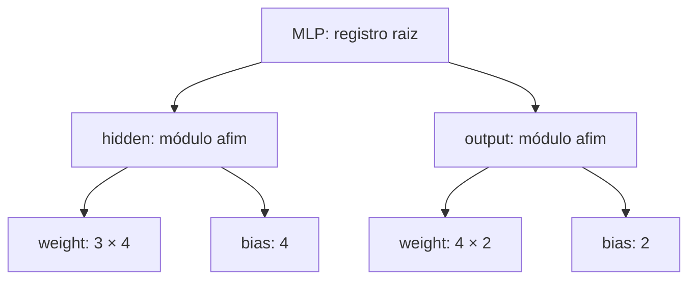
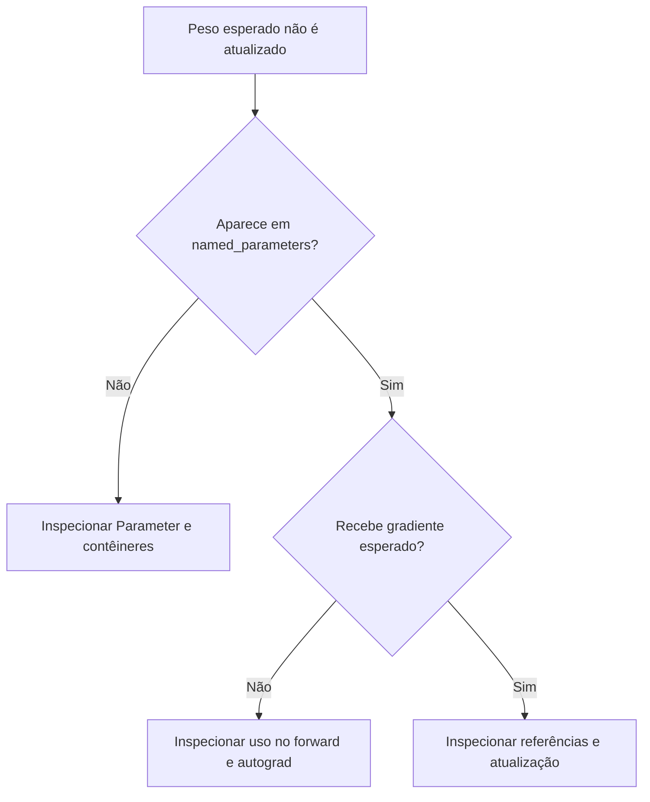

# Aula 06 — `nn.Module`, parâmetros e buffers

<!-- mirandastech-aula-v2 -->

**Trilha:** M6 — PyTorch · **Módulo:** 04 — Deep Learning  
**Anterior:** [Aula 05 — Gradient checking e paridade com NumPy](05-gradcheck-paridade-numpy.md)  
**Laboratório:** [notebook executável](../notebooks/06-module-parametros-buffers-laboratorio.ipynb)

[](https://colab.research.google.com/github/joaopaulomirandamatias/ai-lab/blob/main/04-deep-learning/m6-pytorch/notebooks/06-module-parametros-buffers-laboratorio.ipynb)

## O peso tem gradiente, mas não aprende: onde procurar?

Você transportou a MLP do M5 para PyTorch. A saída coincide com a referência, a loss é finita e o backward encontra derivadas. Mesmo assim, uma rotina que percorre `model.parameters()` não encontra certos pesos. Ao converter o modelo para outro dtype, alguns tensores continuam no tipo anterior. O problema pode estar no **registro do estado**, apesar de o cálculo matemático estar correto.

Até aqui, passamos tensores explicitamente às funções. Agora precisamos organizar uma rede que possa ser inspecionada, composta e manipulada de maneira consistente. `nn.Module` reúne uma receita de cálculo e um registro de componentes. Esse registro informa quais objetos pertencem ao modelo; o autograd continua acompanhando as operações efetivamente executadas.

A pergunta desta aula é: **o estado que pretendemos administrar corresponde ao estado que PyTorch consegue encontrar?** O laboratório responde com equivalência numérica e defeitos controlados, sem começar um treinamento completo.

## Objetivos, pré-requisitos e vocabulário

Ao terminar, você deverá conseguir:

- Escrever um módulo afim e compor uma MLP sem mudar sua função matemática.
- Distinguir `Parameter`, buffer e atributo comum, inclusive na conversão de dtype.
- Inspecionar nomes, hierarquia, quantidade de números registrados e quantidade treinável.
- Explicar por que listas comuns, substituição de parâmetros e snapshots superficiais causam falhas.
- Separar registro, cálculo de gradientes e modo treino/avaliação.

Pré-requisitos: classes Python, shapes e broadcasting da Aula 02, autograd das Aulas 03–04 e a comparação por parâmetro da Aula 05. Não é necessário conhecer `torch.optim` ou `DataLoader`.

| Termo | Significado operacional nesta aula |
|---|---|
| Módulo | Objeto que combina `forward` e registro de componentes |
| Parâmetro | Tensor registrado como `nn.Parameter`, destinado a representar pesos do modelo |
| Buffer | Tensor registrado como estado auxiliar, fora de `parameters()` |
| Submódulo | Módulo filho registrado em outro módulo |
| Persistência | Inclusão de um buffer no `state_dict` padrão |
| Identidade | O objeto Python, diferente dos números que ele contém |
| Hook | Função associada a um evento de execução do módulo |

## 1. Duas estruturas: registro e grafo computacional

Considere o cálculo conhecido:

$$
A=\tanh(XW_1+b_1),\qquad S=AW_2+b_2.
$$

Aqui, $X\in\mathbb{R}^{B\times D}$ contém $B$ exemplos com $D$ características; $W_1\in\mathbb{R}^{D\times H}$ e $b_1\in\mathbb{R}^{H}$ formam a camada oculta de largura $H$. Sua saída é $A\in\mathbb{R}^{B\times H}$. A camada final usa $W_2\in\mathbb{R}^{H\times C}$ e $b_2\in\mathbb{R}^{C}$ para produzir $S\in\mathbb{R}^{B\times C}$. Os vieses são difundidos sobre o eixo do lote.

Empacotar essas operações em uma classe não acrescenta uma derivada à equação. O autograd constrói o grafo a cada execução; a hierarquia de módulos organiza quem possui os pesos. Um parâmetro registrado pode nem ser utilizado em determinado ramo do forward. Um tensor não registrado pode participar do cálculo e receber gradientes.



Descrição do diagrama: a raiz tem dois filhos; cada filho possui peso e viés. As setas representam pertencimento no registro, não o fluxo de derivadas. A `tanh` pode ser uma operação funcional sem estado e, nesse caso, não aparece como filho.

Uma inspeção de módulos, portanto, não substitui o desenho do grafo computacional. Os dois respondem a perguntas diferentes e complementares.

## 2. Um módulo afim que podemos conferir à mão

O construtor inicializa o registro com `super().__init__()`. Em seguida, atribuímos os parâmetros a atributos. O método `forward` descreve o cálculo; chamamos a instância com `layer(x)`. Essas convenções estão documentadas nas referências técnicas [1–2].

O trecho abaixo é autossuficiente e também serve de fallback ao notebook. Requer PyTorch >=2.6; funciona em CPU.

```python
import torch
from torch import nn

class Affine(nn.Module):
    def __init__(self, weight, bias):
        super().__init__()
        self.weight = nn.Parameter(weight.detach().clone())
        self.bias = nn.Parameter(bias.detach().clone())

    def forward(self, x):
        return x @ self.weight + self.bias

x = torch.tensor([[1., 2.]], dtype=torch.float64)
w = torch.tensor([[1., 2.], [3., 4.]], dtype=torch.float64)
b = torch.tensor([0.5, -0.5], dtype=torch.float64)
layer = Affine(w, b)
out = layer(x)
assert torch.equal(out, torch.tensor([[7.5, 9.5]], dtype=torch.float64))
out.sum().backward()
assert torch.equal(layer.weight.grad, torch.tensor([[1., 1.], [2., 2.]], dtype=torch.float64))
assert torch.equal(layer.bias.grad, torch.ones(2, dtype=torch.float64))
assert sum(p.numel() for p in layer.parameters()) == 6
print(out.detach().tolist())  # [[7.5, 9.5]]
```

Resolução: a primeira saída é $1\cdot1+2\cdot3+0{,}5=7{,}5$; a segunda é $1\cdot2+2\cdot4-0{,}5=9{,}5$. Para o escalar $L=S_1+S_2$, cada saída recebe derivada 1. Logo, $\partial L/\partial W$ tem linhas $(1,1)$ e $(2,2)$; $\partial L/\partial b=(1,1)$.

`detach().clone()` cria valores independentes da origem, sem carregar seu histórico. Isso é apropriado para transformar uma fixture em novos pesos leaf. Se a intenção fosse diferenciar através da própria geração dos pesos, esse destacamento eliminaria a dependência desejada. Nem toda transformação deve virar um novo `Parameter`.

Nossa orientação de peso é `(entrada, saída)`. A Aula 07 tratará a orientação adotada por `nn.Linear` e sua conversão; não troque as matrizes automaticamente agora.

## 3. O que cada categoria registra?

| Objeto atribuído ao módulo | `parameters()` | `buffers()` | `state_dict()` padrão | Conversão por `module.to(...)` |
|---|---:|---:|---:|---:|
| `nn.Parameter` | Sim | Não | Sim | Sim |
| Buffer persistente | Não | Sim | Sim | Sim |
| Buffer com `persistent=False` | Não | Sim | Não | Sim |
| Tensor comum em atributo | Não | Não | Não | Não automaticamente |
| String de configuração em atributo | Não | Não | Não | Não |

A tabela descreve o comportamento padrão usado aqui, sem implementações personalizadas de estado extra. `state_dict` não equivale a uma fotografia completa do objeto Python.

**Registro e diferenciação são propriedades separadas.** Um `Parameter` congelado com `requires_grad=False` continua registrado. Um tensor comum com `requires_grad=True` pode receber derivadas sem aparecer no inventário. `register_buffer` também não é uma ordem para desligar o autograd: buffers normalmente representam tensores sem gradientes, mas a API de registro não impõe essa interpretação matemática ao tensor.

No laboratório, `self.weight` é inicialmente um tensor comum contendo 2. Para entrada 3, a soma da saída produz gradiente 3. Entretanto, `parameters()` e `state_dict()` ficam vazios. A contraprova localiza a falha: uma rotina que consome apenas os parâmetros registrados não receberá esse tensor. Envolvê-lo corretamente em `nn.Parameter` corrige o registro.

Não crie pesos novos em cada `forward`: além de reinicializar valores, isso muda o conjunto de objetos que deveriam persistir entre chamadas. A receita cria operações temporárias; os pesos duráveis são normalmente construídos em `__init__`.

## 4. Buffers preservam estado auxiliar

Uma transformação fixa pode usar:

$$
\widetilde X_{ij}=\frac{X_{ij}-\mu_j}{s_j},\qquad s_j>0.
$$

O índice $i$ identifica exemplos, $j$ identifica características, $\mu_j$ é o centro e $s_j$ a escala. Esses vetores são necessários para repetir a transformação, mas não precisam ser pesos aprendidos por descida de gradiente. Registrá-los como buffers permite encontrá-los e convertê-los junto ao modelo.

Usamos `register_buffer('center', tensor)` e `register_buffer('scale', tensor)`. Para entrada $(3,6,8)$, centro $(1,2,3)$ e escala $(2,4,5)$, o resultado é $(1,1,1)$. O laboratório confirma esse cálculo e encontra os dois vetores no estado persistente.

Um terceiro buffer, `offset`, contém zeros e usa `persistent=False`. Ele continua sendo buffer e acompanha `.to(dtype=torch.float32)`, mas sua chave não é incluída no estado. **Não persistente não significa descartado a cada forward**, nem reconstruído automaticamente: a aplicação precisa saber recriar seu valor. Aqui o construtor recria zeros, por contrato.

Um atributo comum `note`, também tensor, permanece em `float64` após a conversão. Essa diferença é observada em CPU; não precisamos de GPU para demonstrar o problema de registro. Conversão de dtype e colocação de entradas continuam sendo responsabilidades explícitas: converter o modelo não converte o argumento `X` fornecido na próxima chamada.

Na fixture, centro e escala são constantes declaradas. Em sistemas reais, quando estimados dos dados, devem usar somente a partição de treino. Registrar estatísticas calculadas com dados de teste **não corrige vazamento**. A estrutura conserva o estado recebido; não valida sua origem metodológica.

## 5. Composição e auditoria do inventário

A MLP do notebook possui `hidden = Affine(...)` e `output = Affine(...)`. O forward retorna `output(tanh(hidden(x)))`. A atribuição dos filhos permite percorrer seus parâmetros recursivamente.

| Nome completo | Shape | Quantidade de escalares |
|---|---|---:|
| `hidden.weight` | `(3, 4)` | 12 |
| `hidden.bias` | `(4,)` | 4 |
| `output.weight` | `(4, 2)` | 8 |
| `output.bias` | `(2,)` | 2 |
| **Total** | Quatro objetos `Parameter` | **26** |

Em geral, a contagem desta arquitetura é:

$$
P=DH+H+HC+C.
$$

Os símbolos são os mesmos da seção 1; o tamanho de lote $B$ não entra na quantidade de pesos. A chamada `parameters(recurse=False)` na raiz retorna zero objetos, pois esses quatro pertencem diretamente aos filhos. Já `named_parameters()` sem restrição encontra os quatro nomes da tabela.

`named_children()` encontra filhos imediatos. `named_modules()` inclui a raiz, de nome vazio, e percorre a composição. Um único parâmetro compartilhado entre dois atributos costuma aparecer uma vez em `parameters()`, cuja enumeração padrão elimina duplicatas por identidade. No laboratório, os dois caminhos ainda aparecem no `state_dict`. Contar chaves de estado, portanto, não é uma forma geral de contar pesos independentes.

### Listas que parecem funcionar

Uma lista Python contendo módulos não registra seus elementos só por ser atribuída ao modelo. O forward pode funcionar normalmente; operações recursivas não encontram aqueles filhos. Usamos exatamente os mesmos pesos em duas pilhas: a lista comum produz a mesma saída que `ModuleList`, mas registra **zero** escalares, contra **26** no contêiner apropriado.

| Construção | Registra o conteúdo | Define encadeamento de execução |
|---|---:|---:|
| Lista Python | Não automaticamente | Não |
| `nn.ModuleList` | Módulos | Não; escreva o forward |
| `nn.ModuleDict` | Módulos por nome | Não; escreva o forward |
| `nn.ParameterList` | Parâmetros | Não |
| `nn.Sequential` | Módulos | Sim, no encadeamento especificado |

O efeito vai além de otimização: `eval()` não alcança filhos escondidos na lista comum. A contraprova verifica a flag `training` desses filhos. Não afirmamos uma mudança numérica nesta MLP, pois seus blocos afins e `tanh` não dependem dessa flag.

## 6. Congelar pesos não é mudar o modo de execução

Existem três decisões independentes:

1. **Pertencimento:** o objeto está registrado?
2. **Diferenciação:** é preciso calcular derivadas em relação a ele ou através das operações?
3. **Modo:** o módulo deve executar seu comportamento de treino ou avaliação?

Congelar `hidden` com `requires_grad_(False)` conserva os 26 escalares registrados e deixa apenas $HC+C=10$ treináveis. Depois de limpar gradientes anteriores, o backward do notebook deixa os pesos ocultos sem novos `.grad` e calcula gradientes para os pesos finais.

`eval()` propaga `training=False` aos módulos registrados. Isso não altera automaticamente `requires_grad`. `no_grad()` controla o registro das operações dentro de seu contexto, mas não remove parâmetros nem configura flags de avaliação. Usaremos esses mecanismos em profundidade na Aula 14.

Também não conclua que toda camada congelada será executada sem grafo: se sua entrada exigir derivadas, o autograd ainda pode precisar das operações para propagá-las. Congelamento de pesos não significa bloquear todas as derivadas através do bloco.

Limpe gradientes antigos e construa a futura lista de atualização de acordo com sua política. O valor de `requires_grad` não apaga sozinho um `.grad` já calculado. A Aula 04 explica o acúmulo; as Aulas 11–12 cuidarão da atualização e dos otimizadores.

## 7. Chamada correta, estado e identidade

### Use `model(x)`

Implementar `forward` define a receita. A chamada à instância também executa mecanismos do módulo, como hooks. O laboratório instala um hook de observação na raiz: `model(X)` registra o shape `(5,2)`; `model.forward(X)` entrega os mesmos números, mas não dispara aquele hook. Chamadas a filhos feitas dentro do forward ainda podem executar os hooks desses filhos.

Registrar somente shapes evita conservar tensores com grafos no histórico de observação. Remova hooks temporários quando terminar a investigação.

### `state_dict()` não congela uma fotografia

O dicionário padrão desta MLP contém os pesos destacados do grafo, mas os tensores compartilham armazenamento com o módulo. Ao somar 1 a um peso sob `no_grad`, o dicionário obtido anteriormente também passa a refletir essa soma. `copy.deepcopy(state_dict)` preserva uma cópia independente nesse exemplo.

O laboratório mede diferença máxima **1,0** entre a referência que acompanhou a mutação e a fotografia independente. Não são persistidos automaticamente o código do forward, as flags de modo, os gradientes nem atributos arbitrários de configuração. A persistência completa para inferência e a retomada serão desenvolvidas nas Aulas 17–18; aqui inspecionamos apenas o estado em memória.

### Trocar o objeto é diferente de trocar seus valores

Imagine uma lista capturada por `list(model.parameters())`. Substituir `model.hidden.weight` por outro `nn.Parameter` atualiza o registro do módulo, mas a lista capturada continua apontando ao objeto antigo. Uma futura rotina de atualização baseada nessa lista pode operar sobre o peso errado.

Quando a intenção é apenas transferir valores compatíveis para um parâmetro existente, `copy_` dentro de `no_grad` conserva a identidade. Isso deve ocorrer em uma etapa apropriada, sem invalidar um grafo ainda necessário. Mudanças estruturais deliberadas podem exigir reconstruir consumidores do inventário; a identidade faz parte do contrato operacional.

## 8. Roteiro de diagnóstico



Descrição: primeiro separe invisibilidade no registro de ausência de derivada. Somente depois examine quem aplica a atualização. Um gradiente nulo também pode ser matematicamente correto; a Aula 05 fornece as verificações de referência.

Erros frequentes incluem omitir `super().__init__()`, criar pesos dentro do forward, guardar camadas somente em listas comuns, interpretar `eval` como congelamento e supor que um atributo qualquer acompanha `.to`. Um print do modelo ajuda, mas deve ser complementado por nomes, shapes, identidades e verificações da função.

## 9. Laboratório reproduzível e resultados confirmados

O notebook requer **Python >=3.10, PyTorch >=2.6 e NumPy >=1.24**. A execução de referência usou **Python 3.12.14, PyTorch 2.6.0+cpu e NumPy 2.3.5**, CPU e `float64`, em **9 de setembro de 2026**. Para validar a estrutura do arquivo, foi utilizado `nbformat` >=5.10.

A seed é **20260906**. Entradas, alvos e pesos são gerados sinteticamente; módulos e função explícita recebem cópias dos mesmos valores. Para $B=5$ e $C=2$, o objetivo é:

$$
L=\frac{1}{2BC}\sum_{i=1}^{B}\sum_{j=1}^{C}(S_{ij}-T_{ij})^2,
$$

em que $T$ é a matriz de alvos. A divisão por $BC=10$ define a redução e impede confundir comparação de estado com diferenças no objetivo.

| Evidência executada | Resultado |
|---|---:|
| Loss da fixture | `0,762737740646` |
| Erro máximo de saída: módulo versus função explícita | `0` |
| Erro máximo nos quatro gradientes | `0` |
| Escalares registrados na MLP | `26` |
| Escalares treináveis após congelar a camada oculta | `10` |
| Gradiente do tensor comum não registrado | `3` |
| Contagem na lista comum / `ModuleList` | `0 / 26` |
| Verificações automáticas | **59/59 aprovadas** |

Foram executadas as **12 células de código**, em ordem, num processo Python novo; as **25 células** foram validadas como notebook. A cópia executada não apresentou erro nem aviso. O arquivo publicado mantém outputs vazios e contadores de execução nulos. O trecho autossuficiente desta aula também foi executado separadamente.

Os zeros são resultados desta fixture e deste ambiente, com as mesmas operações. Não prometem igualdade bit a bit entre implementações diferentes ou dispositivos. Os asserts usam tolerâncias explícitas para a paridade numérica.

Não houve treino, busca de hiperparâmetros nem medida de generalização; não cabe anunciar acurácia. Como o experimento verifica álgebra e registro sem ajuste aos dados, não exige split. No P6 com MNIST, voltarão a valer as partições do P5 e os cuidados com pré-processamento ajustado somente no treino.

## 10. Checklist de aplicação

- [ ] Inicializar a classe base antes de registrar parâmetros e filhos.
- [ ] Conferir nomes, shapes e quantidade de escalares esperados.
- [ ] Distinguir parâmetros congelados de parâmetros ausentes.
- [ ] Usar contêineres registrados quando módulos estiverem em coleções.
- [ ] Registrar estado auxiliar como buffer quando ele precisar acompanhar o modelo.
- [ ] Definir como reconstruir buffers não persistentes.
- [ ] Conferir a origem das estatísticas e impedir vazamento de dados.
- [ ] Chamar a instância e remover hooks temporários após a inspeção.
- [ ] Evitar substituir objetos que consumidores já capturaram sem revisar referências.
- [ ] Comparar saída e gradientes com a função anterior antes de treinar.

Em pesquisa, esse inventário torna a ablação de congelamento auditável: podemos informar quais números realmente receberam gradientes. Em sistemas reais, ele ajuda a reproduzir inferência e a diagnosticar tensores no dtype incorreto. No P6, é a base para associar cada nome PyTorch ao peso correspondente do P5.

## 11. Exercícios com respostas comentadas

**1. Uma MLP tem $D=6$, $H=5$ e $C=3$. Quantos pesos e vieses?**  
$6\cdot5+5+5\cdot3+3=53$ escalares. São quatro objetos de parâmetro, se cada matriz/vetor for armazenado separadamente.

**2. `requires_grad=True` garante presença em `parameters()`?**  
Não. A propriedade solicita diferenciação; o registro exige um Parameter atribuído/registrado ou um caminho equivalente de registro. A contraprova produz gradiente 3 com inventário vazio.

**3. Um Parameter congelado desaparece do `state_dict`?**  
Não. Seu pertencimento persiste. Na MLP da fixture, congelar a camada oculta preserva os 26 números de estado e reduz os treináveis para 10.

**4. A saída está correta com uma lista Python. Por que trocá-la?**  
Se a intenção é que os elementos sejam filhos administrados pelo modelo, o registro é necessário. A igualdade de saída não verifica conversão recursiva, propagação de modos ou inclusão dos pesos no inventário.

**5. `ModuleList` sabe aplicar automaticamente todas as camadas?**  
Não. Ela registra e organiza; o forward deve definir a execução. Para uma composição sequencial simples, `Sequential` fornece esse encadeamento.

**6. Centro e escala estimados em treino devem ser parâmetros?**  
Se serão mantidos fixos, buffers são uma escolha apropriada. A decisão é sobre o papel do estado. Se tiverem sido estimados usando teste, mudar a categoria não elimina vazamento.

**7. Um buffer não persistente é excluído de `.to`?**  
Não. Continua registrado e convertido. O que muda é sua inclusão no `state_dict`; a responsabilidade de reconstrução precisa estar definida.

**8. Por que `eval()` não eliminou `grad_fn` da saída?**  
Porque modo de avaliação e registro de operações são mecanismos diferentes. Havendo dependência de parâmetros diferenciáveis, autograd pode registrar o cálculo. Use o contexto adequado quando não precisar dessas derivadas.

**9. Uma variável recebeu `state_dict()` antes de mudar o peso. Por que mudou junto?**  
Porque seus tensores compartilham armazenamento com o módulo. Uma cópia profunda conserva valores independentes neste modelo; a Aula 17 desenvolverá a persistência de forma completa.

**10. Após substituir um Parameter, uma lista antiga pode atualizá-lo?**  
A lista antiga conserva a referência anterior. Inspecione identidade, e não apenas igualdade de valores. Se só precisava transferir números, uma cópia apropriada para o objeto existente evita essa troca de identidade.

## Resumo e próxima aula

`nn.Module` organiza componentes e estado. O autograd deriva operações executadas. Parâmetros, buffers e atributos comuns têm contratos distintos, e a correção do forward não garante que o inventário esteja correto. A auditoria deve verificar ambos.

A próxima é **Aula 07 — Camadas lineares, ativações e inicialização**, arquivo curricular `07-linear-ativacoes-inicializacao.md`. Usaremos a organização construída aqui para introduzir camadas prontas, comparar a orientação dos pesos e controlar a inicialização, conforme o [currículo estável do M6](../README.md).

## Referências técnicas

Documentação oficial **PyTorch 2.6**, URLs verificadas em **9 de setembro de 2026**. A versão executada foi **2.6.0+cpu**; os exemplos e contraprovas numéricas desta aula foram produzidos para este laboratório.

1. [Modules — composição e estado](https://docs.pytorch.org/docs/2.6/notes/modules.html).
2. [API `nn.Module` — registro, inspeção, modos, hooks e estado](https://docs.pytorch.org/docs/2.6/generated/torch.nn.Module.html).
3. [API `Parameter` — distinção entre parâmetros e tensores comuns](https://docs.pytorch.org/docs/2.6/generated/torch.nn.parameter.Parameter.html).
4. [API `ModuleList` — registro de coleções de módulos](https://docs.pytorch.org/docs/2.6/generated/torch.nn.ModuleList.html).

As referências definem os contratos das APIs; o notebook fornece a evidência local. Não há mídia ou tutorial complementar necessário para completar esta aula.
