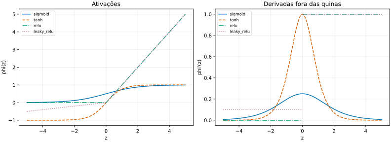
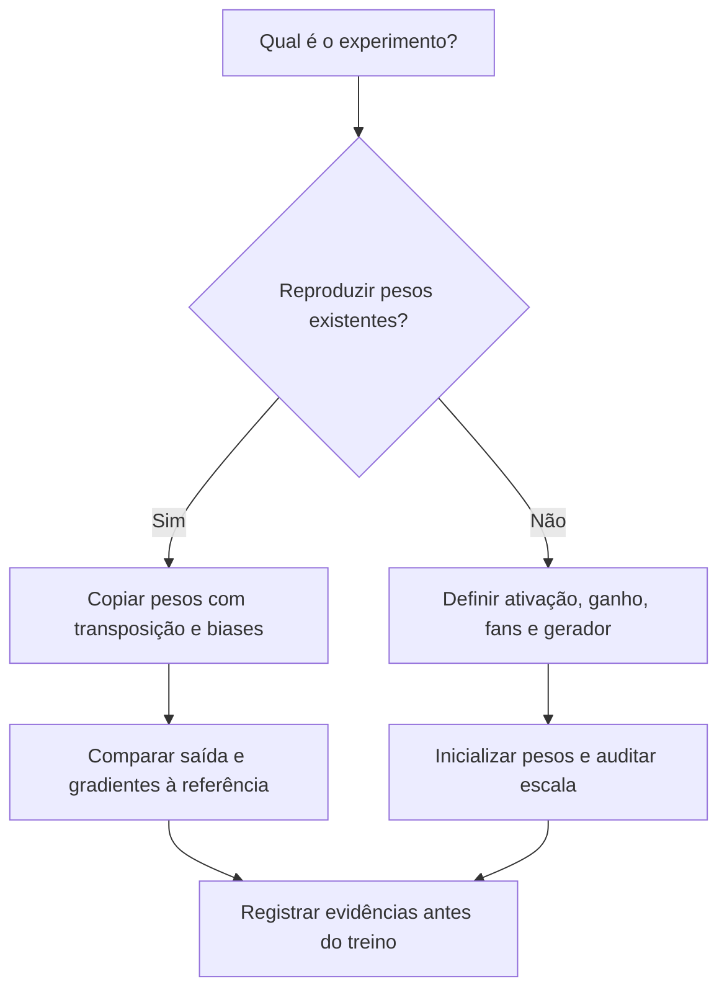

# Aula 07 — Camadas lineares, ativações e inicialização

<!-- mirandastech-aula-v2 -->

**Trilha:** M6 — PyTorch · **Módulo:** 04 — Deep Learning  
**Anterior:** [Aula 06 — `nn.Module`, parâmetros e buffers](06-module-parametros-buffers.md)  
**Laboratório:** [notebook reproduzível](../notebooks/07-linear-ativacoes-inicializacao-laboratorio.ipynb)

[](https://colab.research.google.com/github/joaopaulomirandamatias/ai-lab/blob/main/04-deep-learning/m6-pytorch/notebooks/07-linear-ativacoes-inicializacao-laboratorio.ipynb)

## Uma troca de implementação pode mudar o modelo

Você substitui o bloco afim manual do M5 por `nn.Linear`. A arquitetura continua descrita como “duas camadas com tanh”, mas os resultados deixam de coincidir. Há pelo menos três suspeitos: a orientação dos pesos foi invertida, a ativação foi alterada ou o construtor sorteou uma inicialização diferente.

Essas diferenças importam antes de qualquer treinamento. Em um classificador de sinais de sensores, a mesma entrada pode produzir outra representação já na primeira camada. Se isso passar despercebido, a comparação entre NumPy e PyTorch mistura implementação e escolha de modelo.

Nesta aula, vamos transportar os mesmos números para camadas prontas, conferir a equivalência e, somente em uma rede separada, configurar uma inicialização nova. A referência do P5 fornece a convenção matemática; a fixture sintética torna os erros pequenos o suficiente para inspeção completa.

## Objetivos e pré-requisitos

Ao concluir, você deverá conseguir:

- Relacionar `nn.Linear.weight` à matriz usada em `X @ W + b`.
- Rastrear shapes e transpor também os gradientes na comparação com o M5.
- Usar ativações como módulos ou funções sem mudar sua definição.
- Explicar a inicialização padrão de `Linear` e configurar Xavier/He explicitamente.
- Verificar `fan_in`, `fan_out`, ganho, bias e gerador antes do primeiro treino.
- Distinguir equivalência de implementação de uma ablação de arquitetura.

Pré-requisitos: multiplicação matricial, regra da cadeia, broadcasting, autograd e registro de parâmetros. Releia a [Aula 15 do M5 — Inicialização de pesos](../../m5-redes-neurais-do-zero/aulas/15-inicializacao-pesos.md) para a derivação estatística completa. Aqui a ênfase é traduzir aquele conhecimento para as APIs e conferir seu comportamento.

| Vocabulário | Significado nesta aula |
|---|---|
| Camada afim | Transformação matricial acrescida de um viés |
| Pré-ativação | Valor produzido pela camada afim antes da não linearidade |
| Ativação | Função aplicada aos valores da pré-ativação |
| `fan_in` | Quantidade de entradas por unidade de saída |
| `fan_out` | Quantidade de unidades de saída |
| Ganho | Multiplicador da escala de inicialização |
| Paridade | Concordância sob os mesmos dados, parâmetros, operações e objetivo |
| Ablação | Alteração deliberada de uma escolha para estudar seu efeito |

## 1. `Linear` é afim quando possui bias

Na convenção do M5:

$$
Z=XW+b,
\qquad X\in\mathbb{R}^{B\times D},\quad
W\in\mathbb{R}^{D\times H},\quad b\in\mathbb{R}^{H}.
$$

$B$ é o tamanho do lote; $D$, a quantidade de características de entrada; $H$, a quantidade de saídas. O viés é difundido pelas linhas e $Z$ tem shape $(B,H)$.

`nn.Linear(D, H)` armazena uma matriz $\Theta\in\mathbb{R}^{H\times D}$ e calcula:

$$
Z=X\Theta^\top+b.
$$

Logo, a conversão correta é **$\Theta=W^\top$**. O nome `Linear` é o nome da API: com bias não nulo, a transformação é afim e não preserva necessariamente a origem. Com `bias=False`, o termo aditivo é removido e `layer.bias` é `None`.

### Exemplo resolvido: o erro silencioso da matriz quadrada

Considere:

$$
X=\begin{bmatrix}1&2\end{bmatrix},\qquad
W=\begin{bmatrix}1&2\\3&4\end{bmatrix},\qquad
b=\begin{bmatrix}0{,}5&-0{,}5\end{bmatrix}.
$$

O cálculo manual produz $XW+b=(7{,}5,9{,}5)$. A primeira coordenada é $1\cdot1+2\cdot3+0{,}5$; a segunda, $1\cdot2+2\cdot4-0{,}5$.

Se copiarmos $W$ diretamente para `weight`, a API calculará $XW^\top+b=(5{,}5,10{,}5)$. A execução funciona porque a matriz é quadrada. O erro máximo absoluto é **2**, embora os shapes sejam válidos.

O código abaixo é autossuficiente, executável em CPU e serve de fallback ao notebook:

```python
import torch
from torch import nn

x = torch.tensor([[1., 2.]], dtype=torch.float64)
w = torch.tensor([[1., 2.], [3., 4.]], dtype=torch.float64)
b = torch.tensor([.5, -.5], dtype=torch.float64)
layer = nn.Linear(2, 2, dtype=torch.float64)
with torch.no_grad():
    layer.weight.copy_(w.T)
    layer.bias.copy_(b)
expected = x @ w + b
assert torch.equal(layer(x), expected)
assert torch.equal(expected, torch.tensor([[7.5, 9.5]], dtype=torch.float64))
print(layer(x).detach().tolist())
```

Todos os valores sorteados pelo construtor são sobrescritos antes da comparação. `copy_` conserva o objeto registrado, como estudado na Aula 06. Não reaplique uma inicialização aleatória depois dessa transferência: isso descartaria os pesos de referência.

## 2. O último eixo define as características

O contrato de `Linear` transforma o último eixo e preserva os anteriores. O laboratório verifica uma entrada de shape `(2,5,3)` com `Linear(3,4)`: a saída tem shape `(2,5,4)` e coincide com um laço que aplica a camada a cada vetor de comprimento 3.

| Entrada | Camada | Saída | Interpretação |
|---|---|---|---|
| `(3,)` | `Linear(3,4)` | `(4,)` | Um vetor |
| `(5,3)` | `Linear(3,4)` | `(5,4)` | Cinco exemplos |
| `(2,5,3)` | `Linear(3,4)` | `(2,5,4)` | Dois eixos anteriores preservados |

Esse comportamento não significa que a camada modele relações entre posições do segundo eixo. Ela aplica os mesmos parâmetros a cada vetor do último eixo. Também não corrige um `reshape` semanticamente errado: se você misturar exemplos e características antes da camada, o erro pode continuar com shapes aparentemente aceitáveis.

Uma camada com bias possui $DH+H$ escalares; sem bias, $DH$. O número de exemplos não altera a quantidade de pesos.

## 3. Transportar pesos também exige transportar gradientes

Se $G=\partial L/\partial Z\in\mathbb{R}^{B\times H}$ é o gradiente recebido pela camada, o backward manual é:

$$
\frac{\partial L}{\partial W}=X^\top G,\qquad
\frac{\partial L}{\partial b}=\sum_{i=1}^{B}G_{i,:},\qquad
\frac{\partial L}{\partial X}=GW^\top.
$$

Como o peso PyTorch é $\Theta=W^\top$:

$$
\frac{\partial L}{\partial\Theta}=G^\top X
=\left(\frac{\partial L}{\partial W}\right)^\top.
$$

Portanto, compare `layer.weight.grad.T` com o gradiente do peso manual. O bias mantém sua orientação. Uma divergência de shape no backward pode ser apenas uma comparação entre convenções diferentes, mas isso precisa ser demonstrado.

O notebook usa a MLP:

$$
A=\tanh(XW_1+b_1),\qquad S=AW_2+b_2,
$$

com $B=5$, $D=3$, $H=4$ e $C=2$ saídas. Os 26 parâmetros correspondem a $3\cdot4+4+4\cdot2+2$. A implementação pronta é `Linear(3,4)`, `Tanh()` e `Linear(4,2)` em um `Sequential`.

Para alvos $T\in\mathbb{R}^{B\times C}$, usamos o objetivo conhecido:

$$
L=\frac{1}{2BC}\sum_{i=1}^{B}\sum_{j=1}^{C}(S_{ij}-T_{ij})^2.
$$

O denominador usa os dez resíduos. A referência NumPy deriva cada bloco explicitamente; PyTorch executa `backward`. Conferimos os quatro gradientes de parâmetros e o gradiente da entrada, além de saída e loss. A Aula 08 aprofundará as APIs de losses; aqui o objetivo serve somente à comparação controlada.

## 4. Por que precisamos de ativações?

Empilhar duas camadas afins sem uma não linearidade intermediária produz:

$$
(XW_1+b_1)W_2+b_2
=X(W_1W_2)+(b_1W_2+b_2).
$$

Defina $W_{eq}=W_1W_2$ e $b_{eq}=b_1W_2+b_2$. A composição continua sendo uma única transformação afim. A fatoração pode impor restrições de posto e alterar a otimização, mas não acrescenta por si só uma função não linear.

A ativação altera essa classe de funções. No laboratório, o colapso de duas camadas afins tem erro de arredondamento de `2,78×10⁻¹⁷`; inserir `tanh` muda a saída em até `0,07219349` na fixture. Esse último número demonstra mudança de função, sem afirmar melhora preditiva.

### Quatro funções conhecidas em APIs prontas

Na tabela, $z$ é uma pré-ativação escalar, $a=\phi(z)$ e $\alpha$ é a inclinação negativa da Leaky ReLU. As operações são elemento a elemento.

| Ativação | Definição | Derivada fora das quinas | Implementação |
|---|---|---|---|
| Sigmoid | $a=1/(1+e^{-z})$ | $a(1-a)$ | `nn.Sigmoid()` ou `torch.sigmoid` |
| Tanh | $a=\tanh(z)$ | $1-a^2$ | `nn.Tanh()` ou `torch.tanh` |
| ReLU | $a=\max(0,z)$ | 0 se $z<0$; 1 se $z>0$ | `nn.ReLU()` ou `F.relu` |
| Leaky ReLU | $a=z$ se $z>0$; $a=\alpha z$ caso contrário | $\alpha$ se $z<0$; 1 se $z>0$ | `nn.LeakyReLU(alpha)` ou `F.leaky_relu` |

Aqui `F` significa `torch.nn.functional`. Esses quatro módulos, com os argumentos usados, não adicionam parâmetros treináveis. A forma em módulo se encaixa em `Sequential`; a função permite escrever o cálculo diretamente no forward. Para parâmetros de configuração equivalentes, o notebook confirma os mesmos valores.



**Como ler a figura:** acompanhe uma mesma cor e estilo nos dois painéis. Sigmoid e tanh ficam quase horizontais nas extremidades, onde suas derivadas são pequenas. ReLU cresce à direita, mas bloqueia o gradiente à esquerda; Leaky ReLU conserva uma inclinação negativa configurável. As escalas verticais dos painéis são diferentes.

Para $z=10$, a derivada da sigmoid é aproximadamente `4,53958×10⁻⁵`. Trocar a implementação manual pela API não elimina saturação. ReLU não possui derivada clássica em zero; PyTorch usa zero nesse ponto, e o laboratório verifica essa convenção separadamente. As comparações analíticas das ativações com quina usam valores não nulos.

Usamos `inplace=False` nos retificadores para preservar entradas que também podem alimentar outros ramos. Uma operação in-place não é uma otimização gratuita: pode modificar valores necessários para outro cálculo ou para o backward. Releia a Aula 04 antes de adotá-la.

## 5. Copiar um modelo e inicializar um modelo são tarefas distintas



Descrição: a reprodução depende de números idênticos e operações correspondentes; a inicialização de uma rede nova depende de uma política declarada. Os dois caminhos terminam em evidência antes do treinamento.

Trocar `tanh` por ReLU ou Xavier por He é uma escolha experimental. Pode ser útil, mas deixa de ser uma simples tradução do P5. O notebook mantém uma rede de paridade intacta e cria outra instância para estudar inicialização.

## 6. O que `nn.Linear` faz por padrão?

Na versão **PyTorch 2.6**, peso e bias de `Linear` são sorteados de uma uniforme simétrica com limite $a=1/\sqrt{D}$, para $D=\text{fan\_in}>0$:

$$
\Theta_{ji}\sim U(-a,a),\qquad
\operatorname{Var}(\Theta_{ji})=\frac{a^2}{3}=\frac{1}{3D}.
$$

O bias padrão, portanto, não é todo zero. O laboratório verifica os limites e a variância aproximada de uma matriz com 262.144 pesos. Uma amostra finita não precisa apresentar média zero ou variância exatamente igual ao alvo.

A implementação instalada usa internamente uma chamada Kaiming uniforme com `a=sqrt(5)`. Esse argumento é uma parametrização da fórmula que resulta no limite acima, não a declaração de que a rede usará Leaky ReLU com essa inclinação. O ganho correspondente é $1/\sqrt{3}$, diferente do ganho $\sqrt{2}$ de ReLU.

Essa distinção evita a conclusão incorreta de que o construtor de `Linear` já aplica He/ReLU automaticamente. O construtor também não inspeciona a ativação que você colocará depois dele. Conferimos a documentação e o código da versão executada; não tratamos esse detalhe como contrato eterno de qualquer versão futura.

## 7. Xavier e He: os argumentos fazem parte do protocolo

Se $g$ é o ganho, Xavier normal usa:

$$
\sigma_X=g\sqrt{\frac{2}{\text{fan\_in}+\text{fan\_out}}}.
$$

Na versão uniforme, o limite é $a_X=g\sqrt{6/(\text{fan\_in}+\text{fan\_out})}$. Para reproduzir a variância básica apresentada no M5, declare **`gain=1`**.

`nn.init.calculate_gain('tanh')` retorna **$5/3$** no ambiente consultado. Aplicá-lo a Xavier é uma escolha distinta: a variância-alvo cresce por $(5/3)^2=25/9$. O notebook isola essa mudança usando a mesma sequência normal nos dois sorteios e confirma a razão `2,77777778`. Nenhum desses valores é um certificado universal de melhor treinamento.

He/Kaiming normal, com modo `fan_in`, usa:

$$
\sigma_H=\frac{g}{\sqrt{\text{fan\_in}}},\qquad
g_{\mathrm{ReLU}}=\sqrt{2},\qquad
g_{\mathrm{LeakyReLU}}=\sqrt{\frac{2}{1+\alpha^2}}.
$$

O argumento `a` de Kaiming representa a inclinação negativa quando configurado para Leaky ReLU. Ele deve corresponder à ativação do forward. O modo `fan_out` usa o número de saídas no denominador e busca controlar a escala do backward sob as aproximações da derivação. Em camadas retangulares, os dois modos não são intercambiáveis.

### Exemplo: 128 entradas e 64 saídas

| Política | Desvio-padrão teórico |
|---|---:|
| Padrão `Linear` | $1/\sqrt{384}\approx0{,}051031$ |
| Xavier, ganho 1 | $\sqrt{2/192}\approx0{,}102062$ |
| Xavier, ganho tanh $5/3$ | $0{,}170103$ |
| He/ReLU, `fan_in` | $\sqrt{2/128}=0{,}125$ |

Para o mesmo `fan_in`, a variância He/ReLU é seis vezes a variância padrão de `Linear`. As distribuições também diferem quando comparamos a normal He à uniforme padrão; comparar apenas o desvio-padrão não torna as amostras equivalentes.

As fórmulas ajudam a escolher uma escala inicial sob hipóteses de independência e distribuição do sinal. Depois da não linearidade, especialmente ReLU, a média pode não ser zero. Use também o segundo momento $E[A^2]=\operatorname{Var}(A)+E[A]^2$, como no M5, e não anuncie preservação exata de variância a partir de uma única camada.

## 8. `fan_in` depende de como a matriz será usada

As funções de inicialização inferem os fans segundo a orientação armazenada em `Linear`: `(fan_out, fan_in)`. Por isso:

- Para `layer.weight`, inicialize o próprio tensor.
- Para uma matriz manual `W` usada em `X @ W`, passe `W.T` à função de inicialização.

Na contraprova, `W` tem shape `(1024,256)`. Sua operação real recebe 1024 entradas. Passar `W` diretamente a `kaiming_normal_` leva a API a usar 256 como `fan_in`:

$$
\frac{\sigma_{\text{errada}}^2}{\sigma_{\text{correta}}^2}
=\frac{2/256}{2/1024}=4.
$$

O laboratório encontra razão amostral **4,015957**. Com o mesmo lote sintético, o segundo momento após ReLU passa de **1,001473** para **4,053655**. O erro aparece antes de otimizar qualquer peso.

Xavier depende da soma dos fans: inverter os dois não muda sua variância-alvo. Isso pode mascarar uma confusão de convenção que ficará visível com Kaiming. Tampouco se deve esperar a mesma associação de amostras a coordenadas ao inicializar layouts diferentes; a contraprova compara escalas, não igualdade elemento a elemento.

## 9. Uma política explícita para uma rede nova

Este exemplo autossuficiente configura corpo ReLU com He, saída afim com Xavier ganho 1 e biases zero. É uma política didática declarada, cuja utilidade preditiva dependerá da tarefa. As funções de `nn.init` operam sem registrar suas mutações no autograd.

```python
import torch
from torch import nn

def make_mlp(seed=20260907):
    with torch.random.fork_rng(devices=[]):
        torch.manual_seed(seed)
        model = nn.Sequential(
            nn.Linear(3, 4, dtype=torch.float64),
            nn.ReLU(inplace=False),
            nn.Linear(4, 2, dtype=torch.float64),
        )
    g = torch.Generator(device='cpu').manual_seed(seed)
    nn.init.kaiming_normal_(model[0].weight, mode='fan_in',
                           nonlinearity='relu', generator=g)
    nn.init.zeros_(model[0].bias)
    nn.init.xavier_uniform_(model[2].weight, gain=1., generator=g)
    nn.init.zeros_(model[2].bias)
    return model

a, b = make_mlp(), make_mlp()
assert all(torch.equal(p, q) for p, q in zip(a.parameters(), b.parameters()))
assert torch.isfinite(a(torch.ones(2, 3, dtype=torch.float64))).all()
```

`fork_rng` isola o consumo do gerador global durante a construção em CPU; o gerador local governa a inicialização explícita. Criamos esse gerador uma vez por rede e o consumimos entre camadas. Reiniciá-lo com a mesma seed antes de cada matriz de mesmo shape pode criar valores repetidos entre camadas.

O exemplo controla a reprodução dentro do ambiente declarado. Ele não promete sequências idênticas entre NumPy e PyTorch, versões ou dispositivos. Para paridade, copie valores. Para estudar variabilidade experimental, use várias seeds e um protocolo de avaliação adequado, tema das próximas etapas.

Biases zero não significam pesos zero: pesos sorteados diferentemente quebram a simetria. Evite zerar todas as matrizes ocultas. A política da cabeça final também merece registro separado; não aplique automaticamente o ganho de ReLU à saída afim apenas porque ela pertence à mesma rede.

## 10. Laboratório: resultados e limites

Dependências mínimas: **Python 3.10, PyTorch 2.6, NumPy 1.24 e Matplotlib 3.6**. A validação ocorreu em **9 de setembro de 2026**, com Python **3.12.14**, PyTorch **2.6.0+cpu**, NumPy **2.3.5** e Matplotlib **3.10.8**. Foi utilizado `nbformat` >=5.10 para conferir o formato do notebook.

A seed base é **20260907**; subexperimentos usam deslocamentos explícitos. O notebook contém **29 células, sendo 14 de código**, executadas sequencialmente em um processo Python novo. A cópia de validação terminou sem erros ou avisos; o arquivo publicado tem outputs limpos, contadores nulos e IDs únicos.

| Evidência | Resultado confirmado |
|---|---:|
| Loss NumPy da MLP | `0,476662486529` |
| Erro máximo no forward | `5,55×10⁻¹⁷` |
| Maior erro entre os gradientes comparados | `5,55×10⁻¹⁷` |
| Erro de orientação na matriz quadrada | `2` |
| Razão de variâncias Xavier: ganho tanh / ganho 1 | `2,77777778` |
| Razão de variâncias por `fan_in` errado | `4,015957` |
| Segundo momento ReLU: orientação correta / errada | `1,001473 / 4,053655` |
| Verificações automáticas | **65/65 aprovadas** |

A figura é gerada pelo próprio notebook em `assets/07-ativacoes-derivadas.svg`, relativo ao diretório de execução. A versão desta aula está em `m6-pytorch/assets/`. Não há dependência de imagens externas para compreender o experimento; as definições e a tabela oferecem a mesma informação essencial.

Os dados são sintéticos e documentados. Não houve treino, seleção de hiperparâmetros nem estimativa de generalização, portanto não anunciamos acurácia. O experimento algébrico não exige splits; quando houver ajuste de pré-processamento e treinamento no P6, serão preservadas as partições do P5. Não houve execução em GPU.

## 11. Armadilhas e checklist

As falhas mais frequentes são copiar a matriz sem transpor, comparar gradientes em orientações distintas, esquecer um bias, inicializar novamente depois da cópia ou usar uma ativação diferente durante a comparação. Um teste com matriz quadrada e apenas checagem de shape é insuficiente para detectar várias delas.

Também é incorreto concluir que uma inicialização é “melhor” porque a loss inicial é menor em uma fixture. Ganho, ativação, escala das entradas e política da saída interagem. Em pesquisa, declare quais componentes foram mantidos e quais mudaram; em sistemas reais, trate a transferência de pesos como uma operação verificável.

- [ ] Descrever a operação e a orientação de cada matriz.
- [ ] Conferir o último eixo e preservar a unidade do exemplo.
- [ ] Copiar todos os pesos e biases antes do teste de paridade.
- [ ] Comparar saída, loss e gradientes na mesma convenção.
- [ ] Usar tanto um caso retangular quanto uma contraprova quadrada.
- [ ] Fixar a ativação e seus argumentos, incluindo a inclinação negativa.
- [ ] Registrar distribuição, ganho, modo dos fans e política dos biases.
- [ ] Separar o modelo de paridade do modelo reinicializado.
- [ ] Conferir momentos das ativações sem confundi-los com generalização.
- [ ] Registrar seed, dtype, dispositivo, versão e limites do experimento.

## 12. Exercícios com respostas comentadas

**1. Qual é o shape de `Linear(7,3).weight` e quantos parâmetros existem com bias?**  
O shape é `(3,7)`. São $3\cdot7+3=24$ escalares, independentemente do tamanho de lote.

**2. Uma entrada tem shape `(4,10,7)`. Qual é a saída dessa camada?**  
`(4,10,3)`. A operação transforma cada vetor do último eixo, sem misturar os dez vetores do eixo anterior.

**3. Qual matriz deve ser copiada de um peso manual `(7,3)`?**  
Sua transposta `(3,7)`. Ao comparar o backward, transponha `weight.grad` de volta para `(7,3)`.

**4. Por que duas camadas afins não substituem uma ativação?**  
Sua composição ainda tem a forma $XW_{eq}+b_{eq}$. A fatoração pode restringir posto, mas não cria uma não linearidade.

**5. Sigmoid e tanh ficam imunes à saturação quando usadas como módulos?**  
Não. A API implementa a mesma função. A derivada sigmoid em 10 continua próxima de $4{,}54\times10^{-5}$.

**6. A derivada zero de ReLU em zero prova diferenciabilidade?**  
Não. É uma convenção operacional. As derivadas laterais são distintas; gradient checking em quinas exige cuidado.

**7. Xavier básico e Xavier com ganho tanh são o mesmo protocolo?**  
Não. O ganho passa de 1 para $5/3$ e a variância-alvo é multiplicada por $25/9$. Identifique qual foi utilizado antes de comparar resultados.

**8. Para 128 entradas, qual é a razão entre a variância He/ReLU e a padrão de Linear?**  
$(2/128)/(1/(3\cdot128))=6$. A razão envolve variâncias; a razão de desvios-padrão é $\sqrt{6}$.

**9. Por que inicializar uma matriz manual `(1024,256)` diretamente com Kaiming pode falhar?**  
A API interpreta o segundo eixo como `fan_in`; usará 256. Se a operação é `X @ W`, o número correto é 1024, e devemos inicializar `W.T`.

**10. Uma nova seed em cada biblioteca basta para reproduzir o P5?**  
Não. Geradores e sequências diferem. Copie os mesmos valores para provar equivalência; depois estude inicializações como escolhas experimentais separadas.

## Resumo e continuação

Camadas prontas preservam o cálculo manual quando shapes, orientação dos pesos, biases, ativações e objetivo são equivalentes. A inicialização deve ser declarada: o padrão de `Linear`, Xavier com ganho 1, Xavier com ganho tanh e He/ReLU têm escalas diferentes.

A próxima é **Aula 08 — Losses, logits e reduções**, arquivo curricular `08-losses-logits-reducoes.md`, conforme o [README do M6](../README.md). A saída afim desta aula passará a ser relacionada a targets e objetivos de classificação/regressão, mantendo a atenção à estabilidade e aos denominadores.

## Referências técnicas

URLs verificadas em **9 de setembro de 2026**. APIs consultadas na documentação **PyTorch 2.6**; execução em **2.6.0+cpu**. Os números experimentais foram produzidos pelo notebook desta aula.

- [Linear — operação, shapes e inicialização padrão](https://docs.pytorch.org/docs/2.6/generated/torch.nn.Linear.html).
- [torch.nn.init — ganhos, distribuições e convenção dos fans](https://docs.pytorch.org/docs/2.6/nn.init.html).
- [ReLU](https://docs.pytorch.org/docs/2.6/generated/torch.nn.ReLU.html), [LeakyReLU](https://docs.pytorch.org/docs/2.6/generated/torch.nn.LeakyReLU.html), [Sigmoid](https://docs.pytorch.org/docs/2.6/generated/torch.nn.Sigmoid.html) e [Tanh](https://docs.pytorch.org/docs/2.6/generated/torch.nn.Tanh.html): contratos das ativações.
- Glorot e Bengio (2010), [Understanding the difficulty of training deep feedforward neural networks](https://proceedings.mlr.press/v9/glorot10a.html): fundamento da inicialização Xavier/Glorot.
- He et al. (2015), [Delving Deep into Rectifiers](https://arxiv.org/abs/1502.01852): fundamento da inicialização para retificadores.

As fontes originais sustentam os métodos; a documentação define as APIs e o laboratório verifica a implementação no ambiente declarado. Nenhum vídeo ou tutorial complementar é necessário para completar esta aula.
