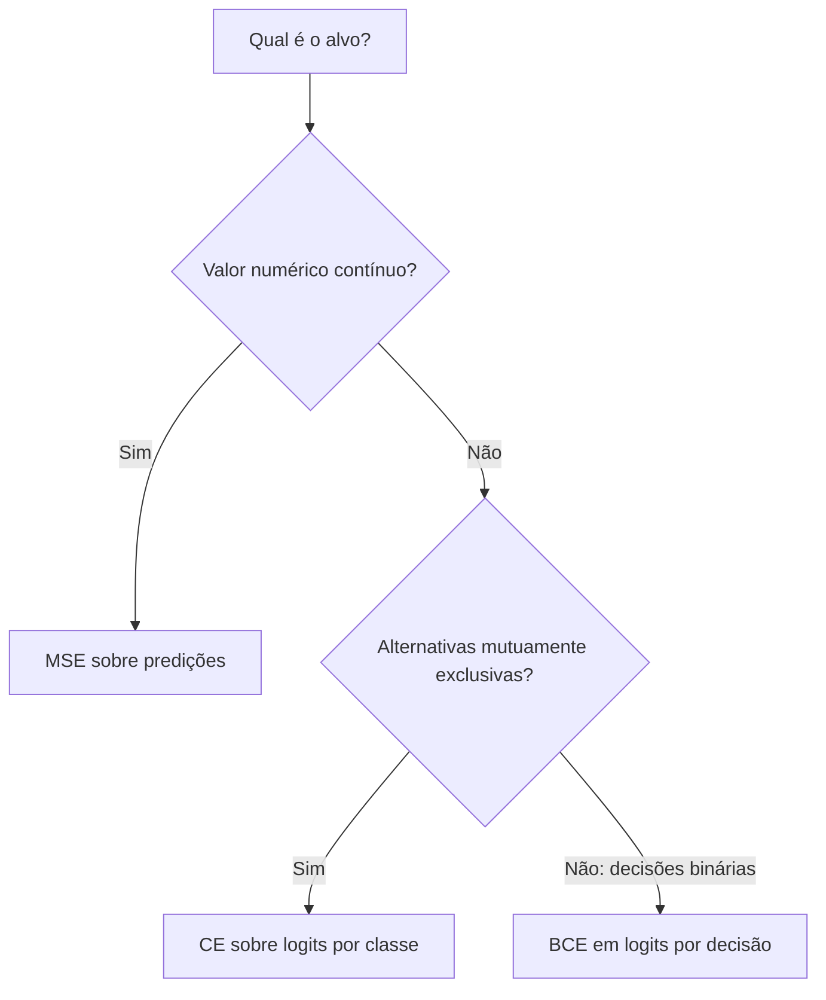
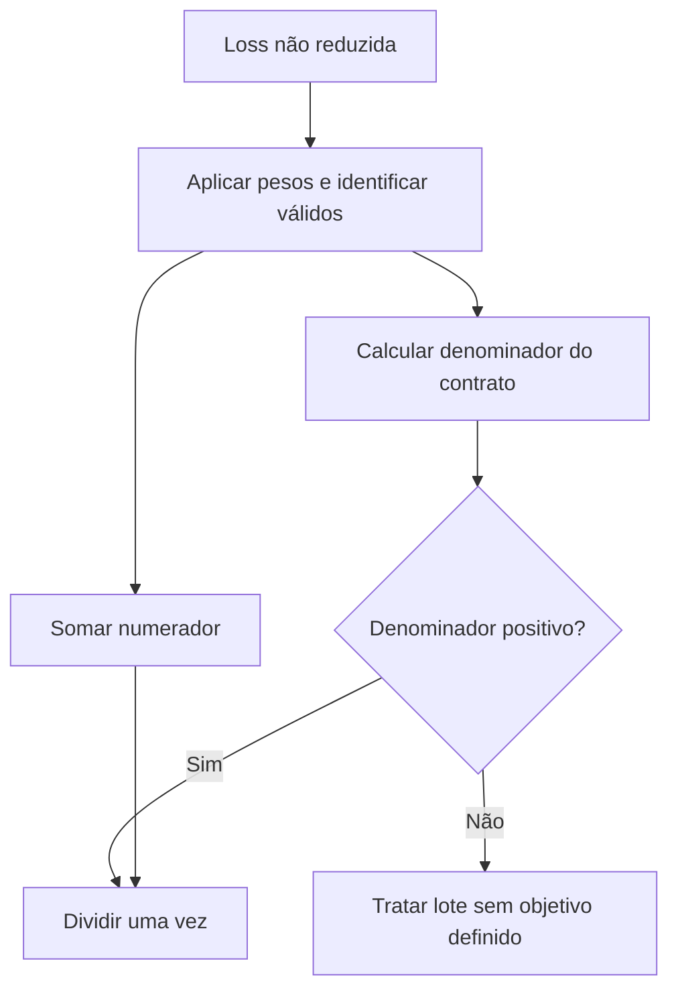

# Aula 08 — Losses, logits e reduções

<!-- mirandastech-aula-v2 -->

**Trilha:** M6 — PyTorch · **Módulo:** 04 — Deep Learning  
**Anterior:** [Aula 07 — Camadas lineares, ativações e inicialização](07-linear-ativacoes-inicializacao.md)  
**Laboratório:** [notebook executável](../notebooks/08-losses-logits-reducoes-laboratorio.ipynb)

[](https://colab.research.google.com/github/joaopaulomirandamatias/ai-lab/blob/main/04-deep-learning/m6-pytorch/notebooks/08-losses-logits-reducoes-laboratorio.ipynb)

## O código executa, mas qual objetivo está sendo minimizado?

Uma MLP pode produzir as mesmas saídas da implementação NumPy e ainda receber gradientes diferentes depois de trocar a loss. Talvez o código anterior usasse metade do erro quadrático médio. Talvez a nova função espere logits, mas receba probabilidades. Ou talvez a média inclua posições que deveriam ser ignoradas.

Considere três tarefas de monitoramento: estimar uma temperatura, escolher uma entre três categorias exclusivas de falha e indicar vários alarmes simultâneos. Embora as três possam usar uma camada afim na saída, seus alvos e suas funções objetivo têm contratos distintos.

Nesta aula vamos relacionar esses contratos às APIs PyTorch e verificar os números. A pergunta central é: **a implementação calcula exatamente a penalidade e o denominador que pretendemos otimizar?** Uma loss finita, sozinha, não responde.

## Objetivos, pré-requisitos e vocabulário

Ao terminar, você deverá conseguir:

- Selecionar MSE, BCE em logits ou CE conforme a estrutura dos alvos.
- Diferenciar logits, probabilidades e log-probabilidades.
- Conferir shapes, dtypes, eixo de classes e valores permitidos.
- Explicar as formas estáveis e comparar seus gradientes com NumPy.
- Aplicar `none`, `sum`, `mean`, pesos e máscaras com denominadores explícitos.
- Reconhecer dupla ativação, broadcasting e agregação incorreta de lotes.

Pré-requisitos: autograd, broadcasting, saída afim e as derivadas da [Aula 11 do M5 — Backward das losses](../../m5-redes-neurais-do-zero/aulas/11-backward-losses.md). As derivações completas estão no M5; aqui tornamos sua correspondência com as APIs verificável.

| Termo | Significado |
|---|---|
| Logit | Score real antes de sigmoid ou softmax |
| Target/alvo | Resultado esperado, com formato definido pela tarefa |
| Loss não reduzida | Penalidades antes da agregação final |
| Redução | Regra que transforma essas penalidades em soma, média ou outra agregação |
| Multiclasse exclusivo | Uma classe correta entre alternativas |
| Multilabel | Várias decisões binárias possíveis por exemplo |
| Alvo denso | Distribuição flutuante sobre classes; one-hot é um caso particular |
| Máscara | Identificação de posições que participam do objetivo |

## 1. Comece pela semântica do alvo

| Tarefa tabular | Saída passada à loss | Alvo | API inicial |
|---|---|---|---|
| Regressão | Valores previstos `(B,D)` | Float, mesmo shape | `MSELoss` |
| Binária | Um logit por exemplo, `(B,)` ou `(B,1)` | Float, mesmo shape, em `[0,1]` | `BCEWithLogitsLoss` |
| Multilabel | Logits `(B,C)` | Float `(B,C)`, em `[0,1]` | `BCEWithLogitsLoss` |
| Multiclasse exclusivo | Logits `(B,C)` | Índices `long` `(B,)`, de 0 a C−1 | `CrossEntropyLoss` |
| Multiclasse com alvo distribuído | Logits `(B,C)` | Float `(B,C)`, distribuição por linha | `CrossEntropyLoss` |

$B$ representa exemplos, $D$ saídas de regressão e $C$ classes. Nas fórmulas usaremos índices de classes de 0 a $C-1$, como no código.

Para alarmes simultâneos, duas posições podem ter alvo 1 na mesma linha. BCE não força soma um entre classes. Para uma categoria exclusiva, a distribuição softmax soma um e estabelece competição entre alternativas. Tratar esses cenários como equivalentes muda o problema estatístico.



Descrição: a escolha parte da estrutura do alvo. Não é uma competição universal entre losses; uma mesma aplicação pode possuir saídas diferentes com objetivos próprios.

## 2. MSE: todos os elementos contam

Para predições $\hat y_r$ e alvos $y_r$, a MSE média é:

$$
L_{\mathrm{MSE}}=\frac{1}{N}\sum_{r=1}^{N}(\hat y_r-y_r)^2,
\qquad
\frac{\partial L}{\partial\hat y_r}=\frac{2(\hat y_r-y_r)}{N}.
$$

$N$ é o número de elementos reduzidos. Se o shape é $(B,D)$, a média padrão usa $N=BD$, não apenas $B$. Isso dá peso igual a cada coordenada, não necessariamente igual relevância física a cada variável. Quando saídas têm unidades muito diferentes, documente escalas e ponderações.

Na Aula 07 usamos **metade da MSE**. Para preservar aquele objetivo, calcule `0.5 * MSELoss(...)`. O fator também divide os gradientes por dois; não é apenas uma diferença no número impresso.

### Exemplo resolvido

Para predições $\begin{bmatrix}1&2\\3&4\end{bmatrix}$ e alvos $\begin{bmatrix}1&0\\1&4\end{bmatrix}$, os resíduos são $\begin{bmatrix}0&2\\2&0\end{bmatrix}$. A soma dos quadrados é $8$ e há quatro elementos:

$$
L=8/4=2,\qquad \nabla_{\hat Y}L=
\begin{bmatrix}0&1\\1&0\end{bmatrix}.
$$

A meia MSE vale 1 e seu gradiente é metade da matriz acima. O notebook verifica `none`, `sum`, `mean` e essa correspondência.

**Cuidado com shapes:** subtrair `(B,1)` de `(B,)` pode formar `(B,B)`, comparando exemplos uns com os outros. Para valores `[1,2,3]`, o laboratório encontra MSE incorreta `1,333333`, embora a comparação correta tenha erro zero. Valide igualdade de shapes antes da API; não esconda o aviso de broadcasting.

## 3. BCE: a loss recebe logits

Para um logit $z$, a probabilidade binária associada é $p=\sigma(z)=1/(1+e^{-z})$. Quando $0<p<1$, $z=\log(p/(1-p))$. A BCE por posição é:

$$
\ell=-y\log p-(1-y)\log(1-p).
$$

Ao compor com sigmoid, obtemos a forma equivalente em logits:

$$
\ell(z,y)=\operatorname{softplus}(z)-yz,
\qquad
\frac{\partial\ell}{\partial z}=\sigma(z)-y.
$$

Aqui $y\in[0,1]$ é o alvo; normalmente vale 0 ou 1, mas alvos suaves também são possíveis. A softplus é $\log(1+e^z)$. Para evitar exponenciais grandes, uma forma estável é:

$$
\ell(z,y)=\max(z,0)-yz+\log\left(1+e^{-|z|}\right).
$$

`BCEWithLogitsLoss` implementa o cálculo integrado. Passe o score da camada afim diretamente. `BCELoss`, uma API diferente, espera probabilidades; não troque essas entradas sem revisar o contrato.

### Um erro confiante precisa de um gradiente útil

Se $z=1000$ e $y=0$, a sigmoid arredonda para 1 no ambiente do laboratório. Calcular literalmente $-\log(1-p)$ resulta em infinito. O cálculo estável em logits continua próximo de 1000.

O notebook testa também $z=-1000,y=1$. As duas losses são **1000**, e a média sobre os dois exemplos produz gradientes **`[-0,5, 0,5]`**. Os infinitos da fórmula ingênua são contraprovas deliberadas, detectadas por asserts; eles não são usados para atualizar parâmetros.

Estabilidade numérica preserva informação disponível em logits finitos. Ela não torna dados inválidos ou logits infinitos aceitáveis, nem resolve overflow que já ocorreu dentro do modelo.

## 4. CE: log-sum-exp e classe correta

Para um exemplo com scores $z_0,\ldots,z_{C-1}$ e classe correta $k$:

$$
p_j=\frac{e^{z_j}}{\sum_c e^{z_c}},\qquad
\ell(z,k)=-\log p_k
=\operatorname{LSE}(z)-z_k.
$$

A função $\operatorname{LSE}(z)=\log\sum_c e^{z_c}$ pode ser calculada usando $m=\max_c z_c$:

$$
\operatorname{LSE}(z)=m+\log\sum_c e^{z_c-m}.
$$

As exponenciais deslocadas têm argumentos não positivos. Na implementação de referência, calculamos log-probabilidades a partir dos scores deslocados, evitando materializar probabilidades extremamente pequenas antes do logaritmo.

`CrossEntropyLoss` recebe **logits não normalizados**. A decomposição estável correspondente é `log_softmax` seguida de `NLLLoss`, com o mesmo eixo, pesos e redução. `NLLLoss` espera log-probabilidades, não probabilidades comuns.

### Exemplo resolvido: três classes

Para logits $(2,1,0)$ e classe 0, subtraímos o máximo e obtemos $(0,-1,-2)$. A soma das exponenciais é $1+e^{-1}+e^{-2}\approx1{,}503215$. Portanto:

$$
p\approx(0{,}665241,0{,}244728,0{,}090031),\qquad
\ell\approx0{,}407605964.
$$

O gradiente por exemplo, sem pesos, é $p-e_k$, onde $e_k$ é o vetor one-hot da classe correta. Com $B$ exemplos e redução média:

$$
\frac{\partial L}{\partial z_{ij}}=
\frac{p_{ij}-\mathbb{1}[j=y_i]}{B}.
$$

A soma dos gradientes ao longo das classes é zero. Isso corresponde à invariância de adicionar a mesma constante a todos os scores de um exemplo. O notebook verifica um deslocamento de 1000 com tolerância de `1e-12` em `float64`; valores excessivamente grandes ainda podem perder diferenças por arredondamento.

Com logits `(1000,0,-1000)` e classe correta 2, a CE estável vale **2000**. O caminho `log(softmax(...))` produz infinito na contraprova, pois a probabilidade da classe correta arredonda para zero.

## 5. Não aplique a ativação duas vezes

`CrossEntropyLoss(softmax(z), y)` interpreta as probabilidades como novos logits. `BCEWithLogitsLoss(sigmoid(z), y)` faz o mesmo com probabilidades binárias. Os resultados podem ser finitos e diferenciáveis, mas representam outra função objetivo.

Na fixture do laboratório:

| Objetivo | Entrada correta | Com ativação extra |
|---|---:|---:|
| CE média | `0,473114` | `0,831586` |
| BCE média | `0,424601` | `0,642835` |

Para obter probabilidades posteriormente, aplique sigmoid ou softmax aos logits conforme a tarefa. Isso é diferente de colocá-las antes de uma loss que já espera logits. As regras de decisão e avaliação serão aprofundadas na Aula 14.

No caso binário sem pesos ou suavização, BCE com um logit $z$ equivale à CE com dois logits $(0,z)$. O notebook confere loss e derivada em relação a $z$. Dois logits livres possuem uma redundância de deslocamento; a equivalência de probabilidades não garante a mesma trajetória de otimização entre parametrizações diferentes.

## 6. Contratos dos alvos e do eixo de classes

Para CE tabular com índices, use logits `(B,C)` e alvos `torch.long` de shape `(B,)`. Um alvo `(B,1)` não representa o mesmo contrato. Um índice inexistente não deve ser corrigido silenciosamente com arredondamento ou clipping.

Para alvos densos, use float com o mesmo shape dos logits, valores não negativos e soma um por exemplo. One-hot satisfaz essa condição. Um tensor de valores arbitrários pode produzir uma loss finita sem representar uma distribuição válida; valide os dados explicitamente.

Para BCE, alvo e logit devem ter o mesmo shape e o alvo deve estar em `[0,1]`. No multilabel, a soma por linha não precisa ser um. O notebook inclui validadores didáticos de shapes e distribuições; eles são específicos dos casos documentados, não uma biblioteca universal de validação.

O código autossuficiente abaixo demonstra o contrato mínimo da CE:

```python
import torch
from torch import nn

logits = torch.tensor([[2., 1., 0.]], dtype=torch.float64,
                      requires_grad=True)
target = torch.tensor([0], dtype=torch.long)
assert logits.shape == (1, 3) and target.shape == (1,)
assert ((target >= 0) & (target < logits.shape[1])).all()
loss = nn.CrossEntropyLoss()(logits, target)
loss.backward()
expected = logits.detach().softmax(dim=1)
expected[0, 0] -= 1
assert torch.allclose(logits.grad, expected, atol=1e-14, rtol=0)
print(round(loss.item(), 9))  # 0.407605964
```

### Eixos adicionais exigem atenção

Uma `Linear` aplicada a `(B,T,D)` pode produzir `(B,T,C)`. Entretanto, CE multidimensional espera o eixo de classes na posição 1: `(B,C,T)`, com índices `(B,T)`. Use `movedim(-1,1)` ou uma transformação equivalente corretamente justificada.

No laboratório, a alternativa de achatar logits para `(-1,C)` e alvos para `(-1)` coincide com a permutação. Um simples reshape para `(B,C,T)` não é uma troca de eixos: ele pode reorganizar incorretamente a associação entre scores e posições.

## 7. `mean` não possui um denominador universal

`none` conserva as perdas antes da redução; `sum` soma. Para `mean`, é necessário ler o contrato específico:

| Caso deste laboratório | Denominador da média |
|---|---|
| MSE ou BCE elementwise | Número total de elementos |
| CE com índices, sem pesos | Número de posições não ignoradas |
| CE com índices e pesos de classe, sem smoothing | Soma dos pesos das classes-alvo válidas |
| CE com alvos probabilísticos densos | Número de posições, inclusive quando há pesos de classe |
| BCE com `weight` e/ou `pos_weight` | Número total de elementos, não soma dos pesos |

Na CE, a dimensão de classes já foi reduzida para formar uma loss por posição. No caso simples, dividir novamente por $C$ reduz indevidamente o gradiente. Com `none`, a raiz ainda não é escalar: agregue deliberadamente ou forneça um gradiente upstream de shape apropriado.

### CE ponderada com índices

Se $V$ é o conjunto de posições válidas, $w_c$ o peso não negativo da classe $c$ e não há smoothing:

$$
L=\frac{\sum_{i\in V}w_{y_i}\ell_i}{D_w},\qquad
D_w=\sum_{i\in V}w_{y_i}>0.
$$

O gradiente local recebe o fator $w_{y_i}/D_w$. No notebook, os alvos são `[0,2,-100]`, os pesos são `[1,2,3]` e `ignore_index=-100`. O denominador é $1+3=4$; a posição ignorada tem loss e gradiente zero. As duas perdas válidas valem aproximadamente `0,407606`, então a média correta mantém esse valor. Fazer a média das três posições da saída ponderada produz `0,543475`, outro resultado.

Uma partição sem posições válidas, ou uma soma de pesos nula, não define essa média. Verifique o denominador antes de dividir e estabeleça uma política explícita para não executar uma atualização baseada em um objetivo indefinido.

### One-hot não garante a mesma média ponderada

Para alvos densos $q_{ic}$, a CE ponderada por posição é:

$$
\ell_i=-\sum_c w_cq_{ic}\log p_{ic}.
$$

A média da API divide por $B$ no caso tabular. Com one-hot, o numerador coincide com o caso de índices, mas o denominador pode mudar. Na fixture, a soma dos pesos selecionados é 6 e existem três exemplos: a versão densa fica **duas vezes maior**. Sem pesos, one-hot e índices coincidem.

Não aplique automaticamente a fórmula simples $p-q$ quando houver pesos de classe: os pesos também modificam a derivada. O contrato deve especificar o numerador e o denominador.

## 8. BCE ponderada: duas funções dos pesos

Para uma posição $(i,c)$, um peso geral $v_{ic}$ e um peso positivo $a_c$:

$$
\ell_{ic}=-v_{ic}\left[a_cy_{ic}\log\sigma(z_{ic})
+(1-y_{ic})\log(1-\sigma(z_{ic}))\right].
$$

`weight` corresponde a $v$, multiplicando a penalidade da posição. `pos_weight` corresponde a $a$, alterando somente o termo positivo. A média padrão ainda divide pelo número de elementos. Se deseja uma média normalizada pela soma dos pesos, construa essa redução explicitamente a partir de `none`.

No caso `(B,C)`, `pos_weight` de shape `(C,)` pode ponderar classes; um peso por exemplo pode ter shape `(B,1)` para broadcasting explícito. Não extrapole isso cegamente para outros layouts.

O notebook usa dois exemplos, três classes e confirma divisor **6**, mesmo com pesos. O gradiente ponderado é conferido contra a fórmula analítica. O valor obtido é `1,382735`.

Pesos alteram o risco otimizado. Se forem derivados de frequências, use apenas dados de treino. Sua escolha não garante determinada precisão, recall ou calibração; esses efeitos precisam ser medidos em um protocolo separado. Uma sigmoid após treinamento ponderado não deve ser tratada automaticamente como probabilidade calibrada da população original.

## 9. Máscaras, smoothing e agregação

### Padding não deve diluir uma média por posições válidas

O ensaio multidimensional tem oito posições, cinco válidas. A CE média correta vale `1,274977`. Incluir os três zeros de padding no denominador reduz o resultado para `0,796860`, exatamente **$5/8$** do valor correto.

`ignore_index` aplica-se ao modo de índices da CE. Para alvos densos ou BCE, use uma máscara explícita sobre as perdas e defina a redução. Uma média por posição e uma média de médias por sequência não são necessariamente o mesmo objetivo; escolha conforme a unidade de análise.

### Label smoothing é mudança de alvo

Sem pesos, a configuração $\varepsilon$ de smoothing corresponde a:

$$
q=(1-\varepsilon)e_y+\frac{\varepsilon}{C}\mathbf{1}.
$$

$\mathbf{1}$ contém um em cada coordenada. Com três classes e $\varepsilon=0{,}1$, a classe correta recebe $0{,}933333$ e as demais $0{,}033333$. Não é uma mistura que distribui todo $\varepsilon$ apenas entre as classes erradas. O laboratório confirma equivalência entre o argumento da API e esse alvo denso, **sem pesos**, obtendo `0,562003`.

### Lotes desiguais: conserve numerador e denominador

Para resultados $L_b=N_b/D_b$ de cada lote, o agregado compatível é:

$$
L_{\mathrm{global}}=\frac{\sum_bN_b}{\sum_bD_b}
=\frac{\sum_bD_bL_b}{\sum_bD_b}.
$$

O índice $b$ identifica lotes; $N_b$ e $D_b$ são o numerador e o denominador do objetivo daquele lote. Em CE ponderada com índices, $D_b$ é a soma dos pesos válidos, não necessariamente a quantidade de exemplos.

O notebook separa os mesmos scores em lotes de dois e um exemplo. A agregação correta difere do cálculo conjunto em apenas `5,55×10⁻¹⁷`; a média simples das médias erra `0,032754`. Os parâmetros não mudam entre os lotes desse ensaio. Durante treinamento, as losses podem ser medidas em parâmetros diferentes; o agregado então descreve a trajetória, não a avaliação de um único modelo fixo.



Descrição: pesos e validade determinam tanto a soma quanto a normalização. O fluxo exige tratar um denominador inválido antes de produzir o escalar para backward.

## 10. Laboratório reproduzível e resultados

O notebook requer **Python >=3.10, PyTorch >=2.6 e NumPy >=1.24**. A execução de referência ocorreu em **9 de setembro de 2026**, com Python **3.12.14**, PyTorch **2.6.0+cpu** e NumPy **2.3.5**, CPU e `float64`. `nbformat` >=5.10 foi usado para validar o arquivo.

A seed base é **20260908**. Os casos principais usam valores explícitos; o ensaio por posição usa geração sintética documentada. As **33 células, incluindo 16 de código**, foram validadas e executadas em ordem em um processo Python novo. O notebook publicado mantém outputs vazios, contadores nulos e IDs únicos.

| Evidência | Resultado confirmado |
|---|---:|
| BCE média da fixture | `0,424600594` |
| CE média da fixture | `0,473114178` |
| Erro máximo BCE versus NumPy | `1,94×10⁻¹⁶` |
| Erro máximo CE versus NumPy | `0` |
| Erro máximo nos gradientes BCE / CE | `0 / 1,39×10⁻¹⁷` |
| BCE / CE em erros extremos | `1000 / 2000`, finitos |
| Razão CE densa / índices com pesos na fixture | `2` |
| Verificações automáticas | **62/62 aprovadas** |

Não houve erro ou aviso inesperado. As fórmulas ingênuas produziram infinitos nos casos explicitamente preparados para demonstrar instabilidade; os asserts detectaram essa falha. O cálculo estável e seus gradientes continuaram finitos. O exemplo autossuficiente desta aula também foi executado separadamente.

Não há treino, busca por hiperparâmetros, avaliação de GPU ou estimativa de generalização. Por se tratar de verificação algébrica sem ajuste aos dados, não há necessidade de split neste laboratório. Os próximos experimentos com aprendizagem deverão separar treino, validação e teste e respeitar a unidade de análise.

## 11. Checklist prático

- [ ] A tarefa é regressão, classificação exclusiva ou multilabel?
- [ ] A loss recebe predições, logits ou log-probabilidades conforme seu contrato?
- [ ] Targets possuem dtype, shape e valores válidos?
- [ ] O eixo de classes está correto, inclusive com dimensões extras?
- [ ] O objetivo inclui ou não o fator $1/2$?
- [ ] O denominador foi escrito explicitamente?
- [ ] Pesos, posições ignoradas e smoothing estão documentados?
- [ ] Lotes sem denominador válido são tratados antes da divisão?
- [ ] O gradiente foi comparado a uma referência pequena e independente?
- [ ] Métricas agregam numeradores e denominadores compatíveis?

Em pesquisa, registrar essas decisões evita atribuir à arquitetura uma diferença produzida pela escala da loss. Em sistemas reais, shapes e máscaras bem definidos ajudam a detectar problemas de alvos, padding e observações ausentes antes de gastar treinamento. Nenhuma dessas verificações substitui avaliar qualidade, representatividade e procedência dos dados.

## 12. Exercícios com respostas comentadas

**1. Uma saída de regressão `(8,3)` usa MSE média. Qual é o divisor?**  
24 elementos. Dividir apenas por oito implementa a média da soma dos erros por exemplo, uma escala três vezes maior.

**2. Como preservar uma meia MSE ao migrar para PyTorch?**  
Use `0.5 * MSELoss(...)`. Isso preserva tanto o valor quanto o gradiente da definição anterior.

**3. Por que `(B,)` e `(B,1)` exigem cuidado em regressão?**  
O broadcasting pode formar `(B,B)`. Torne os shapes iguais deliberadamente, sem depender de expansão implícita.

**4. Qual loss usar para vários alarmes simultâneos?**  
BCE em logits por decisão binária é uma escolha inicial compatível. Os targets podem conter vários uns por exemplo; softmax exclusivo modelaria outra estrutura.

**5. Por que não passar softmax à CrossEntropyLoss?**  
A API espera logits. Os valores normalizados seriam interpretados como novos scores, mudando a loss e o gradiente.

**6. Qual é a CE para `(2,1,0)` com classe correta 0?**  
Após deslocar por 2, ela vale $\log(1+e^{-1}+e^{-2})\approx0{,}407606$. Não é necessário calcular o logaritmo de uma probabilidade arredondada.

**7. Uma CE ponderada tem classes-alvo 0 e 2 e pesos `[1,2,3]`. Qual divisor usa o modo de índices, sem smoothing?**  
$1+3=4$. O divisor é a soma dos pesos observados, não a soma de todos os pesos de classes nem o número de exemplos.

**8. Converter esses alvos para one-hot sempre preserva a média ponderada?**  
Não. A redução densa divide pelo número de posições. O numerador pode coincidir e, ainda assim, a escala final mudar.

**9. Há cinco posições válidas em oito. Que erro ocorre ao fazer mean das perdas com três zeros mascarados?**  
A média fica multiplicada por $5/8$ em relação à média por posição válida. Zerar a contribuição no numerador não exclui automaticamente a posição do denominador.

**10. Aumentar pos_weight garante probabilidades calibradas ou recall maior?**  
Não há essa garantia experimental. O peso altera o risco; escolha, limiar e calibração precisam ser avaliados com dados apropriados, sem selecionar pelo teste.

## Resumo e próxima aula

A loss conecta saídas do modelo a um objetivo matemático. Para reproduzir esse objetivo, preserve domínio de entrada, targets, eixos, pesos, máscaras e redução. Formas estáveis em logits evitam perder informação ao materializar probabilidades extremas.

A próxima é **Aula 09 — `Dataset` e transformações sem vazamento**, arquivo curricular `09-dataset-transformacoes.md`, conforme o [README do M6](../README.md). Passaremos dos contratos de alvos à construção dos exemplos, seus splits e transformações ajustadas somente onde o protocolo permite.

## Referências técnicas

Documentação oficial **PyTorch 2.6**, verificada em **9 de setembro de 2026**; execução em **2.6.0+cpu**. As fórmulas e contraprovas foram implementadas e verificadas no laboratório desta aula.

- [MSELoss — erro quadrático e reduções](https://docs.pytorch.org/docs/2.6/generated/torch.nn.MSELoss.html).
- [BCEWithLogitsLoss — operação estável, pesos e targets](https://docs.pytorch.org/docs/2.6/generated/torch.nn.BCEWithLogitsLoss.html).
- [CrossEntropyLoss — índices, alvos densos, pesos, ignore_index e smoothing](https://docs.pytorch.org/docs/2.6/generated/torch.nn.CrossEntropyLoss.html).
- [NLLLoss — entrada em log-probabilidades](https://docs.pytorch.org/docs/2.6/generated/torch.nn.NLLLoss.html).

As APIs definem os contratos operacionais; o M5 fornece a derivação anterior e o notebook registra a evidência local. Não há mídia complementar necessária para acompanhar a explicação.
