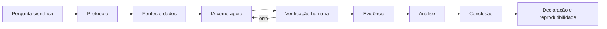
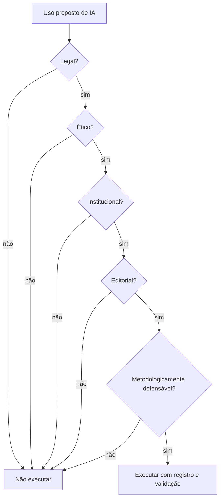
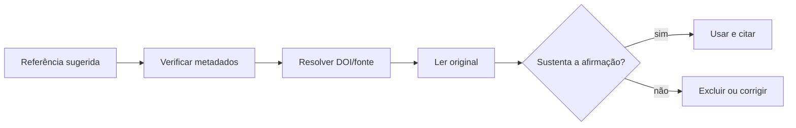
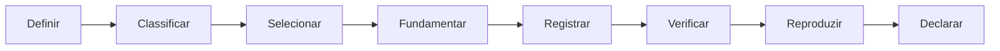
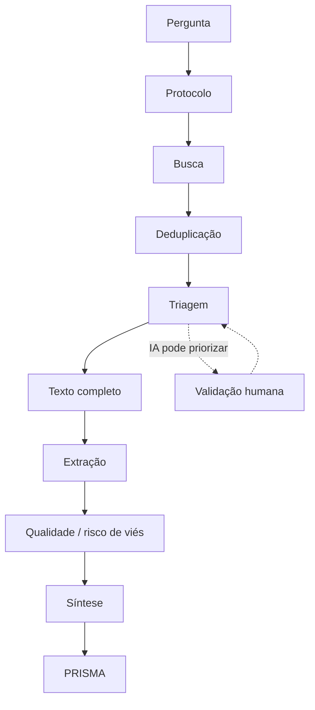

# Diagramas Mermaid

## 1. Pesquisa assistida e auditável

```mermaid
flowchart LR
    A[Pergunta científica] --> B[Protocolo]
    B --> C[Fontes e dados]
    C --> D[IA como apoio]
    D --> E[Verificação humana]
    E --> F[Evidência]
    F --> G[Análise]
    G --> H[Conclusão]
    H --> I[Declaração e reprodutibilidade]
    E -->|erro| D
```

## 2. Cinco camadas de decisão

```mermaid
flowchart TD
    A[Uso proposto de IA] --> B{Legal?}
    B -->|não| Z[Não executar]
    B -->|sim| C{Ético?}
    C -->|não| Z
    C -->|sim| D{Institucional?}
    D -->|não| Z
    D -->|sim| E{Editorial?}
    E -->|não| Z
    E -->|sim| F{Metodologicamente defensável?}
    F -->|não| Z
    F -->|sim| G[Executar com registro e validação]
```

## 3. Auditoria de referência

```mermaid
flowchart LR
    A[Referência sugerida] --> B[Verificar metadados]
    B --> C[Resolver DOI/fonte]
    C --> D[Ler original]
    D --> E{Sustenta a afirmação?}
    E -->|sim| F[Usar e citar]
    E -->|não| G[Excluir ou corrigir]
```

## 4. IA-Ciência Auditável

```mermaid
flowchart LR
    A[Definir] --> B[Classificar]
    B --> C[Selecionar]
    C --> D[Fundamentar]
    D --> E[Registrar]
    E --> F[Verificar]
    F --> G[Reproduzir]
    G --> H[Declarar]
```

## 5. Revisão sistemática

```mermaid
flowchart TD
    A[Pergunta] --> B[Protocolo]
    B --> C[Busca]
    C --> D[Deduplicação]
    D --> E[Triagem]
    E --> F[Texto completo]
    F --> G[Extração]
    G --> H[Qualidade / risco de viés]
    H --> I[Síntese]
    I --> J[PRISMA]
    E -. IA pode priorizar .-> K[Validação humana]
    K -.-> E
```
