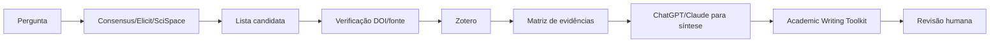

# Prática 4 — Plugins acadêmicos: qual usar em cada etapa?

> Plugins aceleram tarefas específicas. Eles não substituem critérios, protocolo ou verificação humana.

## 1. Matriz rápida

| Ferramenta/plugin | Melhor uso | Saída típica | Controle obrigatório |
|---|---|---|---|
| **Consensus** | descoberta e síntese de literatura revisada por pares | papers, sínteses e bibliografias | abrir/verificar estudo original |
| **Elicit** | busca, comparação e extração estruturada | tabela/relatório de estudos | revisar extração e critérios |
| **SciSpace** | descoberta, triagem e leitura tabular | tabela com abstract, método, resultado | validar campos no paper |
| **Sider Scholar** | busca ampla + coleções + RAG | papers, respostas sobre coleção, grafos | controlar corpus e fonte |
| **Zotero** | biblioteca, BibTeX e citações | itens verificados e chaves | conferir metadados |
| **Academic Writing Toolkit** | auditoria de escrita/citações/BibTeX | inconsistências e sugestões | decisão editorial humana |
| **Scholar Sidekick** | checagem de DOI/PMID e status bibliográfico | metadados/veredito | conferir registro primário |
| **Undermind** | busca profunda e citation trails | lista ranqueada de literatura | revisar cobertura e ranking |

A disponibilidade depende da conta, plano, região e workspace.

## 2. Não escolha pela marca; escolha pela tarefa

### Quero descobrir literatura
Comece com:
- Consensus;
- Elicit;
- SciSpace;
- Sider Scholar;
- busca tradicional em bases.

### Quero reduzir risco de referência falsa
Use:
- DOI/Crossref/PubMed/site do periódico;
- Scholar Sidekick, quando disponível;
- Zotero para manter metadados confirmados.

### Quero fazer screening
Use:
- SciSpace/Elicit;
- Rayyan/ASReview fora do ambiente de plugins;
- IA apenas como priorizador/classificador com validação humana.

### Quero sintetizar um corpus que já selecionei
Use:
- Sider Scholar ou outra abordagem RAG;
- ChatGPT/Claude com documentos controlados;
- uma matriz de evidências verificada.

### Quero escrever
Use:
- Academic Writing Toolkit para auditoria;
- LLM para clareza e crítica;
- Zotero para citações reais.

## 3. Como usar plugins no ChatGPT

Em interfaces compatíveis:
1. abra `Plugins`;
2. instale o plugin;
3. conecte a conta subjacente quando necessário;
4. invoque com `@Nome` ou pelo menu `+ → Mais`;
5. limite escopo e formato da tarefa;
6. registre a ferramenta e a consulta quando o uso for metodologicamente relevante.

Exemplo:

```text
@Elicit
Procure estudos de 2022–2026 sobre avaliação de factualidade em sistemas RAG.
Retorne tabela com desenho, dataset, métrica e resultado principal.
Marque campos ausentes como "não localizado".
```

Depois:

```text
Agora não faça nova busca.
Organize somente os estudos retornados em uma matriz para triagem humana.
```

## 4. Estratégia multi-ferramenta sem "votação de IAs"

Errado:

```text
Consensus concordou com Elicit e Claude → conclusão validada
```

Correto:

```text
ferramentas diferentes → cobertura de descoberta
                   ↓
deduplicação
                   ↓
fonte original
                   ↓
extração verificada
                   ↓
síntese
```

Ferramentas diferentes ajudam a aumentar cobertura e encontrar divergências. **Concordância entre modelos não substitui validação empírica.**

## 5. Pipeline sugerido



## 6. Critérios para avaliar um plugin acadêmico

Antes de adotar:
- Qual corpus ele consulta?
- Cobre meu domínio?
- Recupera metadados ou texto completo?
- Mostra DOI/URL verificável?
- Permite exportar os resultados?
- Explica critérios de ranking?
- Qual a política de dados?
- O resultado pode ser reproduzido?
- Existe limitação de plano?
- Ele executa ações de escrita/importação?

## 7. Exercício comparativo

Pesquise a mesma pergunta em:
1. Consensus;
2. Elicit ou SciSpace;
3. uma base tradicional.

Compare:

| Métrica | Ferramenta A | B | Base tradicional |
|---|---:|---:|---:|
| resultados candidatos | | | |
| duplicados | | | |
| estudos únicos relevantes | | | |
| DOI verificável | | | |
| falsos positivos de relevância | | | |
| tempo gasto | | | |

### Pergunta final
Qual ferramenta aumentou **recall**, qual melhorou **triagem** e qual forneceu a evidência mais fácil de auditar?

## 8. Política da aula

Nunca diga apenas "use o plugin X". Ensine:

> **tarefa → fonte → ferramenta → controle → evidência**

## Referência de produto

- OpenAI — Plugins no ChatGPT/Codex: https://help.openai.com/pt-br/articles/20001256-plugins-no-chatgpt-e-no-codex

A lista de plugins muda; revise o Diretório de Plugins antes de ministrar a aula.
