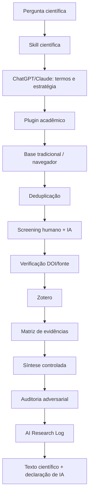

# Prática 7 — Workflow end-to-end: da pergunta ao Zotero

Este roteiro junta tudo em um único fluxo operacional.

## Cenário

Você quer preparar o estado da arte de uma nova pesquisa.

## Pipeline



## Etapa 1 — Pergunta

Não comece pela ferramenta.

Defina:
- problema;
- pergunta;
- população/contexto;
- fenômeno/intervenção;
- resultado de interesse;
- período;
- critérios.

## Etapa 2 — Skill

Ative/use `pesquisa-cientifica-auditavel` para impor o workflow e os quality gates.

## Etapa 3 — Estratégia de busca

Use ChatGPT/Claude para expandir termos e criticar a string, mas aprove-a manualmente.

Artefato: `search-strategy.md`.

## Etapa 4 — Discovery em plugin

Use Consensus/Elicit/SciSpace/Sider Scholar conforme o domínio.

Artefato: export/tabela de candidatos + data + consulta.

## Etapa 5 — Busca complementar em base

Use uma base disciplinar/tradicional. Se Claude in Chrome ajudar na interface, mantenha aprovação supervisionada.

Artefato: segunda lista de candidatos.

## Etapa 6 — Deduplicação

Combinar resultados por identificadores.

Artefato: `candidates.csv`.

## Etapa 7 — Screening

Critérios já definidos.

IA pode:
- priorizar;
- justificar classificação;
- marcar incertos.

Humano deve:
- revisar decisões críticas;
- avaliar falsos negativos;
- decidir inclusão final.

Artefato: `screening.csv`.

## Etapa 8 — Verificação e Zotero

Para cada incluído:
1. resolver DOI/identificador;
2. abrir fonte original;
3. confirmar metadados;
4. salvar no Zotero;
5. aplicar tags/coleção.

Zotero torna-se a biblioteca de referências confirmadas.

## Etapa 9 — Extração

Preencha a matriz de evidências.

A IA pode ajudar a extrair, mas precisa apontar a seção/trecho e usar `não localizado` para ausências.

Artefato: `evidence-matrix.csv` ou Markdown.

## Etapa 10 — Síntese

A IA recebe somente o corpus/matriz controlados.

Prompt:

```text
Use exclusivamente esta matriz de evidências.
Separe:
- convergências;
- divergências;
- lacunas;
- limitações.

Para cada afirmação, indique os IDs dos estudos que a sustentam.
Não acrescente referências externas.
```

## Etapa 11 — Auditoria adversarial

Peça a outro passo — não necessariamente outro modelo — para questionar:
- causalidade;
- generalização;
- viés;
- ausência de estudos contraditórios;
- qualidade metodológica;
- validade externa.

Valide cada crítica.

## Etapa 12 — Escrita

Escreva a partir da matriz e do Zotero.

```text
Evidência verificada → argumento humano → revisão de clareza por IA → citações Zotero
```

Evite:

```text
prompt genérico → texto com referências geradas → tentativa de conferir depois
```

## Etapa 13 — Registro

Preencha `AI Research Log` para usos relevantes.

Registre no mínimo:
- ferramenta/modelo;
- data;
- finalidade;
- consulta/prompt;
- corpus/dados;
- saída incorporada;
- verificação;
- decisão humana.

## Etapa 14 — Declaração

Antes de submeter:
- política do financiador;
- política institucional;
- periódico/conferência;
- regras de autoria;
- confidencialidade;
- declaração de IA.

Use os templates em `../templates/declaracao-uso-ia.md` como ponto de partida, não como substituto da regra editorial.

## Estrutura de projeto recomendada

```text
research-project/
├── protocol/
│   ├── question.md
│   └── search-strategy.md
├── screening/
│   ├── candidates.csv
│   └── screening.csv
├── evidence/
│   └── evidence-matrix.csv
├── analysis/
│   └── notebooks/
├── ai/
│   ├── ai-research-log.csv
│   └── skill-version.txt
├── bibliography/
│   └── references.bib
└── manuscript/
    └── paper.md
```

## Definição de pronto

Um ciclo está pronto quando outra pessoa consegue responder:
1. de onde vieram os estudos?;
2. por que cada estudo foi incluído?;
3. quais fontes sustentam cada afirmação?;
4. onde a IA participou?;
5. como as saídas foram verificadas?;
6. qual versão do workflow/Skill foi usada?
